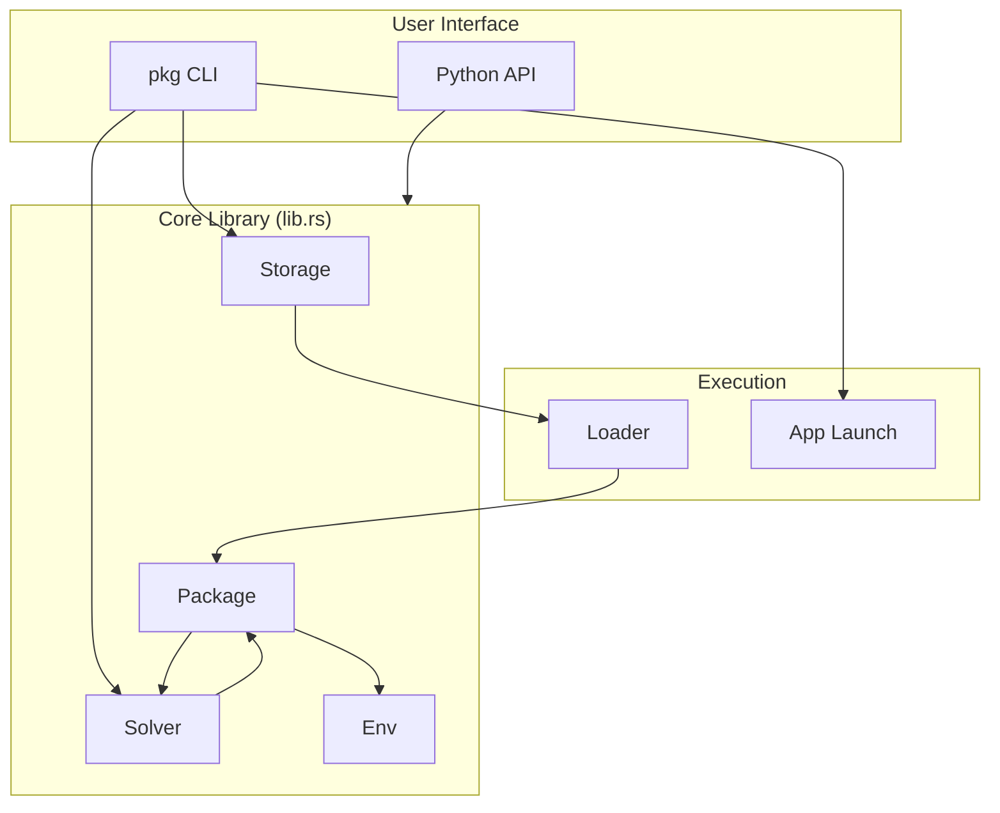
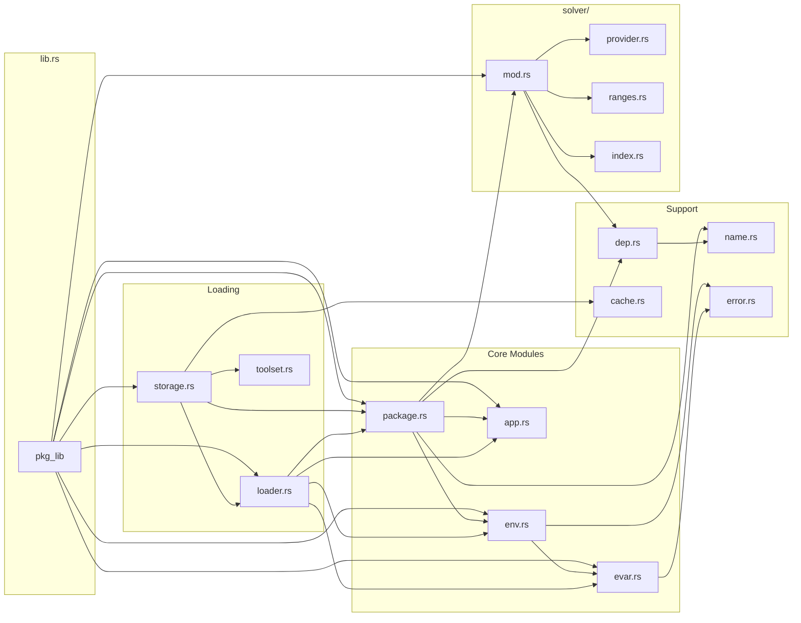
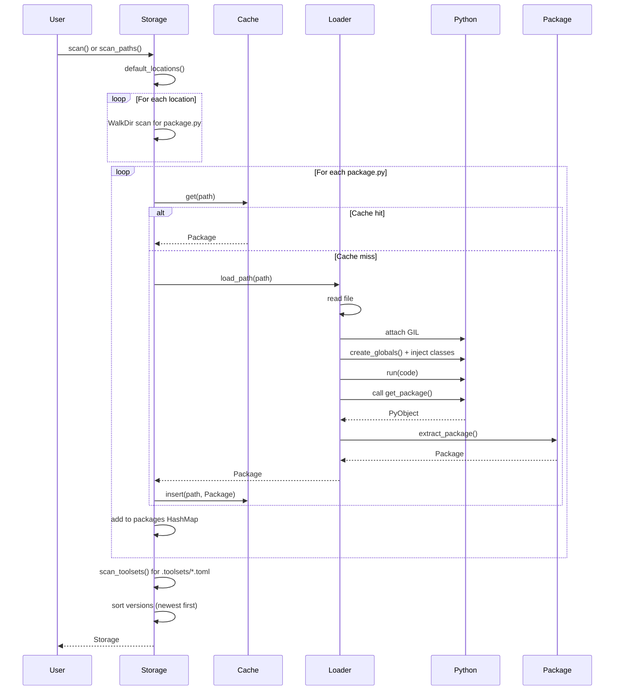
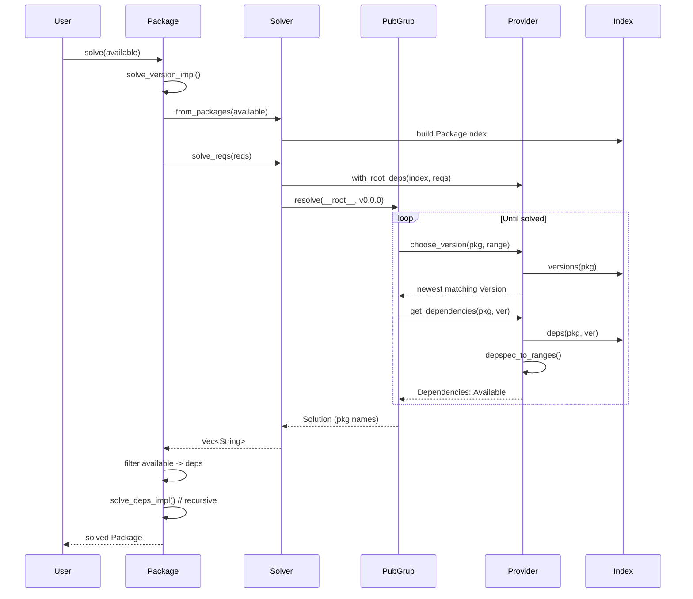
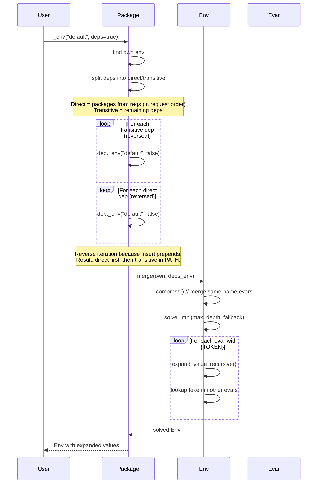
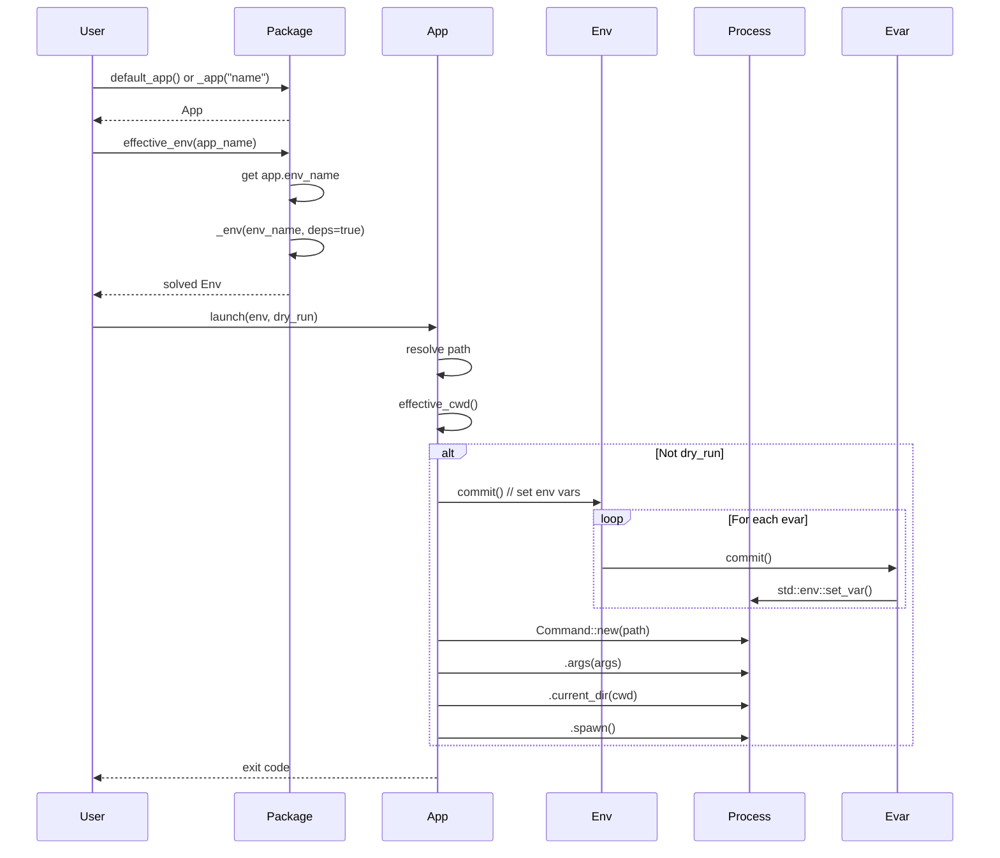
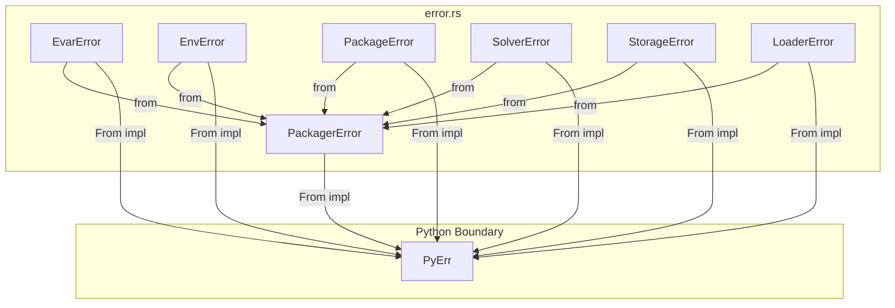
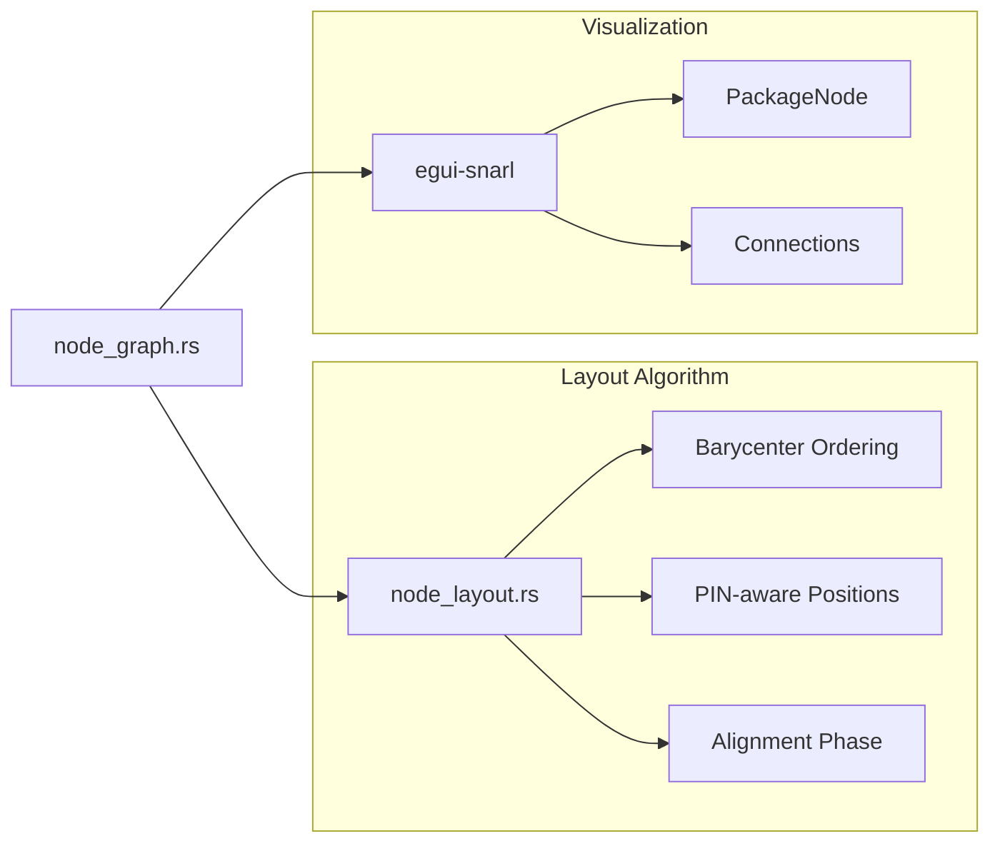

# AGENTS.md - pkg-rs Architecture Guide

This document provides comprehensive dataflow and codepath diagrams for the pkg-rs codebase. It serves as a reference for both AI agents and human developers to understand the system architecture.

---

## Table of Contents

1. [System Overview](#system-overview)
2. [Core Data Structures](#core-data-structures)
3. [Module Dependency Graph](#module-dependency-graph)
4. [Dataflow Diagrams](#dataflow-diagrams)
5. [Codepath Documentation](#codepath-documentation)
6. [Error Flow](#error-flow)
7. [PyO3 Boundary](#pyo3-boundary)

---

## System Overview

pkg-rs is a VFX package manager similar to [rez](https://github.com/AcademySoftwareFoundation/rez). It provides:

- **Package Discovery**: Scans filesystem for `package.py` definitions
- **Dependency Resolution**: Uses PubGrub algorithm for SAT solving
- **Environment Management**: Manages environment variables for package contexts
- **Application Launching**: Runs applications with configured environments



---

## Core Data Structures

### Package (package.rs)

Central data structure representing a software package.

```
Package {
    name: String,      // "maya-2026.1.0"
    base: String,      // "maya"
    version: String,   // "2026.1.0"

    envs: Vec<Env>,    // Named environments
    apps: Vec<App>,    // Executable applications
    reqs: Vec<String>, // Version requirements ("redshift@>=3.5")
    deps: Vec<Package>,// Resolved dependencies (cloned)

    tags: Vec<String>, // Categorization tags
    solve_status: SolveStatus,
}
```

### Env (env.rs)

Collection of environment variables with merge semantics.

```
Env {
    name: String,      // "default", "debug", etc.
    evars: Vec<Evar>,  // Environment variables
}
```

### Evar (evar.rs)

Single environment variable with action semantics.

```
Evar {
    name: String,      // "PATH", "MAYA_ROOT"
    value: String,     // "/opt/maya/bin" or "{ROOT}/bin"
    action: Action,    // Set | Append | Insert
}

Action::Set    -> Replace value
Action::Append -> value + separator + new
Action::Insert -> new + separator + value
```

### App (app.rs)

Application definition for launching executables.

```
App {
    name: String,       // "maya", "mayapy"
    path: Option<String>,       // "/opt/maya/bin/maya"
    args: Vec<String>,          // Default arguments
    env_name: Option<String>,   // Reference to Env
    cwd: Option<String>,        // Working directory
    properties: HashMap<...>,   // Custom properties
}
```

### Storage (storage.rs)

Registry of discovered packages.

```
Storage {
    packages: HashMap<String, Package>,  // By full name
    by_base: HashMap<String, Vec<String>>, // By base name
    locations: Vec<PathBuf>,
    warnings: Vec<String>,
}
```

---

## Module Dependency Graph



---

## Dataflow Diagrams

### 1. Package Discovery Flow



### 2. Dependency Resolution Flow



### 3. Environment Solving Flow



**PATH Order Strategy**: Direct requirements appear first in PATH (in request order), followed by transitive dependencies. This ensures the main DCC (e.g., maya) takes precedence over plugins.

### 4. Application Launch Flow



---

## Codepath Documentation

### Storage::scan_impl() - Main Entry Point

```
Location: storage.rs:367-473

1. Initialize Python interpreter (pyo3::Python::initialize)
2. Load cache from disk (Cache::load)
3. Determine locations:
   - Custom paths if provided
   - Or: PKG_LOCATIONS env var
   - Or: ./repo fallback
4. Walk each location with jwalk::WalkDir
5. Collect all package.py files
6. For each file:
   a. Check cache (by path + mtime)
   b. If miss: Loader::load_path()
   c. Add to packages HashMap
   d. Index by base name in by_base
7. Scan .toolsets/ directory
8. Sort versions (newest first)
9. Prune and save cache
10. Return Storage
```

### Package::solve_version_impl() - SAT Resolution

```
Location: package.rs:629-670

1. If no reqs: return solved with empty deps
2. Create Solver from available packages
3. Call solver.solve_reqs(reqs)
4. On success:
   a. Filter available packages by solution names
   b. Clone matching packages into self.deps
   c. Set solve_status = Solved
5. On error:
   a. Set solve_status = Failed
   b. Set solve_error = error message
```

### Env::solve_impl() - Token Expansion

```
Location: env.rs:244-290

1. Build lookup HashMap from evars (name -> value)
2. For each evar:
   a. Extract {TOKENS} from value
   b. For each token:
      - Look up in lookup map
      - If found: replace
      - If not found and fallback: keep literal
      - If not found and !fallback: error
   c. Track visited tokens (cycle detection)
   d. Recurse up to max_depth
3. Create new Env with expanded values
```

### Loader::execute_package_py() - Python Execution

```
Location: loader.rs:285-354

1. Acquire GIL (Python::attach)
2. Create globals dict with:
   - __builtins__
   - __file__ = path
   - Package, Env, Evar, App, Action classes
   - pathlib.Path, sys, os modules
3. Execute code with py.run()
4. Get get_package function from globals
5. Build args tuple and kwargs dict
6. Call get_package(*args, **kwargs)
7. Extract result:
   a. Try direct Package extraction
   b. Try PyDict -> Package::from_dict()
   c. Try obj.to_dict() -> Package::from_dict()
8. Return Package or error
```

---

## Error Flow



Error types and their sources:

| Error | Source | Variants |
|-------|--------|----------|
| EvarError | evar.rs | DepthExceeded, CircularReference, InvalidAction |
| EnvError | env.rs | DepthExceeded, CircularReference, VariableNotFound |
| PackageError | package.rs | EnvNotFound, AppNotFound, InvalidName, InvalidVersion, DepsNotSolved |
| SolverError | solver/ | InvalidDepSpec, NoSolution, NoMatchingVersion, Conflict, CircularDependency |
| StorageError | storage.rs | InvalidPath, ScanFailed, InvalidPackage, LoadFailed |
| LoaderError | loader.rs | FileNotFound, ExecutionError, MissingFunction, InvalidReturn |

---

## PyO3 Boundary

The library exposes a Python module via PyO3:

```
#[pymodule]
pkg_lib (lib.rs)
├── Package    (pyclass)
├── Env        (pyclass)
├── Evar       (pyclass)
├── App        (pyclass)
├── Action     (pyclass, enum)
├── Storage    (pyclass)
├── Loader     (pyclass)
├── Solver     (pyclass)
├── SolveStatus(pyclass, enum)
└── VERSION    (constant)
```

### Naming Convention

| Rust Method | Python Exposure | Notes |
|-------------|-----------------|-------|
| `fn method_impl()` | Not exposed | Internal Rust-only |
| `fn method()` | `#[pymethods]` | Python-facing |
| `fn _method()` | Not exposed | Rust API alternative |

### Memory Model

- Python objects are **cloned** when crossing the boundary
- Package.deps contains **owned copies** (not references)
- This makes solved packages **self-contained**

---

## Quick Reference

### File Locations

| Component | File | Key Structs/Functions |
|-----------|------|----------------------|
| Package definition | `src/package.rs` | `Package`, `SolveStatus` |
| Environment | `src/env.rs` | `Env`, `solve_impl` |
| Env variable | `src/evar.rs` | `Evar`, `Action`, `path_sep` |
| Application | `src/app.rs` | `App`, `launch` |
| Discovery | `src/storage.rs` | `Storage`, `scan_impl` |
| Loading | `src/loader.rs` | `Loader`, `execute_package_py` |
| Dep specs | `src/dep.rs` | `DepSpec`, `parse_impl` |
| Name parsing | `src/name.rs` | `split_name_version` |
| Toolsets | `src/toolset.rs` | `ToolsetDef`, `scan_toolsets_dir` |
| Errors | `src/error.rs` | All error enums |
| Solver | `src/solver/mod.rs` | `Solver`, `PackageIndex` |
| PubGrub | `src/solver/provider.rs` | `PubGrubProvider` |
| Ranges | `src/solver/ranges.rs` | `depspec_to_ranges` |
| Cache | `src/cache.rs` | `Cache` |

### CLI Commands

| Command | Handler | Description |
|---------|---------|-------------|
| `pkg list` | `commands/list.rs` | List packages |
| `pkg info <pkg>` | `commands/info.rs` | Package details |
| `pkg env <pkg>` | `commands/env.rs` | Environment and launch |
| `pkg graph <pkg>` | `commands/graph.rs` | Dep graph |
| `pkg scan` | `commands/scan.rs` | Scan locations |
| `pkg shell` | `shell.rs` | Interactive mode |

---

## GUI Architecture (src/gui/)

The GUI is built with `eframe/egui` (immediate mode GUI) and `egui-snarl` for node graph visualization.

### Module Structure

| File | Purpose |
|------|--------|
| `mod.rs` | Main App struct, panel layout, event handling |
| `state.rs` | AppState - persistent UI state (selection, filters, sliders) |
| `package_list.rs` | Left panel - package/toolset list with filtering |
| `tree_editor.rs` | Middle panel - package details tree view |
| `actions.rs` | Bottom panel - Solve, Export buttons, solve result display |
| `toolset_editor.rs` | Modal dialog for creating/editing toolsets |
| `node_graph.rs` | Dependency graph visualization using egui-snarl |
| `node_layout.rs` | **Sugiyama-style hierarchical layout algorithm** |

### Node Graph & Layout System



### Node Layout Algorithm (node_layout.rs)

**Problem**: Visualize dependency DAGs with minimal edge crossings and horizontal connections.

**Solution**: Modified Sugiyama algorithm with PIN-aware barycenter.

#### Why PIN-aware Barycenter?

Standard barycenter calculates node position as average of neighbor positions.
But when ROOT has 10 input pins (requirements), all connected nodes get the
same barycenter (ROOT's center) and end up sorted alphabetically → edge crossings!

**Our fix**: Track which INPUT PIN each edge connects to. Use pin's Y position
(not node center) for barycenter calculation.

```
Standard:  barycenter = avg(neighbor_center_y)
PIN-aware: barycenter = avg(neighbor_y + pin_index/total_pins * height)
```

#### Algorithm Phases

```
Phase 1: CROSSING MINIMIZATION (30 iterations)
├── Forward sweep (layer 1 → N)
│   └── Sort nodes by barycenter of upper neighbors
└── Backward sweep (layer N → 1)
    └── Sort nodes by barycenter of lower neighbors

Phase 2: COORDINATE ASSIGNMENT (30 iterations)  
├── Forward: align nodes with upper neighbor pin positions
└── Backward: align nodes with lower neighbor pin positions
    └── Use median, respect spacing, 30% dampening

Phase 3: FINAL POSITIONING
├── Center graph vertically (Y=400)
└── X = (max_layer - node.layer) * h_spacing + 100
```

#### Key Data Structures

```rust
// Adjacency with pin fractions
adj_upper: HashMap<NodeId, Vec<(NeighborId, pin_frac)>>
adj_lower: HashMap<NodeId, Vec<(NeighborId, pin_frac)>>

// pin_frac = pin_index / total_input_pins
// 0.0 = top pin, 1.0 = bottom pin
```

#### Configuration (UI Sliders)

| Slider | Range | Default | Controls |
|--------|-------|---------|----------|
| Depth | 0-10 | 4 | Max dependency depth to show |
| H | 150-500 | 330 | Horizontal spacing between layers |
| V | 10-100 | 30 | Vertical spacing between nodes |

### Solve Result Display (actions.rs)

After clicking "Solve", displays 3 resizable columns:

```
┌─────────────┬─────────────┬─────────────────────┐
│  Packages   │    Apps     │    Environment      │
│  (resolved) │  (▶ launch) │  (collapsible vars) │
└─────────────┴─────────────┴─────────────────────┘
```

- **Packages**: Numbered list of resolved dependencies
- **Apps**: Launch buttons for all apps in resolved packages
- **Environment**: Merged env vars with Expand/Collapse buttons

### Tree Editor (tree_editor.rs)

Displays package structure as collapsible tree:
- `envs` → Env → Evars (name=value table)
- `apps` → App (with ▶ Launch button)
- `reqs` → requirements (editable for toolsets)
- `tags` → tags (editable for toolsets)

**Edit mode for toolsets**: 
- Click "Edit" on reqs section
- Add/remove requirements with +/- buttons
- Edit tags as comma-separated string
- Apply saves to source .toml file

### Toolset Editor Dialog (toolset_editor.rs)

Modal for creating/editing toolsets:
- Name, Version, Description, Tags fields
- Requirements multiline editor
- Save to `.toolsets/*.toml` files
- Delete button in edit mode

### State Persistence (state.rs)

AppState saved to `prefs.json`:
- `graph_depth`, `graph_h_spacing`, `graph_v_spacing`
- `last_toolset_dir` - remembers last +File directory
- `solve_col1`, `solve_col2` - column widths
- Selection state (package, source_file)

---

## Changelog

- **2025-12-28**: GUI improvements and node layout algorithm
  - **Node Layout**: Rewrote with PIN-aware barycenter algorithm
    - Nodes now ordered to match pin positions on neighbors
    - Connections are horizontal instead of crossing
    - V slider (10-100) controls vertical spacing
  - **+File button**: Remembers last directory (persistent)
  - **Expand/Collapse**: Fixed for Environment section
  - **Export buttons**: Now work with toolsets (use solved env)
  - **Tree editor**: Editable reqs/tags for toolsets with Apply/Cancel
  - **Stable sorting**: Prevents UI flickering in lists
  - **Comprehensive comments**: Added to node_layout.rs

- **2025-12-27**: Initial AGENTS.md created
  - Full architecture documentation
  - Mermaid diagrams for all major flows
  - Codepath documentation
  - Error flow mapping
