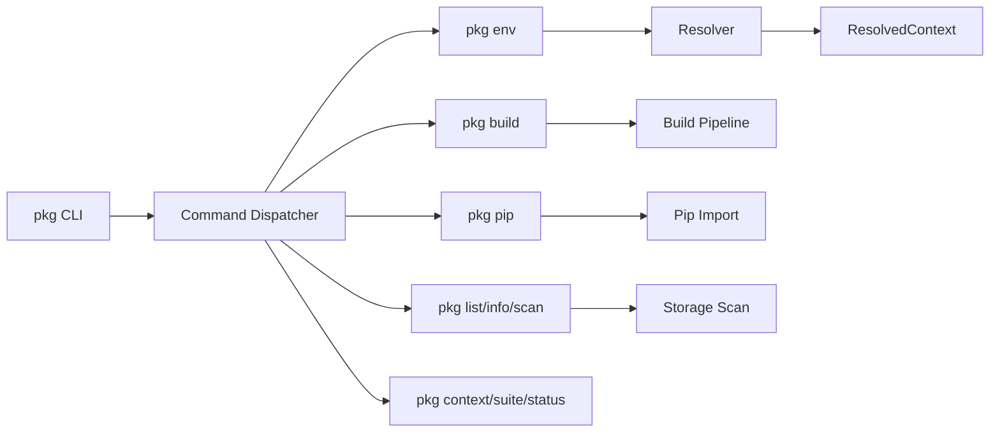
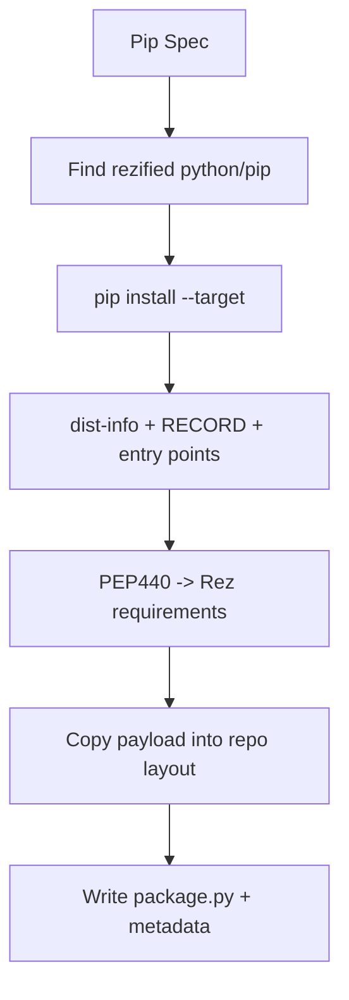

# Mermaid Diagrams

## Config Precedence

```mermaid
flowchart TD
    A[Defaults: rezconfig.py] --> B[Config files list: REZ_CONFIG_FILE]
    B --> C[Home config: ~/.rezconfig]
    C --> D[Env overrides: REZ_*]
    D --> E[Env overrides JSON: REZ_*_JSON]
    E --> F[Package config section (build/release)]
    F --> G[Effective Config + plugins.pkg_rs.*]
```

## Embedded Python Layout

```mermaid
flowchart TD
    ROOT[python/ sys.path root] --> REZ[rez/ (rezconfig, resolver)]
    ROOT --> PLUGINS[rezplugins/ (build/shell/repo plugins)]
```

## CLI Command Routing



## Rez Commands (Single Binary)

```mermaid
flowchart TD
    PKG[pkg binary] --> SUB[subcommands]
    SUB --> ENV[env (pkg rez env) -> cmd_env]
    SUB --> BUILD[build (pkg rez build) -> cmd_build]
    SUB --> PIP[pip (pkg rez pip) -> cmd_pip]
    SUB --> STUB[rez <cmd> stubs]
```

## Env Pipeline (Current)

```mermaid
flowchart TD
    CLI[pkg env] --> PKG[Resolve package(s)]
    PKG --> SOLVE[Solve deps]
    SOLVE --> ENV[Package._env/default]
    ENV --> STAMP[Stamp PKG_* vars]
    STAMP --> EXPAND[Env.solve_impl]
    EXPAND --> OUT[Emit/commit env]
    PKG -. commands ignored .-> OUT
```

## Env Pipeline (Target Rez Parity)

```mermaid
flowchart TD
    CLI[pkg env] --> RESOLVE[Resolve deps + variants]
    RESOLVE --> CTX[ResolvedContext]
    CTX --> REX[Execute pre/commands/post (rex)]
    REX --> ENV[Env mutations]
    ENV --> OUT[Emit/commit env]
    CTX --> TESTS[pre_test + tests]
    TESTS --> REPORT[Test report]
```

## Package Loader Command Capture

```mermaid
flowchart TD
    SRC[package.py source] --> EXEC[Python exec globals]
    EXEC --> GET[get_package()]
    EXEC --> EXTRACT[Extract command sources]
    EXTRACT --> MERGE[Merge into Package if missing]
    GET --> PKG[Package/dict]
    PKG --> MERGE
```

## Resolve + Context Pipeline

```mermaid
flowchart TD
    REQ[Package Requests] --> FILTERS[Filters + Orderers + Timestamp]
    FILTERS --> SELECT[Backend Select]
    SELECT --> PKG[Pkg Solver (PubGrub)]
    SELECT --> REZ[Rez Resolver (python)]
    PKG --> CTX[ResolvedContext]
    REZ --> CTX
    CTX --> SHELL[Shell Env Output]
    CTX --> RXT[.rxt Serialization]
    CTX --> EXEC[Command Execution]
```

## Build Pipeline

```mermaid
flowchart TD
    PKG[Developer Package] --> DETECT[BuildSystem Detection]
    DETECT --> PROC[BuildProcess (local/central)]
    PROC --> BCTX[Resolve Build Context]
    BCTX --> ENVVARS[Set REZ_BUILD_* + pre_build_commands]
    ENVVARS --> PHASES[Configure/Build/Install]
    PHASES --> INSTALL[Install Payload + Metadata]
    PHASES --> SCRIPTS[build-env + build.rxt]
```

## Pip Pipeline


