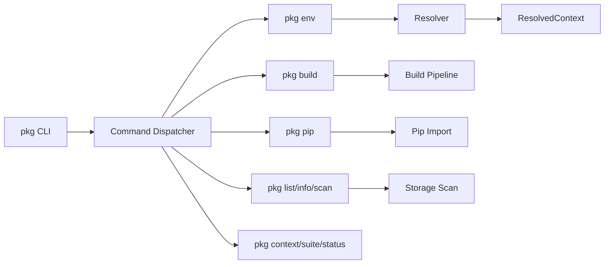
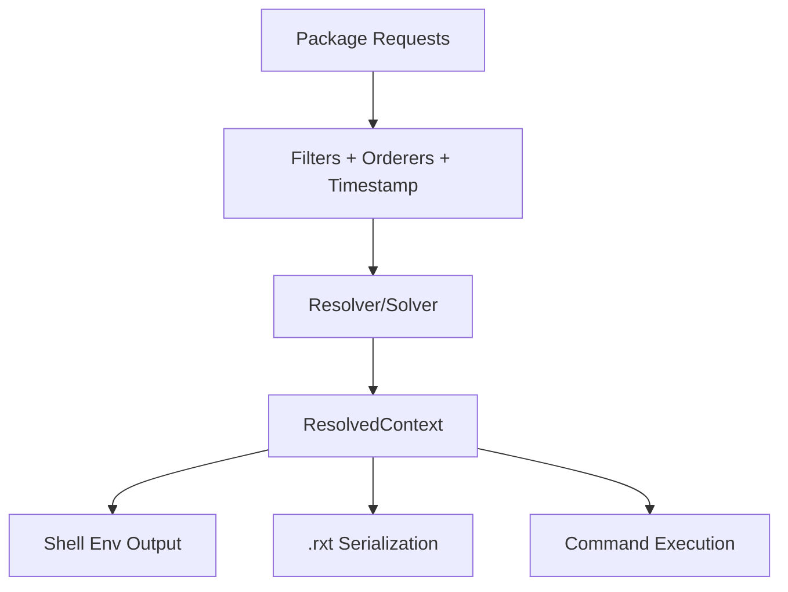
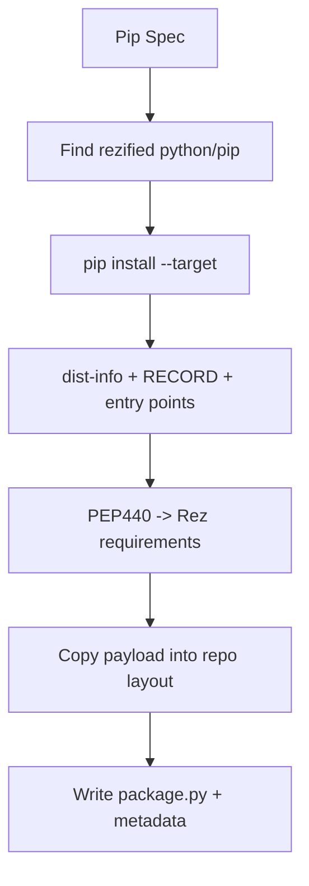

# Mermaid Diagrams

## Config Precedence

```mermaid
flowchart TD
    A[Defaults] --> B[Config files list]
    B --> C[Home config]
    C --> D[Env overrides: PKG_*]
    D --> E[Env overrides: PKG_*_JSON]
    E --> F[Package config section (build/release)]
    F --> G[Effective Config]
```

## CLI Command Routing



## Resolve + Context Pipeline



## Build Pipeline

```mermaid
flowchart TD
    PKG[Developer Package] --> DETECT[BuildSystem Detection]
    DETECT --> PROC[BuildProcess (local/central)]
    PROC --> BCTX[Resolve Build Context]
    BCTX --> ENVVARS[Set REZ_BUILD_* + pre_build_commands]
    ENVVARS --> PHASES[Configure/Build/Install]
    PHASES --> INSTALL[Install Payload + Metadata]
    PHASES --> SCRIPTS[build-env + build.rxt]
```

## Pip Pipeline

