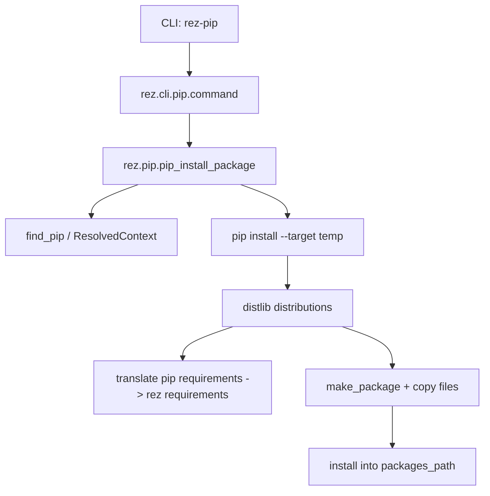
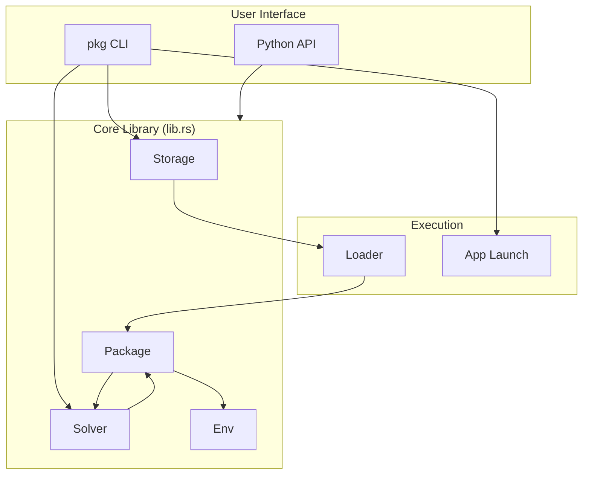
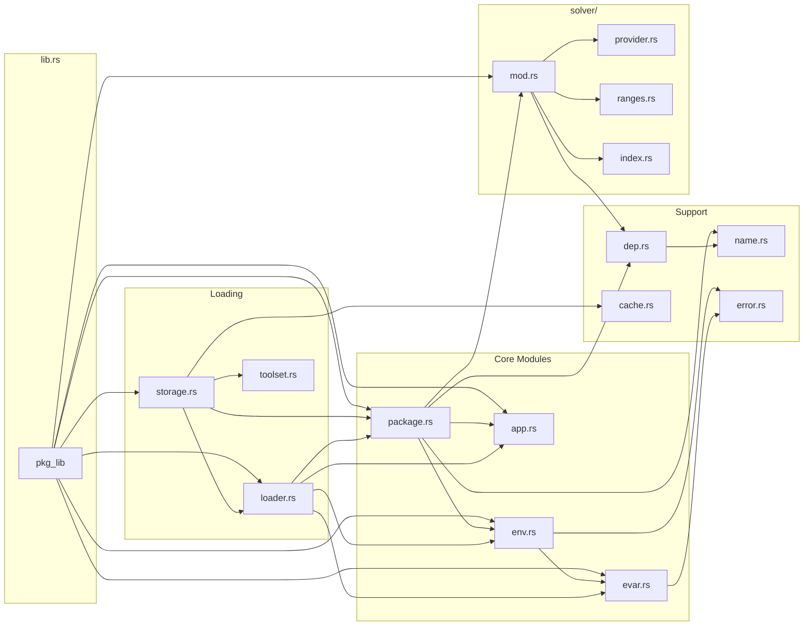
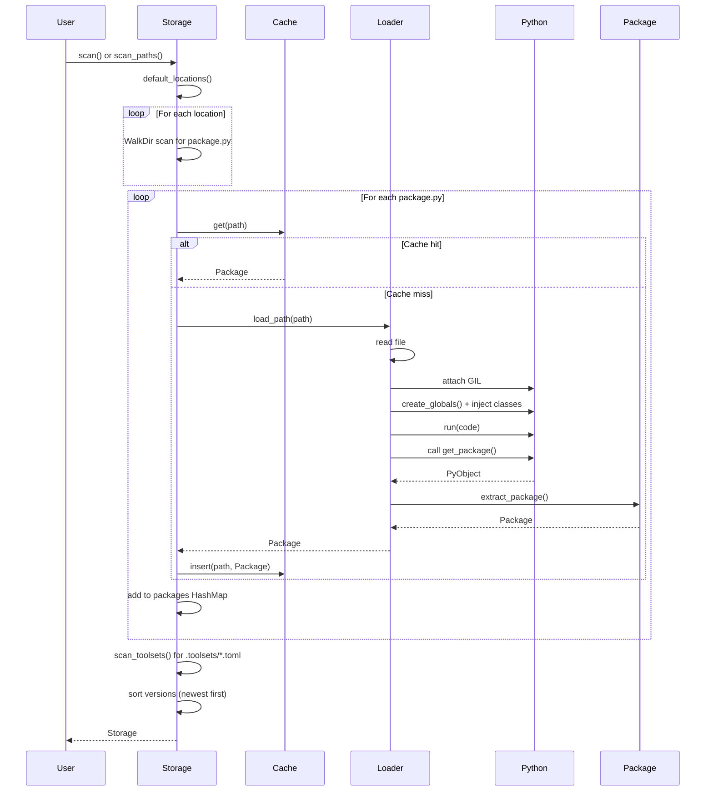
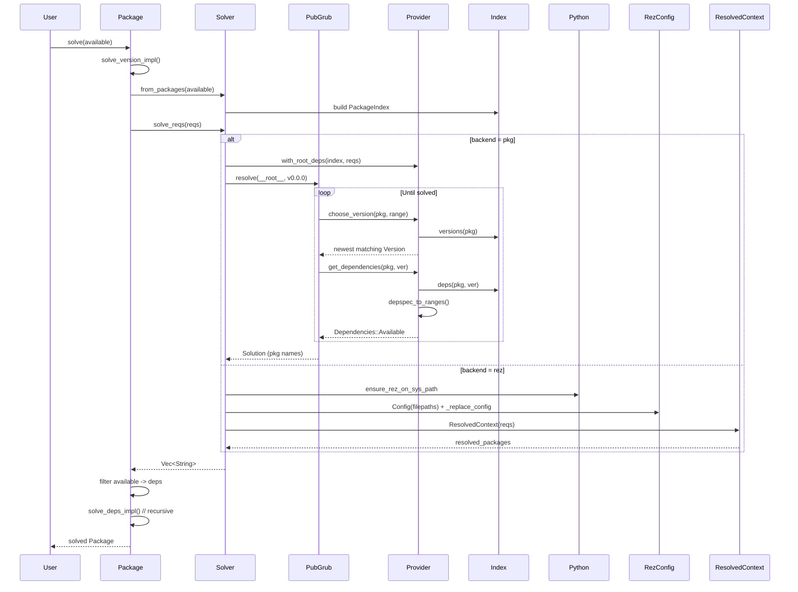
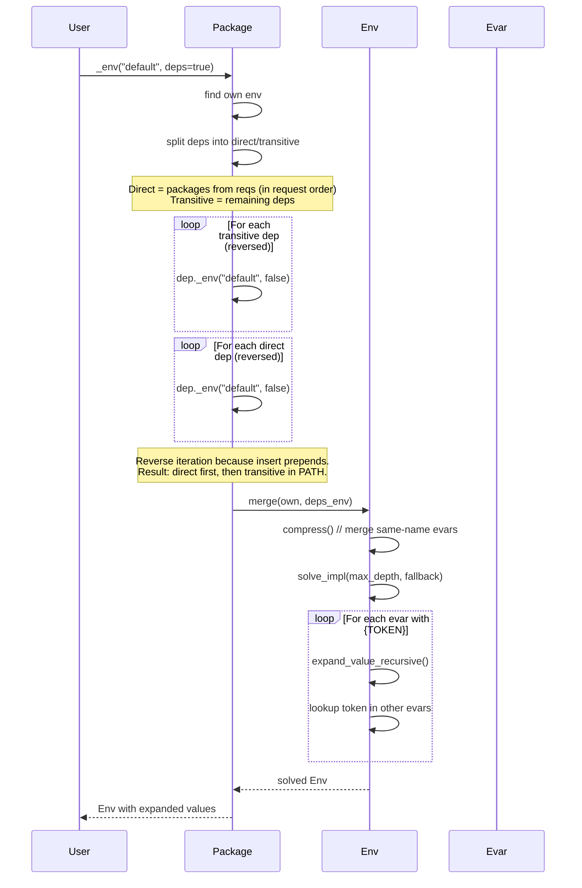
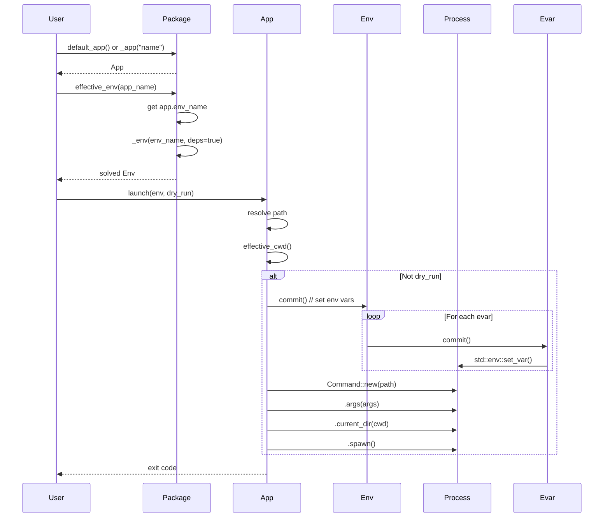
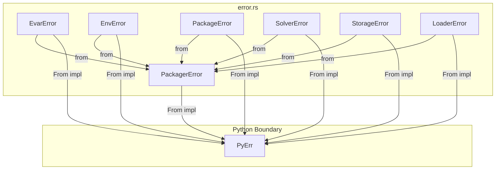
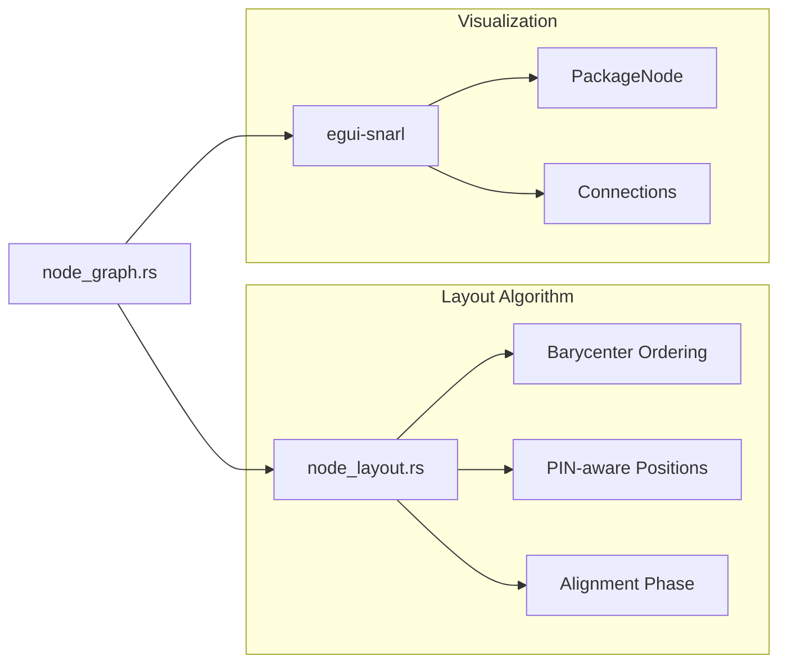
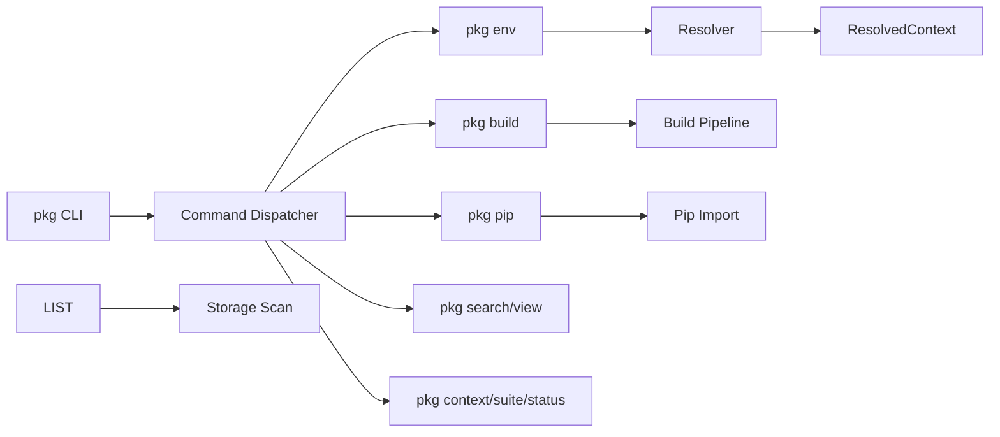

# MEGAPLAN

Generated: 2026-02-09 18:16:49
Root: C:\projects\projects.rust\_done\pkg-rs
Files: 106

## Index
1. `_ref/AGENTS.md`
2. `_ref/bleeding-rez/CHANGELOG.md`
3. `_ref/bleeding-rez/CONTRIBUTING.md`
4. `_ref/bleeding-rez/INSTALL.md`
5. `_ref/bleeding-rez/README.md`
6. `_ref/bleeding-rez/RELEASE.md`
7. `_ref/bleeding-rez/src/rez/SOLVER.md`
8. `_ref/bleeding-rez/src/rez/vendor/README.md`
9. `_ref/bleeding-rez/src/support/README.md`
10. `_ref/bleeding-rez/wiki/pages/_Configuring-Rez.md`
11. `_ref/bleeding-rez/wiki/pages/_Credits.md`
12. `_ref/bleeding-rez/wiki/pages/Basic-Concepts.md`
13. `_ref/bleeding-rez/wiki/pages/Building-Packages.md`
14. `_ref/bleeding-rez/wiki/pages/Command-Line-Tools.md`
15. `_ref/bleeding-rez/wiki/pages/Contexts.md`
16. `_ref/bleeding-rez/wiki/pages/Environment-Variables.md`
17. `_ref/bleeding-rez/wiki/pages/FAQ.md`
18. `_ref/bleeding-rez/wiki/pages/Getting-Started.md`
19. `_ref/bleeding-rez/wiki/pages/Glossary.md`
20. `_ref/bleeding-rez/wiki/pages/Package-Commands.md`
21. `_ref/bleeding-rez/wiki/pages/Package-Definition-Guide.md`
22. `_ref/bleeding-rez/wiki/pages/Suites.md`
23. `_ref/bleeding-rez/wiki/pages/Variants.md`
24. `_ref/bleeding-rez/wiki/README.md`
25. `_ref/diagram.md`
26. `_ref/DIAGRAMS.md`
27. `_ref/plan1.md`
28. `_ref/plan2.md`
29. `_ref/rez/.github/ISSUE_TEMPLATE/bug_report.md`
30. `_ref/rez/.github/ISSUE_TEMPLATE/feature_request.md`
31. `_ref/rez/.github/ISSUE_TEMPLATE/tsc_meeting_agenda.md`
32. `_ref/rez/ADOPTERS.md`
33. `_ref/rez/ASWF/ONBOARDING.md`
34. `_ref/rez/ASWF/TSC/meeting-notes/2022-08-18.md`
35. `_ref/rez/ASWF/TSC/meeting-notes/2022-09-15.md`
36. `_ref/rez/ASWF/TSC/meeting-notes/2022-10-20.md`
37. `_ref/rez/ASWF/TSC/meeting-notes/2022-11-17.md`
38. `_ref/rez/ASWF/TSC/meeting-notes/2022-12-15.md`
39. `_ref/rez/ASWF/TSC/meeting-notes/2023-01-19.md`
40. `_ref/rez/ASWF/TSC/meeting-notes/2023-02-16.md`
41. `_ref/rez/ASWF/TSC/meeting-notes/2023-03-16.md`
42. `_ref/rez/ASWF/TSC/meeting-notes/2023-04-20.md`
43. `_ref/rez/ASWF/TSC/meeting-notes/2023-05-18.md`
44. `_ref/rez/ASWF/TSC/meeting-notes/2023-07-20/notes.md`
45. `_ref/rez/ASWF/TSC/meeting-notes/2023-08-17/notes.md`
46. `_ref/rez/ASWF/TSC/meeting-notes/_YYYY-MM-DD.md`
47. `_ref/rez/ASWF/TSC/project-reviews/README.md`
48. `_ref/rez/CHANGELOG.md`
49. `_ref/rez/CODE_OF_CONDUCT.md`
50. `_ref/rez/CONTRIBUTING.md`
51. `_ref/rez/docs/README.md`
52. `_ref/rez/docs/source/changelog.md`
53. `_ref/rez/example_extensions/hello_cmd/README.md`
54. `_ref/rez/example_packages/hello_world/README.md`
55. `_ref/rez/GOVERNANCE.md`
56. `_ref/rez/INSTALL.md`
57. `_ref/rez/metrics/benchmarking/RESULTS.md`
58. `_ref/rez/README.md`
59. `_ref/rez/RELEASE.md`
60. `_ref/rez/SECURITY.md`
61. `_ref/rez/src/build_utils/README.md`
62. `_ref/rez/src/rez/cli/README.md`
63. `_ref/rez/src/rez/data/tests/packages/py_packages/empty/README.md`
64. `_ref/rez/src/rez/SOLVER.md`
65. `_ref/rez/src/rez/vendor/pydot/README.md`
66. `_ref/rez/src/rez/vendor/README.md`
67. `_ref/rez/src/support/README.md`
68. `_ref/rez/src/support/shotgun_toolkit/README.md`
69. `_ref/rez/THIRD_PARTY.md`
70. `crates/bin-patch/README.md`
71. `docs/src/advanced/caching.md`
72. `docs/src/advanced/constraints.md`
73. `docs/src/advanced/tokens.md`
74. `docs/src/cli/commands.md`
75. `docs/src/cli/completions.md`
76. `docs/src/cli/options.md`
77. `docs/src/installation.md`
78. `docs/src/intro.md`
79. `docs/src/package-structure.md`
80. `docs/src/packages/applications.md`
81. `docs/src/packages/dependencies.md`
82. `docs/src/packages/environments.md`
83. `docs/src/packages/format.md`
84. `docs/src/python/app.md`
85. `docs/src/python/env.md`
86. `docs/src/python/package.md`
87. `docs/src/python/solver.md`
88. `docs/src/python/storage.md`
89. `docs/src/quickstart.md`
90. `docs/src/SUMMARY.md`
91. `md/agents.md`
92. `md/all_plans.md`
93. `md/diagram.md`
94. `md/diagrams.md`
95. `md/implementation_order.md`
96. `md/parity.md`
97. `md/port_to_rust.md`
98. `md/progress.md`
99. `md/readme.md`
100. `md/report.md`
101. `md/rez_next_plan.md`
102. `md/todo.md`
103. `md/userguide.md`
104. `src/pkg/README.md`
105. `src/README.md`
106. `task.md`

## Content

---

## _ref/AGENTS.md
# Agents

## Rez-Build Dataflow (ASCII)

[User CLI + CWD]
  |
  v
[rez.cli._entry_points.run_rez_build]
  |
  v
[rez.cli._main.run("build")]
  |
  v
[rez.cli.build.command]
  |
  +--> Load DeveloperPackage (CWD)
  |
  +--> Select BuildSystem plugin (package build_system/build_command or auto-detect)
  |
  +--> Create BuildProcess plugin (default: local)
           |
           v
        Build variants:
           - create ResolvedContext -> build.rxt
           - run BuildSystem.build
           - optionally install payload + update package.py

## Rez-Build Codepaths (ASCII)

rez-build
  -> rez.cli._entry_points.run_rez_build
    -> rez.cli._main.run
      -> rez.cli._util.subcommands["build"] (arg_mode=grouped)
        -> rez.cli.build.setup_parser / command
          -> rez.build_system.create_build_system
          -> rez.build_process.create_build_process
            -> rezplugins.build_process.local.LocalBuildProcess.build
              -> LocalBuildProcess._build_variant_base
                -> BuildSystem.build

## Rez-Pip Dataflow (ASCII)

[CLI: rez-pip]
  |
  v
[rez.cli.pip.command]
  |
  v
[rez.pip.pip_install_package]
  |
  +--> find_pip (rez python/pip or fallback)
  +--> pip install --target <temp>
  +--> distlib: collect distributions
  +--> translate pip requirements -> rez requirements
  +--> make_package + copy files (python/, bin/)
  +--> install into packages_path (local/release/prefix)

## Key Files
- src/rez/cli/_entry_points.py
- src/rez/cli/_main.py
- src/rez/cli/_util.py
- src/rez/cli/build.py
- src/rez/build_system.py
- src/rez/build_process.py
- src/rezplugins/build_process/local.py
- src/rezplugins/build_system/custom.py
- src/rez/cli/pip.py
- src/rez/pip.py
- src/rez/utils/pip.py
- docs/source/pip.rst


---

## _ref/bleeding-rez/CHANGELOG.md
# Change Log


## 2.40.5 (2020-11-06)

**Notes**

This update enables using non-filesystem based package repository. ([\#97](https://github.com/mottosso/bleeding-rez/pull/97) )


## 2.40.4 (2020-02-13)

**Notes**

This update brings fixes the character "&" being escaped on PowerShell's shell plugin. ([\#93](https://github.com/mottosso/bleeding-rez/issues/93) )


## 2.40.3 (2019-08-15)
[Source](https://github.com/nerdvegas/rez/tree/2.40.3) | [Diff](https://github.com/nerdvegas/rez/compare/2.40.2...2.40.3)

**Notes**

This update allows custom plugins to override the builtin rez plugins. It does so by reversing the order
in which plugins are loaded, so that builtins are loaded last.

**Merged pull requests:**

- Reverse order for plugins loading [\#692](https://github.com/nerdvegas/rez/pull/692) ([predat](https://github.com/predat))

**Closed issues:**

- rezplugins loading order [\#677](https://github.com/nerdvegas/rez/issues/677)

## 2.40.2 (2019-08-15)
[Source](https://github.com/nerdvegas/rez/tree/2.40.2) | [Diff](https://github.com/nerdvegas/rez/compare/2.40.1...2.40.2)

**Notes**

This release fixes an issue on Windows, which has non-case-sensitive filepaths. Requesting a package with a case
differing from that on disk would cause two packages to exist in the resolve, which really were just different
cases of the same package.

The behaviour on Windows is now:

- Packages are case-sensitive - `rez-env Foo` will fail if the package folder on disk is `foo`;
- Package repository paths are case-insensitive - `~/packages` and `~/Packages` are regarded as the same repo.

**Merged pull requests:**

- [FIX] Make package resolve request respect case sensitivity -- Windows [\#689](https://github.com/nerdvegas/rez/pull/689) ([lambdaclan](https://github.com/lambdaclan))

## 2.40.1 (2019-08-07)
[Source](https://github.com/nerdvegas/rez/tree/2.40.1) | [Diff](https://github.com/nerdvegas/rez/compare/2.40.0...2.40.1)

**Notes**

Fixes regression introduced in v2.39.0.

**Merged pull requests:**

- added missing plugin config [\#690](https://github.com/nerdvegas/rez/pull/690) ([nerdvegas](https://github.com/nerdvegas))

**Closed issues:**

- [Regression - Version >= 2.39.0] ConfigurationError: Error in Rez configuration under plugins.shell [\#688](https://github.com/nerdvegas/rez/issues/688)

## 2.40.0 (2019-08-07)
[Source](https://github.com/nerdvegas/rez/tree/2.40.0) | [Diff](https://github.com/nerdvegas/rez/compare/2.39.0...2.40.0)

**Notes**

- Adds new Zsh shell plugin (**BETA**)

**Merged pull requests:**

- initial implementation of zsh shell plugin [\#686](https://github.com/nerdvegas/rez/pull/686) ([maxnbk](https://github.com/maxnbk))

**Closed issues:**

- zsh plugin for rez [\#451](https://github.com/nerdvegas/rez/issues/451)

## 2.39.0 (2019-08-07)
[Source](https://github.com/nerdvegas/rez/tree/2.39.0) | [Diff](https://github.com/nerdvegas/rez/compare/2.38.2...2.39.0)

**Notes**

- Fixes errors in new powershell plugin
- Adds new powershell core 6+ plugin (**BETA**).

**Merged pull requests:**

- Fix missing import in powershell plugin [\#674](https://github.com/nerdvegas/rez/pull/674) ([instinct-vfx](https://github.com/instinct-vfx))
- Add powershell core 6+ support (pwsh) [\#679](https://github.com/nerdvegas/rez/pull/679) ([instinct-vfx](https://github.com/instinct-vfx))

**Closed issues:**

- Add shell plugin for poweshell 6+ [\#678](https://github.com/nerdvegas/rez/issues/678)

## 2.38.2 (2019-07-23)
[Source](https://github.com/nerdvegas/rez/tree/2.38.2) | [Diff](https://github.com/nerdvegas/rez/compare/2.38.1...2.38.2)

**Notes**

Fixes regression in 2.38.0 that unintentionally renamed _rez_fwd tool to _rez-fwd.

**Merged pull requests:**

- fixed regression in 2.38.0 that unintentionally renamed _rez_fwd to _rez-fwd [\#676](https://github.com/nerdvegas/rez/pull/676) ([nerdvegas](https://github.com/nerdvegas))

**Closed issues:**

- build scripts generated with incorrect shebang arg [\#671](https://github.com/nerdvegas/rez/issues/671)

## 2.38.1 (2019-07-20)
[Source](https://github.com/nerdvegas/rez/tree/2.38.1) | [Diff](https://github.com/nerdvegas/rez/compare/2.38.0...2.38.1)

**Notes**

Fixes issue on Windows where rez-bind'ing pip creates a broken package.

**Merged pull requests:**

- [Fix] Windows rez-bind pip [\#659](https://github.com/nerdvegas/rez/pull/659) ([lambdaclan](https://github.com/lambdaclan))

## 2.38.0 (2019-07-20)
[Source](https://github.com/nerdvegas/rez/tree/2.38.0) | [Diff](https://github.com/nerdvegas/rez/compare/2.37.1...2.38.0)

**Notes**

Updates the installer (install.py).

* patched distlib (in build_utils) has been removed. The patch we were relying on
  has since been made part of the main distlib release, which we already have vendored;
* virtualenv has been updated to latest;
* scripts have been removed, and entry points are used instead;
* install.py code has been cleaned up and simplified. Specifically, standard use of
  distlib.ScriptMaker has been put in place;
* INSTALL.md has been updated with a full explanation of the installer, and why a
  pip-based installation is not the same as using install.py.

**Merged pull requests:**

- Installer updates [\#662](https://github.com/nerdvegas/rez/pull/662) ([nerdvegas](https://github.com/nerdvegas))

## [2.37.1](https://github.com/nerdvegas/rez/tree/2.37.1) (2019-07-20)
[Full Changelog](https://github.com/nerdvegas/rez/compare/2.37.0...2.37.1)

**Notes**

This fixes a regression introduced in `2.34.0`, which causes `rez-context -g` to
fail. The pydot vendor package was updated, and the newer version includes a
breaking change. Where `pydot.graph_from_dot_data` used to return a single graph
object, it now returns a list of graph objects.

**Merged pull requests:**

- Fix pydot regression [\#668](https://github.com/nerdvegas/rez/pull/668) ([nerdvegas](https://github.com/nerdvegas))

## [2.37.0](https://github.com/nerdvegas/rez/tree/2.37.0) (2019-07-19)
[Full Changelog](https://github.com/nerdvegas/rez/compare/2.36.2...2.37.0)

**Notes**

Adds PowerShell support.
https://docs.microsoft.com/en-us/powershell/

**Merged pull requests:**

- Implement PowerShell [\#644](https://github.com/nerdvegas/rez/pull/644) ([mottosso](https://github.com/mottosso))

## [2.36.2](https://github.com/nerdvegas/rez/tree/2.36.2) (2019-07-16)
[Full Changelog](https://github.com/nerdvegas/rez/compare/2.36.1...2.36.2)

**Merged pull requests:**

- [Feature] Pure python package detection [\#628](https://github.com/nerdvegas/rez/pull/628) ([lambdaclan](https://github.com/lambdaclan))

## [2.36.1](https://github.com/nerdvegas/rez/tree/2.36.1) (2019-07-16)
[Full Changelog](https://github.com/nerdvegas/rez/compare/2.36.0...2.36.1)

**Merged pull requests:**

- [Fix] Sh failing in `test_shells.TeshShells.text_rex_code_alias` [\#663](https://github.com/nerdvegas/rez/pull/663) ([bfloch](https://github.com/bfloch))

## [2.36.0](https://github.com/nerdvegas/rez/tree/2.36.0) (2019-07-16)
[Full Changelog](https://github.com/nerdvegas/rez/compare/2.35.0...2.36.0)

**Merged pull requests:**

- Add a package_preprocess_mode [\#651](https://github.com/nerdvegas/rez/pull/651) ([JeanChristopheMorinPerso](https://github.com/JeanChristopheMorinPerso))

**Closed issues:**

- Support "additive" preprocess functions [\#609](https://github.com/nerdvegas/rez/issues/609)

## [2.35.0](https://github.com/nerdvegas/rez/tree/2.35.0) (2019-07-10)
[Full Changelog](https://github.com/nerdvegas/rez/compare/2.34.0...2.35.0)

**Backwards Compatibility Issues**

Please note that this update alters the process hierarchy of a resolved rez environment,
for Windows users. This does not necessarily represent a compatibility issue, but please
be on the lookout for unintended side effects and report them if they arise.

**Merged pull requests:**

- WIP No more "Terminate Batch Job? (Y/N)" - Take 2 [\#627](https://github.com/nerdvegas/rez/pull/627) ([mottosso](https://github.com/mottosso))

**Closed issues:**

- Shell history not working in cmd.exe or PowerShell [\#616](https://github.com/nerdvegas/rez/issues/616)

## [2.34.0](https://github.com/nerdvegas/rez/tree/2.34.0) (2019-07-10)
[Full Changelog](https://github.com/nerdvegas/rez/compare/2.33.0...2.34.0)

**Merged pull requests:**

- [Fix] Wheel pip regressions [\#656](https://github.com/nerdvegas/rez/pull/656) ([lambdaclan](https://github.com/lambdaclan))

## [2.33.0](https://github.com/nerdvegas/rez/tree/2.33.0) (2019-06-26)
[Full Changelog](https://github.com/nerdvegas/rez/compare/2.32.1...2.33.0)

**Merged pull requests:**

- Update distlib vendor library [\#654](https://github.com/nerdvegas/rez/pull/654) ([lambdaclan](https://github.com/lambdaclan))
- [WIP] Feature/pip install modern [\#602](https://github.com/nerdvegas/rez/pull/602) ([lambdaclan](https://github.com/lambdaclan))

## [2.32.1](https://github.com/nerdvegas/rez/tree/2.32.1) (2019-06-24)
[Full Changelog](https://github.com/nerdvegas/rez/compare/2.32.0...2.32.1)

**Merged pull requests:**

- Support for external PyYAML and Python 3 [\#622](https://github.com/nerdvegas/rez/pull/622) ([mottosso](https://github.com/mottosso))
- Fix escaping backslashes in tcsh on Mac OS [\#497](https://github.com/nerdvegas/rez/pull/497) ([skral](https://github.com/skral))

## [2.32.0](https://github.com/nerdvegas/rez/tree/2.32.0) (2019-06-23)
[Full Changelog](https://github.com/nerdvegas/rez/compare/2.31.4...2.32.0)

**Merged pull requests:**

- Implement preprocess function support for rezconfig.py (takeover) [\#650](https://github.com/nerdvegas/rez/pull/650) ([JeanChristopheMorinPerso](https://github.com/JeanChristopheMorinPerso))

## [2.31.4](https://github.com/nerdvegas/rez/tree/2.31.4) (2019-06-22)
[Full Changelog](https://github.com/nerdvegas/rez/compare/2.31.3...2.31.4)

**Merged pull requests:**

- Expose Python standard module __file__ and __name__ to rezconfig [\#636](https://github.com/nerdvegas/rez/pull/636) ([mottosso](https://github.com/mottosso))

## [2.31.3](https://github.com/nerdvegas/rez/tree/2.31.3) (2019-06-22)
[Full Changelog](https://github.com/nerdvegas/rez/compare/2.31.2...2.31.3)

**Merged pull requests:**

- Bugfix for alias() on Windows [\#607](https://github.com/nerdvegas/rez/pull/607) ([mottosso](https://github.com/mottosso))

## [2.31.2](https://github.com/nerdvegas/rez/tree/2.31.2) (2019-06-22)
[Full Changelog](https://github.com/nerdvegas/rez/compare/2.31.1...2.31.2)

**Merged pull requests:**

- Fix #558 [\#647](https://github.com/nerdvegas/rez/pull/647) ([mottosso](https://github.com/mottosso))

**Closed issues:**

- rez-build breaks if "|" in a required package's version on Windows [\#558](https://github.com/nerdvegas/rez/issues/558)

## [2.31.1](https://github.com/nerdvegas/rez/tree/2.31.1) (2019-06-18)
[Full Changelog](https://github.com/nerdvegas/rez/compare/2.31.0...2.31.1)

**Merged pull requests:**

- Automatically create missing package repository dir [\#623](https://github.com/nerdvegas/rez/pull/623) ([mottosso](https://github.com/mottosso))

## [2.31.0](https://github.com/nerdvegas/rez/tree/2.31.0) (2019-06-04)
[Full Changelog](https://github.com/nerdvegas/rez/compare/2.30.2...2.31.0)

**Merged pull requests:**

- Fix/add support for reversed version range [\#618](https://github.com/nerdvegas/rez/pull/618) ([instinct-vfx](https://github.com/instinct-vfx))

## [2.30.2](https://github.com/nerdvegas/rez/tree/2.30.2) (2019-06-03)
[Full Changelog](https://github.com/nerdvegas/rez/compare/2.30.1...2.30.2)

**Merged pull requests:**

- Update print statements to be Python 3 compatible [\#641](https://github.com/nerdvegas/rez/pull/641) ([bpabel](https://github.com/bpabel))

## [2.30.1](https://github.com/nerdvegas/rez/tree/2.30.1) (2019-06-03)
[Full Changelog](https://github.com/nerdvegas/rez/compare/2.30.0...2.30.1)

**Merged pull requests:**

- WIP Fix file permissions of package.py on Windows [\#598](https://github.com/nerdvegas/rez/pull/598) ([mottosso](https://github.com/mottosso))

## [2.30.0](https://github.com/nerdvegas/rez/tree/2.30.0) (2019-05-07)
[Full Changelog](https://github.com/nerdvegas/rez/compare/2.29.1...2.30.0)

**Merged pull requests:**

- fqdn [\#621](https://github.com/nerdvegas/rez/pull/621) ([bpabel](https://github.com/bpabel))
- Fix path list with whitespace [\#588](https://github.com/nerdvegas/rez/pull/588) ([asztalosdani](https://github.com/asztalosdani))
- Close the amqp connection after message publish [\#615](https://github.com/nerdvegas/rez/pull/615) ([loup-kreidl](https://github.com/loup-kreidl))

**Closed issues:**

- rezbuild.py broken [\#619](https://github.com/nerdvegas/rez/issues/619)
- rez-env Performance and socket.getfqdn() [\#617](https://github.com/nerdvegas/rez/issues/617)
- "parse_build_args.py" file parser arguments are not accessible anymore in "os.environ". [\#590](https://github.com/nerdvegas/rez/issues/590)

## [2.29.1](https://github.com/nerdvegas/rez/tree/2.29.1) (2019-04-22)
[Full Changelog](https://github.com/nerdvegas/rez/compare/2.29.0...2.29.1)

**Merged pull requests:**

- Bugfix/custom build arguments [\#601](https://github.com/nerdvegas/rez/pull/601) ([lambdaclan](https://github.com/lambdaclan))

**Closed issues:**

- bug in rez-build --bs option [\#604](https://github.com/nerdvegas/rez/issues/604)

## [2.29.0](https://github.com/nerdvegas/rez/tree/2.29.0) (2019-04-09)
[Full Changelog](https://github.com/nerdvegas/rez/compare/2.28.0...2.29.0)

**Implemented enhancements:**

- hash-based variant subpaths [\#583](https://github.com/nerdvegas/rez/issues/583)

**Closed issues:**

- rez variant environment var during build [\#304](https://github.com/nerdvegas/rez/issues/304)

## [2.28.0](https://github.com/nerdvegas/rez/tree/2.28.0) (2019-03-15)
[Full Changelog](https://github.com/nerdvegas/rez/compare/2.27.1...2.28.0)

**Fixed bugs:**

- nargs errors for logging_.print_* functions [\#580](https://github.com/nerdvegas/rez/issues/580)

**Merged pull requests:**

- Ignore versions if .ignore file exists [\#453](https://github.com/nerdvegas/rez/pull/453) ([Pixomondo](https://github.com/Pixomondo))
- Fix/logging print nargs [\#581](https://github.com/nerdvegas/rez/pull/581) ([wwfxuk](https://github.com/wwfxuk))
- package_test.py: fix rez-test header command with % [\#572](https://github.com/nerdvegas/rez/pull/572) ([rodeofx](https://github.com/rodeofx))
- Call the flush method every time a Printer instance is called [\#540](https://github.com/nerdvegas/rez/pull/540) ([rodeofx](https://github.com/rodeofx))

## [2.27.1](https://github.com/nerdvegas/rez/tree/2.27.1) (2019-03-15)
[Full Changelog](https://github.com/nerdvegas/rez/compare/2.27.0...2.27.1)

**Merged pull requests:**

- Delete old repository directory [\#576](https://github.com/nerdvegas/rez/pull/576) ([bpabel](https://github.com/bpabel))

## [2.27.0](https://github.com/nerdvegas/rez/tree/2.27.0) (2019-01-24)
[Full Changelog](https://github.com/nerdvegas/rez/compare/2.26.4...2.27.0)

**Implemented enhancements:**

- facilitate variant install when target package is read-only [\#565](https://github.com/nerdvegas/rez/issues/565)

**Fixed bugs:**

- timestamp override no working in package copy [\#568](https://github.com/nerdvegas/rez/issues/568)
- shallow rez-cp can corrupt package if there are overlapping variants [\#563](https://github.com/nerdvegas/rez/issues/563)

**Merged pull requests:**

- Issue 568 [\#569](https://github.com/nerdvegas/rez/pull/569) ([nerdvegas](https://github.com/nerdvegas))
- Issue 565 [\#567](https://github.com/nerdvegas/rez/pull/567) ([nerdvegas](https://github.com/nerdvegas))
- Issue 563 [\#566](https://github.com/nerdvegas/rez/pull/566) ([nerdvegas](https://github.com/nerdvegas))

## 2.26.4 [[#562](https://github.com/nerdvegas/rez/pull/562)] Fixed Regression in 2.24.0

#### Addressed Issues

* [#561](https://github.com/nerdvegas/rez/issues/561) timestamp not written to installed package

## 2.26.3 [[#560](https://github.com/nerdvegas/rez/pull/560)] Package.py permissions issue

#### Addressed Issues

* [#559](https://github.com/nerdvegas/rez/issues/559) package.py permissions issue

#### Notes

Fixes issue where installed `package.py` can be set to r/w for only the current user.

## 2.26.2 [[#557](https://github.com/nerdvegas/rez/pull/557)] Package Copy Fixes For Non-Varianted Packages

#### Addressed Issues

* [#556](https://github.com/nerdvegas/rez/issues/556) rez-cp briefly copies original package definition in non-varianted packages
* [#555](https://github.com/nerdvegas/rez/issues/555) rez-cp inconsistent symlinking when --shallow=true
* [#554](https://github.com/nerdvegas/rez/issues/554) rez-cp doesn't keep file metadata in some cases

#### Notes

There were various minor issues related to copying non-varianted packages.

## 2.26.1 [[#552](https://github.com/nerdvegas/rez/pull/552)] Bugfix in Package Copy

#### Addressed Issues

* [#551](https://github.com/nerdvegas/rez/issues/551) package copy fails if symlinks in root dir

#### Notes

This was failing when symlinks were present within a non-varianted package being copied. Now, these
symlinks are retained in the target package, unless `--follow-symlinks` is specified.

## 2.26.0 [[#550](https://github.com/nerdvegas/rez/pull/550)] Build System Detection Fixes

#### Addressed Issues

* [#549](https://github.com/nerdvegas/rez/issues/549) '--build-system' rez-build option not always
  available

#### Notes

To fix this issue:
* The '--build-system' rez-build option is now always present.
* To provide further control over the build system type, the package itself can now specify its build
  system - see https://github.com/nerdvegas/rez/wiki/Package-Definition-Guide#build_system

#### COMPATIBILITY ISSUE!

Unfortunately, the 'cmake' build system had its own '--build-system' commandline option also. This
was possible because previous rez versions suppressed the standard '--build-system' option if only
one valid build system was present for a given package working directory. **This option has been
changed to '--cmake-build-system'**.


## 2.25.0 [[#548](https://github.com/nerdvegas/rez/pull/548)] Various Build-related issues

#### Addressed Issues

* [#433](https://github.com/nerdvegas/rez/issues/433): "package_definition_build_python_paths" defined
  paths are not available from top level in package.py
* [#442](https://github.com/nerdvegas/rez/issues/442): "rez-depends" and "private_build_requires"
* [#416](https://github.com/nerdvegas/rez/issues/416): Need currently-building-variant build variables
* [#547](https://github.com/nerdvegas/rez/issues/547): rez-cp follows symlinks within package payload

#### Notes

The biggest update in this release is the introduction of new variables accessible at early-bind time:
building, build_variant_index and build_variant_requires. This allows you to do things like define
different private_build_requires per-variant, or a requires that is different at runtime than it is
at build time. In order to get this to work, a package.py is now re-evaluated multiple times when a
build occurs - once pre-build (where 'building' is set to False), and once per variant build. Please
see the updated wiki for more details: https://github.com/nerdvegas/rez/wiki/Package-Definition-Guide#available-objects

A new build-time env-var, REZ_BUILD_VARIANT_REQUIRES, has been added. This mirrors the new
build_variant_requires var mentioned above.

rez-depends has been updated to only include the private_build_requires of the package being queried
(previously, all packages' private build reqs were included, which is not useful). Recall that the
previous release fixes the issue where private_build_requires was being stripped from released
packages.

The entirety of a package definition file can now see the extra build-time modules available via the
package_definition_build_python_paths config setting. Previously, only early bound functions could
see these.

There was an issue with package copying (and thus the rez-cp tool) where symlinks within a package's
payload were expanded out to their source files at copy time. The default now is to keep such symlinks
intact - but hte previous behavior can still be accessed with the rez-cp --follow-symlinks option.


## 2.24.0: Package Copying

This release adds a new tool, rez-cp, for copying packages/variants from one package repository to
another, with optional renaming/reversioning. The associated API can be found in src/package_copy.py.

#### Addressed Issues

* #541
* #510
* #477

#### Notes

* Package definition file writes are now atomic;
* private_build_requires is kept in installed/released packages;
* Fixes include modules not being copied into released packages;
* File lock is no longer created when variant installation happens in dry mode.


## 2.23.1: Fixed Regression in 2.20.0

#### Addressed Issues

* #532

#### Notes

Bug was introduced in: https://github.com/nerdvegas/rez/releases/tag/2.20.0


## 2.23.0: Package Usage Tracking, Better Config Overrides

#### Addressed Issues

* #528

#### Notes

Two new features are added in this release:

Override any config setting with an env-var. For any setting "foo", you can now set the env-var
REZ_FOO_JSON to a JSON-encoded string. This works for any config setting. Note that the existing
REZ_FOO env-var overrides are still in place also; if both are defined, REZ_FOO takes precedence.
This feature means you can now override some of the more complicated settings with env-vars, such as
package_filter.

Track context creation and sourcing via AMQP. Messages are published (on a separate thread) to the
nominated broker/exchange/routing_key. You have control over what parts of the context are published.
For more details: https://github.com/nerdvegas/rez/blob/master/src/rez/rezconfig.py#L414

The embedded simplejson lib was removed. The native json lib is used instead, and for cases where loads-without-unicoding-everything is needed, utils/json.py now addresses that instead.


## 2.22.1: Stdin-related fixes

#### Addressed Issues

* #512
* #526


## 2.22.0: Search API

PR: #213

#### Notes

Package/variant/family search API is now available in package_search.py. This gives the same
functionality as provided by the rez-search CLI tool.


## 2.21.0: Added mingw as a rez build_system for cmake

PR: #501


## 2.20.1: Windows Fixes

#### Merged PRs

* #490: Fix alias command in Windows when PATH is modified
* #489: Fix cmd.exe not escaping special characters
* #482: Fix selftest getting stuck on Windows

#### Addressed Issues

* #389
* #343
* #432
* #481


## 2.20.0: Better CLI Arg Parsing

PR: #523

#### Addressed Issues

* #492

#### Notes

The rez-python command now supports all native python args and passes those through to its python
subprocess - so you can now shebang with rez-python if that is useful.

More broadly, rez commands now parse CLI args correctly for each case. Many commands previously
accepted rez-env-style commands (eg rez-env pkgA -- somecommand -- i am ignored), but simply ignored
extraneous args after -- tokens.


## 2.19.1: Fixed bug with rez-build and package preprocess

#### Merged PRs

* #522

#### Addressed Issues

* #514

#### Notes

The problem occurred because the preprocess function was attempting to be serialized when the package
definition is cached to memcache. However, this function is stripped in installed packages;
furthermore, caching "developer packages" (ie unbuilt packages) was never intentional.

This release disables memcaching of developer packages, thus avoiding the bug and bringing back
originally intended behavior.


---

## _ref/bleeding-rez/CONTRIBUTING.md
# Contributing To Rez

If you would like to contribute code you can do so through GitHub by forking the repository and
sending a pull request. Please follow these guidelines:

1.  Always retain backwards compatibility, unless a breaking change is necessary. If it is necessary, the associated release notes must make this explicit and obvious;
2.  Make every effort to follow existing conventions and style;
3.  Follow [PEP8](https://www.python.org/dev/peps/pep-0008/)
4.  Follow the [Google Python Style Guide](https://google.github.io/styleguide/pyguide.html)
    for docstrings
5.  Use *spaces*, not *tabs*;
6.  Update the [bleeding-rez version](https://github.com/mottosso/bleeding-rez/blob/master/src/rez/utils/_version.py) appropriately, and follow [semantic versioning](https://semver.org/);
7.  Update [the changelog](https://github.com/mottosso/bleeding-rez/blob/master/CHANGELOG.md); see the section below for more details
8.  Use [this format](https://help.github.com/articles/closing-issues-using-keywords/) to mention the issue(s) your PR closes
9.  Add relevant tests to demonstrate that your changes work
10. Add relevant documentation (see [here](https://github.com/mottosso/bleeding-rez/blob/master/wiki/README.md)) to document your changes, if applicable.

## Reporting Bugs

If you report a bug, please ensure to specify the following:

1.  Rez version (e.g. 2.18.0);
2.  Platform and operating system you were using;
3.  Contextual information (what were you trying to do using Rez);
4.  Simplest possible steps to reproduce.

## Updating The Changelog

Here is an example changelog entry:

```
## [2.30.0](https://github.com/mottosso/bleeding-rez/tree/2.30.0) (2019-05-07)
[Full Changelog](https://github.com/mottosso/bleeding-rez/compare/2.29.1...2.30.0)

**Closed issues:**

- rezbuild.py broken [\#619](https://github.com/mottosso/bleeding-rez/issues/619)
- bleeding-rez-env Performance and socket.getfqdn() [\#617](https://github.com/mottosso/bleeding-rez/issues/617)
- "parse_build_args.py" file parser arguments are not accessible anymore in "os.environ". [\#590](https://github.com/mottosso/bleeding-rez/issues/590)
```

Please include the relevant issues that your PR closes, matching the syntax shown above. When the PR is merged to master, the PR info will be added to the same changelog entry by the maintainer. Don't be too concerned with the date and 'full changelog' line, this will also be patched by the maintainer.


---

## _ref/bleeding-rez/INSTALL.md
# Installation

See https://github.com/nerdvegas/rez/wiki/Getting-Started#installation


---

## _ref/bleeding-rez/README.md


> "Works on *your* machine"

A [Rez](https://github.com/nerdvegas/rez) superset, on PyPI, for Python 2 and 3, with extended support for Windows, an editable [wiki](https://github.com/mottosso/bleeding-rez/wiki) and independent [roadmap](https://github.com/mottosso/bleeding-rez/wiki/Bleeding-Roadmap-2019).

<br>

#### Build Status

<table>
    <tr>
        <td><code>master</code></td>
        <td width=150px><a href=https://mottosso.visualstudio.com/bleeding-rez/_build?definitionId=1></a></td>
        <td width=150px><a href=https://mottosso.visualstudio.com/bleeding-rez/_build?definitionId=1></a></td>
        <td width=150px><a href=https://mottosso.visualstudio.com/bleeding-rez/_build?definitionId=1></a></td>
    </tr>
    <tr>
        <td><code>dev</code></td>
        <td width=150px><a href=https://mottosso.visualstudio.com/bleeding-rez/_build?definitionId=1></a></td>
        <td width=150px><a href=https://mottosso.visualstudio.com/bleeding-rez/_build?definitionId=1></a></td>
        <td width=150px><a href=https://mottosso.visualstudio.com/bleeding-rez/_build?definitionId=1></a></td>
    </tr>
</table>

[](https://pypi.org/project/bleeding-rez/)

<br>

### What is Rez

Rez is a command-line utility for Windows, Linux and MacOS, solving the problem of creating a reproducible environment for your software projects on any machine in any pre-existing environment. It does so by resolving a "request" into a deterministic selection of "packages". Each package is a versioned collection of files with some metadata that you self-host and the resulting "context" is generated on-demand.

```bash
$ rez env Python-3.7 PySide2-5.12 six requests
> $ echo Hello reproducible environment!
```

- [Safety](#safety)
- [Production Configurations](#production-configurations)
- [Backwards Compatibility](#backwards-compatibility)
- [Known Issues](#known-issues)
- [FAQ](#faq)
- [Comparisons](#comparisons) (wip)

<br>

### Ecosystem

A small but growing number of companion projects for bleeding- and nerdvegas-rez.

- `rez-installz` - Native package manager for bleeding-rez
- [`rez-localz`](https://github.com/mottosso/rez-localz) - Package localisation from network or cloud storage
- [`rez-scoopz`](https://github.com/mottosso/rez-scoopz) - Install from [500+ system packages](https://github.com/ScoopInstaller/Main/tree/master/bucket) for Windows as a Rez package
- [`rez-pipz`](https://github.com/mottosso/rez-pipz) - Build and install any [PyPI](https://pypi.org) compatible project as a Rez package
- `rez-cmakez` - Build your projects using CMake
- `rez-yumz` - Install from a selection of [80,000+ RPM packages](https://centos.pkgs.org/7/centos-x86_64/) and counting
- `rez-vcpkgz` - Install any of the [1000+ C++ libraries](https://github.com/Microsoft/vcpkg/tree/master/ports) as a Rez package
- `rez-conanz` - Install any of the [200+ C++ libraries](https://conan.io/) as a Rez package
- `rez-npm` - Install any of the [1000+ JavaScript libraries](https://www.npmjs.com/get-npm) as a Rez package
- [`rez-allzpark`](https://allzpark.sh) - Visual application launcher and Rez debugging tool
- [`rez-for-projects`](https://github.com/mottosso/rez-for-projects) - A set of example packages for use of Rez (and Allspark) with project and application configurations
- `rez-performance` - Test the impact of x-number of packages with y-level of complexity in your network environment to make better integration and deployment decisions.
- `rez-releaz` - Secure package releases with Git integration
- `rez-guiz` - Old-school visual editor of Rez contexts
- `rez-flowchartz` - Visualise package dependencies as a flowchart, useful for debugging
- `rez-...` Your project here!

<br>

### Quickstart

Here's how to install and use bleeding-rez on your machine.

```bash
$ pip install bleeding-rez
$ rez bind --quickstart
$ rez --version
2.33.0
$ rez env
> $ echo Hello World!
Hello World!
```

> The `>` character denotes that you are in a resolved environment, great job!

Now head over to the [**Quickstart Guide**](https://github.com/mottosso/bleeding-rez/wiki/Quickstart) for your first look at what it can do!

<details><summary><b>Advanced</b></summary>

You may alternatively install directly from the GitHub repository using one of the following commands.

```bash
$ pip install git+https://github.com/mottosso/bleeding-rez.git
$ pip install git+https://github.com/mottosso/bleeding-rez.git@dev
$ pip install git+https://github.com/mottosso/bleeding-rez.git@feature/windows-alias-additional-argument
```

</details>

<details><summary><b>Developer</b></summary>

The developer approach maintains Git history and enables you to contribute back to this project (yay!)

```bash
$ python -m virtualenv rez-dev
$ rez-dev\Scripts\activate
(rez) $ git clone https://github.com/mottosso/bleeding-rez.git
(rez) $ cd rez
(rez) $ pip install . -e
```

> Use `. rez-dev\bin\activate` on Linux and MacOS

</details>

<br>

### Safety

How do you test whether your new software runs on another machine? You could run it on another machine. Or you could run it with bleeding-rez.

In order to guarantee that what works on your machine works everywhere, the environment generated by bleeding-rez is "isolated". Akin to what you get out of a Docker container. It contains only the bare essentials provided with a new install of your OS, everything else being provided by your packages.

```
C:\
 __________   __________   __________
|          | |          | |          |
| packageA | | packageB | | packageC |
|__________| |__________| |__________|
      |            |            |
 ____ v __________ v __________ v ___
|                                    |
|              Clean OS              |
|____________________________________|
```

Conversely, nerdvegas/rez *sometime* inherits the environment of the parent shell, resulting in a mix of variables coming from packages, and some coming from the parent. How does it determine whether to inherit? If a package references a variable, it is overwritten. Otherwise, inherited.

This is one of the core differences between nerdvegas- and bleeding-rez, and is what makes bleeding-rez safe and predictable.

##### Why is that important?

- **Incorrect assumptions** Consider developing a library on your machine that takes the environment variable `MY_VARIABLE` for granted. Everything runs, until it comes time to make a release. Once released, your users complain that your software doesn't work, and yet on your machine it does!
- **Bad remote environment** A user gets in touch to complain that your Python library doesn't run on his machine. Why? Because his local `PYTHONHOME` is set to his system Python distribution, rather than the one `required` by your package.
- **Bad local environment** Another user gets in touch saying his Python application complains about not finding PySide2. On your machine it runs just fine, but you later find out that your system Python had PySide2 installed.
- **Any other experience?** Let [me know](https://github.com/mottosso/bleeding-rez/issues)!

<br>

### Production Configurations

Unlike nerdvegas/rez, bleeding-rez fully supports packaging of production environments, also known as "profiles".

- See [Allzpark](https://allzpark.com/) for an example of what that means to you

<br>

### Backwards Compatibility

Some features have been disabled by default. If you encounter any issues, here is how can re-enable them.

**rezconfig.py**

Apply all of these for full compatibility with nerdvegas/rez

```python
import os

# bleeding-rez does not affect file permissions at all
# as it can cause issues on SMB/CIFS shares
make_package_temporarily_writable = True

# bleeding-rez does not support Rez 1 or below
disable_rez_1_compatibility = False

# nerdvegas/rez inherits all values, except under special circumstances.
# See https://github.com/mottosso/bleeding-rez/issues/70
# Can also be passed interactively, to override whatever is set here.
#   $ rez env --inherited  # = True
#   $ rez env --isolated   # = False
inherit_parent_environment = True

# bleeding-rez simplifies the map for Windows
# You can undo this simplification like this.
platform_map = {}

# On Windows, the default shell for bleeding-rez is PowerShell
default_shell = "cmd" if os.name == "nt" else None
```

<br>

### Known Issues

- The (deprecated) `rezbuild.py` build system doesn't appear to work without `inherit_parent_environment = True`

<br>

### FAQ

##### <blockquote>Should I use nerdvegas/rez or bleeding-rez?</blockquote>

If you need to use Rez on Windows with Python 2 and 3, and prefer a simplified installation procedure via PyPI along with the protection of an isolated environment then bleeding-rez is for you.

##### <blockquote>Why does bleeding-rez exist?</blockquote>

bleeding-rez started off as a fork from which to make PRs to nerdvegas/rez, but eventually started to diverge, now bleeding-rez is a true fork featuring additional safety and cross-platform compatibility, especially with Windows.

##### <blockquote>Are there any similar projects to bleeding-rez?</blockquote>

Yes, to some extent. Have a look at these.

| Project | Scope | Shared Packages | Commercial
|:--------|:------|:----------------|:-----------------
| [bleeding-rez](https://github.com/mottosso/bleeding-rez) | ESAP | x
| [rez](https://github.com/nerdvegas/rez) | ES | x
| [Stash](http://stashsoftware.com) | ESAP | x | x
| [be](https://github.com/mottosso/be) | ESAP | x
| [Ecosystem](https://github.com/PeregrineLabs/Ecosystem) | E | x
| [add](https://github.com/mottosso/add) | E | x
| [avalon](http://getavalon.github.io) | EA | x
| [miniconda](https://conda.io/en/latest/) | S |
| [virtualenv](https://github.com/pypa/virtualenv) | S |
| [venv](https://docs.python.org/3/library/venv.html) | S |
| [pipenv](https://docs.pipenv.org/en/latest/) | S |
| [poetry](https://github.com/sdispater/poetry) | S |
| [hatch](https://github.com/ofek/hatch)  | S |
| [nixpkgs](https://nixos.org/nixpkgs/)   | S | x
| [scoop](https://scoop.sh)               | S |
| [fips](https://github.com/floooh/fips)  | S |
| [spack](https://spack.io)  | ESA |

- **Project** Name of project
- **Shared** Whether packages are re-installed per environment, or shared amongst them
- **Scope** Usecases covered by project
    - **E** Environment management, per-package control over what is should look like when requested
    - **S** Software builds, e.g. via cmake
    - **A** Application versioning, along with associated dependencies
    - **P** Project versioning, with associated software and application dependencies

##### <blockquote>How can I get involved?</blockquote>

I'm glad you asked! You're welcome to fork this repository and make a pull-request with your additions. Don't worry too much about the details, automated tests will kick in any time you update your PR. You can also contribute by looking through this README or the [wiki](https://github.com/mottosso/bleeding-rez/wiki) for things to improve, and generally just being part of the project. Welcome aboard!

##### <blockquote>How do I report a bug?</blockquote>

You can do that in the [issues section](https://github.com/mottosso/bleeding-rez/issues), try and be specific.

##### <blockquote>What's the advantage of bleeding-rez over Python's virtualenv/venv or Conda?</blockquote>

Aside from those being strictly limited to Python packages and Rez being language agnostic, both venv and Conda couple the installation of packages with their environment, meaning installed packages cannot be shared with other environments. Consider having installed a series of packages, such as PySide2, PyOpenGL, pyglet and other somewhat large libraries. You'll need to spend both time and disk space for each environment you make; essentially once per project.

On the other side of the spectrum, you've got the global installation directory for something like Python, the `site-packages` directory. Why not just install everything there, and let whichever project you work on use what it needs? The problem is version. If one of your projects require PySide2-5.9 but another requires 5.13 there isn't much you can do.

Enter Rez. With Rez, you can install every package under the sun, for all platforms at once, and establish environment dynamically as you either run, build or develop your project.

```bash
cd my_project
rez env git-2.1 vs-2017 PySide2-5.13 python-3.7 pyglet-1.1b0 PyOpenGL-3.1 -- python setup.py bdist_wheel
```

That means, less disk space is used and that every package you install is an investment into future projects. At some point, your repository of packages gets so large that a single computer or disk is not enough to contain them all, and that's exactly the kind of situation Rez excels at solving, with a `memcached` backend for performance and multi-repository support via the `REZ_PACKAGES_PATH` environment variable which works much like `PYTHONPATH` for Python.

Some of the largest consumers of packages, Animal Logic, hosts thousands of gigabytes of actively used packages across thousands of computers within a shared environment.

<br>

### Comparisons

In addition to the high-level comparisons [above](https://github.com/mottosso/bleeding-rez#are-there-any-similar-projects-to-bleeding-rez), these are a few more in-depth comparisons with projects of particular interest.

<br>

#### Docker

Ever wanted to run graphical applications, like Maya, in a Docker container? Now bleeding-rez can give you the next best thing. Full compartmentalisation whilst retaining access to system hardware like your GPU.

Like a Docker container, the environment within is completely independent of the environment from which it was entered.

```bash
$ export MY_VARIABLE=true
$ docker run -ti --rm centos:7
> $ echo $MY_VARIABLE
$MY_VARIABLE
```

Like `docker run`, environment variables can be passed into a resolved context like this.

```bash
$ docker run -e key=value centos:7
$ rez env -e key=value python-3.7
```


---

## _ref/bleeding-rez/RELEASE.md
# Releasing New Rez Versions

To merge a PR to master and release a new version:

1. Merge the PR locally, following the instructions given on GitHub in the
   `command line instructions` link (but do not push to master yet);
2. Run the tests (rez-selftest) to double check nothing is broken;
3. Make sure the [rez version](https://github.com/nerdvegas/rez/blob/master/src/rez/utils/_version.py)
   is correct, and change if necessary. The version may have been correct at the
   time of PR submission, but may need an update due to releases that have occurred
   since;
4. Update [the changelog](CHANGELOG.md) to include the PR itself, as per existing
   entries. Also, make sure that the date and 'full changelog' link are correct;
5. Run the release-rez utility script. This performs the following actions:
   * Pushes codebase to master;
   * Creates tag on latest version, and pushes tag to master;
   * Generates the new GitHub release (https://github.com/nerdvegas/rez/releases).

      ```
      ]$ python ./release-rez.py
      ```
6. Relax.


---

## _ref/bleeding-rez/src/rez/SOLVER.md
# Description Of Solver Algorithm

## Overview

* A **phase** is a current state of the solve. It contains a list of **scopes**.
* A **scope** is a package request. If the request isn't a conflict, then a scope
  also contains the actual list of variants that match the request.

The solve loop performs 5 different types of operations:

* **EXTRACT**. This happens when a common dependency is found in all the variants
  in a scope. For example if every version of pkg 'foo' depends on some version
  of python, the 'extracted' dependency might be "python-2.6|2.7".

* **MERGE-EXTRACTIONS**. When one or more scopes are successfully *extracted*,
  this results in a list of package requests. This list is then merged into a new
  list, which may be unchanged, or simpler, or may cause a conflict. If a conflict
  occurs then the phase is in conflict, and fails.

* **INTERSECT**: This happens when an extracted dependency overlaps with an existing
  scope. For example "python-2" might be a current scope. Pkg foo's common dependency
  python-2.6|2.7 would be 'intersected' with this scope. This might result in a
  conflict, which would cause the whole phase to fail (and possibly the whole solve).
  Or, as in this case, it narrows an existing scope to 'python-2.6|2.7'.

* **ADD**: This happens when an extraction is a new pkg request. A new scope is
  created and added to the current list of scopes.

* **REDUCE**: This is when a scope iterates over all of its variants and removes those
  that conflict with another scope. If this removes all the variants in the scope,
  the phase has failed - this is called a "total reduction". This type of failure
  is not common - usually it's a conflicting INTERSECT that causes a failure.

* **SPLIT**: Once a phase has been extracted/intersected/added/reduced as much as
  possible (this is called 'exhausted'), we are left with either a solution (each
  scope contains only a single variant), or an unsolved phase. This is when the
  algorithm needs to recurse (although it doesn't actually recurse, it uses a stack
  instead). A SPLIT occurs at this point. The first scope with more than one
  variant is found. This scope is split in two (let us say ScopeA and ScopeB),
  where ScopeA has at least one common dependency (worst case scenario, ScopeA
  contains a single variant). This is done because it guarantees a later extraction,
  which hopefully gets us closer to a solution. Now, two phases are created (let us
  say PhaseA and PhaseB) - identical to the current phase, except that PhaseA has
  ScopeA instead of the original, and PhaseB has ScopeB instead of the original.
  Now, we attempt to solve PhaseA, and if that fails, we attempt to solve PhaseB.

Following the process above, we maintain a 'phase stack'. We run a loop, and in
each loop, we attempt to solve the phase at the top of the stack. If the phase
becomes exhaused, then it is split, and replaced with 2 phases (so the stack
grows by 1). If the phase is solved, then we have the solution, and the other
phases are discarded. If the phase fails to solve, then it is removed from the
stack - if the stack is then empty, then there is no solution.

## Pseudocode

The pseudocode for a solve looks like this (and yes, you will have to read the
solver code for full appreciation of what's going on here):

    def solve(requests):
        phase = create_initial_phase(requests)
        phase_stack = stack()
        phase_stack.push(phase)

        while not solved():
            phase = phase_stack.pop()

            if phase.failed:
                phase = phase_stack.pop()  # discard previous failed phase

            if phase.exhausted:
                phase, next_phase = phase.split()
                phase_stack.push(next_phase)

            new_phase = solve_phase(phase)

            if new_phase.failed:
                phase_stack.push(new_phase)  # we keep last fail on the stack
            elif new_phase.solved:
                # some housekeeping here, like checking for cycles
                final_phase = finalise_phase(new_phase)
                phase_stack.push(final_phase)
            else:
                phase_stack.push(new_phase)  # phase is exhausted

    def solve_phase(phase):
        while True:
            changed_scopes = []
            added_scopes = []
            widened_scopes = []

            while True:
                extractions = []

                foreach phase.scope as scope:
                    extractions |= collect_extractions(scope)

                if not extractions:
                    break

                merge(extractions)
                if in_conflict(extractions):
                    set_fail()
                    return

                foreach phase.scope as scope:
                    intersect(scope, extractions)

                    if failed(scope):
                        set_fail()
                        return

                    if was_intersected(scope):
                        changed_scopes.add(scope)

                        if was_widened(scope):
                            widened_scopes.add(scope)

                # get those extractions involving new packages
                new_extractions = get_new_extractions(extractions)

                # add them as new scopes
                foreach request in new_extractions:
                    scope = new_scope(request)
                    added_scopes.add(scope)
                    phase.add(scope)

            if no (changed_scopes or added_scopes or widened_scopes):
                break

            pending_reductions = convert_to_reduction_set(
                changed_scopes, added_scopes, widened_scopes)

            while pending_reductions:
                scope_a, scope_b = pending_reductions.pop()
                scope_a.reduce_by(scope_b)

                if totally_reduced(scope_a):
                    set_fail()
                    return

                # scope_a changed so other scopes need to reduce against it again
                if was_reduced(scope_a):
                    foreach phase.scope as scope:
                        if scope is not scope_a:
                            pending_reductions.add(scope, scope_a)

There are 2 notable points missing from the pseudocode, related to optimisations:

* Scopes keep a set of package families so that they can quickly skip unnecessary
  reductions. For example, all 'foo' pkgs may depend only on the set (python, bah),
  so when reduced against 'maya', this becomes basically a no-op.

* Objects in the solver (phases, scopes etc) are immutable. Whenever a change
  occurs - such as a scope being narrowed as a result of an intersect - what
  actually happens is that a new object is created, often based on a shallow copy
  of the previous object. This is basically implementing copy-on-demand - lots of
  scopes are shared between phases in the stack, if objects were not immutable
  then creating a new phase would involve a deep copy of the entire state of the
  solver.

## Interpreting Debugging Output

Solver debugging is enabled using the *rez-env* *-v* flag. Repeat for more
vebosity, to a max of *-vvv*.

### Scope Syntax

Before describing all the sections of output during a solve, we need to explain
the scope syntax. This describes the state of a scope, and you'll see it a lot
in solver output.

* `[foo==1.2.0]` This is a scope containing exactly one variant. In this case it
  is a *null* variant (a package that has no variants).

* `[foo-1.2.0[1]]` This is a scope containing exactly one variant. This example
  shows the 1-index variant of the package foo-1.2.0

* `[foo-1.2.0[0,1]]` This is a scope containing two variants from one package version.

* `foo[1.2.0..1.3.5(6)]` This is a scope containing 6 variants from 6 different
  package versions, where the packages are all >= 1.2.0 and <= 1.3.5.

* `foo[1.2.0..1.3.5(6:8)]` This is a scope containing 8 variants from 6 different
  package versions.

In all of the above cases, you may see a trailing `*`, eg `[foo-1.2.0[0,1]]*`.
This indicates that there are still outstanding *extractions* for this scope.

### Output Steps

    request: foo-1.2 bah-3 ~foo-1

You will see this once, at the start of the solve. It simply prints the initial
request list.

    merged request: foo-1.2 bah-3

You will see this once and immediately after the `request:` output. It shows a
simplified (merged) version of the initial request. Notice here how `~foo-1` is
gone - this is because the intersection of `foo-1.2` and `~foo-1` is simply
`foo-1.2`.

    pushed {0,0}: [foo==1.2.0[0,1]]* bah[3.0.5..3.4.0(6)]*

This is pushing the initial *phase* onto the *phase stack*. The `{0,0}` means
that:

* There is 1 phase in the stack (this is the zeroeth phase - phases are pushed
  and popped from the bottom of the stack);
* Zero other phases have already been solved (or failed) at this depth so far.

    --------------------------------------------------------------------------------
    SOLVE #1...
    --------------------------------------------------------------------------------

This output indicates that a phase is starting. The number indicates the number
of phases that have been solved so far (1-indexed), regardless of how many have
failed or succeeded.

    popped {0,0}: [foo==1.2.0[0,1]]* bah[3.0.5..3.4.0(6)]*

This is always the first thing you see after the `SOLVE #1...` output. The
topmost phase is being retrieved from the phase stack.

    EXTRACTING:
    extracted python-2 from [foo==1.2.0[0,1]]*
    extracted utils-1.2+ from bah[3.0.5..3.4.0(6)]*

This lists extractions that have occurred from current scopes.

    MERGE-EXTRACTIONS:
    merged extractions are: python-2 utils-1.2+

This shows the result of merging a set of extracted package requests into a
potentially simpler (or conflicting) set of requests.

    INTERSECTING:
    python[2.7.3..3.3.0(3)] was intersected to [python==2.7.3] by range '2'

This shows scopes that were intersected by previous extractions.

    ADDING:
    added utils[1.2.0..5.2.0(12:14)]*

This shows scopes that were added for new extractions (ie, extractions that
introduce a new package into the solve).

  REDUCING:
  removed blah-35.0.2[1] (dep(python-3.6) <--!--> python==2.7.3)
  [blah==35.0.2[0,1]] was reduced to [blah==35.0.2[0]]* by python==2.7.3

This shows any reductions and the scopes that have changed as a result.


---

## _ref/bleeding-rez/src/rez/vendor/README.md
This folder contains all the libraries on which rez depends to run.

The dependencies list found here is used to track which version we use so that when we
revisit the install procedure, it will be much simpler to do any change in the vendored
libraries (updating them, un-vendoring some, etc).

Note that the latest versions column is just to give us an idea of how far back we are.


# Common

| Package                     | Version                    | Latest                                  | Note                                                                                                                                                                                                                                  |
|-----------------------------|----------------------------|-----------------------------------------|---------------------------------------------------------------------------------------------------------------------------------------------------------------------------------------------------------------------------------------|
| amqp                        | 1.4.9 (Jan 8, 2016)        | 2.4.2 (Mar 3, 2019)                     |                                                                                                                                                                                                                                       |
| argcomplete                 | ?                          | 1.9.5 (Apr 2, 2019)                     | Our version seems patched.                                                                                                                                                                                                            |
| argparse                    | 1.2.1                      | Python standard library since 2.7,>=3.2 | We should simply drop support for python <2.6. Note: Can be done now, 2.6 already officially dropped.                                                                                                                                                                                         |
| atomicwrites                | 1.2.1 (Aug 30, 2018)       | 1.3.0 (Feb 1, 2019)                     |                                                                                                                                                                                                                                       |
| attrs                | 19.1.0 (Mar 3, 2019)       | 19.1.0 (Mar 3, 2019)                     | Added (July 2019) to enable the use of packaging lib that depends on it.
| colorama                    | 0.3.1 (Apr 19, 2014)       | 0.4.1 (Nov 25, 2018)                    | The newest version probably support Windows :)                                                                                                                                                                                        |
| distlib                     | 0.2.9.post0 (May 14, 2019) | 0.3.0 (No official release yet)         | Updated (June 2019) to enable wheel distribution based installations                                                                                                                                                                                           |
| enum                        | ?                          | ?                                       | By looking at the code, it's probably enum34. If so, the latest version is 1.1.6 (May 15, 2016)                                                                                                                                       |
| lockfile                    | 0.9.1 (Sep 19, 2010)       | 0.12.2 (Nov 25, 2015)                   |                                                                                                                                                                                                                                       |
| memcache (python-memcached) | 1.53 (Jun 7, 2013)         | 1.59 (Dec 15, 2017)                     | We could try to move to a more maintained package like pymemcache from pinterest. NOTE: A port to redis may be a better option, people are more familiar with it and it already has a good python client that supports conn pooling.
| packaging                    | 19.0 (Jan 20, 2019)         | 19.0 (Jan 20, 2019)                       | Added (July 2019) to enable PEP440 compatible versions handling.
| progress                    | 1.2 (Nov 28, 2013)         | 1.5 (Mar 6, 2019)                       |                                                                                                                                                                                                                                       |
| pydot                       | 1.4.1 (Dec 12, 2018)       | 1.4.1 (Dec 12, 2018)                     | Updated (July 2019) in order to update pyparsing lib which in turn is required by the packaging library.                                                                                                                                                                                                                                       |
| pygraph (python-graph-core) | 1.8.2 (Jul 14, 2012)       | 1.8.2                                   | Wow, it took me some archeology to find this one. Not entirely sure we need it... We might be able to achieve the same with pydot or graphviz (the pip package)?                                                                      |
| pyparsing                   | 2.4.0 (Apr 8, 2019)      | 2.4.0 (Apr 8, 2019)                     | ~~Transitive dependency. Required by pydot and version pydot 1.0.28 specifically require ==2.0.1. Newer versions require >=2.1.4)~~ Updated (July 2019) along with pydot to allow for packaging lib to be used.                                                                                                       |
| schema                      | 0.3.1 (Apr 28, 2014)       | 0.7.0 (Feb 27, 2019)                    | Our version is patched. Updating would probably require quite a lot of work and wouldn't bring that much to rez.                                                                                                                      |
| six                         | 1.12.0 (Dec 9, 2018)       | 1.12.0 (Dec 9, 2018)                    | Used only for its exec_ function for now. I guess if we want to support python 2 and 3 we will use it more and more. Updated (July 2019) to coincide with packaging lib addition that depends on it.                                                                                                                |
| sortedcontainers            | 1.5.7 (Dec 22, 2016)       | 2.1.0 (Mar 5, 2019)                     | Used in the resolver. Updating would possibly give us some speed improvements.                                                                                                                                                        |
| version                     | ?                          |                                         | This is actually part of rez. It's here because I've been intending on releasing it separately for ages.                                                                                                                                                                                                                  |
| yaml (PyYAML)               | 3.10 (May 30, 2011)        | 5.1 (Mar 13, 2019)                      | Not much changes, mostly broken releases that never made it. Between 3.10 and 5.1 there is only 3 versions that made it to the public (3.11 and 3.12, 3.13), the rest were all removed or marked as pre-release. It's safe to update. |


# Development

| Package   | Version              | Latest               | Note                                                                                 |
|-----------|----------------------|----------------------|--------------------------------------------------------------------------------------|
| unittest2 | 0.5.1 (Jul 12, 2010) | 1.1.0 (Jun 30, 2015) | If we drop support for python 2.6, we will be able to use unittest from the std lib. Note: Can be done now, 2.6 already officially dropped. |


---

## _ref/bleeding-rez/src/support/README.md
Source within this directory is not installed as part of rez; it is here to provide
supporting code for integration with third party applications.


---

## _ref/bleeding-rez/wiki/pages/_Configuring-Rez.md
## Overview

Rez has a good number of configurable settings. The default settings, and
documentation for every setting, can be found
[here](https://github.com/nerdvegas/rez/blob/master/src/rez/rezconfig.py).

Settings are determined in the following way:

- The setting is first read from the file *rezconfig.py* in the rez installation;
- The setting is then overridden if it is present in another settings file pointed at by the
  *REZ_CONFIG_FILE* environment variable. This can also be a path-like variable, to read from
  multiple configuration files;
- The setting is further overriden if it is present in *$HOME/.rezconfig*;
- The setting is overridden again if the environment variable *REZ_XXX* is present, where *XXX* is
  the uppercase version of the setting key. For example, "image_viewer" will be overriden by
  *REZ_IMAGE_VIEWER*.
- This is a special case applied only during a package build or release. In this case, if the
  package definition file contains a "config" section, settings in this section will override all
  others. See [here](#package-overrides).

It is fairly typical to provide your site-specific rez settings in a file that the environment
variable *REZ_CONFIG_FILE* is then set to for all your users. Note that you do not need to provide
a copy of all settings in this file - just provide those that are changed from the defaults.

## Settings Merge Rules

When multiple configuration sources are present, the settings are merged together -
one config file does not replace the previous one, it overrides it. By default, the
following rules apply:

* Dicts are recursively merged together;
* Non-dicts override the previous value.

However, it is also possible to append and/or prepend list-based settings. For example, the
following config entry will append to the `release_hooks` setting value defined by the
previous configuration sources (you can also supply a *prepend* argument):

    release_hooks = ModifyList(append=["custom_release_notify"])

## Package Overrides

Packages themselves can override configuration settings. To show how this is useful,
consider the following example:

    # in package.py
    with scope("config") as c:
        c.release_packages_path = "/svr/packages/internal"

Here a package is overriding the default release path - perhaps you're releasing
internally- and externally-developed packages to different locations, for example.

These config overrides are only applicable during building and releasing of the package.
As such, even though any setting can be overridden, it's only useful to do so for
those that have any effect during the build/install process. These include:

* Settings that determine where packages are found, such as *packages_path*,
  *local_packages_path* and *release_packages_path*;
* Settings in the *build_system*, *release_hook* and *release_vcs* plugin types;
* *package_definition_python_path*;
* *package_filter*.

## String Expansions

The following string expansions occur on all configuration settings:

* Any environment variable reference, in the form *${HOME}*;
* Any property of the *system* object, eg *{system.platform}*.

The *system* object has the following attributes:

* platform: The platform, eg 'linux';
* arch: The architecture, eg 'x86_64';
* os: The operating system, eg 'Ubuntu-12.04';
* user: The current user's username;
* home: Current user's home directory;
* fqdn: Fully qualified domain name, eg 'somesvr.somestudio.com';
* hostname: Host name, eg 'somesvr';
* domain: Domain name, eg 'somestudio.com';
* rez_version: Version of rez, eg '2.0.1'.

## Commandline Tool

You can use the *rez-config* command line tool to see what the current configured settings are.
Called with no arguments, it prints all settings; if you specify an argument, it prints out just
that setting:

    ]$ rez-config packages_path
    - /home/sclaus/packages
    - /home/sclaus/.rez/packages/int
    - /home/sclaus/.rez/packages/ext

Here is an example showing how to override settings using your own configuration file:

    ]$ echo 'packages_path = ["~/packages", "/packages"]' > myrezconfig.py
    ]$ export REZ_CONFIG_FILE=${PWD}/myrezconfig.py
    ]$ rez-config packages_path
    - /home/sclaus/packages
    - /packages

## Configuration Settings

Following is an alphabetical list of rez settings.

> [[media/icons/info.png]] Note that this list has been generated automatically
> from the [rez-config.py](https://github.com/nerdvegas/rez/blob/master/src/rez/rezconfig.py)
> file in the rez source, so you can also refer to that file for the same information.

__REZCONFIG_MD__


---

## _ref/bleeding-rez/wiki/pages/_Credits.md
## Contributors

<p align="center">
<i>__CONTRIBUTORS_MD__</i>
</p>

## Other

<p align="center">
[[media/icons/info.png]]
[[media/icons/warning.png]]
[[media/icons/under_construction.png]]
Icons made by <a href="http://www.flaticon.com" target="_blank">Freepik</a>.
</p>


---

## _ref/bleeding-rez/wiki/pages/Basic-Concepts.md
## Overview

Rez manages packages. You request a list of packages from rez, and it resolves this request, if
possible. If the resolution is not possible, the system supplies you with the relevant information
to determine why this is so. You typically want to resolve a list of packages because you want to
create an environment in which you can use them in combination, without conflicts occurring. A
conflict occurs when there is a request for two or more different versions of the same package - a
version clash.

Rez lets you describe the environment you want in a natural way. For example, you can say:
“I want an environment with...”

* “...the latest version of houdini”
* “...maya-2009.1”
* “...the latest rv and the latest maya and houdini-11.something”
* “...rv-3.something or greater”
* “...the latest houdini which works with boost-1.37.0”
* “...PyQt-2.2 or greater, but less than PyQt-4.5.3”

In many examples in this documentation we will use the
[rez-env](Command-Line-Tools#rez-env) command line tool. This tool takes a list of package
requests and creates the resulting configured environment. It places you in a subshell - simply
exit the shell to return to a non-configured environment.

## Versions

Rez version numbers are alphanumeric - they support any combination of numbers, letters and
underscores. A version number is a set of *tokens*, separated by either dot or dash. For example,
here is a list of valid package version numbers:

* 1
* 1.0.0
* 3.2.build_13
* 4.rc1
* 10a-5

Version number tokens follow a strict ordering schema and are case sensitive. Underscore is the
smallest character, followed by letters (a-z and A-Z), followed by numbers. The ordering rules are
like so:

* Underscore before everything else;
* Letters alphabetical, and before numbers;
* Lowercase letters before uppercase;
* Zero-padded numbers before equivalent non-padded (or less padded) number ('01' is < '1');
* If a token contains a combination of numbers and letters, it is internally split into groups
containing only numbers or only letters, and the resulting list is compared using the same rules
as above.

The following table shows some example version token comparisons:

smaller token | larger token
--------------|-------------
0             | 1
a             | b
a             | A
a             | 3
_5            | 2
ham           | hamster
alpha         | beta
alpha         | bob
02            | 2
002           | 02
13            | 043
3             | 3a
beta3         | 3beta

Versions are compared by their token lists. The token delimiter (usually dot, but can also be dash)
is ignored for comparison purposes - thus the versions '1.0.0' and '1-0.0' are equivalent. If two
versions share the same token list prefix, the longer version is greater - thus '1.0.0' is a higher
version than '1.0'.

Note that no special importance is given to specific characters or letters in Rez version numbers -
the terms 'alpha' and 'beta' for example have no special meaning. Similarly, the number of tokens in
a version number doesn't matter, you can have as many as you like. While you are encouraged to use
semantic versioning (see <a href="http://semver.org/">here</a>), it is not enforced.

## Packages

A *package* is a versioned piece of software, that may have dependencies on other packages. Packages
are self-contained - they have a single package definition file (typically *package.py*), which
describes everything we need to know about the package in order to use it. Rez manages any kind of
package, whether it be a python package, compiled package, or simply build code or configuration
data.

Here is an example package definition file (see [here](Package-Definition-Guide) for further details
of each attribute):

    name = "foo"

    version = "1.0.0"

    description = "Something that does foo-like things."

    requires = [
      "python-2.6",
      "utils-1.1+<2"
    ]

    tools = [
      "fooify"
    ]

    def commands():
      env.PYTHONPATH.append("{root}/python")
      env.PATH.append("{root}/bin")

The *requires* section defines the requirements of the package. The *commands* section describes
what happens when this package is added to an environment. Here, the *bin* directory in the package
installation is appended to *PATH*, and similarly the *python* subdirectory is appended to
*PYTHONPATH*.

## Package Repositories

Packages are installed into package repositories. A package repository is a directory on disk, with
packages and their versions laid out in a known structure underneath. Going on with our (foo, bah,
eek) example, here is how the package repository might look:

    /packages/inhouse/foo/1.1
                         /1.2
                         /1.3
    /packages/inhouse/bah/2
                         /3
                         /4
    /packages/inhouse/eek/2.5
                         /2.6
                         /2.7

    # more detailed example of foo-1.1
    /packages/inhouse/foo/1.1/package.py
                             /python/<PYTHON FILES>
                             /bin/<EXECUTABLES>

Here we have a package repository under the directory */packages/inhouse*. The actual package content
(files, executables etc) is installed into each leaf-node version directory, as shown for *foo-1.1*.
The package definition file, in this case *package.py*, is always stored at the root of the package -
right under the version directory for that package.

Rez only requires that the package's *package.py* file is at the root of the package installation. The
layout of the rest of the package - for example, the *python* and *bin* directories - is completely
up to the package's own build to determine. You should expect to see a package's *commands* section
match up with its installation though. For example, notice how the path for foo's python files and
binaries match what its package commands specified from earlier - "{root}/python" and "{root}/bin"
will expand to these paths respectively.

## Package Search Path

Rez finds packages using a search path in much the same way that python finds python modules using
PYTHONPATH. You can find out what the search path is, using the rez command line tool rez-config
(which you can also use to find any other rez setting):

    ]$ rez-config packages_path
    - /home/ajohns/packages
    - /packages/inhouse
    - /packages/vendor

If the same package appears in two or more repositories on the search path, the earlier package is
used in preference. This happens at the version level - an earlier package "foo-1.0.0" will hide a
later package "foo-1.0.0", but not "foo-1.2.0".

The example search path shown is a typical setting. There are some central repositories later in the
search path, where packages are released to so everyone can use them. But there is also a local
package path at the front of the search path. This is where packages go that are being locally
developed by a user. Having this at the start of the searchpath allows developers to resolve
environments that pull in test packages in preference to released ones, so they can test a package
before releasing it for general use.

You can change the packages search path in several ways. A common way is to set the REZ_PACKAGES_PATH
environment variable; see [Configuring Rez](Configuring-Rez) for more configuration options.

## Package Commands

The *commands* section of the package definition determines how the environment is configured in
order to use it. It is a python function, but note that if any imports are used, they must appear
within the body of this function.

Consider this commands example:

    def commands():
      env.PYTHONPATH.append("{root}/python")
      env.PATH.append("{root}/bin")

This is a typical example, where a package adds its source path to *PYTHONPATH*, and its tools to
*PATH*. See [here](Package-Commands) for details on what can be done within the *commands* section,
as well as details on what order package commands are executed in.

## Package Requests

A *package request* is a string with a special syntax which matches a number of possible package
versions. You use package requests in the requires section of a package definition file, and also
when creating your own configured environment directly using tools such as *rez-env*.

For example, here is a request (using the *rez-env* tool) to create an environment containing
*python* version 2.6 or greater, and *my_py_utils* version 5.4 or greater, but less than 6:

    ]$ rez-env 'python-2.6+' 'my_py_utils-5.4+<6'

Here are some example package requests:

package request | description                         | example versions within request
----------------|-------------------------------------|--------------------------------
foo             | Any version of foo.                 | foo-1, foo-0.4, foo-5.0, foo-2.0.alpha
foo-1           | Any version of foo-1[.x.x...x].     | foo-1, foo-1.0, foo-1.2.3
foo-1+          | foo-1 or greater.                   | foo-1, foo-1.0, foo-1.2.3, foo-7.0.0
foo-1.2+<2      | foo-1.2 or greater, but less than 2 | foo-1.2.0, foo-1.6.4, foo-1.99
foo<2           | Any version of foo less than 2      | foo-1, foo-1.0.4
foo==2.0.0      | Only version 2.0.0 exactly          | foo-2.0.0
foo-1.3\|5+     | OR'd requests                       | foo-1.3.0, foo-6.0.0

### The Conflict Operator

The '!' operator is called the *conflict* operator, and is used to define an incompatibility
between packages, or to specify that you do *not* want a package version present. For example,
consider the command:

    ]$ rez-env maya_utils '!maya-2015.6'

This specifies that you require any version of *maya_utils*, but that any version of *maya* within
2015.6 (and this includes 2015.6.1 and so on) is not acceptable.

### Weak References

The '~' operator is called the *weak reference* operator. It forces a package version to be within
the specified range if present, but does not actually require the package. For example, consider
the command:

    ]$ rez-env foo '~nuke-9.rc2'

This request may or may not pull in the *nuke* package, depending on the requirements of *foo*;
however, if nuke *is* present, it must be within the version 9.rc2.

Weak references are useful in certain cases. For example, applications such as *nuke* and *maya*
sometimes ship with their own version of *python*. Their rez packages don't have a requirement on
*python* (they have their own embedded version already). However often other python libraries are
used both inside and outside of these applications, and those packages *do* have a python
requirement. So, to make sure that they're using a compatible python version when used within the
app, the app may define a *weak package reference* to their relevant python version, like so:

    # in maya's package.py
    requires = [
      "~python-2.7.3"
    ]

This example ensures that any package that uses python, will use the version compatible with maya
when maya is present in the environment.

## Implicit Packages

The *implicit packages* are a list of package requests that are automatically added to every rez
request (for example, when you use *rez-env*). They are set by the configuration setting
*implicit_packages*. The default setting looks like so:

    implicit_packages = [
        "~platform=={system.platform}",
        "~arch=={system.arch}",
        "~os=={system.os}",
    ]

Rez models the current system - the platform, architecture and operating systems - as packages
themselves. The default implicits are a set of *weak requirements* on each of *platform*, *arch* and
*os*. This ensures that if any platform-dependent package is requested, the platform, architecture
and/or operating system it depends on, matches the current system.

The list of implicits that were used in a request are printed by *rez-env* when you enter the newly
configured subshell, and are also printed by the *rez-context* tool.

## Dependency Resolving

Rez contains a solving algorithm that takes a *request* - a list of package requests - and produces
a *resolve* - a final list of packages that satisfy the request. The algorithm avoids version
conflicts - two or more different versions of the same package at once.

When you submit a request to rez, it finds a solution for that request that aims to give you the
latest possible version of each package. If this is not possible, it will give you the next latest
version, and so on.

Consider the following example (the arrows indicate dependencies):

<p align="center">
<a href="media/rez_deps_simple_eg.png">

</a></p>

Here we have three packages - 'foo', 'bah' and 'eek', where both foo and bah have dependencies on
eek. For example, package "bah-4" might have a package definition file that looks something like
this (some entries skipped for succinctness):

    name = "bah"

    version = "4"

    requires = [
      "eek-2.6"
    ]

A request for "foo-1.3" is going to result in the resolve ("foo-1.3", "eek-2.7"). A request for
"foo" will give the same result - we are asking for "any version of foo", but rez will prefer the
latest. However, if we request ("foo", "bah"), we are not going to get the latest of both - they
depend on different versions of eek, and that would cause a version conflict. Instead, our resolve
is going to be ("foo-1.2", "bah-4", "eek-2.6"). Rez has given you the latest possible versions of
packages, that do not cause a conflict.

Sometimes your request is impossible to fulfill. For example, the request ("foo-1.3", "bah-4") is
not possible. In this case, the resolve will fail, and rez will inform you of the conflict.

## Resolving An Environment

A user can create a resolved environment using the command line tool *rez-env* (also via the API -
practically everything in rez can be done in python). When you create the environment, the current
environment is not changed - you are placed into a sub-shell instead. Here is an example of using
rez-env, assuming that the package repository is from our earlier (foo, bah, eek) example:

    ]$ rez-env foo bah

    You are now in a rez-configured environment.

    resolved by ajohns@14jun01.methodstudios.com, on Wed Oct 22 12:44:00 2014,
    using Rez v2.0.rc1.10

    requested packages:
    foo
    bah

    resolved packages:
    eek-2.6   /packages/inhouse/eek/2.6
    foo-1.2   /packages/inhouse/foo/1.2
    bah-4     /packages/inhouse/bah/4

    > ]$ █

The output of rez-env shows the original request, along with the matching resolve. It's the resolve
that tells you what actual package versions are present in the newly resolved environment. Notice
the '**>**' character in the prompt - this is a visual cue telling you that you have been placed
into a rez-resolved environment.

### Putting It All Together

Let's go through what happens when an environment is resolved, using a new (and slightly more
realistic) example.
Let us assume that the following packages are available:

* maya-2014.sp2;
* nuke-8.0v3;
* 3 versions of a maya plugin "mplugin";
* 2 versions of a nuke plugin "nplugin";
* 3 versions of a common base library "lib".

The following diagram shows what happens when the command *"rez-env mplugin-1.3.0"* is run:


<p align="center">
<a href="media/rez_env.png">

</a></p>

The digram shows the following operations occurring:

* Rez takes the user's request, and runs it through the dependency solver. The solver reads packages
  from the package repositories in order to complete the solve;
* This results in a list of resolved packages. These are the packages that are used in the
  configured environment;
* The commands from each package are concatenated together;
* This master list of commands is then translated into the target shell language (in this example
  that is *bash*);
* A sub-shell is created and the translated command code is sourced within this environment,
  creating the final configured environment.

The order of package command execution depends on package dependencies, and the order that packages
were requested in. See
[here](Package-Commands#order-of-command-execution) for more details.


---

## _ref/bleeding-rez/wiki/pages/Building-Packages.md
## Overview

Rez packages can be built and locally installed using the *rez-build* tool. This
tool performs the following actions:

* Iterates over a package's [variants](Variants);
* Constructs the build environment;
* Runs the build system within this environment.

Each build occurs within a *build path* - this is typically either a *build*
subdirectory, or a variant-specific subdirectory under *build*. For example, a
package with two python-based variants might look like this:

    +- package.py
    +- CMakeLists.txt (or other build file)
    +-build
      +-python-2.6  # build dir for python-2.6 variant
      +-python-2.7  # build dir for python-2.6 variant

The current working directory is set to the *build path* during a build.

## The Build Environment

The build environment is a rez resolved environment. Its requirement list is
constructed like so:

* First, the package's [requires](Package-Definition-Guide#requires) list is used;
* Then, the package's [build_requires](Package-Definition-Guide#build_requires) is
  appended. This is transitive - the *build_requires* of all other packages in the
  environment are also used;
* Then, the package's [private_build_requires](Package-Definition-Guide#private-build_requires)
  is appended (unlike *build_requires*, it is not transitive).
* Finally, if the package has variants, the current variant's requirements are
  appended.

A standard list of environment variables is also set (all prefixed with *REZ_BUILD_*) -
you can see the full list [here](Environment-Variables#resolved-build-environment-variables).

The build system is then invoked within this environment, for each variant.

## Build Time Dependencies

Sometimes it is desirable for a package to depend on another package only for the purposes
of building its code, or perhaps generating documentation. Let’s use documentation as an
example - a C++ project may need to builds its docs using doxygen, but once the docs are
generated, doxygen is no longer needed.

This is achieved by listing build-time dependencies under a
[build_requires](Package-Definition-Guide#build_requires) or
[private_build_requires](Package-Definition-Guide#private-build_requires)
section in the *package.py*. The requirements in *private_build_requires* are only used
from the package being built; requirements from *build_requires* however are transitive - build
requirements from all packages in the build environment are included.

Some example *private_build_requires* use cases include:

* Documentation generators such as *doxygen* or *sphinx*;
* Build utilities. For example, you may have a package called *pyqt_cmake_utils*, which
  provides cmake macros for converting *ui* files to *py*;
* Statically linked libraries (since the library is linked at build time, the package
  is not needed at runtime).

An example use case of *build_requires* is a header-only (hpp) C++ library - if your own
C++ package includes this library in its own headers, other packages will also need this
library at build time (since they may include your headers, which in turn include the
hpp headers).

## Package Communication

Let's say I have two C++ packages, *maya_utils* and the well-known *boost* library. How
does *maya_utils* find *boost*'s header files, or library files?

The short answer is, that is entirely up to you. Rez is not actually a build system -
it supports various build systems (as the next section describes), and it configures the
build environment, but the details of the build itself are left open for the user.
Having said that, *cmake* has been supported by rez for some time, and rez comes with a
decent amount of utility code to manage cmake builds.

When a rez environment is configured, each package's [commands](Package-Definition-Guide#commands)
section configures the environment. When a build is occurring, a special variable
[building](Package-Commands#building) is set to *True*. Your packages should use this
variable to communicate build information to the package being built.

For example, our *boost* package's commands might look like so:

    def commands():
        if building:
            # there is a 'FindBoost.cmake' file in this dir..
            env.CMAKE_MODULE_PATH.append("{root}/cmake")

A (very simple) *FindBoost.cmake* file might look like this:

    set(Boost_INCLUDE_DIRS $ENV{REZ_BOOST_ROOT}/include)
    set(Boost_LIBRARY_DIRS $ENV{REZ_BOOST_ROOT}/lib)
    set(Boost_LIBRARIES boost-python)

Then, our *maya_utils* package might have a *CMakeLists.txt* file (cmake's build script)
containing:

    find_package(Boost)
    include_directories(${Boost_INCLUDE_DIRS})
    link_directories(${Boost_LIBRARY_DIRS})
    target_link_libraries(maya_utils ${Boost_LIBRARIES})

As it happens, the [find_package](https://cmake.org/cmake/help/v3.0/command/find_package.html)
cmake macro searches the paths listed in the *CMAKE_MODULE_PATH* environment variable,
and looks for a file called *FindXXX.cmake*, where *XXX* is the name of the package (in this
case, *Boost*), which it then includes.

## The Build System

Rez supports multiple build systems, and new ones can be added as plugins. When a
build is invoked, the build system is detected automatically. For example, if a
*CMakeLists.txt* file is found in the package's root directory, the *cmake* build
system is used.

### Argument Passing

There are two ways to pass arguments to the build system.

First, some build system plugins add extra options to the *rez-build* command directly.
For example, if you are in a CMake-based package, and you run *rez-build -h*, you will
see cmake-specific options listed, such as *--build-target*.

Second, you can pass arguments directly to the build system - either using the
*rez-build* *--build-args* option; or listing the build system arguments after *--*.

For example, here we explicitly define a variable in a cmake build:

    ]$ rez-build -- -DMYVAR=YES

### Custom Build Commands

As well as detecting the build system from build files, a package can explicitly
specify its own build commands, using the
[build_command](Package-Definition-Guide#build_command) package attribute. If present,
this takes precedence over other detected build systems.

For example, consider the following *package.py* snippet:

    name = "nuke_utils"

    version = "1.2.3"

    build_command = "bash {root}/build.sh {install}"

When *rez-build* is run on this package, the given *build.sh* script will be executed
with *bash*. The *{root}* string expands to the root path of the package (the same
directory containing *package.py*). The *{install}* string expands to "*install*" if
an install is occurring, or the empty string otherwise. This is useful for passing the
install target directly to the command (for example, when using *make*) rather than
relying on a build script checking the *REZ_BUILD_INSTALL* environment variable.

> [[media/icons/warning.png]] The current working directory during a build is set
> to the *build path*, **not** to the package root directory. For this reason, you
> will typically use the *{root}* string to refer to a build script in the package's
> root directory.

#### Passing Arguments

You can add arguments for your build script to the *rez-build* command directly, by
providing a *parse_build_args.py* source file in the package root. Here is an example:

    # in parse_build_args.py
    parser.add_argument("--foo", action="store_true", help="do some foo")

Now if you run *rez-build -h* on this package, you will see the option listed:

    $ rez-build -h
    usage: rez build [-h] [-c] [-i] [-p PATH] [--fail-graph] [-s] [--view-pre]
                     [--process {remote,local}] [--foo]
                     [--variants INDEX [INDEX ...]] [--ba ARGS] [--cba ARGS] [-v]

    Build a package from source.

    optional arguments:
      ...
      --foo                 do some foo

The added arguments are stored into environment variables so that your build script
can access them. They are prefixed with `__PARSE_ARG_`; in our example above, the
variable `__PARSE_ARG_FOO` will be set. Booleans will be set to 0/1, and lists are
space separated, with quotes where necessary.

#### Make Example

Following is a very simple C++ example, showing how to use a custom build command to
build and install via *make*:

    # in package.py
    build_command = "make -f {root}/Makefile {install}"


    # in Makefile
    hai: ${REZ_BUILD_SOURCE_PATH}/lib/main.cpp
        g++ -o hai ${REZ_BUILD_SOURCE_PATH}/lib/main.cpp

    .PHONY: install
    install: hai
        mkdir -p ${REZ_BUILD_INSTALL_PATH}/bin
        cp $< ${REZ_BUILD_INSTALL_PATH}/bin/hai

## Local Package Installs

After you've made some code changes, you presumably want to test them. You do this
by *locally installing* the package, then resolving an environment with *rez-env*
to test the package in. The cycle goes like this:

* Make code changes;
* Run *rez-build --install* to install as a local package;
* Run *rez-env mypackage* in a separate shell. This will pick up your local package,
  and your package requirements;
* Test the package.

A local install builds and installs the package to the *local package repository*,
which is typically the directory *~/packages* (see [here](Configuring-Rez#local_packages_path)).
This directory is listed at the start of the
[package search path](Basic-Concepts#package-search-path), so when you resolve an
environment to test with, the locally installed package will be picked up first. Your
package will typically be installed to *~/packages/packagename/version*, for example
*~/packages/maya_utils/1.0.5*. If you have variants, they will be installed into subdirectories
within this install path (see [here](Variants#disk-structure) for more details).

> [[media/icons/info.png]] You don't need to run *rez-env* after every install. If your
> package's requirements haven't changed, you can keep using the existing test environment.

You can make sure you've picked up your local package by checking the output of the
*rez-env* call:

    ]$ rez-env sequence

    You are now in a rez-configured environment.

    resolved by ajohns@turtle, on Thu Mar 09 11:41:06 2017, using Rez v2.7.0

    requested packages:
    sequence
    ~platform==linux   (implicit)
    ~arch==x86_64      (implicit)
    ~os==Ubuntu-16.04  (implicit)

    resolved packages:
    arch-x86_64      /sw/packages/arch/x86_64
    os-Ubuntu-16.04  /sw/packages/os/Ubuntu-16.04
    platform-linux   /sw/packages/platform/linux
    python-2.7.12    /sw/packages/python/2.7.12
    sequence-2.1.2   /home/ajohns/packages/sequence/2.1.2  (local)

Note here that the *sequence* package is a local install, denoted by the *(local)* label.


---

## _ref/bleeding-rez/wiki/pages/Command-Line-Tools.md
## rez

## rez-bind

## rez-build

## rez-config

## rez-context

## rez-depends

## rez-diff

## rez-env

## rez-gui

## rez-help

## rez-interpret

## rez-memcache

## rez-plugins

## rez-python

## rez-release

## rez-search

## rez-selftest

## rez-status

## rez-suite

## rez-test

## rez-view

## rez-yaml2py


---

## _ref/bleeding-rez/wiki/pages/Contexts.md
## Overview

When you use *rez-env* to create a resolved environment, you are actually
creating something called a *context*. A context is a store of information
including:

* The initial [package request](Basic-Concepts#package-requests) list;
* The *resolve* - the list of variants that were chosen;
* A graph which shows the resolve visually.

The context does not store copies of the packages it resolved to; rather, it
stores a kind of handle for each, which gives enough information to know where
to fetch the full package definition and contents from.

Contexts themselves are quite small, and are stored in JSON format in a file
with the extension *rxt*. When you use *rez-env*, it actually creates a temporary
context file on disk, which is removed when the shell is exited:

    ]$ rez-env foo bah

    You are now in a rez-configured environment.

    resolved by ajohns@14jun01.methodstudios.com, on Wed Oct 22 12:44:00 2014,
    using Rez v2.0.rc1.10

    requested packages:
    foo
    bah

    resolved packages:
    eek-2.6   /packages/inhouse/eek/2.6
    foo-1.2   /packages/inhouse/foo/1.2
    bah-4     /packages/inhouse/bah/4

    > ]$ echo $REZ_RXT_FILE
    /tmp/rez_context_0tMS4U/context.rxt

## Baking Resolves

You can use the *rez-env* flag *--output* to write a resolved context directly
to file, rather than invoking a subshell:

    ]$ rez-env foo bah --output test.rxt

Later, you can read the context back again, to reconstruct the same environment:

    ]$ rez-env --input test.rxt

    You are now in a rez-configured environment.

    resolved by ajohns@14jun01.methodstudios.com, on Wed Oct 22 12:44:00 2014,
    using Rez v2.0.rc1.10

    requested packages:
    foo
    bah

    resolved packages:
    eek-2.6   /packages/inhouse/eek/2.6
    foo-1.2   /packages/inhouse/foo/1.2
    bah-4     /packages/inhouse/bah/4

    > ]$ █

Contexts do not store a copy of the environment that is configured (that is, the
environment variables exported, for example). A context just stores the resolved
list of packages that need to be applied in order to configure the environment.
When you load a context via *rez-env --input*, each of the packages' *commands*
sections are interpreted once more.

You can think of package *commands* like fragments of a wrapper script which
configures an environment. By creating a context, you are creating a list of
script fragments which, when run in serial, produce the target environment. So,
if your package added a path to *$PATH* which included a reference to *$USER*
for example, this would work correctly even if Joe created the rxt file, and
Jill read it - the commands are reinterpreted when Jill loads the context.

## The rez-context Tool

The *rez-context* tool inspects context files. When you're within a resolved
subshell, *rez-context* inspects the current context, unless one is specified
explicitly. For example, we can inspect the context created in the previous
example, without actually being within it:

    ]$ rez-context test.rxt

    resolved by ajohns@14jun01.methodstudios.com, on Wed Oct 22 12:44:00 2014,
    using Rez v2.0.rc1.10

    requested packages:
    foo
    bah

    resolved packages:
    eek-2.6   /packages/inhouse/eek/2.6
    foo-1.2   /packages/inhouse/foo/1.2
    bah-4     /packages/inhouse/bah/4


---

## _ref/bleeding-rez/wiki/pages/Environment-Variables.md
This chapter lists the environment variables that rez generates in certain
circumstances, as well as environment variables that you can set which affect
the operation of rez.

## Context Environment Variables

These are variables that rez generates within a resolved environment (a "context").

* **REZ_RXT_FILE** - Filepath of the current context (an rxt file).
* **REZ_USED** - Path to rez installation that was used to resolve this environment.
* **REZ_USED_IMPLICIT_PACKAGES** - The list of implicit packages used in the resolve.
* **REZ_USED_PACKAGES_PATH** - The package searchpath used for this resolve.
* **REZ_USED_RESOLVE** - The list of resolved packages, eg *"platform-linux utils-1.2.3"*.
* **REZ_USED_REQUEST** - The environment request string, eg *"maya-2017 maya_utils-1.3+"*.
  Does not include implicit packages.
* **REZ_USED_REQUESTED_TIMESTAMP** - The epoch time of this resolved environment,
  explicitly set by the user with (for example) the rez-env '\-\-time' flag; zero otherwise.
* **REZ_USED_TIMESTAMP** - The epoch time when this environment was resolved; OR,
  the value of *REZ_USED_REQUESTED_TIMESTAMP*, if non-zero.
* **REZ_USED_VERSION** - The version of rez used to resolve this environment.

Specifically, per-package, the following variables are generated. Note that for a given
package name, *"(PKG)"* in the variables below is the uppercased package name.

* **REZ_(PKG)_BASE** - The base directory of the package installation, eg
  *"/packages/utils/1.0.0"*.
* **REZ_(PKG)_ROOT** - The root directory of the package installation (actually,
  the variant), eg *"/packages/utils/1.0.0/python-2.7"*.
* **REZ_(PKG)_VERSION** - The version of the package.
* **REZ_(PKG)_MAJOR_VERSION** - The major version of the package, or ''.
* **REZ_(PKG)_MINOR_VERSION** - The minor version of the package, or ''.
* **REZ_(PKG)_PATCH_VERSION** - The patch version of the package, or ''.

## Build Environment Variables

These are variables that rez generates within a build environment, in addition
to those listed [here](#context-environment-variables).

* **REZ_BUILD_ENV** - Always present in a build, has value 1.
* **REZ_BUILD_INSTALL** - Has a value of 1 if an installation is taking place
  (either a *rez-build -i* or *rez-release*), otherwise 0.
* **REZ_BUILD_INSTALL_PATH** - Installation path, if an install is taking place.
* **REZ_BUILD_PATH** - Path where build output goes.
* **REZ_BUILD_PROJECT_DESCRIPTION** - Equal to the *description* attribute of the
  package being built.
* **REZ_BUILD_PROJECT_FILE** - The filepath of the package being built (typically
  a *package.py* file).
* **REZ_BUILD_PROJECT_NAME** - Name of the package being built.
* **REZ_BUILD_PROJECT_VERSION** - Version of the package being built.
* **REZ_BUILD_REQUIRES** - Space-separated list of requirements for the build -
  comes from the current package's *requires*, *build_requires* and
  *private_build_requires* attributes, including the current variant's requirements.
* **REZ_BUILD_REQUIRES_UNVERSIONED** - Equivalent but unversioned list to
  *REZ_BUILD_REQUIRES*.
* **REZ_BUILD_SOURCE_PATH** - Path containing the package.py file.
* **REZ_BUILD_THREAD_COUNT** - Number of threads being used for the build.
* **REZ_BUILD_TYPE** - One of *local* or *central*. Value is *central* if a
  release is occurring.
* **REZ_BUILD_VARIANT_INDEX** - Zero-based index of the variant currently being
  built. For non-varianted packages, this is "0".
* **REZ_BUILD_VARIANT_REQUIRES** - Space-separated list of runtime requirements
  of the current variant. This does not include the common requirements as found
  in *REZ_BUILD_REQUIRES*. For non-varianted builds, this is an empty string.
* **REZ_BUILD_VARIANT_SUBPATH** - Subdirectory containing the current variant.
  For non-varianted builds, this is an empty string.

## Runtime Environment Variables

These are environment variables that the user can set, which affect the
operation of rez.

* **REZ_(CONFIG_ENTRY)** - For any given rez config entry (see *rezconfig.py*),
  you can override the setting with an environment variable, for convenience. Here,
  *(CONFIG_ENTRY)* is the uppercased equivalent of the setting name. For example,
  a setting commonly overriden this way is *packages_path*, whos equivalent
  variable is *REZ_PACKAGES_PATH*.
* **REZ_(CONFIG_ENTRY)_JSON** - Same as the previous env-var, except that the format
  is a JSON string. This means that some more complex settings can be overridden,
  that aren't supported in the non-JSON case (*package_filter* is an example).
* **EDITOR** - On Linux and OSX systems, this will set the default editor to use
  if and when rez requires one (an example is on release if the *prompt_release_message*
  config setting is true).
* **REZ_KEEP_TMPDIRS** - If set to a non-empty string, this prevents rez from
  cleaning up any temporary directories. This is for debugging purposes.
* **REZ_SIGUSR1_ACTION** - If you set this to *print_stack*, rez will prints its
  current stacktrace to stdout if sent a USR1 signal. This is for debugging purposes.


---

## _ref/bleeding-rez/wiki/pages/FAQ.md
FAQ


---

## _ref/bleeding-rez/wiki/pages/Getting-Started.md
## Essential Packages

After installation, you need to create some essential Rez packages. The *rez-bind*
tool creates Rez packages that reference software already installed on your system.
Use the *--quickstart* argument to bind a set of standard packages (note that you
may require administrative privileges for some of them):

    ]$ rez-bind --quickstart
    Binding platform into /home/ajohns/packages...
    Binding arch into /home/ajohns/packages...
    Binding os into /home/ajohns/packages...
    Binding python into /home/ajohns/packages...
    Binding rez into /home/ajohns/packages...
    Binding rezgui into /home/ajohns/packages...
    Binding setuptools into /home/ajohns/packages...
    Binding pip into /home/ajohns/packages...

    Successfully converted the following software found on the current system into Rez packages:

    PACKAGE     URI
    -------     ---
    arch        /home/ajohns/packages/arch/x86_64/package.py
    os          /home/ajohns/packages/os/osx-10.11.5/package.py
    pip         /home/ajohns/packages/pip/8.0.2/package.py
    platform    /home/ajohns/packages/platform/osx/package.py
    python      /home/ajohns/packages/python/2.7.11/package.py
    rez         /home/ajohns/packages/rez/2.0.rc1.44/package.py
    rezgui      /home/ajohns/packages/rezgui/2.0.rc1.44/package.py
    setuptools  /home/ajohns/packages/setuptools/19.4/package.py

Now you should be able to create an environment containing Python. Try this:

    ]$ rez-env python -- which python
    /home/ajohns/packages/python-2.7.8/platform-linux/arch-x86_64/os-Ubuntu-12.04/bin/python


## Building Your First Package

Before building your first rez package, ensure that:

* The directory *$HOME/packages* exists and is writable;
* The [cmake](https://cmake.org/) tool is available.

The *rez-build* tool is used to build packages and install them locally (typically
to *$HOME/packages*). Once you've done that, you can use them via *rez-env*, just
like any other package:

    ]$ cd example_packages/hello_world
    ]$ rez-build --install

    --------------------------------------------------------------------------------
    Building hello_world-1.0.0...
    --------------------------------------------------------------------------------
    Resolving build environment: python
    resolved by ajohns@workstation.local, on Sun Jul 31 14:39:33 2016, using Rez v2.0.rc1.44

    requested packages:
    python
    ~platform==osx    (implicit)
    ~arch==x86_64     (implicit)
    ~os==osx-10.11.5  (implicit)

    resolved packages:
    arch-x86_64     /home/ajohns/packages/arch/x86_64                                            (local)
    os-osx-10.11.5  /home/ajohns/packages/os/osx-10.11.5                                         (local)
    platform-osx    /home/ajohns/packages/platform/osx                                           (local)
    python-2.7.11   /home/ajohns/packages/python/2.7.11/platform-osx/arch-x86_64/os-osx-10.11.5  (local)

    Invoking cmake build system...
    Executing: /usr/local/bin/cmake -d /home/ajohns/workspace/rez/example_packages/hello_world -Wno-dev -DCMAKE_ECLIPSE_GENERATE_SOURCE_PROJECT=TRUE -D_ECLIPSE_VERSION=4.3 --no-warn-unused-cli -DCMAKE_INSTALL_PREFIX=/home/ajohns/packages/hello_world/1.0.0 -DCMAKE_MODULE_PATH=${CMAKE_MODULE_PATH} -DCMAKE_BUILD_TYPE=Release -DREZ_BUILD_TYPE=local -DREZ_BUILD_INSTALL=1 -G Unix Makefiles
    Not searching for unused variables given on the command line.
    -- Could NOT find PkgConfig (missing:  PKG_CONFIG_EXECUTABLE)
    -- Configuring done
    -- Generating done
    -- Build files have been written to: /home/ajohns/workspace/rez/example_packages/hello_world/build

    Executing: make -j4
    [100%] Built target py

    Executing: make -j4 install
    [100%] Built target py
    Install the project...
    -- Install configuration: "Release"
    -- Installing: /home/ajohns/packages/hello_world/1.0.0/./python/hello_world.py
    -- Installing: /home/ajohns/packages/hello_world/1.0.0/./python/hello_world.pyc
    -- Installing: /home/ajohns/packages/hello_world/1.0.0/./bin/hello

    All 1 build(s) were successful.

You have just built your first package, and installed it to the *local package path*, which defaults
to (and is usually kept as) *$HOME/packages*.


## Testing Your Package

You can use the *rez-env* tool to request a configured environment containing your package:

    ]$ rez-env hello_world

    You are now in a rez-configured environment.

    resolved by ajohns@workstation.local, on Sun Jul 31 14:43:54 2016, using Rez v2.0.rc1.44

    requested packages:
    hello_world
    ~platform==osx    (implicit)
    ~arch==x86_64     (implicit)
    ~os==osx-10.11.5  (implicit)

    resolved packages:
    arch-x86_64        /home/ajohns/packages/arch/x86_64                                            (local)
    hello_world-1.0.0  /home/ajohns/packages/hello_world/1.0.0                                      (local)
    os-osx-10.11.5     /home/ajohns/packages/os/osx-10.11.5                                         (local)
    platform-osx       /home/ajohns/packages/platform/osx                                           (local)
    python-2.7.11      /home/ajohns/packages/python/2.7.11/platform-osx/arch-x86_64/os-osx-10.11.5  (local)

    > ]$ █

Now you are within the configured environment. The caret (>) prefixed to your prompt is a visual cue
telling you that you're within a rez-configured subshell. Rez does not update the currect environment,
instead it configures a subshell and puts you within it.

Now you can run the *hello* tool in our *hello_world* package:

    > ]$ hello
    Hello world!

If you're within a rez shell, and you forget what packages are currently available or want to see the
list again, you can use the *rez-context* tool. It prints the same information you see when you
initially created the environment:

    > ]$ rez-context
    resolved by ajohns@workstation.local, on Sun Jul 31 14:43:54 2016, using Rez v2.0.rc1.44

    requested packages:
    hello_world
    ~platform==osx    (implicit)
    ~arch==x86_64     (implicit)
    ~os==osx-10.11.5  (implicit)

    resolved packages:
    arch-x86_64        /home/ajohns/packages/arch/x86_64                                            (local)
    hello_world-1.0.0  /home/ajohns/packages/hello_world/1.0.0                                      (local)
    os-osx-10.11.5     /home/ajohns/packages/os/osx-10.11.5                                         (local)
    platform-osx       /home/ajohns/packages/platform/osx                                           (local)
    python-2.7.11      /home/ajohns/packages/python/2.7.11/platform-osx/arch-x86_64/os-osx-10.11.5  (local)

To exit the configured environment, simply exist the shell using the *exit* command:

    > ]$ exit
    ]$ █

You can also create a configured environment and run a command inside of it, with a single command.
When you use this form, the shell is immediately exited after the command runs:

    ]$ rez-env hello_world -- hello
    Hello world!
    ]$ █


---

## _ref/bleeding-rez/wiki/pages/Glossary.md
## context
An object containing everything about an environment resolve. Contexts can be stored in
  .rxt files, and used to reconstruct the same environment at a later date.

## local package path
Path to package repository where locally-developed packages are installed to. This path typically
appears at the front of the packages search path. It is typically `~/packages`.

## package
A versioned piece of software - the things that rez manages.

## package commands
A block of python code in the package definition file that determines how the package updates the
environment it is used in.

## package definition file
A file, such as 'package.py', that defines everything we want to know about a package, including
its dependencies. Every package has one.

## package repository
A place where packages are stored - usually a directory on disk.

## package request
A string describing a request for a package, such as "python-2.6+", "foo==1.0.0".

## package search path
Search path that rez uses to find packages.

## request
A list of package requests, such as ("python-2.6+", "foo-1", "bah==2.3.3").

## resolve
A list of packages resulting from resolving a request with the dependency solver.

## rez-config
A command line tool that shows the current rez configuration settings.

## rez-env
A command line tool that places the user into a newly resolved environment.

## version
A version number, such as "1", "2.0", "1.5.3alpha".

## version conflict
Two requests for the same package that do not overlap. For example, ("python-2.5", "python-2.7").

## version range
A string describing a range of possible versions, such as "4+", "<2.1", "3.0", "1.1+<2", "==4.2.2".


---

## _ref/bleeding-rez/wiki/pages/Package-Commands.md
## Overview

Package definition files (*package.py*) usually define a *commands* section. This is a python
function that determines how the environment is configured in order to include the package.

Consider the simple example:

    def commands():
      env.PYTHONPATH.append("{root}/python")
      env.PATH.append("{root}/bin")

This is a typical case, where a package adds its source path to PYTHONPATH, and its tools to
PATH. The "{root}" string expands to the installation directory of the package.

When a rez environment is configured, every package in the resolve list has its *commands* section
interpreted and converted into shell code (the language - bash or other - depends on the platform
and is extensible). The resulting shell code is sourced, and this configures the environment.
Within a configured environment, the variable *REZ_CONTEXT_FILE* points at this shell code, and the
command *rez-context --interpet* prints it.

The python API that you use in the *commands* section is called *rex* (Rez EXecution language). It
is an API for performing shell operations in a shell-agnostic way. Some common operations you would
perform with this API include setting environment variables, and appending/prepending path-like
environment variables.

> [[media/icons/info.png]] By default, environment variables that are not referenced by any package
> are left unaltered. There will typically be many system variables that are left unchanged.

> [[media/icons/warning.png]] If you need to import any python modules to use in a *commands*
> section, the import statements **must** appear inline to that function.

## Order Of Command Execution

The order in which package commands are interpreted depends on two factors - the order in which
the packages were requested, and dependencies between packages. This order can be defined as:

* If package *A* was requested before package *B*, then *A*'s commands are interpreted before *B*'s;
* Unless package *A* requires (depends on) *B*, in which case *B* will be interpreted before *A*.

Consider a package *maya_anim_tool*. Let us say this is a maya plugin. Naturally it has a dependency
on *maya*, therefore *maya*'s commands will be interpreted first. This is because the maya plugin
may depend on certain environment variables that *maya* sets. For example, *maya* might initialize
the *MAYA_PLUG_IN_PATH* environment variable, and *maya_anim_tool* may then append to this
variable.

For example, consider the request:

    ]$ rez-env maya_anim_tool-1.3+ PyYAML-3.10 maya-2015

Assuming that *PyYAML* depends on *python*, and *maya_anim_tool* depends on *maya*, then the
resulting *commands* execution order would be:

* maya;
* maya_anim_tool;
* python;
* PyYAML.

## Variable Appending And Prepending

Path-like environment variables can be appended and prepended like so:

    env.PATH.append("{root}/bin")

However, the first append/prepend operation on any given variable actually **overwrites** the
variable, rather than appending. Why does this happen? Consider *PYTHONPATH* - if an initial
overwrite did not happen, then any modules visible on *PYTHONPATH* before the rez environment was
configured would still be there. This would mean you may not have a properly configured
environment. If your system *PyQt* were on *PYTHONPATH* for example, and you used *rez-env* to set
a different *PyQt* version, an attempt to import it within the configured environment would still,
incorrectly, import the system version.

> [[media/icons/info.png]] *PATH* is a special case. It is not simply overwritten, because if that
> happened you would lose important system paths and thus utilities like *ls* and *cd*. In this
> case the system paths are appended back to *PATH* after all commands are interpreted. The system
> paths are defined as the default value of *PATH* in a non-interactive shell.

> [[media/icons/under_construction.png]] Better control over environment variable initialization is
> coming. Specifically, you will be able to specify various modes for variables. For example, one
> mode will append the original (pre-rez) value back to the resulting value.

## String Expansion

### Object Expansion

Any of the objects available to you in a *commands* section can be referred to in formatted strings
that are passed to rex functions such as *setenv* and so on. For example, consider the code:

    appendenv("PATH", "{root}/bin")

Here, "{root}" will expand out to the value of [root](#root), which is the installation path of the
package ("this.root" could also have been used).

You don't *have* to use this feature; it is provided as a convenience. For example, the following
code is equivalent to the previous example, and is just as valid (but more verbose):

    import os.path
    appendenv("PATH", os.path.join(root, "bin"))

Object string expansion is also supported when setting an environment variable via the *env* object:

    env.FOO_LIC = "{this.root}/lic"

### Environment Variable Expansion

Environment variable expansion is also supported when passed to rex functions. The syntaxes *$FOO*
and *${FOO}* are supported, regardless of the syntax supported by the target shell.

### Literal Strings

You can use the [literal](#literal) function to inhibit object- and environment variable- string
expansion. For example, the following code will set the environment variable to the literal string:

    env.TEST = literal("this {root} will not expand")

There is also an expandable function, which matches the default behavior. You wouldn't typically
use this function; however, you can define a string containing literal and expandable parts by
chaining together *literal* and *expandable*:

    env.DESC = literal("the value of {root} is").expandable("{root}")

### Explicit String Expansion

Object string expansion usually occurs **only** when a string is passed to a rex function, or to
the *env* object. For example the simple statement *var = "{root}/bin"* would not expand "{root}"
into *var*. However, you can use the [expandvars](#expandvars) function to enable this behavior
explicitly:

    var = expandvars("{root}/bin")

The *expandvars* and *expandable* functions are slightly different - *expandable* will generate a
shell variable assignment that will expand out; *expandvars* will expand the value immediately.

This table illustrates the difference between *literal*, *expandable* and *expandvars*:

package command                 | equivalent bash command
--------------------------------|------------------------
env.FOO = literal("${USER}")    | export FOO='${USER}'
env.FOO = expandable("${USER}") | export FOO="${USER}"
env.FOO = expandvars("${USER}") | export FOO="jbloggs"

## Pre And Post Commands

Occasionally it's useful for a package to run commands either before or after all other packages,
regardless of the command execution order rules. This can be achieved by defining a *pre_commands*
or *post_commands* function. A package can have any, all or none of *pre_commands*, *commands* and
*post_commands* defined, although it is very common for a package to define just *commands*.

The order of command execution is:

* All package *pre_commands* are executed, in standard execution order;
* Then, all package *commands* are executed, in standard execution order;
* Then, all package *post_commands* are executed, in standard execution order.

## A Largish Example

Here is an example of a package definition with a fairly lengthy *commands* section:

    name = "foo"

    version = "1.0.0"

    requires = [
        "python-2.7",
        "~maya-2015"
    ]

    def commands():
        import os.path  # imports MUST be inline to the function

        # add python module, executables
        env.PYTHONPATH.append("{this.root}/python")
        env.PATH.append("{this.root}/bin")

        # show include path if a build is occurring
        if building:
            env.FOO_INCLUDE_PATH = "{this.root}/include"

        # debug support to point at local config
        if defined("DEBUG_FOO"):
            conf_file = os.path.expanduser("~/.foo/config")
        else:
            conf_file = "{this.root}/config"
        env.FOO_CONFIG_FILE = conf_file

        # if maya is in use then include the maya plugin part of this package
        if "maya" in resolve:
            env.MAYA_PLUG_IN_PATH.append("{this.root}/maya/plugins")

            if resolve.maya.version.minor == "sp3":
                error("known issue with GL renderer in service pack 3, beware")

        # license file per major version
        env.FOO_LIC = "/lic/foo_{this.version.major}.lic"

## Objects

Various objects and functions are available to use in the *commands* function (as well as
*pre_commands* and *post_commands*). For example, *env* is a dict-like object that represents all
the environment variables being constructed in the target environment.

Following is a list of the objects and functions available.

### alias
*Function*

    alias("nukex", "Nuke -x")

Create a command alias.

> [[media/icons/info.png]] In *bash*, aliases are implemented as bash functions.

### base
*String*

See [this.base](#thisbase).

### building
*Boolean*

    if building:
        env.FOO_INCLUDE_PATH = "{root}/include"

This boolean variable is *True* if a build is occurring (typically done via the *rez-build* tool),
and *False* otherwise. Typically a package will use this variable to set environment variables that
are only useful during a build - C++ header include paths are a good example.

### command
*Function*

    command("rm -rf ~/.foo_plugin")

Run an arbitrary shell command. Note that you cannot return a value from this function call, because
*the command has not yet run*. All of the packages in a resolve only have their commands executed
after all packages have been interpreted and converted to the target shell language. Therefore any
value returned from the command, or any side effect the command has, is not visible to any package.

You should prefer to perform simple operations (such as file manipulations and so on) in python
where possible instead. Not only does that take effect immediately, but it's also more cross
platform. For example, instead of running the command above, we could have done this:

    def commands():
        import shutil
        import os.path
        path = os.path.expanduser("~/.foo_plugin")
        if os.path.exists(path):
            shutil.rmtree(path)

### comment
*Function*

    if "nuke" in resolve:
        comment("note: taking over 'nuke' binary!")
        alias("nuke", "foo_nuke_replacer")

Creates a comment line in the converted shell script code. This is only visible if the user views
the current shell's code using the command *"rez-context --interpret"* or looks at the file
referenced by the environment variable *REZ_CONTEXT_FILE*. You would create a comment for debugging
purposes.

### defined
*Function*

    if defined("REZ_MAYA_VERSION"):
        env.FOO_MAYA = 1

Use this boolean function to determine whether or not an environment variable is set.

### env
*Dict-like object*

    env.FOO_DEBUG = 1
    env["BAH_LICENSE"] = "/lic/bah.lic"

The *env* object represents the environment dict of the configured environment. Note that this is
different from the standard python *os.environ* dict, which represents the current environment,
not the one being configured. If a prior package's *commands* set a variable via the *env* object,
it will be visible only via *env*, not *os*. The *os* dict hasn't been updated because the target
configured environment does not yet exist!

The *env* object also provides the following functions:

#### env.append
*Function*

    env.PATH.append("{root}/bin")

Appends a value to an environment variable. By default this will use the *os.pathsep* delimiter
between list items, but this can be overridden using the config setting *env_var_separators*. See
[here](#variable-prepending-and-appending) for further information on the behavior of this function.

#### env.prepend
*Function*

    env.PYTHONPATH.prepend("{root}/python")

like *env.append*, but prepends the environment variable instead.

### error
*Function*

    if "PyQt" in resolve:
        error("The floob package has problems running in combo with PyQt")

Prints to standard error.

> [[media/icons/info.png]] This function just prints the error, it does not prevent the target
environment from being constructed (use the [stop](#stop) command for that).

### getenv
*Function*

    if getenv("REZ_MAYA_VERSION") == "2016.sp1":
        pass

Gets the value of an environment variable; raises *RexUndefinedVariableError* if not set.

### implicits
*Dict-like object*

    if "platform" in implicits:
        pass

This is similar to the [request](#request) object, but it contains only the package requests as
defined by the [implicit_packages](Configuring-Rez#implicit_packages) configuration setting.

### info
*Function*

    info("floob version is %s" % resolve.floob.version)

Prints to standard out.

### literal
*Function*

    env.FOO = literal("this {root} will not expand")

Inhibits expansion of object and environment variable references. You can also chain together
*literal* and *expandable* functions like so:

    env.FOO = literal("the value of {root} is").expandable("{root}")

### request
*Dict-like object*

    if "maya" in request:
        info("maya was asked for!")

A dict representing the list of package requests. Each item is a request string keyed by the
package name. For example, consider the package request:

    ]$ rez-env maya-2015 maya_utils-1.2+<2 !corelib-1.4.4

This request would yield the following *request* object:

    {
        "maya": "maya-2015",
        "maya_utils": "maya_utils-1.2+<2",
        "corelib": "!corelib-1.4.4"
    }

> [[media/icons/info.png]] If multiple requests are present that refer to the same package, the
request is combined ahead of time. In other words, if requests *foo-4+* and *foo-<6* were both
present, the single request *foo-4+<6* would be present in the *request* object.

### resolve
*Dict-like object*

    if "maya" in resolve:
        info("Maya version is %s", resolve.maya.version)
        # ..or resolve["maya"].version

A dict representing the list of packages in the resolved environment. Each item is a
[Package](Package-Definition-Guide) object, keyed by the package name.

### root
*String*

See [this.root](#thisroot).

### setenv
*Function*

    setenv("FOO_PLUGIN_PATH", "{root}/plugins")

This function sets an environment variable to the given value. It is equivalent to setting a
variable via the *env* object (eg, "env.FOO = 'BAH'").

### source
*Function*

    source("{root}/scripts/init.sh")

Source a shell script. Note that, similarly to *commands*, this function cannot return a value, and
any side effects that the script sourcing has is not visible to any packages. For example, if the
*init.sh* script above contained *"export FOO=BAH"*, a subsequent test for this variable on the
*env* object would yield nothing.

### stop
*Function*

    stop("The value should be %s", expected_value)

Raises an exception and stops a resolve from completing. You should use this when an unrecoverable
error is detected and it is not possible to configure a valid environment.

### system
*System object*

    if system.platform == "windows":
        ...

This object provided system information, such as current platform, arch and os. See
[the source](https://github.com/nerdvegas/rez/blob/master/src/rez/system.py) for more info.

### this
*Package object*

    import os.path
    env.PATH.append(os.path.join(this.root, "bin"))

The *this* object represents the current package. The following attributes are most commonly used
in a *commands* section (though you have access to all package attributes - see
[here](Package-Definition-Guide)):

#### this.base
*String*

Similar to *this.root*, but does not include the variant subpath, if there is one. Different
variants of the same package share the same *base* directory. See [here](Variants) for more
information on package structure in relation to variants.

#### this.name
*String*

The name of the package, eg 'houdini'.

#### this.root
*String*

The installation directory of the package. If the package contains variants, this path will include
the variant subpath. This is the directory that contains the installed package payload. See
[here](Variants) for more information on package structure in relation to variants.

#### this.version
*Version object*

The package version. It can be used as a string, however you can also access specific tokens in the
version (such as major version number and so on), as this code snippet demonstrates:

    env.FOO_MAJOR = this.version.major  # or, this.version[0]

The available token references are *this.version.major*, *this.version.minor* and
*this.version.patch*, but you can also use a standard list index to reference any version token.

### undefined
*Function*

    if undefined("REZ_MAYA_VERSION"):
        info("maya is not present")

Use this boolean function to determine whether or not an environment variable is set. This is the
opposite of [defined](#defined).

### unsetenv
*Function*

    unsetenv("FOO_LIC_SERVER")

Unsets an environment variable. This function does nothing if the environment variable was not set.

### version
*Version object*

See [this.version](#thisversion).


---

## _ref/bleeding-rez/wiki/pages/Package-Definition-Guide.md
## Overview

Packages are defined by a *package definition file*. This is typically a file named *package.py*
that is located in the root directory of each package install. For example, given package
repository location */packages/inhouse*, the package definition file for package "foo-1.0.0" would
be */packages/inhouse/foo/1.0.0/package.py*.

Here is an example package definition file:

    name = 'sequence'

    version = '2.1.2'

    description = 'Sequence detection library.'

    authors = ['ajohns']

    tools = [
        'lsq',
        'cpq'
    ]

    requires = [
        'python-2.6+<3',
        'argparse'
    ]

    def commands():
        env.PATH.append("{root}/bin")
        env.PYTHONPATH.append("{root}/python")

    uuid = '6c43d533-92bb-4f8b-b812-7020bf54d3f1'

## Package Attributes

Every variable defined in the package definition file becomes an attribute on the built or
installed package. This includes attributes that are not in the
[standard list](#standard-package-attributes) - you can add any custom attribute to a package.

Some variables are not, however, added as package attributes. Consider the following package
definition snippet:

    import sys

    description = "This package was built on %s" % sys.platform

Here we do not want *sys* to become a package attribute, because providing a python module as a
package attribute is nonsensical.

Python variables that do **not** become package attributes include:

* Python modules;
* Functions, not include early- and late- binding functions (see next), and not including the
  *commands* and related functions;
* Any variable with a leading double underscore;
* Any variable that is a [build-time package attribute](#build-time-package-attributes).

## Package Attributes As Functions

Package attributes can be implemented as functions - the return value of the function becomes
the attribute value. There are two types of attribute functions - *early binding* functions,
and *late binding* functions - and these are decorated using *@early* and *@late* respectively.

> [[media/icons/warning.png]] The *commands* functions are an exception to the rule. They are
> late bound, but are not the same as a standard function attribute, and are *never* decorated
> with the early or late decorators.

### Early Binding Functions

Early binding functions use the *@early* decorator. They are evaluated at *build time*, hence the
'early' in 'early binding'. Any package attribute can be implemented as an early binding function.

Here is an example of an *authors* attribute that is automatically set to the contributors of the
package's git project:

    @early()
    def authors():
        import subprocess
        p = subprocess.Popen("git shortlog -sn | cut -f2",
                             shell=True, stdout=subprocess.PIPE)
        out, _ = p.communicate()
        return out.strip().split('\n')

> [[media/icons/info.png]] You can assume that during evaluation of early binding functions, the
> current working directory is the root directory containing your *package.py*.

An early bound function can also have access to other package attributes. To do this, use the
implicit *this* object:

    @early()
    def description():
        # a not very useful description
        return "%s version %s" % (this.name, this.version)

> [[media/icons/warning.png]] Do not reference other early bound or late bound attributes in
> your early bound function - an error will be raised if you do.

Early binding functions are a convenience - you can always use an arbitrary function instead, like so:

    def _description():
        return "%s version %s" % (this.name, this.version)

    description = _description()

However, using early binding results in a package definition that is cleaner and more explicit - it
is clear that an attribute is intended to be evaluated at build time, and you avoid the need to
define an arbitrary function earlier in the python source. You can always use a combination of the
two as well - an early binding function can call an arbitrary function defined at the bottom of
your definition file.

#### Available Objects

Following is the list of objects that are available during early evaluation.

* *building* - see [building](Package-Commands#building);
* *build_variant_index* - the index of the variant currently being built. This is only relevant if
  `building` is True.
* *build_variant_requires* - the subset of package requirements specific to the variant
  currently being built. This is a list of `PackageRequest` objects. This is only relevant if
  `building` is True.
* *this* - the current package, as described previously.

Be aware that early-bound functions are actually evaluated multiple times during a build - once
pre-build, and once per variant, during its build. This is necessary in order for early-bound
functions to change their return value based on variables like `build_variant_index`. Note that the
*pre-build* evaluated value is the one set into the installed package, and in this case, `building`
is False.

An example of where you'd need to be aware of this is if you wanted the `requires` field to include
a certain package at runtime only (ie, not present during the package build). In this case, `requires`
might look like so:

    @early()
    def requires():
        if building:
            return ["python-2"]
        else:
            return ["runtimeonly-1.2", "python-2"]

> [[media/icons/warning.png]] You **must** ensure that your early-bound function returns the value
> you want to see in the installed package, when `building` is False.

### Late Binding Functions

Late binding functions stay as functions in the installed package definition, and are only evaluated
lazily, when the attribute is accessed for the first time (the return value is then cached).

Not any attribute can be implemented as a late binding function. The allowed attributes are:

* requires
* build_requires
* private_build_requires
* tools
* help
* any arbitrary attribute

Here is an example of a late binding *tools* attribute:

    @late()
    def tools():
        import os

        # get everything in bin dir
        binpath = os.path.join(this.root, "bin")
        result = os.listdir(binpath)

        # we don't want artists to see the admin tools
        if os.getenv("_USER_ROLE") != "superuser":
            result = set(result) - set(["delete-all", "mod-things"])

        return list(result)

> [[media/icons/warning.png]] Late binding function attributes *must* perform any necessary imports
> *within* the function, not at the top of the *package.py* file.

Note that, if this function just returned the binaries found in the bin dir, it would have made
more sense to implement this as an *early binding* function - no code evaluation has to happen at
runtime then, so it's cheaper. However here a modification is made based on the value of the
*_USER_ROLE* environment variable, which isn't known at build time.

If some information for an attribute could be calculated once at build time, you can reduce the
runtime cost by storing that part into an early binding arbitrary attribute. For example, we could
reimplement the above example like so:

    @late()
    def tools():
        import os
        result = this._tools

        # we don't want artists to see the admin tools
        if os.getenv("_USER_ROLE") != "superuser":
            result = set(result) - set(["delete-all", "mod-things"])

        return list(result)

    @early()
    def _tools():
        import os
        return os.listdir("./bin")

Note how in the *_tools* function we're referring to a relative path. Remember that early binding
functions are evaluated at build time - the package hasn't actually been built or installed yet,
so attributes such as *this.root* don't exist.

#### The *in_context* Function

When late binding functions are evaluated, a boolean function *in_context* is present, which
returns True if the package is part of a resolved context, or False otherwise. For example,
if you just use the rez API to iterate over packages (as the *rez-search* tool does), these
packages do not belong to a context; however if you create a *ResolvedContext* object (as
the *rez-env* tool does) and iterate over its resolved packages, these belong to a context.

The in-context or not-in-context distinction is important, because often the package attribute
will need information from the context to give desired behavior. For example, consider the
late binding *tool* attribute below:

    @late()
    def tools():
        result = ["edit"]

        if in_context() and "maya" in request:
            result.append("maya-edit")

        return result

Here the *request* object is being checked to see if the *maya* package was requested in the
current env; if it was, a maya-specific tool *maya-edit* is added to the tool list.

> [[media/icons/warning.png]] Always ensure your late binding function returns a sensible
> value regardless of whether *in_context* is True or False. Otherwise, simply trying to
> query the package attributes (using *rez-search* for example) may cause errors.

#### Available Objects

Following is the list of objects that are available during late evaluation, if *in_context*
is *True*:

* *context* - the *ResolvedContext* instance this package belongs to;
* *system* - see [system](Package-Commands#system);
* *building* - see [building](Package-Commands#building);
* *request* - see [request](Package-Commands#request);
* *implicits* - see [implicits](Package-Commands#implicits).

The following objects are available in *all* cases:

* *this* - the current package/variant (see note below);
* *in_context* - the *in_context* function itself.

> [[media/icons/warning.png]] The *this* object may be either a package or a variant,
> depending on the situation. For example, if *in_context* is True, then *this* is a
> variant, because variants are the objects present in a resolved context. On the other
> hand, if a package is accessed via API (for example, by using the *rez-search* tool),
> then *this* may be a package. The difference matters, because variants have some
> attributes that packages don't - notably, *root* and *index*. Use the properties
> `this.is_package` and `this.is_variant` to distinguish the case if needed.

#### Example - Late Bound build_requires

Here is an example of a package.py with a late-bound `build_requires` field:

    name = "maya_thing"

    version = "1.0.0"

    variants = [
        ["maya-2017"],
        ["maya-2018"]
    ]

    @late()
    def build_requires():
        if this.is_package:
            return []
        elif this.index == 0:
            return ["maya_2017_build_utils"]
        else:
            return ["maya_2018_build_utils"]

Note the check for `this.is_package`. This is necessary, otherwise the evaluation would
fail in some circumstances. Specifically, if someone ran the following command, the `this`
field would actually be a `Package` instance, which doesn't have an `index`:

    ]$ rez-search maya_thing --type package --format '{build_requires}'

In this case, `build_requires` is somewhat nonsensical (there is no common build requirement
for both variants here), but something needs to be returned nonetheless.

## Sharing Code Across Package Definition Files

It is possible to share common code across package definition function attributes, but the
mechanism that is used is different depending on whether a function is early binding or late
binding. This is to avoid installed packages being dependent on external code that may change
at any time; builds being dependent on external code is not problematic however.

### Sharing Code During A Build

Functions in a *package.py* file which are evaluated at build time include:

* The *preprocess* function;
* Any package attribute implemented as a function using the *@early* decorator.

You expose common code to these functions by using the
[package_definition_build_python_paths](Configuring-Rez#package_definition_build_python_paths)
config setting.

### Sharing Code Across Installed Packages

Functions that are evaluated in installed packages' definition files include:

* The various *commands* functions;
* Any package attribute implemented as a function using the *@late* decorator.

You expose common code to these functions by using the *@include* decorator, which relies on the
[package_definition_python_path](Configuring-Rez#package_definition_python_path) config setting.
The module source files are actually copied into each package's install payload, so the package
stays self-contained, and will not break or change behavior if the original modules' source
files are changed. The downside though, is that these modules are not imported, and they themselves
cannot import other modules managed in the same way.

Here is an example of a package's *commands* using a shared module:

    # in package.py
    @include("utils")
    def commands():
        utils.set_common_env_vars(this, env)

## Requirements Expansion

Often a package may be compatible with a broader range of its dependencies at build time than it is
at runtime. For example, a C++ package may build against any version of *boost-1*, but may
then need to link to the specific minor version that it was built against, say *boost-1.55*.

You can describe this in your package's *requires* attribute (or any of the related attributes,
such as *build_requires*) by using wildcards as shown here:

    requires = [
        "boost-1.*"
    ]

If you check the *package.py* of the built package, you will see that the boost reference in the
requires list will be expanded to the latest found within the given range ("boost-1.55" for example).

There is also a special wilcard available - *"**"*. This expands to the full package version. For
example, the requirement *boost-1.*** might expand to *boost-1.55.1*.

You can also achieve requirements expansion by implementing *requires* as an early binding
function (and you may want to use some variation of this to generate *variants* for example), and
using the rez *expand_requires* function:

    @early()
    def requires():
        from rez.package_py_utils import expand_requires
        return expand_requires(["boost-1.*"])

## Package Preprocessing

You can define a *preprocessing* function either globally or in a *package.py*. This can be used to
validate a package, or even change some of its attributes, before it is built. To set a global
preprocessing function, see the
[package_preprocess_function](Configuring-Rez#package_preprocess_function) config setting.

Consider the following preprocessing function, defined in a *package.py*:

    def preprocess(package, data):
        from rez.package_py_utils import InvalidPackageError
        import re

        if not re.match("[a-z]+$", package.name):
            raise InvalidPackageError("Invalid name, only lowercase letters allowed")

        if not package.authors:
            from preprocess_utils import get_git_committers
            data["authors"] = get_git_committers()

This preprocessor checks the package name against a regex; and sets the package authors list to its
git committers, if not already supplied in the *package.py*. To update package attributes, you have
to update the given *data* dict, *not* the *package* instance.

To halt a build because a package is not valid, you must raise an *InvalidPackageError* as shown
above.

> [[media/icons/info.png]] To see the preprocessed contents of a package.py, run the command
> *"rez-build --view-pre"* in the source root directory. This will just print the preprocessed
> package to standard out, then exit.

### Overriding Config Settings In Preprocessing

It is not uncommon to override config settings such as the release path in a package, like so:

    # in package.py
    with scope("config") as c:
        c.release_packages_path = "/software/packages/external"

Let's say we have a scenario where we want to install third party packages to a specific install
path, and that we set the arbitrary attribute *external* to True for these packages. We could do
this with a global preprocessing function like this:

    def preprocess(package, data):
        if not data.get("external"):
            return

        try:
            _ = data["config"]["release_packages_path"]
            return  # already explicitly specified by package
        except KeyError:
            pass

        data["config"] = data["config"] or {}
        data["config"]["release_packages_path"] = "/software/packages/external"

The *"with scope(...)"* statement is just a fancy way of defining a dict, so you can do the same
thing in the preprocess function simply by updating the *config* dict within *data*.

## Example Package

Here is an example package definition, demonstrating several features. This is an example of a
python package which, instead of actually installing python, detects the existing system python
installation instead, and binds that into a rez package.

    name = "python"

    @early()
    def version():
        return this.__version + "-detected"

    authors = [
        "Guido van Rossum"
    ]

    description = \
        """
        The Python programming language.
        """

    @early()
    def variants():
        from rez.package_py_utils import expand_requires
        requires = ["platform-**", "arch-**", "os-**"]
        return [expand_requires(*requires)]

    @early()
    def tools():
        version_parts = this.__version.split('.')

        return [
            "2to3",
            "pydoc",
            "python",
            "python%s" % (version_parts[0]),
            "python%s.%s" % (version_parts[0], version_parts[1])
        ]

    uuid = "recipes.python"

    def commands():
        env.PATH.append("{this._bin_path}")

        if building:
            env.CMAKE_MODULE_PATH.append("{root}/cmake")

    # --- internals

    def _exec_python(attr, src):
        import subprocess

        p = subprocess.Popen(
            ["python", "-c", src],
            stdout=subprocess.PIPE, stderr=subprocess.PIPE)
        out, err = p.communicate()

        if p.returncode:
            from rez.exceptions import InvalidPackageError
            raise InvalidPackageError(
                "Error determining package attribute '%s':\n%s" % (attr, err))

        return out.strip()

    @early()
    def _bin_path():
        return this._exec_python(
            "_bin_path",
            "import sys, os.path; print(os.path.dirname(sys.executable))")

    def _version():
        return _exec_python(
            "version",
            "import sys; print(sys.version.split()[0])")

    __version = _version()

Note the following:

* *variants* is implemented as an early bound attribute, and uses *requirements expansion* to
  dynamically define the variant requirements. Even though only the *requires* and related attributes
  natively expand wildcards, you can still use the *expand_requirement* function yourself, as
  illustrated here.
* A *_version* function has been defined, and its return value stored into the *__version* variable.
  This is done because two other early binding attributes - *version* and *tools* - use this value,
  and we avoid calling the function twice. Both *_version* and *__version* are later stripped from
  the package, because one is a normal function, and the other has double leading underscores.
* An arbitrary attribute *_bin_path* has been defined, and implemented as an early bound attribute.
  The *commands* function then uses this value. In this example, it was far better to take this
  approach than the alternative - running the python subprocess in the *commands* function. Doing that
  would have been very costly, since commands are executed every time a new environment is created
  (and launching a subprocess is slow). Instead, here we take this cost at build time, and cache the
  result into the package attribute.
* Common code was provided in the normal function *_exec_python*, which will be stripped from the
  installed package.

## Standard Package Attributes

Following is a list, in alphabetical order, of every standard attribute that a user can define in a
package definition file (you can also define your own arbitrary attributes). Each entry specifies
the data type, and includes a code snippet.

### authors
*List of string*

    authors = ["jchrist", "sclaus"]

Package authors. Should be in order, starting with the major contributor.

### build_requires
*List of string*

    build_requires = [
        "cmake-2.8",
        "doxygen"
    ]

This is the same as *requires*, except that these dependencies are only included during a build
(typically invoked using the *rez-build* tool).

### commands
*Function*

    def commands():
        env.PYTHONPATH.append("{root}/python")
        env.PATH.append("{root}/bin")

This is a block of python code which tells rez how to update an environment so that this package can
be used. There is a python API provided (see [here](Package-Commands) for more details) that lets
you do things such as:

* set, unset, prepend and append environment variables;
* create aliases;
* source scripts;
* print messages.

In this example, the 'foo' package is appending a path to *PYTHONPATH*, and appending a path to
*PATH*. The special string "{root}" will expand out to the install location of the package. This is
a fairly typical example.

### config

    with scope("config"):
        release_packages_path = "/software/packages/apps"

Packages are able to override rez configuration settings. This is useful in some cases; for example,
we may want a package to release to a different directory than the default (as this example shows).
See [here](Configuring-Rez) for more details.

### description
*String*

    description = "Library for communicating with the dead."

This is a general description of the package. It should not mention details about a particular
version of the package, just about the package in general.

### has_plugins
*Boolean*

    has_plugins = True

Indicates that the package is an application that may have plugins. These plugins are often made
available as rez packages also.

### hashed_variants
*Boolean*

    hashed_variants = True

Instructs the package to install variants into a subdirectory based on a hash of the variant's
contents (its requirements in other words). This is useful for variants with a high number of
requirements, or with requirements that do not translate well to directories on the filesystem
(such as conflict requirements).

### help
*String*

    help = "https://github.com/nerdvegas/rez/wiki"

URL for package webpage, or, if a string containing spaces, a command to run. You can show the help
for a package using the *rez-help* command line tool.

### name
*String (mandatory)*

    name = "maya_utils"

This is the name of the package. Alphanumerics and underscores are allowed. Name is case sensitive.

### plugin_for
*String*

    plugin_for = "maya"

Provided if this package is a plugin of another package. For example, this might be a maya plugin.

### post_commands
*Function*

    def post_commands():
        env.FOO_PLUGIN_PATH.append("@")

Similar to *pre_commands*, but runs in a final phase rather than the first. See that attribute for
further details.

### pre_commands
*Function*

    def pre_commands():
        import os.path
        env.FOO_PLUGIN_PATH = os.path.join(this.root, "plugins")

This is the same as *commands*, except that all packages' *pre_commands* are executed in a first
pass; then, all *commands* are run in a second; and lastly, *post_commands* are all run in a third
phase. It is sometimes useful to ensure that some of a package's commands are run before, or after
all others, and using pre/post_commands is a way of doing that.

### relocatable
*Boolean*

    relocatable = True

Determines whether a package can be copied to another package repository (using the `rez-cp` tool for
example). If not provided, this is determined from the global config setting [default_relocatable](Configuring-Rez#default_relocatable).

### requires
*List of string*

    requires = [
        "python-2",
        "maya-2016",
        "maya_utils-3.4+<4"
    ]

This is a list of other packages that this package depends on. A rez package should list all the
packages it needs - someone should be able to use your package without needing to know about how it
works internally - and this includes needing to know its dependencies.

Rez has a syntax for these package requests. For example, "python-2.6" is a package request which
covers the range of all python packages starting with 2.6 - for example, "python-2.6.0",
"python-2.6.4" (it is not simply a prefix - "python-2.65" is not within the request). When you
request a package, you are asking rez for any version within this request, although rez will aim to
give you the latest possible version.

### tests
*Dict*

    tests = {
        "unit": "python -m unittest discover -s {root}/python/tests",
        "lint": {
            "command": "pylint mymodule",
            "requires": ["pylint"]
        },
        "CI": {
            "command": "python {root}/ci_tests/maya.py",
            "requires": ["maya-2017"]
        }
    }

This is a dict of tests that can be run on the package using the *rez-test* tool. For example, to
run a linter on the package *maya_utils* with the *test* attribute above, you would simply run:

    ]$ rez-test maya_utils lint

If a test entry is a string or list of strings, this is interpreted as the command to run. If you
provide a nested dict, you can specify extra package requirements as well (in the *requires* key),
and the command itself under *command*.

Command strings will expand any references to package attributes, such as *{root}*.

### tools
*List of string*

    tools = [
        "houdini",
        "hescape",
        "hython"
    ]

This is a list of tools that the package provides. This entry is important later on when we talk
about [suites](Suites#suite-tools).

### uuid
*String*

    uuid = "489ad32867494baab7e5be3e462473c6"

This string should uniquely identify this *package family* - in other words, all the versions of a
particular package, such as 'maya'. It is used to detect the case where two unrelated packages that
happen to have the same name are attempted to be released. If rez detects a uuid mismatch, it will
abort the release.

You should set the uuid on a new package once, and not change it from then on. The format of the
string doesn't actually matter, but you'd typically use a true UUID, and you can generate one
like so:

    ]$ python -c 'import uuid; print(uuid.uuid4().hex)'

### variants
*List of list of string*

    variants = [
        ["maya-2015.3"],
        ["maya-2016.1"],
        ["maya-2016.7"]
    ]

A package can contain *variants* - think of them as different flavors of the same package version,
but with differing dependencies. See the [variants chapter](Variants) for further details.

### version
*String*

    version = "1.0.0"

This is the version of the package. See [here](Basic-Concepts#versions) for further details on valid
package versions.

## Build Time Package Attributes

The following package attributes only appear in packages to be built; they are stripped from the
package once installed because they are only used at build time.

### build_command
*String or False*

    build_command = "bash {root}/build.sh {install}"

Package build command. If present, this is used as the build command when *rez-build* is run,
rather than detecting the build system from present build scripts (such as *CMakeLists.txt*). If
*False*, this indicates that no build step is necessary (the package definition will still be
installed, and this is enough to define the package).

The *{root}* string expands to the root directory of the package (where the package.py is
contained). Note that, like all builds, the working directory is set to the *build path*, which
is typically somewhere under a *build* subdirectory, and is where build outputs should go.

The *{install}* string expands to "*install*" if an installation is occurring, or the empty string
otherwise. This is useful for passing the install target directly to the command (for example, when
using *make*) rather than relying on a build script checking the *REZ_BUILD_INSTALL* environment
variable.

### build_system
*String*

    build_system = "cmake"

Specify the build system used to build this package. If not set, it is detected automatically when
a build occurs (or the user specifies it using the `--build-system` option).

### preprocess
*Function*

See [Package Preprocessing](#package-preprocessing)

### private_build_requires
*List of string*

    private_build_requires = [
        "cmake-2.8",
        "doxygen"
    ]

This is the same as *build_requires*, except that these dependencies are only included if this
package is being built. Contrast this with *build_requires*, whose dependencies are included if a
build is occurring - regardless of whether this package specifically is being built, or whether
this package is a dependency of the package being built.

### requires_rez_version
*String*

    requires_rez_version = "2.10"

This defines the minimum version of rez needed to build this package. New package features have
been added over time, so older rez versions cannot necessarily build newer packages.

## Release Time Package Attributes

The following package attributes are created for you by Rez when your package is released via the
*rez-release* tool. If you look at the released *package.py* file you will notice that some or all
of these attributes have been added.

### changelog
*String*

    changelog = \
        """
        commit 22abe31541ceebced8d4e209e3f6c44d8d0bea1c
        Author: allan johns <nerdvegas at gee mail dot com>
        Date:   Sun May 15 15:39:10 2016 -0700

            first commit
        """

Change log containing all commits since the last released package. If the previous release was from
a different branch, the changelog given will go back to the last common commit ancestor. The syntax
of this changelog depends on the version control system; the example here is from a *git*-based
package.

### previous_revision
*Type varies*

Revision information of the previously released package, if any (see *revision* for code example -
the code for this attribute is the same).

### previous_version
*String*

    previous_version = "1.0.1"

The version of the package previously released, if any.

### release_message
*String*

    release_message = "Fixed the flickering thingo"

The package release message. This is supplied either via the *rez-release* tool's *--message*
option, or was entered in a text editor on release if rez is configured to do this (see the config
setting 'TODO_ADD_THIS'). A package may not have a release message.

### revision
*Type varies*

    revision = \
        {'branch': 'master',
         'commit': '22abe31541ceebced8d4e209e3f6c44d8d0bea1c',
         'fetch_url': 'git@github.com:nerdvegas/dummy.git',
         'push_url': 'git@github.com:nerdvegas/dummy.git',
         'tracking_branch': 'origin/master'}

Information about the source control revision containing the source code that was released. The
data type is determined by the version control system plugin that was used. The example code shown
here is the revision dict from a *git*-based package.

### timestamp
*Integer*

    timestamp = 1463350552

Epoch time at which the package was released.

### vcs
*String*

    vcs = "git"

Name of the version control system this package was released from.


---

## _ref/bleeding-rez/wiki/pages/Suites.md
## Overview

Let us say that you wish to provide a number of different tools to your users,
even though these tools may require being run in different environments. For
example, you may want artists at your studio to be able to run *maya* and *nuke*
from the command line, without needing to know that they execute within different
environments.

Let's say that in order to do this, you create two *contexts* - *maya.rxt* and
*nuke.rxt* (see [here](Contexts#baking-resolves) for more information). In
order to run maya, you would do this:

    ]$ rez-env --input maya.rxt -- maya

You may then decide to wrap this command within a wrapper script which is also
called *maya*, and that might look something like this:

    #!/bin/bash
    rez-env --input maya.rxt -- maya $*

Now, if you put this somewhere on *$PATH*, and do the same for *nuke*, then
voila, your artists can run these applications from the command line, without
needing to know what's happening under the hood.

This, in a nutshell, is what a *suite* does. A suite is simply a directory
containing a set of contexts, and wrapper scripts which run tools within those
contexts.

## The rez-suite Tool

Let's go through the same example, this time using the *rez-suite* tool.

First, we create the suite. This creates a directory called *mysuite* in the
current working directory:

    ]$ rez-suite --create mysuite

Now we need to add contexts to our suite. First we create the contexts:

    ]$ rez-env maya-2016.2 --output maya.rxt
    ]$ rez-env nuke --output nuke.rxt

Then, we add these contexts to the suite (note that the *--context* arg just
gives each context a label - you would typically have this match the context
filename as shown).

    ]$ rez-suite --add maya.rxt --context maya mysuite
    ]$ rez-suite --add nuke.rxt --context nuke mysuite

The suite is created! Now all we need to do is to activate it, and that's as
simple as adding its *bin* path to *$PATH*:

    ]$ export PATH=$(pwd)/mysuite/bin:$PATH

You should now see your tools coming from the suite:

    ]$ which maya
    ./mysuite/bin/maya

    ]$ ls ./mysuite/bin
    maya
    nuke

## Suite Tools

The tools in a context which are exposed by the suite is determined by the
[tools](Package-Definition-Guide#tools) package attribute. For example, the
*maya* package might have a *tools* definition like so:

    # in maya package.py
    tools = [
        "maya",
        "mayapy",
        "fcheck"
    ]

All these tools would be made available in the suite (although you can explicitly
hide tools - see the *rez-suite* *--hide* option).

> [[media/icons/warning.png]] Only packages listed in the context *requests*,
> that are not weak or conflict requests, have their tools exposed - packages
> pulled in as dependencies do not. If you need to control the version of a package
> not in the request, without adding its command line tools, just add it as a weak
> reference to the request list.

### Tool Aliasing

Tools can be aliased to different names, either explicitly (on a per-tool basis),
or by applying a common prefix or suffix to all tools in a context.

Prefixing/suffixing is particularly useful when you want to expose the same
package's tools, but in two or more contexts. For example, you may want to run a
stable version of maya, but also a newer beta version. These would run in
different contexts, and the beta context might prefix all tools with *_beta*,
hence making available tools such as *maya_beta*.

For example, here we create a context with a newer version of maya, add it to
the suite, then add a suffix to all its tools:

    ]$ rez-env maya-2017 --output maya2017.rxt
    ]$ rez-suite --add maya2017.rxt --context maya2017 mysuite
    ]$ rez-suite --suffix _beta --context maya2017 mysuite

### Control Arguments

When using suite tools, any arguments passed to the wrappers are passed through
to the underlying tool, as expected. However, there is an exception to the case -
rez provides a set of *control* arguments, which are prefixed with `+`/`++`
rather than the typical `-`/`--`. These are suite-aware arguments that pass
directly to rez. You can get a listing of them using `+h`/`++help`, like so:

```
]$ maya ++help
usage: maya [+h] [+a] [+i] [+p [PKG [PKG ...]]] [++versions]
            [++command COMMAND [ARG ...]] [++stdin] [++strict] [++nl]
            [++peek] [++verbose] [++quiet] [++no-rez-args]

optional arguments:
  +h, ++help            show this help message and exit
  +a, ++about           print information about the tool
  +i, ++interactive     launch an interactive shell within the tool's
                        configured environment
  +p [PKG [PKG ...]], ++patch [PKG [PKG ...]]
                        run the tool in a patched environment
  ++versions            list versions of package providing this tool
  ++command COMMAND [ARG ...]
                        read commands from string, rather than executing the
                        tool
  ++stdin               read commands from standard input, rather than
                        executing the tool
  ++strict              strict patching. Ignored if ++patch is not present
  ++nl, ++no-local      don't load local packages when patching
  ++peek                diff against the tool's context and a re-resolved copy
                        - this shows how 'stale' the context is
  ++verbose             verbose mode, repeat for more verbosity
  ++quiet               hide welcome message when entering interactive mode
  ++no-rez-args         pass all args to the tool, even if they start with '+'
```

For example, to see information about the suite wrapper:

    ]$ maya ++about
    Tool:     maya
    Path:     ./mysuite/bin/maya
    Suite:    ./mysuite
    Context:  ./mysuite/contexts/maya2016.rxt ('maya2016')

> [[media/icons/info.png]] If the target tool also uses `+` for some of its
> own arguments, you can change the prefix character that rez uses for its
> control arguments. See the *rez-suite* *--prefix-char* option.


---

## _ref/bleeding-rez/wiki/pages/Variants.md
## Overview

Packages in rez can contain different *variants*. Think of these as different
flavors of the same package version. Each variant has one or more package
dependencies that differ to the other variants in the same package.

Use of variants is best illustrated with an example. Consider a maya plugin,
*my_maya_plugin*. Let us assume that there are two active versions of maya
currently in use at your studio - *2016.sp2* and *2017*. If your plugin is compiled,
you may need to build it separately for each maya version, even though the source
is no different.

You would use *variants* to create a version of your plugin that will work with
both maya versions. Consider the following package definition for our plugin:

    name = "my_maya_plugin"

    version = "1.0.0"

    requires = [
        "openexr-2.2"
    ]

    variants = [
        ["maya-2016.sp2"],
        ["maya-2017"]
    ]

When you build and install this package, two separate builds will occur - one
using *maya-2016.sp2*, and the other *maya-2017*. When an environment is resolved
that includes *my_maya_plugin*, the correct variant will be selected depending on
the version of maya present. Only one variant of a package is ever used in a
given configured environment.

Each variant entry is a list of dependencies, no different to the packages listed
in the *requires* field. These dependencies are appended to the *requires* list
for each variant. Thus the first variant requires *openexr-2.2* and *maya-2016.sp1*,
and the second variant requires *openexr-2.2* and *maya-2017*.

## Disk Structure

Package variants are stored within the package, under subdirectories that match
the variant requirements. For example, continuing on with our *my_maya_plugin*
package, the installation of that package would look like so:

    /rez/packages/my_maya_plugin/1.0.0/maya-2016.sp2/<PAYLOAD>
                                      /maya-2017/<PAYLOAD>

The anatomy of a package with variants is illustrated in the following diagram:

<p align="center">
<a href="media/pkg_path_anatomy.png">

</a></p>

The *root* of a package is the root directory of its current variant (the one
the current environment is configured to use); the *base* of a package is the
directory containing its variants. In a package that does not have variants,
*base* and *root* are the same.

## Hashed Variants

There are two problems with the variant subpath as illustrated above:
* The variant install path can become long if there are many requirements;
* If some variant requirements contain characters such as `!` and `<`, they
  can cause escaping problems that affect build systems; and, depending on the
  platform, may not be a valid filesystem path.

You can avoid these issues by using _hashed variants_. This sets the variant
subpath to a hash of its requirements, rather than the requirements themselves.
The resulting subdirectly is somewhat unwieldy (example:
`83e0c415db1b602f9d59cee028da6ac785e9bacc`). However, another feature -
_variant shortlinks_ - deals with this. A shortlink is a symlink to each variant,
created in a separate subdirectory (default `_v`).

Here is an example hashed variant path:

    /rez/packages/my_maya_plugin/1.0.0/83e0c415db1b602f9d59cee028da6ac785e9bacc

Here is the matching _shortlink_, which is what will be used in a resolved
environment:

    /rez/packages/my_maya_plugin/1.0.0/_v/a

Hashed variants must be enabled explicitly for a package. To do this, simply set
this in your package definition:

    hashed_variants = True


## Platform As Variant

It is not uncommon to see the platform, architecture and/or operating system
packages in package variants (recall that rez represents these as packages). For
example, you might see variants like this:

    # in package.py
    variants = [
        ["platform-linux", "arch-x86_64", "os-Ubuntu-12.04"],
        ["platform-linux", "arch-x86_64", "os-Ubuntu-16.04"]
    ]

This indicates that the package has been built for multiple platforms. The correct
variant will be selected for you, because you probably have the relevant
[implicit packages](Basic-Concepts#implicit-packages) set to limit packages to
the current platform.

## Single Variants

You may often see packages with just one variant. There are two reasons for this:

* *Future proofing*. Let's say you have a compiled package that links against python.
  It may currently support *python-2.7*, however it's conceivable that support for
  newer python versions may be added later. It is not possible to add new variants
  to a package that does not have any; so by adding the *python-2.7* variant now,
  you can add variants later without needing to move to a newer version.
* *Installation path*. People often expect to see platform, architecture and/or
  operating system information in the installation path of a piece of software (and
  may also expect the same of python version, or other core packages). By putting
  these dependencies into a variant, we ensure that they appear in the installation
  path of the package.

## Variant Selection

As mentioned, rez will automatically select the correct variant of a package
depending on the environment being resolved. For example, consider:

    ]$ rez-env my_maya_plugin maya-2017 -- echo '$REZ_MY_MAYA_PLUGIN_ROOT'
    /rez/packages/my_maya_plugin/1.0.0/maya-2017
    ]$ rez-env my_maya_plugin maya-2016 -- echo '$REZ_MY_MAYA_PLUGIN_ROOT'
    /rez/packages/my_maya_plugin/1.0.0/maya-2016.sp2

You can see how the correct variant (ie the one that does not conflict with other
packages in the request) has been selected. But what if both variants are valid
for the given request? Consider:

    ]$ rez-env my_maya_plugin -- echo '$REZ_MY_MAYA_PLUGIN_ROOT'
    /rez/packages/my_maya_plugin/1.0.0/maya-2017

Here *maya* was not in the request. Either variant of *my_maya_plugin* would have
satisfied the request, since we have not specified which version of maya we actually
want.

By default, rez will prefer the variant with the higher-versioned packages, which
is why the *maya-2017* variant was selected in this example. If there are
multiple packages in the variant, priority is given to those that were in the request
list, if any; following that, priority is given to packages listed earlier in the
variant. For example, consider:

    name = "foo"

    variants = [
        ["python-2.6", "maya-2017"],
        ["python-2.7", "maya-2016"]
    ]

If I run "rez-env foo", which variant will I get? The answer is not clear. In this
case it will be the second variant, since *python* is given priority (it is the
first listed package in the variant), and the second variant has the higher version
of python. However, if I ran "rez-env foo maya", I would get the *first* variant -
because priority is now given to *maya*, because it's listed in my request, and the
first variant has the higher version of maya.

The rez setting
[variant_select_mode](Configuring-Rez#variant_select_mode) affects this selection behavior.
The default mode just described is *version_priority*, but there is another mode -
*intersection_priority*. In this mode, variants are preferred that have *the most
number of packages present in the request*; version priority is secondary.

### Mutual Exclusivity

In all the examples we've seen so far, a package's variants have been mutually
exclusive. For example, you cannot have both *python-2.6* and *python-2.7* in the
same environment, so when we request "foo python-2.6" we can be sure of which
variant we will get.

Variants, however, do not need to be mutually exclusive. In fact, you may use
variants in order to provide support for different DCCs for your package. Consider
a package with the following variants:

    name = "geocache"

    variants = [
        ["maya-2016"],
        ["houdini-14"]
    ]

Which variant will I get if I run "rez-env geocache"? Behavior in this case is
undefined - rez gives no guarantees as to which variant will be selected. We cannot
meaningfully compare version numbers across packages, so maya will not have preference
simply because 2016 > 14. However, *version_priority* mode does give priority to
packages listed in the request. So if we ran "rez-env geocache maya", we will get
the first variant... probably.

#### Probably?

The operative word here is *preference*. Because the variants are not mutually
exclusive, we can't make guarantees. A resolve is still deterministic - you aren't
going to get differing results when requesting the same environment - but predicting
which variant you'll get can be tricky.

Consider the following request:

    ]$ rez-env geocache maya animtools-1.4

We would expect to get the *maya-2016* variant of *geocache*. However, what if
*animtools* requires *maya-2017*? This makes the first *geocache* variant impossible
to select, since a conflict would occur, and so the *houdini* variant of *geocache*
will be selected - quite possibly not what you expected.

> [[media/icons/under_construction.png]] I plan on adding a new package request
> syntax, that is able to explicitly select package variants. This will avoid the
> ambiguity in cases like the one described here.

## Why Use Variants?

Variants are a powerful mechanism in rez. They avoid the need to maintain separate
branches of a package in order to support varying dependencies. You may have had
problems in the past where a common library depends on, say, boost, and is used in
various DCCs (maya, nuke etc), and depended on by many other packages in your
pipeline. When a DCC moves to a new version of boost (or python, or OIIO, etc)
you now have to branch this library, which potentially affects many other packages.
The problem gets worse if you have multiple dependencies with varying versions.
Variants solve that problem - you simply add another boost variant to your library,
and other dependent packages are not affected. Rez will correctly select the
package variant that does not conflict with the resolved environment.


---

## _ref/bleeding-rez/wiki/README.md
# rez-wiki

This directory holds the content used to produce the Rez Wiki documentation
found [here](https://github.com/nerdvegas/rez/wiki).

You should include relevant wiki updates with your code PRs.

To update the wiki, make your changes here, then run ./update-wiki.sh. The
current repository status is irrelevant - you don't have to have anything
committed nor pushed in order to update the wiki repository.


---

## _ref/diagram.md
# Rez-Build Dataflow and Codepaths (ASCII)

Dataflow (rez-build)

[User CLI args + CWD]
  |
  v
[rez.cli._entry_points.run_rez_build]
  |
  v
[rez.cli._main.run("build")]
  |
  v
[Arg parsing: rez.cli._util.subcommands["build"] (grouped args)]
  |
  v
[rez.cli.build.command]
  |
  +--> [Load DeveloperPackage from CWD]
  |        |
  |        v
  |     [Package metadata (build_system/build_command, variants, requires)]
  |
  +--> [Select BuildSystem plugin]
  |        |
  |        +--> explicit build_system/build_command in package
  |        +--> or auto-detect via build files
  |
  +--> [Create BuildProcess plugin (default: local)]
           |
           v
        [For each variant]
           |
           +--> [Resolve build context (ResolvedContext)]
           |        |
           |        +--> write build.rxt
           |
           +--> [BuildSystem.build]
           |        |
           |        +--> set REZ_BUILD_* env vars
           |        +--> run pre_build_commands if present
           |        +--> execute build command/build tool
           |
           +--> [If install]
                    |
                    +--> copy payload to install path
                    +--> write variant.json (if variant indexed)
                    +--> install extra files (build.rxt, etc)
                    +--> run pre_install tests (if configured)
                    +--> update package.py in repo

Outputs
- Build directory under `build_directory` (default: "build")
- build.rxt (resolved build context)
- variant.json (per variant, if indexed)
- Optional build-env script (when --scripts is used)
- Installed package payload and updated package.py in target repo

Codepaths (rez-build)

rez-build
  -> rez.cli._entry_points.run_rez_build
    -> rez.cli._main.run
      -> rez.cli._util.subcommands["build"] (arg_mode = grouped)
        -> rez.cli.build.setup_parser / command
          -> rez.build_system.create_build_system
            -> build_system plugin (custom/cmake/make/...)
          -> rez.build_process.create_build_process
            -> build_process plugin (local by default)
              -> LocalBuildProcess.build
                -> LocalBuildProcess._build_variant_base
                  -> BuildSystem.build


---

## _ref/DIAGRAMS.md
# Diagrams

## Rez-Build Dataflow (Mermaid)

```mermaid
flowchart TD
    A[CLI: rez-build] --> B[rez.cli._entry_points.run_rez_build]
    B --> C[rez.cli._main.run("build")]
    C --> D[rez.cli.build.command]
    D --> E[Load DeveloperPackage from CWD]
    D --> F[Select BuildSystem plugin]
    D --> G[Create BuildProcess plugin]
    G --> H[Iterate variants]
    H --> I[ResolvedContext build env]
    I --> J[Write build.rxt]
    H --> K[BuildSystem.build]
    K --> L[Run build command/build tool]
    H --> M{Install?}
    M -->|yes| N[Copy payload + extra files]
    M -->|yes| O[Run pre_install tests]
    M -->|yes| P[Update package.py in repo]
```

## Rez-Build Codepath (Mermaid)

```mermaid
flowchart TD
    A[rez-build] --> B[rez.cli._entry_points.run_rez_build]
    B --> C[rez.cli._main.run]
    C --> D[rez.cli._util.subcommands["build"]
arg_mode=grouped]
    D --> E[rez.cli.build.setup_parser]
    D --> F[rez.cli.build.command]
    F --> G[rez.build_system.create_build_system]
    F --> H[rez.build_process.create_build_process]
    H --> I[rezplugins.build_process.local.LocalBuildProcess.build]
    I --> J[LocalBuildProcess._build_variant_base]
    J --> K[BuildSystem.build]
```

## Rez-Pip Dataflow (Mermaid)




---

## _ref/plan1.md
# Plan 1

1. Inventory repository tree and scan TODO/FIXME/HACK markers. (Done)
2. Trace rez-build entrypoints, parser behavior, and build flow. (Done)
3. Map rez-build dataflow/codepaths and record outputs. (Done)
4. Produce diagrams in diagram.md, AGENTS.md, DIAGRAMS.md. (Done)
5. Deliver report with file/line references and wait for approval. (Done)


---

## _ref/plan2.md
# Plan 2

1. Inventory rez features from docs, CLI modules, and plugin directories. (Done)
2. Trace rez-pip behavior in docs and code paths. (Done)
3. Inventory pkg-rs current capabilities and gaps for build/release/pip. (Done)
4. Propose integration options and phased plan for pkg-rs. (Done)
5. Write PLAN.md in pkg-rs and update AGENTS.md / DIAGRAMS.md. (Done)


---

## _ref/rez/.github/ISSUE_TEMPLATE/bug_report.md
---
name: Bug report
about: Create a bug report
title: ''
labels: bug
assignees: ''

---

Describe the bug here.

**Environment**
* OS (eg "linux ubuntu 18.04")
* Rez version (eg "2.100.0")
* Rez python version (output of "rez-python --version")

**To Reproduce**
1. Do a thing
2. Do another thing

**Expected behavior**
Describe what you expected to happen.

**Actual behavior**
Describe the faulty behaviour you're currently seeing.

**Related Issues/PRs**
* #1241 (delete this section if N/A)

**Regression**
If applicable, state the last known rez version where the bug did not occur (delete this section if N/A).


---

## _ref/rez/.github/ISSUE_TEMPLATE/feature_request.md
---
name: Feature request
about: Suggest an idea for this project
title: ''
labels: enhancement
assignees: ''

---

Describe your feature request here.

**Motivation**
Explain why the project should have this feature.

**Related Issues/PRs**
* #1241 (delete this section if N/A)


---

## _ref/rez/.github/ISSUE_TEMPLATE/tsc_meeting_agenda.md
---
name: TSC Meeting Agenda
about: Create a TSC Meeting Agenda
title: 'TSC Meeting YYYY-MM-DD'
labels: TSC-Meeting
assignees: ''

---

Please respond to this issue with items you would like to see added to the agenda.

Items from attendees of TSC Meetings are prioritized above others, though ad-hoc reprioritization and discussion will occur.

Current agenda below:

* Category
  * Agenda Item
  * Another Item
* Another Category
  * More Items


---

## _ref/rez/ADOPTERS.md
# Adopters

This document is not an official list, but is collated from a variety of
confirmed and unconfirmed sources. If your organization is erroneously present,
misspelled or miswritten in any way, please reach out to us right away and we
will amend the list. Thank you for your understanding in this regard.

## New Adopters

If your company, studio, or organization uses rez, please consider filing a
GitHub issue, or pull-request, asking us to add you.

You are also encouraged to fill in and confirm or annotate any of the info in
the unofficial [rez adopters spreadsheet](https://docs.google.com/spreadsheets/d/15IUtYIePvQOtIt7W639oOPLsl5qcvB_jJhoyHelhep8/edit#gid=0).

Thank you for helping us understand the rez ecosystem! It helps us determine how
best to grow and support usage of rez workflows everywhere.

## The List (Alphabetical)

- Accenture Song Content
- Animal Logic
- AntaresImage
- Apple
- Brunch Studio
- Company3 / Method Studios
- Crafty Apes
- Digital District
- Dreamworks Animation
- Dupe VFX
- Electric Theatre Collective
- Flying Bark Productions
- FuseFX / Folks VFX
- HouseofVFX
- Iloura
- Laika
- Luma Pictures
- Mikros Image
- Milk VFX
- MSG Sphere
- NAD-UQAC
- Paramount Animation
- Pixomondo
- Platige Image
- Rodeo FX
- Saddington Baynes
- SHED Inc
- Sony Pictures Imageworks
- Squeeze Studio Animation
- Squint Opera
- Tangent Animation
- Tencent Games
- Toonbox Entertainment
- WWFX UK


---

## _ref/rez/ASWF/ONBOARDING.md
This is a temp document for keeping track of ASWF adoption progress.
Copied and modified from
https://github.com/AcademySoftwareFoundation/asfw-sample-project/blob/main/tsc/project_intake.md

# Internal Checklist

Misc stuff not covered in the ASWF list

- [X] Move from master to main branch [#1203](/../../issues/1203)
- [X] Remove hardcoded references to `nerdvegas` where possible (some of these won't make sense to do until after gh migration) [#1205](/../../issues/1205)
  - TODO: inline links in comments (will need a script to batch convert)
  - TODO: README.md
- [X] Update Github slack integration [#1204](/../../issues/1204)

# ASWF Onboarding Checklist
- Existing Project Governance
  - [X] A [LICENSE](../LICENSE) file in every code repository, with the license chosen an OSI-approved license.
  - [X] Any third-party components/dependencies included are listed along with thier licenses ( [THIRD_PARTY.md](../THIRD_PARTY.md) ) [#1227](/../../issues/1227)
  - [ ] A [README.md](../README.md) file welcoming new community members to the project and explaining why the project is useful and how to get started.
    - (exists but requires review)
  - [ ] A [CONTRIBUTING.md](../CONTRIBUTING.md) file explaining to other developers and your community of users how to contribute to the project. The file should explain what types of contributions are needed and how the process works, along with how to disclose security issues responsibly ( may also point to a [SECURITY.md](../SECURITY.md) file ).
    - (exists but requires review)
  - [X] A [CODEOWNERS](../CODEOWNERS) or [COMMITTERS](../COMMITERS.csv) file to define individuals or teams that are responsible for code in a repository; document current project owners and current and emeritus committers. [#1226](/../../issues/1226)
  - [X] A [CODE_OF_CONDUCT.md](../CODE_OF_CONDUCT.md) file that sets the ground rules for participants’ behavior associated and helps to facilitate a friendly, welcoming environment. By default, projects should leverage the Linux Foundation Code of Conduct unless an alternate Code of Conduct was previously approved. [#1227](/../../issues/1227)
  - [ ] A [RELEASE.md](process/release.md) file that provides documentation on the release methodology, cadence, criteria, etc.
    - (exists but requires review)
  - [X] A [GOVERNANCE.md](../GOVERNANCE.md) file that documents the project’s technical governance. [#1229](/../../issues/1229)
  - [ ] A [SUPPORT.md](../SUPPORT.md) file to let users and developers know about ways to get help with your project. [#1230](/../../issues/1230)
- Infrastructure/Assets
  - [X] License scan completed and no issues found
  - [X] Code repository imported to ASWF GitHub organization or ownership of current GitHub organization given to `thelinuxfoundation` user
    - [X] Developer Certificate of Origin past commit signoff done and DCO Probot enabled.
  - [X] Issue/feature tracker established (JIRA, GitHub issues)
  - [X] Mailing lists ( one of )
    - [X] Setup new lists ( -discuss@ and -tsc@ ) on [ASWF groups.io](https://lists.aswf.io) ( create [issue on foundation repo](https://github.com/AcademySoftwareFoundation/foundation/issues/new) to setup )
    - [X] Move to [ASWF groups.io](https://lists.aswf.io) ( create [issue on foundation repo](https://github.com/AcademySoftwareFoundation/foundation/issues/new) to transfer )
  - [X] Slack ( create [issue on foundation repo](https://github.com/AcademySoftwareFoundation/foundation/issues/new) to setup project channel on [ASWF Slack](https://slack.aswf.io)
  - [ ] Website
  - [X] CI/build environment
  - [X] Trademarks/mark ownership rights ( complete 'LF Projects - Form of Trademark and Account Assignment' - create [issue on foundation repo](https://github.com/AcademySoftwareFoundation/foundation/issues/new) - only needed if project using existing name )
  - [X] Domain name ( create [issue with the LF IT staff](https://jira.linuxfoundation.org/plugins/servlet/theme/portal/2/group/19) to setup/transfer )
  - [X] Zoom account access ( create [issue on foundation repo](https://github.com/AcademySoftwareFoundation/foundation/issues/new) to get access to credentials )
  - [ ] Social media accounts or other project accounts ( create [issue on foundation repo](https://github.com/AcademySoftwareFoundation/foundation/issues/new) to transfer )
    - [X] Logo(s)   ( create [issue on artwork repo](https://github.com/AcademySoftwareFoundation/artwork/issues/new) to add in SVG and PNG format and color/black/white )
      - (in progress)
- New Project Goverance
  - [X] TSC members identified
  - [X] First TSC meeting held
  - [X] TSC meeting cadence set and added to project calendar
  - [x] CLA Approved ( if used ) ( [CCLA](ccla.md) and [ICLA](icla.md) )
  - Project charter ( [charter.md](charter.md) )
    - [x] Approved by TSC
    - [x] Filed ( create pull request against [foundation repo](https://github.com/AcademySoftwareFoundation/foundation) )
  - [ ] [Core Infrastructure Initiative Best Practices Badge](https://bestpractices.coreinfrastructure.org/) achieved as the 'Passing' level.
  - [X] TAC representative appointed
- Outreach
  - [X] New project annoucement done ( create [issue on foundation repo](https://github.com/AcademySoftwareFoundation/foundation/issues/new) to trigger )
  - [X] Project added to ASWF website and ASWF landscape
- Adopted Stage graduation requirements
  - [ ] CII Badge   achieved
  - [ ] Demonstrate a substantial ongoing flow of commits and merged contributions, authored by a healthy number of diverse contributors*.
  - [ ] Demonstrable roadmap progress.
  - [ ] A healthy number of public adopters that are identified within the project ( using an ADOPTERS file or showcased on the project’s website ).
  - [ ] [Core Infrastructure Initiative Best Practices Badge](https://bestpractices.coreinfrastructure.org/) achieved as the 'Passing' level.
  - [ ] Submit intent to graduate to TAC for consideration during future meeting, outlining achievement of the [Adopted stage requirements](https://tac.aswf.io/process/lifecycle.html#adopted-stage)
  - [ ] 2/3 supermajority vote of the TAC
  - [ ] Affirmative majority vote of the Governing Board


---

## _ref/rez/ASWF/TSC/meeting-notes/2022-08-18.md
# Rez TSC Meeting Notes - 2022-08-18

## Attendance

* Host: John Mertic - Academy Software Foundation / Linux Foundation
* Secretary: Stephen Mackenzie
* TSC Attendees:
    * [X] Allan Johns - NVIDIA
    * [X] Stephen Mackenzie - NVIDIA
    * [X] Thorsten Kaufmann - Mackevision / Accenture
    * [X] Jean-Christophe Morin - Freelance
    * [X] Brendan Abel - Walt-Disney Imagineering
* Other Attendees:
    * N/A - Meeting not public

## Agenda

* Agenda Issue: [https://github.com/AcademySoftwareFoundation/rez/issues/1362]
* [X] Welcome/Intros
* [X] Role of the TSC
* [X] TSC Chairperson/Secretary
* [X] Infrastructure updates
* [X] Meeting cadence
* [X] Other topics

## Short Version / Decisions / Discussions / Action Items / Important Links

* Decisions:
    * [x] Meeting cadence set at monthly
    * [x] Initial cadence consistent at Monthly 3rd Thursday 21:00 UTC
        * [ ] May stabilize into alternating later
    * [x] Current Chairperson -> Allan
    * [x] Current Secretary -> Stephen (3-5 meetings)
    * [x] Simple majority vote for adding to TSC
    * [x] TSC Votes may be asynchronous due to timezones
    * [x] Meetings are public
    * [x] Meeting agenda to be placed in github-issue-templated issue
    * [x] Meeting notes to be PRed into repository off that issue
    * [x] Optional: Tag issues with 'meeting-agenda' for discussion
* Action Items:
    * [ ] Write down official process for adding people to the TSC,
    * [ ] Write down official process for having increased permissions on the repo.
    * [ ] Allan / Brendan to walkthrough/verify/update releasing docs for non-Allan to release.
    * [ ] Define github issue template for meeting agenda.
    * [X] Initial meeting notes to be pushed to repo
    * [ ] Eventually start progress towards OpenSSF badge.
    * [ ] Continue updating old/broken links in repo
    * [ ] Unlink SonarCloud, relink SonarCloud to ASWF
    * [ ] Updated governance, contributing, release markdown files
    * [ ] Update a committers CSV file
    * [ ] Address virtualenv issue
* Links:
    * [https://tac.aswf.io/process/tsc_faq.html]
    * [https://github.com/AcademySoftwareFoundation/foundation/blob/main/project_charters/rez-charter.pdf]
    * [https://github.com/AcademySoftwareFoundation/aswf-sample-project]
    * [https://bestpractices.coreinfrastructure.org/en]
    * [https://training.linuxfoundation.org/training/secure-software-development-requirements-design-and-reuse-lfd104/]

## Details

### Welcome & Intros
  * Allan Johns in Sydney working for NVIDIA.
  * Stephen Mackenzie in Rochester NY working for NVIDIA.
  * Allan & Stephen:
      * rez capacities are personal and not NVIDIA sponsored (at least for now), but NVIDIA is 100% aware of involvement.
      * Guy Martin NVIDIA contact for ASWF stuff.
  * Jean-Christophe Morin in Montreal.
      * Work on rez is as freelance not for a company.
  * Thorsten Kaufmann in Stuttgart with Mackevision rebranded recently under Accenture.
      * Not officially sponsored for rez but rez work is registered within OSS inside of Accenture and has approved contributions.
  * Brendan Abel in Chicago for Walt Disney Imagineering
      * Some time for work on rez in the context of py3 migrations.
      * Most work on rez has been for Windows stuff.
  * John Mertic for the Linux Foundation based in Cleveland/Akron Ohio area.
      * Here to help us get going!

### Role of the TSC
* (JCM):
    * Think of it as taking on some leadership for the project:
        * Setting a lot of the direction, release cadence, things like that.
    * Most successful leadership in other projects has been servant-leadership; Making sure the rest of the community has what it needs to be successful, such as:
        * Infrastructure, advice, communications, docs, tooling, all those things, nurturing the future, bringing more people in.
    * In terms of expanding or contracting, this group is the one to do it.
        * Leavers can leave, you can vote more in, group can set more specific rules as it makes sense.
    * Charter doesn't set anything particular other than what the project determines itself. Simple majority vote.
    * ASWF TAC site - Has a really good TSC FAQ - talks to the roles and things like that.
        * [https://tac.aswf.io/process/tsc_faq.html]
* (SM):
    * Have a question about what rules from the ASWF we need to honor off the bat.
* (JCM):
    * Yeah, pretty much the only things we really do ask for is that the project operates transparently.
    * That, unless there is a sensitive topic, it be open to anyone who wants to attend.
    * This group makes the decisions, just make sure to write it down so that if it's challenged, there's something to fall back on.
* (JCM):
    * rez charter [https://github.com/AcademySoftwareFoundation/foundation/blob/main/project_charters/rez-charter.pdf]
* (SM):
    * Vote asynchonrously?
* (JCM):
    * Yeah, votes via email is fine. Most successful pattern is that sort of thing, decisions can also be on PRs
    * Usually people want to get into a room for the bigger decisions.
    * Github issues and PRs to do +1's can be very useful as well, just good to keep a solid written culture with it.
    * Whatever works best for you.
    * Most successful pattern is the consistent recurring schedule.
* (TK):
    * Makes sense to go with a regular alternating cadence would be best since we are all so spread.
    * If it needs everyone, we can find a time slot like this one.
    * With remote work most people are confident working async anyways.
* (AJ):
    * One of the first things I think about in terms of process is how we assemble the agenda for the next meeting.
    * Could start with a github issue for the next agenda that people can add things to.
    * I can see some value in formalizing that process so that people know how to be involved.
* (JCM):
    * Some people set a tag on some of their issues like 'meeting-agenda' and just filter issues by that.
    * node community has a Github action which will scrape the items into an agenda automatically. A lot of projects work that way. [https://github.com/pkgjs/meet]
* (AJ):
    * This stuff can be inherently complex sometimes so sometimes it's a huge conversation and goes for a long time.
* (TK):
    * I like the idea of having it as an issue so we can have longer/ongoing discussions over multiple meetings as opposed to copy over items from agenda to agenda.
* (AJ):
    * So perhaps we do have an issue per meeting with a 1:1 relationship for each meeting and we can keep the discussion happening on that thread if it makes sense as well, and then the next issue has the agenda for that next meeting.
    * Where do we codify this?
* (JCM):
    * Start by adding to the Governance.md
    * Over time it might naturally group into different documents, but as a good first point of reference to link out into different resources.
    * Generally people go there first to gain an understanding,
    * Contributing.md / release.md for those mechamics, etc.
    * We recommend projects start with those same conventions as a starting point, and if you need to point elsewhere, you can do that.
* (AJ):
    * I think a contributing.md is the best place to start for people coming newly to the project.
* (JCM):
    * Will also want to document who all the people on the TSC
    * Usually we see projects with a committers file that lists those out, or a .csv only because it shows up super sortable and nice in github.
* (JCM):
    * Do we need to start from a template or?
* (JCM):
    * Yeah, there is an ASWF sample project to start from that is a great place to pull a number of templated documents from.
    * [https://github.com/AcademySoftwareFoundation/aswf-sample-project]
    * you can look at some of the other projects to see how they've evolved it, etc.

### Meeting cadence
* (AJ):
    * Once a month to start?
* (TK):
    * As this becomes more mature and bigger if we can find a non-alternating timeslot.
    * This is late for me but I can make it work to get things going until things are more process-orientated
* (JCM):
    * Yeah, this is the most early for you Allan, right?
* (AJ):
    * Could do earlier, 7am is ok, have some wiggle-room
* (JCM):
    * This meeting is effectively on the 3rd thursday of the month - If we stuck with that cadence, it would be Sept 15 5pm?
* (All):
    * Scheduling banter, confirmed above.
* (JCM):
    * Will give access to LF scheduling tool / project control center

### TSC Chairperson/Secretary
* (JCM):
    * Select a Chairperson? People can step in and out of chairperson role, rotate, fill-in, etc.
(All)
    * Allan
* (JCM):
    * Select a Secretary? Can also rotate amongst everyone.
* (SM):
    * Volunteered to do for short-term, first 3-5 or so, would be good to rotate medium/long-term.
* (AJ):
    * What does chairperson need to do?
* (JCM):
    * Chairperson is the linkage to the TAC, some projects rotate, sometimes other roles work as well.
    * Projects sometimes add additional roles like architect role etc.
    * As you grow, feel free to think about other roles.
* (AJ):
    * Next meeting we should open-up as a hello-welcome-to-rez etc, start up a github issue and add things to it.
    * Will create an issue for agenda and we'll make it happen.
* (BA):
    * Sounds good, getting the governance and contributing updated quickly would be a good idea.
* (JCM):
    * Before starting to do activities in the repo, should we make some announcement in the repo or channel so that people aren't scared by the missing communications.
* (AJ):
    * Yeah we should do that
* (SM):
    * Should we keep meeting notes in-repo to start?
* (JCM):
    * Have a place to put them and direct people to, each project handles it a little different.
    * Some host out of the repo, some put in the wiki, etc.
    * Generally advise against a google drive or box - Good tool for taking notes, but really hard to share them out afterwards.
    * MaterialX puts them in Slack - It's okay but makes it difficult for discoverability.
* (AJ):
    * Big fan of keeping it close to the source.
    * Bunch of code in the repo there to autogenerate sections of the wiki. Could hook that up to the meeting notes.
* (JCM):
    * Could do a separate branch or github pages special branch or something.
    * Github wiki is actually a VC controlled git repo.
    * Those are the main things.

### Infrastructure updates
* (JCM):
    * There are some infrastructure things to take care of, but most things are stood-up and going already.
    * repo is moved over,
    * CLA, DCO, domain name, etc are handled.
    * rez-project.io, .com, .org for fwding. redirects to repo for now.
    * Can get help designing a page LF has a CS team as well.
    * Those are the big things for now.
* (AJ):
    * Initial agenda ought to include a few small infra/admin items, a few dangling things hooked up, the virtualenv issue, etc.
    * Still some old links to old doc URLs and such still to fix
    * virtualenv issue will cause some implications to rez installations
* (SM):
    * Should fix up the SonarCloud linkage someone mentioned on Slack.
* (AJ):
    * Should totally do that
* (JCM):
    * I put in a link to the best practices page where you'll want to start looking at the openssf badge.
    * [https://bestpractices.coreinfrastructure.org/en]
    * most projects get hung up on having a security expert
    * we have a number of courses at the LF that are free to take around opensource
    * [https://training.linuxfoundation.org/training/secure-software-development-requirements-design-and-reuse-lfd104/]
* (JCM):
    * Ideally SSF badge should get to passing level, to move towards a passing project most get to Gold.
    * ASWF has a number of security courses here at LF that are free to take around Open Source.
* (AJ):
    * Package definitions could be an interesting problem for security since any python can go into there. Similar problem to a lot of DCCs.
* (JCM):
    * Know the people to go talk to if you have issues there, and can go ask them.
    * Mostly a lot of the requirements are pretty straightforward, most things you're probably already doing, there might just be a couple new things that need adding.
    * Security is usually the biggest item - Generally getting a security expert is just someone having taken that course.
    * Some OSS best-practice courses as well.
    * Let me know if any badge requirements are an issue and we'll try to help.
* (JCM):
    * openssf project - it's up to us to create it, or is it up to ASWF to create it?
* (JCM):
    * You can go ahead and create it and use the app online there as you're checking-off/tracking things and can run with a separate document first if necessary.
    * In that way you can maintain it over time.
* (TK):
    * Is this basically a self-assessment and we need to prepare that, or audited in some way and need to prepare for that?
* (JCM):
    * Yes, self-assessment
* (JCM):
    * There are some tools for automatic scanning of repositories. Things like scorecard etc.
* (JCM):
    * Yeah, things to assess project health and things like that.
    * Also a "reuse" project that you can hook in as a Github action to check for best-practices of repository setup, license headers, copyright headers, governance doc, readme doc, license doc, things of that nature.
    * CI group interested in enabling that in the base build to catch some of that over time
* (AJ):
    * CI working group also mentioned something related.. Seems like something the Academy can help with.
* (JCM):
    * Group getting some alignment there as some of the badge requirements align and makes a ton of sense.
    * Some input from release engineering team to get that stuff implemented in the background.
* (TK):
    * Also a bit weird for rez because some of the security issues are less about rez and more about the software packaging/delivery process.
    * Looking at the badge requirements we might not be covered by that.
    * As long as we're writing the code with security in mind, then that should be fine.
    * Having a big mothership, it's an issue that we're forced into, that's why I'm asking about the auditing can be a big issue, since we're audited externally sometimes.
    * That's not to say we should cheat, most things are common sense to implement, but it's a lot easier that we make sure we follow them as best as we can and check them off as we fulfill them.
* (SM):
    * When you do security code scanning on rez it comes up with a lot of subprocess things - It's like - Well yeah, that's kind of the whole point of rez, to subprocess things, you're using it in the sanctioned way because that's the way this is supposed to work. Providing the right security guidance may have some particularities for us.
* (JCM):
    * With openssf there was one open point with package managers as they think about security things, supply chain angles, delivery of trust through the package manager, etc.
    * If I see that coming back up, I'll try to get you all connected in to that, as one of the most valuable things on the security side.
    * OpenSSF Securing Software Repositories WG - notes and meetings -> [https://docs.google.com/document/d/1-f6m442MHg9hktrbcp-4sM9GbZC3HLTpZPpxMXJCMCp4/edit#]

### Other topics
* (JCM):
    * Anything else to talk about?
* (AJ):
    * Governance related.. release process management.
    * Right now, I'm still taking responsibility for merging PRs and releasing.
    * github workflow we follow is very simple, linear, no staged releases etc.
    * Not sure that's something we need to change straight away, but maybe just doing major releases in the future, or something slightly different.
    * A fan of not changing a lot of things at once.
    * BDFL model can't stick around, so we need a way to work through that.
* (BA):
    * The two things that need to be written down before the next meeting are:
    * Official process for adding people to the TSC,
    * and the way to increase permissions on the repo.
* (SM):
    * Pre-ASWF, the people in this group plus or minus one or two people had maintainer and release privileges, but to my knowledge no one ever actually made use of them.
    * Maybe at a minimum there should be a process of, before a release goes out, someone gets designated as the release manager/deployer, just to get the process out of Allans hands, even if Allan judges the PR, it could be passed off to someone else.
* (JCM):
    * Having someone else do the next release makes sense and would be great because it would make sure that the release process is properly documented, etc.
    * So we should use that to make sure things are properly set up.
* (AJ):
    * Brendan has a straightforward PR we could do that for.
* (BA):
    * The build was broken for awhile but I think it's working now.
* (TK):
    * I think a big part of the problem was that I didn't feel confident to be able to do the release, is this everything that you need to do, is the doc complete, etc.
    * Would like more confidence. Formalize the requirements that we have for a release to happen for that to happen.
    * PRs being approved by at least one other person, etc.
* (AJ):
    * In the mean time, Brendan can be guinea pig on a minor release, iron out any issues, we'll touch base.
* (BA):
    * Yeah sounds great
* (TK):
    * In convos in the slack etc, people have been waiting for this milestone so if we can demonstrate a proper pace in releasing, getting PRs merges/released, etc, people really want to see this happen.
* (AJ):
    * I wonder if we want to move to a different branching model, if it will make people more comfortable, it might be less scary, since you'd be merging towards some release candidate. I wonder if that would help.
* (SM):
    * The issue with that is usually that if you have a workflow of merging a lot of PRs into one release, you usually have a more robust QC process. Moving to a new branching model might necessitate a bit more of a robust QC process.
* (AJ):
    * That's just an inherent problem now anyway, though.
* (BA):
    * At some point you have to rely on tests yeah.
* (TK):
    * A lot of people seem to be way back in terms of the version they are currently on and will be making major leaps.
    * Important to be transparent about that, so people have advance knowledge of what they are getting themselves into.
* (AJ):
    * One thing that is good with rez that we've kept up is the release notes / changelogs are pretty clean, so we need to keep that going and stay on top of that.
* (TK):
    * Absolutely, usually we gather up a bunch of releases, before pushing to production here. The granular releases are really helpful for us.
* (time running low):
* (SM):
    * John, for now, you're putting the scheduled meeting in place?
* (JCM):
    * Yes, doing that now and giving access to Stephen and Allan to manage that through PCC.
* (AJ):
    * Possible to make the recordings public?
    * If possible we should add that link to the meeting issue
    * Should put together an github issue template meetings etc
* (JCM):
    * Recordings/Transcripts available through your past meetings page with a passcode
    * Just sent out the reoccurring meeting invite
    * Will listen in the background for some future meetings and drift away as things stabilize


---

## _ref/rez/ASWF/TSC/meeting-notes/2022-09-15.md
# Rez TSC Meeting Notes - 2022-09-15

## Attendance

* Host: Allan Johns
* Secretary: Stephen Mackenzie
* TSC Attendees:
    * [x] Allan Johns - NVIDIA
    * [x] Brendan Abel - Walt-Disney Imagineering
    * [x] Jean-Christophe Morin
    * [x] Stephen Mackenzie - NVIDIA
    * [x] Thorsten Kaufmann - Accenture Song Content / Mackevision
* Other Attendees:
    * [x] Jason Scott - FuseFX / Rising Sun / FOLKS / El Ranchito
    * [x] Neil Chodorowski - Archetype Entertainment
    * [x] Joel Pollack - Dreamworks
    * [x] Jeff Bradley Dreamworks
    * [x] Viven Iyer - Animal Logic
    * [x] Zach Lewis - Company3 / Method Studios
    * [x] Samuel Eichner Company3 / Method Studios
    * [x] Jonas Avrin - Encore VFX
    * [x] Sergio Rojas
    * [x] Hannes
    * [x] predat

## Agenda

* Agenda Issue: [https://github.com/AcademySoftwareFoundation/rez/issues/1363]
* [X] Present/introduce TSC members
* [ ] Open Q&A
    * [X] What are your pain points?
    * [ ] Where do you most want to see effort put into the project currently?
    * [ ] How do we add the most value (and drive further adoption) with the least effort?
* [ ] Discuss prioritization of efforts, eg:
    * [X] ASWF matters (finalizing governance.md etc);
    * [X] Identifying and triaging quality of life improvements / low hanging fruit;
    * [ ] Triaging long-standing PRs;
    * [ ] Planning/implementation of longer term features
* [ ] Discuss branch/release workflow
    * [ ] Current strategy is simple and linear, which has its downsides
    * [ ] Should we move to (eg) dev branch and scheduled major releases?


## Short Version / Decisions / Discussions / Action Items / Important Links

* Decisions:
    * N/A
* Discussions:
    * Welcome / Intros
    * Meta / Governance
    * What are your pain points / low-hanging-fruit
    * Perforce
    * Artifact Storage
    * Cross compilation
    * Docs Contributions
    * Quality of technical docs vs UX/theory/rationale docs
    * Initial setup/startup
    * Starter package setups
    * Modularity
    * Moving away from sole maintainership
* Action Items:
    * Contribute to docs issues
    * Contribute to logging consistency rules
    * Get involved in discussions
    * Add things to issues
* Links:
    * (Modularity Overview)[https://github.com/AcademySoftwareFoundation/rez/discussions/1242]
    * (Improve Docs)[https://github.com/AcademySoftwareFoundation/rez/discussions/1277]
    * (Thorsten Minimal Windows Setup Video)[https://www.youtube.com/watch?v=pYOxL_MVCBQ]

## Details

### Welcome
* (AJ):
    * Welcome to the first public rez TSC meeting!
    * This is gonna be kinda loose at first.
    * We're not sure what this is gonna look like.
    * A little meta.
    * Want people to talk about what they're most interested in.
    * Want to talk about problems they are having.
    * Not going to dive into specific PRs/issues at first.
    * Maybe longer term that'll happen, that's ok, we'll figure it out as we go along.
    * Importantly we'll be taking on board everyones input in these meetings.
    * As a whole we can decide what we want to get out of them.
    * So let's get started.

### TSC Intros
* (AJ):
    * Introducing TSC members.
    * Allan Johns
        * At NVIDIA, not here on behalf of them.
        * Wrote rez and been maintaining for about a decade.
    * Stephen Mackenzie
        * At NVIDIA, ditto. Spent ~7 years at Method being a packaging / build specialist, smaller internal things, py3 migration for rez, etc.
        * Secretary for now, taking the notes.
    * Brendan Abel
        * At Walt-Disney Imagineering. Been at several different houses.
        * Using rez since about 2014 or so.
    * Thorsten Kaufmann
        * Working with Accenture Song Content - Recently rebranded from Mackevision.
        * Adopted rez 6 years ago.
    * Jean-Christophe Morin
        * Working outside of VFX, for Signiant, company that makes MediaShuttle, but recently was at RodeoFX in MTL for awhile doing a lot of packaging.
        * May see my face in other ASWF Slack channels. Involved in a number of TSCs and participating in the community.

### Community Intros
* (AJ) Let's do intros for people who want to. Jump in whenever you can.
    * (Jason Scott)
        * Currently with with Fuse group, FuseFX, RSP, Folx, El Ranchito, etc.
        * Using rez since 2015 at Method
        * Focusing on rez ecosystems and production implementations, design within/around rez, how-we-use-it as a foundation, best-practices, not just strictly the tool itself.
    * (Samuel Eichner)
        * Currently at Co3, previously Method.
        * Using rez since around 2015 when Method VAN started using it.
        * Still using it as the pipe core, trying to contribute to rez through the git-bash / pathing updates.
    * (Neil Chodorowski)
        * Work in Games for Archetype Entertainment in Austin.
        * Following rez for a few years, was finally able to use it when the license switched over.
        * Rolled out rez for the first week last time, in an interesting environment (Windows/perforce)
        * Interesting usage but it works.
    * (Jonas Avrin)
        * Know a lot of people from Method, at Encore now.
        * Currently adopting rez on Windows, working with Sam E. Happy this is happening.
    * (Hannes in chat)
        * Haven't had a chance to integrate rez in pipeline, but have done some R&D with it.
    * (Jeff Bradley)
        Dreamworks, Linux House like a lot of you.
    * (Joel Pollack)
        *  Dreamworks, part of the computer management team using rez exclusively for packaging/building needs.
    * (Zach Lewis)
        * Using rez since around 2014 at Method when I helped everyone integrate/switch-over from the previous package-managing bespoke thing to rez.
        * Been building/managing packages ever since. Maintain a home rez ecosystem at home as well.
    * (Sylvain Maziere)
        * from Mikros
        * Using rez for about 10 years now.
    * (Vivan Iyer)
        * Animal Logic
        * Haven't used it personally for a long time.
        * AL has adopted it for a fairly long time and trying to augment features for internal purposes as well.

### Perforce Integration
* (AJ) Wondering about the perforce integration Neil mentioned, if you're gonna need more integration..
    * (NC)
        * Currently very temporary because of a current pipeline rework in stages,
        * right now we don't have a full deployment system, but we'll get to at some point,
        * so some issues with perforce style get-everything-sync,
        * some files/folders being left behind, etc.
        * Minor things for when we move to a full build system those will go away.
    * (TK)
        * Very interested in having this discussion at a later point.
        * Even though we're not a games shop we are doing a lot of viz/RT work.
        * Looking at perforce related things and would really be interested in exchanging solutions for a lot of the problems we're all probably hitting against when switching from rez to perforce or the other way around.
    * (NC)
        * In my entire career in the games industry, I've only used perforce.
        * It's what the AAA games industry uses for the most part,
        * so things like git can be hard to get around - Like what is git rebase
    * (AJ)
        * S3 subtopic
            * Don't want to delve too much into it now,
            * but definitely there's a future topic of how do we properly support the more-common requirement of packaging, which is going to involve formalizing a package artifact repository
            * where you resolve an environment of packages and where it pulls the artifacts/payloads down as part of that process.
            * That's something rez doesn't model, it's a gap in the design, we need to update that.
            * But this topic is coming up more and more often.

### Meta & Governance Things
* (AJ): Meta / Governance things.
    * Tracking these TSC meetings with specific issues in the github repo, tagged with a label "TSC-Meeting" as well.
    * Putting that information probably into Contributing.md, somewhere that people can find.
    * People need to know about this meeting, that it exists, how to join it, see the agenda, and take part in it, contribute towards what that agenda is, if they want to.
    * So this is part of some of that meta stuff, so people are aware of that process.

### Biggest community pain points with rez
* (AJ): Peoples biggest problems with rez?
    * So what we'll do next is we'll open it up to what peoples biggest problems people are facing when using rez.
    * What's missing, what's broken?
    * Bunch of quality of life stuff and low hanging fruit we could probably do in the project to an extent without expending too much effort. At EOD, we're all busy and this is OSS, so limited resourced, so would really like to see how we could best improve things with those resources.
    * Any issues, please speak up.

#### Cross compiling
* (SM)
    * Seeing cross-compiling with rez come up more.
    * The way variants at build time works as a common issue.
    * This issue is coming up more frequently lately.
    * Multiple independent groups hitting up against it.
* (AJ)
    * Good example of Low-hanging fruit: When you use rez-build, you can't remove implicits etc, like you can with rez-env.
    * Which is something you want to be able to do to support cross-compilation.
    * Typically you would have packages representing your platform/arch/os etc.
    * By default if you rez-env on linux, to windows, that won't work because of the conflict with your implicits.
    * So the Very first thing we would want is a flag to rez-build that rez-env has that drops the implicits.
    * Suggests we need a way to add extra ones back to constrain to a given CC build.

#### Requirements Expansion
* (AJ)
    * Bit of a rabbit-hole.
    * How we want to specify debug vs release builds, related to that is this need to specify additional packages to the build.
    * Simpler example:
    * Might have a compile-time boost requirement, at build time have a flexible req, but at runtime require the built requirement directly.
    * David Latwe's PR is close to properly implementing. Requirements expansion.
    * If that were to exist and be completed, becomes obvious we'd need this exact same feature to specify additional requirements at build-time.

#### implicits
* (JS)
    * Going back to the no-implicits flag;
    * Is there a reason you should restrict that to just implicits?
    * May want to take precompiled packages against houdini versions, properly varianted, but I may not literally have all of those versions installed.
    * But maybe we could use as a way to install full variant structures for as-yet-installed packages.
* (SM)
    * Have seen other examples of that kind of thing for wanting to deploy larger structures when not all the pieces are deployed yet.
* (AJ)
    * Two slightly different things.
    * Talking about removing implicits, but are you talking about adding a conflict?
* (Clarifying chatter)

#### provides feature
    * (AJ)
        * Seems more like this is about the provides feature, where we're pretending this package exists even though it doesn't.
        * Can describe briefly.
        * When you're using rez, there's a boundary to things controlled by the system vs what you want or don't want to manage with rez.
        * There are cases where you want to resolve with rez but say that Python is already sorted out for you, provided by the package or the system itself, and stub those out.
        * If such a thing existed, it would allow you to deploy variants that don't exist because you can just lie to rez about what exists.

#### provides vs rez-pip
* (SM)
    * Provides in that sort of way might also be a good end-game for a rez-pip we're happy with.
    * Nothing would make us happier to allow pip to do all the work.
    * Just letting the system know what exists via the dist-info files or whatever.
    * rez-pip not existing via provides could be fantastic.
* (TK)
    * We had a custom version of rez-pip prior to the real one.
    * We spent a lot more time on more granularly detecting the variants that are required for a specific package.
    * Bit of a rabbit-hole.
    * Hard to make that reliable because many niche package maintainers are not managing their metadata properly.
    * But it's been brought up recently to be able to force rez-pip to be less specific about the variants, which we could use a lot too, especially for internal and pure-python packages.
    * Because either we end up patching live packages or we end up re-releasing a lot which is tough.
    * Being a cross-OS shop where there is quite a bit of overlap in matrix of supported platforms and python versions because we're forced to use recent python versions for security reasons.
    * Made worse by the embedded interpreters in apps and having to version against those.
    * Quite an ecosystem problem to support.
    * (AJ)
        * Are you using rez-bundling for your service deployments?
    * (TK)
        * No, not really. Probably have to look into it against at some point.
        * Not really a pleasant experience on Windows anyway.
        * Still a lot of uncertainty around things like supporting cloud environments, VRML envs, etc.
        * The modularity discussion really rings well with us.
        * Artifact store for these very different environments would be a great way to bridge.
    * (AJ)
        * Should bring up the modularity discussion.
        * (Modularity Overview)[https://github.com/AcademySoftwareFoundation/rez/discussions/1242]

### Documentation
* (AJ)
    * Documentation need to be better.
    * Entire chunks missing.
    * Just one of those things that hasn't been done.
    * Started a bunch of issues around that.
    * (SM)
        * Pretty easy to get into the docs issues.
    * (TK)
        * A lot of the features have great docstrings, rez-config especially.
    * (JCM)
        * Reviewers will help with this too.
        * We're always happy to help with the accuracy of the information.
    * (JS)
        * Is there an open priority list of things?
    * (SM)
        * There is an active issue where it's being collected.
        * Easy to peel things out.
    * (AJ)
        * Just filter by documentation label in github.
    * (JCM)
        * Link to GH discussion that contains link to a bunch of doc issues and a lot of people that chimed in and just said need to document this and that.
        * This is the most complete version of what is missing, what we should have.
        * [https://github.com/AcademySoftwareFoundation/rez/discussions/1277]

### Initial startup/setup of rez
* (BA)
    * Initial startup/setup of rez - especially on Windows - is rough.
    * Having some type of single installer to get it on there, instead of oh, download this, run this, distribute this env var, etc is too much.
    * We're generating installers internally, but it'd be great to see an easy get-up-and-running setup.
    * (AJ)
        * Yes, long-standing issue.
        * rez-bind confusion is something we really need to kill.
        * Should have a minimal repo that builds the things that need to get built, tie that into such a quickstart wrapper, etc.

    * (SM)
        * Useful too look at the Slack channel and seeing the kind of questions people are asking.
        * Use that as a platform to understand what isn't understandable from the docs.
        * Docs Technical/Accuracy is good, but for UX is not that great.
    * (JCM)
        * Difficult to make a link between what this setting is, and why I would need this setting. Sometimes difficult to link the features together.
    * (TK)
        * Agree, when we add new people, I tell them, read this, that, etc, in entirety.
        * You won't understand it, but you will hit a problem in 4 weeks and remember that note.
        * It will be better than if you didn't have that pre-required reading.
    * (AJ)
        * Just note that the rez-config part of the wiki is generated from the source.

### Developer-focused logging
* (SE)
    * One of my things that falls in line with docs in a way is, at least in my experience doing development, there doesn't seem to be a lot of debug information for when trying to develop.
    * Plenty of verbosity for the functionality, like how a package won't build or env won't solve.
    * But I find myself having to load up rez code with a lot of debug statements or print statements because it doesn't seem like there any kind of debug introspection when you're trying to develop for it.
    * Might be something worth looking into to make it easier for people to contribute and work on it, because there's a lot of complexity to the class inheritance and environments are being setup and it's not easy to see.
    * My two cents; Nice to add more debug information as you go along for developing.
* (JCM)
    * If you have happen to have examples that would be extremely great to know (where to add more debugging info). Can create an issue or post in Slack.
* (SE)
    * Definitely can create a list of stuff.
    * Dealing with the gitbash plugin has been extremely difficult.
    * There's a lot of stuff rez is doing I'm trying to figure out as it goes.
    * I'm certain that I can make a list of places that there should be more information.
    * I will put something together for that.
    * (AJ)
        * The logging sucks in general, that should be cleaned up.
        * Could quite easily drop a lot more debug throughout the code.
        * It's just a bit weird how it works.
        * Should just be standard python logging.
        * Just a QoL thing that should be done.
    * (SE)
        * Yeah I throw a ton of logging in there and delete it for a PR.
        * Once I finally figure this out, I'd be up for tackling that
        * Get logging set up and and add logging to a bunch of places.
    * (AJ)
        Ought to be straightforward.
    * (JCM)
        * A lot of print statements in the code, but the logging is at least partly there in some parts.
    * (AJ)
        * Yeah, that's what I mean, it's a bit all over the place and weird. Still tie it to the same logging settings we have.
    * (TK)
        * What if we come up with a general rule structure for how we want logging, and we could do those changes as we touch those areas rather than huge PRs that would be good.

### Starter package sets, rez-cook / rez-install
* (JA) Starter Packages
    * Providing a starter set of packages, deploying rez with that starter set, etc. For Windows in particular it would be very helpful to have cmake and maybe nmake be a package.
    * (SM)
        * A few times in the past, different efforts have tried to start generic startup setup of packages
        * An old rezipes repo was trying to be that.
        * Zach has made some really good generic package subsets.
        * Before the ASWF stuff happened, Allan and I talked about putting together a starter-studio setup for the VFX Ref Platform at a minimum.
        * At least the common stuff.
        * Maybe not exactly up to date with the real world, but still something that would be fantastic overlap between what we do and need from the rez ecossytem, with a bit of what the ASWF CI WG is doing and what kind of thing. Similar to how the docker images are done.
        * Just to see how rez experts assemble a real flexible package that work in a variety of contexts.
        * Not always hard to make a package for your setup, but hard to make it generic.
        * Making a reference setup to point towards where we want to head, even if you have to customize it for your setup.
        * Allan and I started a test repo to figure out the structure and primitives in-place. Something that I think would make a fantastic effort.
        * Anders has done a bunch of rez-cook effort that is fantastic as well. Basically a Windows-based USD ref platform setup.
        * Maybe we can cobble together these workflows into good community solutions into all-the-things.
    * (AJ)
        * Yeah, would like to get Anders in here for that.
        * The rez-cook stuff has a lot of overlap with where features I've talked about that could be formally added towards the end goal to perform an installation and have dependencies installed all at the same time.
        * Ultimately just being able to do all of that and just install USD off the top and control all the controllable bits.
        * Very achieveable and a fair idea of how to make it work.
        * Anders work and what I had in mind are very similar.
        * Definitely need a meeting dedicated to that. Good to keep on the radar.

### Docs rehash / siloing / mailing-lists
* (NC)
    * Back on docs.
    * What I found myself referring to a lot was the old google groups site.
    * Had a lot of theory and rationale.
    * More high-level, this is the rationale, how to structure, etc.
    * Helps provide a set of guidelines, a lot of info that that would be good bring to the forefront.
* (AJ)
    * Too much siloing of information.
    * Not really a rez-specific issue but definitely different but helpful ways information is siloed.
* (SM)
    * We should add these kinds of things to the docs effort.
* (TK)
    * Bunch of threads in the google groups that discuss things I still refer to, things that work well and don't work well in rez.
    * Agree with Neil that this should be extracted. More of best-practices and practical-use of rez.
* (JCM)
    * ASWF mailing list now too.
    * Too many lists.
* (SM)
    * Maybe we could get some offline dumpable version of the google group.
    * Personally don't really find the google group easy to use.
* (TK)
    * Now that we have ASWF mailing lists..
    * is that something that we're using?
    * Should pick Github Discussions or the lists rather than spread between channels.
* (AJ)
    * Personally I'm for Github Discussions. Closer to the source.
    * Need to watch out for issues leaking into discussion.
    * Need to provide guidelines about what goes where.

### More meta - ASWF, TSC, Participation, Communication
* (AJ)
    * Some meta stuff about how the project is managed.
    * Discussion about prioritization of efforts,
    * finalization of gov/contrib etc.
    * Should probably start hashing that out sooner rather than later,
    * Guidelines about where questions/issues should go needs to be in those as well.
* (AJ)
    * Part of this whole thing of ASWF is about moving some sole maintainership, adoption of ASWF, etc.
    * Need to move away from that, it's already a bottleneck/problem.
    * Big chunk of this adoption is to move away from that and have an open governance model.
    * Anybody that's got any input on that general note.
* (SM)
    * We're bootstrapped with some TSC members but there's no reason that anyone who's super interested shouldn't put their name forward if you want to be part of that decision-making process and maintainership process.
    * A lot of people put their hands up for that.
    * Contributing and TSC-ing are not mutual exclusive.
    * Opinions are helpful to us.
    * Be aware that that's something that is open. No part of this door is closed.
* (AJ)
    * Just being involved in discussion is great.
    * Have had PRs that needed to be trashed if earlier conversations has been bad.
    * Get in early and start issues and get in on meetings before diving in and putting in a bunch of effort without communicating first.
    * Communication is key.
* (SM)
    * Thanks everyone being a part of this and getting it off the ground.
* (AJ)
    * Hopefully the attendee list grows.
    * Definitely want this project to be a more general framework for packaging.
    * Think we should add that information somewhere.

### Wrapping
* (Signoffs)
* (Misc chats)
    * (JA)
        * Package caching on windows seems broken.
        * Wondering if others are experiencing that.
        * Seems related to rez-bind issues but just a feeling.
        * Caching solves big issues with performance on Windows with DCCs.
    * (TK)
        * We are using payload caching extensively with windows.
        * It would be great to get specific examples what you are running into
    * (JA)
        * Thanks


---

## _ref/rez/ASWF/TSC/meeting-notes/2022-10-20.md
# Rez TSC Meeting Notes - 2022-10-20

## Attendance

* Host: Stephen Mackenzie
* Secretary: Stephen Mackenzie
* TSC Attendees:
    * [ ] Allan Johns - NVIDIA
    * [ ] Brendan Abel - Walt-Disney Imagineering
    * [x] Jean-Christophe Morin
    * [x] Stephen Mackenzie - NVIDIA
    * [x] Thorsten Kaufmann - Accenture Song Content / Mackevision
* Other Attendees:
    * [x] Jason Scott - FuseFX / Rising Sun / FOLKS / El Ranchito
    * [x] Jeff Bradley Dreamworks
    * [x] Thomas Trently
    * [x] Zach Lewis - Company3 / Method Studios
    * [x] Samuel Eichner Company3 / Method Studios
    * [x] Jonas Avrin - Encore VFX
    * [x] Joel Pollack - Dreamworks


## Agenda

* Agenda Issue: [https://github.com/AcademySoftwareFoundation/rez/issues/1386]
* [x] Update on where we are at on ASWF related tasks
* [x] Plan next release
    * [x] Identify PRs that will go into the next release
    * [ ] Assign reviewers
    * [ ] Anything else required to get the release done
* [x] Going through many of the old PRs and Issues
* [ ] Open Q&A
    * [ ] What are your pain points?
    * [ ] Where do you most want to see effort put into the project currently?
    * [ ] How do we add the most value (and drive further adoption) with the least effort?
* [ ] Discuss prioritization of efforts, eg:
    * [ ] ASWF matters (finalizing governance.md etc);
    * [ ] Identifying and triaging quality of life improvements / low hanging fruit;
    * [ ] Triaging long-standing PRs;
    * [ ] Planning/implementation of longer term features
* [x] Discuss branch/release workflow
    * [x] Current strategy is simple and linear, which has its downsides
    * [x] Should we move to (eg) dev branch and scheduled major releases?


Action Item: Take the issue and document the approaches, Pros/Cons of each approach, for a future vote


## Short Version / Decisions / Discussions / Action Items / Important Links

* Decisions:
    * N/A
* Discussions:
    * Update on ASWF-related tasks
    * Next Release
    * Going through old PRs / branches
    * Release Workflow
* Action Items:
    * TSC: Get a first release out
    * TSC: Get TSC members to have repository settings permissions
    * TSC: Vote on / implement "delete branch after merge" default
    * Stephen: master to main branch switchover
    * Sam: Let us know when Windows pathing issue is ready
* Links:
    * (Governance)[https://github.com/AcademySoftwareFoundation/rez/pull/1392]
    * (Docs PR)[https://github.com/AcademySoftwareFoundation/rez/pull/1391]
    * (REZ_USED_LOCAL_RESOLVE)[https://github.com/AcademySoftwareFoundation/rez/pull/1378]
    * (rez-pip platform/arch)[https://github.com/AcademySoftwareFoundation/rez/pull/1287]
    * (powershell appendenv regression)[https://github.com/AcademySoftwareFoundation/rez/pull/1285]
    * (Release/Branch Strategy)[https://github.com/AcademySoftwareFoundation/rez/issues/1247]

## Details

### Welcome
* (SM):
    * Welcome!
    * No Allan today, one-off work-meeting conflict, so I've been asked to run the agenda today.
    * We have several things unaddressed from last meetnig, and some new things this time.
    * New things are mostly from TSC members for discuss.
    * TSC seems to feel that there are some things that could be prioritized in order to unblock and not-hold-up things that the community cares about, such as actual releases coming out and so forth, since we haven't had an actual release come out since the ASWF-ization.
    * In front of community stuff, we're just going to put a couple of ASWF specific agenda items and we'll see how it shakes out, and I don't think it'll take the whole meeting so we'll still get to some of the other things.

### Update on ASWF-related tasks
* (JCM):
    * Yes, that was me.
    * Basically wanted to update on where we are, because we have some stuff to do to get the TSC and project into good shape. One of these is the governance model. We have an issue where we all commented on it and defining it, not yet entirely defined, a few things still unknown to us and at least that is still going on, and we really need to get that done soon because it's a big blocker.
    * We also did a bunch of little things, like...
    * We Set codeowners to be the agreed TSC members, so it's not just Allan by default on new Pull Requests, it will be the whole TSC, to help reduce the bottleneck on Allan.
* (SM):
    * Are there any pieces of the governance stuff that seem like they should have any community feedback?
* (JCM):
    * It's up to us - We can ask for feedback but it's ultimately up to us. Everyone is welcome to comment on it. But there's nothing that guarantees that your comment is something that is addressed.
    * One thing that could be nice is, the one thing regarding company names. Right now, the TSC members have their company listed and who they are working for. We were a little bit split to have it clear who works for who and we don't just all work for one company and take control of the project. Although legally the project is owned by the LF, just so that everyones interests are not necessarily in one bucket.
* (SM):
    * Points for transparency, right?
* (ZL):
    * with OpenColorIO, Autodesk does a lot of the contributions, and the rule there is they need at least two non-Autodesk reviewers to approve a PR in order to actual merge stuff. Might be worth considering. Though I think where Color stuff is concerned, they might have more vested interests that require that sort of relationship.
* (JS):
    * I think it's good for transparency, but as long as we have a disclaimer that just because we're listing the companies, it's not listing them as an endorsement of company support or company time. Could mark where any individuals do or don't. Some kind of indication of when it is or is-not direct time endorsed by the company.
* (SM):
    * company name plus asterisk?
* (ZL):
    * That's a great idea.
* (JCM):
    * Maybe Zach knows: There is some wording in the paperwork stuff or whether it relates to the TAC or TSCs, in one of them there is wording that you cannot be a member on behalf of a company, so that might already be started somewhere.
* (JS):
    * The TAC has voting members of companies, representing the companies, so they are voting members, ...
* (SM):
    * I think it's that the TAC voting members are explicitly there on behalf of the companies, but if you just show up as yourself even though you work for one of them, that's explicitly not on behalf of the companies, i.e. you have to be a company-approved TAC rep in order for your vote to count.
    * Not sure if that applies to TSC or not, that may be project-specific.
    * Might be good to look at OpenTimelineIO, since there was originally clearly a heavy pixar vibe early on.
* (JS):
    * Also just referencing that last-meeting we all introduced ourselves, we all said I'm here but I'm not here on behalf of X, so we already felt like we had to provide that disclaimer, so I think it's not necessarily wrong to be explicit in our governance of the same. Looking for precedence in the other governance models.
* (SM):
    * Worth noting that our governance document so far was mostly a copy-paste of OpenEXR.
* (JS):
    * OpenTimelineIO does list company names, and 3 out of 4 work for Pixar.
* (SM):
    * Yeah, so maybe we should look at that in case it matters to us.
* (JCM):
    * Also we should just loop in John Metric and see if he has any wise advice for us.
* (ZL):
    * For several of the OpenColorIO meetings, the minutes are posted on confluence and anyone that attends has their name or avatar has the company name mentioned.
* (JCM):
    * The other TSC meetings that I attend, they also have this.
    * The TAC lists peoples company names in minutes.
* (SM):
    * We'll ask John.
    * I think that was the only real contentious issue on the Governance Doc, if anyone has any more specific thoughts, just comb through it for a minute and if you see anything you want to highlight, feel free to do so, let us know, we'll take that feedback under consideration.
    * Was that it for ASWF-directly-related-tasks for now, or do you want to move on for now?
* (JCM):
    * Nothing else.

### Next Release
* (SM):
    * Next item is about planning the next release.
    * I was hoping Brendan or someone else would be here for this too.
    * Biggest item and useful to have people around for as well is:
    * One of the things we want to do is identify PRs to go into the next release.
    * Anecdotally, one of the bigger issues and bigger pain points that people have been putting a lot of effort into has been related to the Windows pathing stuff. I haven't gotten to follow up on those PRs, so I'm a little out of date on that, but, aside from those, are there any PRs that anyone wants to flag as "Hey it would be really good if we got this into the first post-ASWF release"?
* (JCM):
    * I put together a small list of PRs that are just small improvements, documentation changes, or minor fixes, so these would be easy wins.
    * If you have any that you think is a quick and easy merge, let us know.
    * When I built this list, I just went through the PRs for ones I thought would be good.
* (SM):
    * Brendan and Allan had a PR they were thinking about including for their release, do we have that one handy or ready?
    * That was a side conversation between them so we'll have to get that from them, but that might be a good one.
* (JCM):
    * I think I merged it. I'll check.
* (SM):
    * Sounds good.
* (JCM):
    * Yeah this one will need some conversation.
* (SM):
    * Would it be worth doing all-non-pathing things as the first release, and we'll see where the pathing thing is after that?
* (JCM):
    * Yes.
    * What I was thinking of is basically do the release without this one, at some point we have to cut these things off and do a release.
    * Take some time after that to review it, present it the work in the next TSC meeting, which would make the discussion a bit easier.
    * We know it's a big one and important, and we have to get it to the finish line.
* (SE):
    * I'm okay with that.
    * Basically I'm trying to finish up what we have now, and we've been sort of deploying test versions locally.
    * We deploy whatever version internally and we continue using beta versions while we wait for an official release.
    * Maybe Jonas wants to add something to that.
    * I'm personally okay with it as long as we do eventually get eyes on it, once I finish everything out.
* (SM):
    * As long as we get it in eventually so you're not maintaining a fork internally forever.
* (SE):
    * Yeah.
* (JCM):
    * I changed your PR from Ready for Review to Draft, so one thing that would help is, tell us when you're done or what kind of testing you're doing. I see new commits coming in and not sure if it's finished or not. So if you push new stuff, just keep us updated on the status, that will really help us to review it.
* (SE):
    * Perfectly fine with me.
* (SM):
    * JC, you mentioned that it would be good to assign some reviewers to some Pull Requests
* (JCM):
    * Those are the ones I linked, yeah.
    * Also I found the the PR I thought I merged, but it's still there.
* (SM):
    * Sounds like four or five could all go out.
* (JCM):
    * All pretty simple. We have the list there and someone just has to go through it.
    * Some of them are stuck because they were made with the the old Codeowners file and really require Allan's approval.
* (SM):
    * Let's not backwards yet to fix all of those because I'm probably going to do the master to main branch switch "soon", which, when PRs get retargeted, it might trigger a lot of emails and might trigger automations like CI as well, may as well let all the spam go to Allan and not all of us. Maybe there's a way to do a bulk edit somewhere in that process.
    * Regardless of whether that's an issue, we'll hold off on that until that switchover happens.
* (JCM):
    * Yeah, that's not a big deal.
* (SM):
    * Does it matter if we do the main to master switch before/after?
* (JS):
    * I really want the change, but these are pretty simple, and the progress of getting a first release out and visibility of that is more important than delaying for the branch switch.
* (ZL):
    * Agree, get momentum going.
* (SM):
    * Just to note, one thing delaying the release is just that we wanted Allan to guide one other person to do the release, that going to be Brendan and Allan, but I don't think they scheduled that yet, and the rest of would attend as much as possible. But so we just need Allan to have enough time to do a code release with someone else, so that if at least one other person can do it, it should open it up for the rest of us to do a release.
    * I think that's it for that topic.
    * Anything else?

### Going through old PRs / branches
* (SM):
    * Who was it that was suggesting this?
* (JCM):
    * Thorsten or Brendan, not sure.
* (SM):
    * (Thorsten just arrived)
    * Good timing Thorsten, we were just getting into the old/stale PRs/issues agenda item.
    * We just got through the planning-next-release-topics and on to this now.
    * Maybe you want to weigh in on the approach to take or things of that nature.
* (TK):
    * Definitely agree there is a lot of value in getting rid of stale things.
    * Not sure if I put it in the issue or not, but excess branches get in my way, there's like 120 of them or so. That would make a lot of sense. We do have a bunch of stale PRs.
* (SM):
    * If at least for branches, there's probably only like 3-5 branches anywhere on the rez repo itself that are of any interest to anyone for any reason, probably for those people, they probably know what those are, like for example maybe the attempt at C++ ing the version module for example, most of those would be easy to identify, have the TSC, Allan, any community people flag any branch to keep for a month or whatever, if it doesn't come up by then, ...?
* (TK):
    * I think that makes sense.
* (SM):
    * For PRs it's a little tougher, but I think the approach that could work really is, regardless of whether or not a PR gets closed, it could be good to just itemize what all the PRs are that are out there, .. The concern is usually that some PR that's useful is getting closed that's useful. If we just notepad what all the contents was at some point and just shunt it off the side, we're not really going to lose any useful information.
* (TK):
    * I think that makes sense, but not really sure how many PRs are useful to anyone. Has anyone ever done a mongodb repo, and someone puts one up, I would argue that is useful. I'm not sure what the best way is to make sure we go through these and make sure we don't miss any useful ones without having everyone having to agree on them, how to slice and dice them up.
* (SM):
    * Good question.
* (JCM):
    * One thing OpentimelineIO does that is useful is the TSC just gets some private time together, not just TSC meeting time, with a bunch of different things to review or clean up, 30 minutes or so here and there, and are able to go through stuff like this. It's a bit harder when there is a lot of people.
* (SM):
    * There's a more gradual approach to, which is just, "everyone go find a PR that you think is stale", flag it, and we just get 5 or 10 per month or something.
* (JCM):
    * Could make a GH project, have columns in the project. Somewhere to just have the PRs in columns and just move them around.
* (TK):
    * I like that because there is a direct reference to the PRs and branches and whatnot, so you don't just need a list that is disjoint from the repository.
* (SM):
    * Might want to run by Brendan and Allan for full consensus but I don't think they will disagree.
* (JCM):
    * It's easier with PRs because even if you close it, it will just stay there. Can still see changed files on the Pull Request itself. With branches, if you delete the branch, and nobody has a backup, it's gone.
* (SM):
    * That makes sense.
* (TK):
    * I would vote to have a safety somewhere, local backup or whatever.
* (JS):
    * Clarification: We're talking about 18 branches and 46 PRs, those are the numbers we're talking?
* (TK):
    * Looking at 129 branches currently.
* (JS):
    * But the overwhelming majority of those are merged, right?
    * Only 18 of those that are stale and not merged.
* (TK):
    * Things like the wheel branch, nine years old, etc.
* (JS):
    * Yes, but the unmerged branches is a lot less, just so this doesn't feel as daunting. 18 branches is a lot easier to get through than 118.
* (SM):
    * Yup, that makes sense, that's a lot less work.
    * Do we even have the option set to delete branches that are merged, or is that at tickbox we have to turn on?
* (JS):
    * Yeah, only the owner who can see that.
* (SM):
    * Maybe time to flick that one on.
* (JCM):
    * Also to set it so TSC members have access to the repository settings for things like that. More than just for moderation.
* (SM):
    * Makes sense.
    * Think that covers that topic, we know what to do next.
    * That was all the new/ASWF agenda items that the TSC added to make community engagement easier.
    * From here, it's back to old-agenda types of stuff.
    * The only current non-recurring agenda item/topic is on the Release stategy/workflow.

### Release Workflow
* (SM):
    * There was a big github issue / discussion pre-TSC about Release workflows up and downs, and it might be good to talk out some of those use-cases and such. Doesn't have to be talked about today but wanted to bring it up in case there were any strong community opinions.
    * As everyone knows, the current strategy is relatively simple, linear, uncomplicated. No forked release branches with cherrypicked patches, just a simple "next feature / patch uptick", everything just goes to the tip of master/main and that's it.
    * Some people may want more of a scheduled/segmented approach, pros/cons, etc.
* (JCM):
    * Linked the issue
    * Looks like a split; We agree to some extent that the way rez was released before was not the most community-oriented way of doing it, but some people wanted to release a bit less often with more features into it, it becomes a little bit easier to know which feature or bug is in which version.
    * There is also the other side where the releases could be organized, should we use release branches, branch naming, and these kinds of things.
    * Not necessarily conflicting, but focusing on different things.
* (TK):
    * There was a bit of a difference of opinion about how, on the one hand, less frequent releases means you're updating a lot of things at once, and that might mean you have to roll back because one thing doesn't work for you, whereas with many releases, I can pick more granularly which to be on.
    * I don't have a strong opinion on that, I just think we should decide for one and go for it, and focus more on getting PRs done and releases out as more important, than how many are in each release.
* (SM):
    * Part of the discussion is a bit moot when we haven't released once since the ASWF happened.
    * Maybe we reserve more of this discussion until we've gotten our release cadence to not be a zero-div error.
    * Once we have at least some kind of cadence and a strategy will arrive more out of that.
    * Release conflicts were never a thing because it was only Allan, for example, maybe now it's different.
    * So I guess table it and come back in 3-6 months.
* (JCM):
    * We could take an action-item to document the different issues, pros/cons of each solution, make a big summary, that will be more digestible for a future vote.
    * I personally think that the release-process and schedule will become the natural thing, because we're not going to release things without the agreement of the others.
* (TK):
    * Once we get things going, we'll get a sense of if releases are too big or too small.
    * Since it was only Allan before, I don't know if we know the implications this will have for other studio setups.
* (JCM):
    * The noise ratio is a nice thing. If the community could give feedback on their perception of how they saw the releases before; Were you subscribing to github before or watching something else, and did you feel like it was too many or not enough? That could help the group. Since we're now ASWf it's important to better communicate when we release stuff and once in awhile when we get big features released, we might want to get posts up, etc.
* (JS):
    * I know I made a comment on that PR about preferring fewer over scattered / micro releases, but really in the end is just more regular releases. Even if it was daily but I knew it was daily, I could work around that. The mindset will change with the change in ownership, so having more regular schedule will be good. That will be the most important thing to me. Regular pacing the most beneficial.
* (SM):
    * Having some consistency. There were times when Allan would release 4-5 releases/patches, silence for awhile, another flurry of activity. Which is kind of where we are now, we can extricate raise from being purely a limitation of Allan's time and energy, so hopefully we can achieve that consistency. So in your mind, what is the right kind of cadence, if there is any answer; Is there an idea of that is not enough or that is way too much? Is there a sliding scale? A year, I think we can all agree, is too little, and daily is too much, so there's a sweet spot in there somewhere.
    * I feel that two-weeks to a month is the cadence that we now communicate on, so..?
* (JS):
    * Knowing that there is some offset of "issues brought up, PRs approved, a week later or whatever, ..." Giving some clarity to a larger community for when things will move is good.
* (SM):
    * Like, for example, this TSC is the third thursday of every month, so the the TSCs weekend is just a couple days away, so maybe if some PR gets brought up, it's only a couple days until the TSC can hopefully look things over.
* (JS):
    * Responding to Zach in chat, about calendar-versioning, .. I don't personally like that, partly philosophically that a lot of our software does just general semantic versinioning, but also that it locks us into certain limitations in my opinion.
* (JCM):
    * There was a comment about people asking for stuff to be released. It's actually a good habit for the community. If the user that created the PR asks for it to be released because they need it, .. creating activity on the pull request is going to help us get things moving. Personally when I see Pull Requests and I comment on it, and no answer in months, I have no incentive to push on it, etc.
* (SM):
    * Focusong things that people actually need and not just dangling when someone lost interest or moved on.
* (JCM):
    * Right now what is important is just getting stuff done and released, like the Windows issues because of how much noise it makes, etc.
* (SM):
    * Thank you for diving on your sword on that Sam.
* (JCM):
    * It's a process of us engaging in those PRs but also the community engaging with us.
* (TK):
    * I would like +1 on monthly releases. It kind of feels manageable in that we do actually get some PRs done. If we were weekly we probably wouldn't pull off things in time for releases. Monthly seems to be a cadence that works for quite big releases, like VSCode does a monthly main release, then patches when things break shortly after. I really like the idea of aligning it with the TSC, so that we can have a short discussion about it, no extra meetings or discussions.
* (ZL):
    * It's a good opportunity to ask people to review things too, if it's pending.
* (SM):
    * Not a bad chance to, if we, the TSC need help from the community to further review, to ask people to consider testing it internally, things like that might be a good way to have the community engagement work.
* (JCM):
    * What I like some OTIO TSCs, they block like 10 minutes, where they go through the new issues and PRs in the repo and invite the issue authors and PR authors to the meeting so they can speak themselves, so they can say why that have that problem, and it forces us to engage since it's live, and get opinions from everyone who showed up.
* (SM):
    * Two minutes left, any closing comments.
    * Last minute calls for action or assistance on Pull Requests, other than what JC highlighted earlier.
    * Thanks everyone for showing up, hopefully we'll see you next time, and hopefully we'll have a release soon.

### Wrapping
* (Signoffs)


---

## _ref/rez/ASWF/TSC/meeting-notes/2022-11-17.md
# Rez TSC Meeting Notes - 2022-11-17

## Attendance

* Host: Allan Johns
* Secretary: Stephen Mackenzie
* TSC Attendees:
    * [x] Allan Johns - NVIDIA
    * [ ] Brendan Abel - Walt-Disney Imagineering
    * [x] Jean-Christophe Morin - Freelance
    * [x] Stephen Mackenzie - NVIDIA
    * [x] Thorsten Kaufmann - Mackevision / Accenture
* Other Attendees:
    * [x] Joel Pollack
    * [x] Sergio Rojas
    * [x] Viven Iyer
    * [x] Zach Lewis
    * [x] Jonas Avrin
    * [x] Samuel Eichner


## Agenda

* Agenda Issue: [https://github.com/AcademySoftwareFoundation/rez/issues/1408]
* [x] TSC updates
    * [x] Rez 2.112.0 released. This is the first release made by the TSC!
    * [x] Governance model (GOVERNANCE.md #1392)
* [x] Q&A
    * [x] Windows paths handling (Fix shebang and executable paths in gitbash #1364).
    * [x] Samuel Eichner to present his work on this PR.
    * [ ] provides feature discussion (if time allows).

## Short Version / Decisions / Discussions / Action Items / Important Links

* Decisions:
    * N/A
* Discussions:
    * TSC Updates
    * Windows Pathing
* Action Items:
    * Samuel Eichner: Add toggle to path normalization PR
    * Samuel Eichner: Add logging to rez-context file
    * Jason Scott: Help Sam with docs when completed
* Links:
    * (First TSC rez release)[https://github.com/AcademySoftwareFoundation/rez/releases/tag/2.112.0]
    * (Sam's Windows Shell Pathing PR)[https://github.com/AcademySoftwareFoundation/rez/pull/1364]

## Details

### TSC Updates
* (AJ):
    * First successful not-me release went out
    * Identified some kinks in the release process
    * Found some issues we need to fix in the release script
    * Nothing crazy, just removing some builtin assumptions
    * What was actually in it?
* (SM):
    * Some of Jasons updates to docs
    * Josh Kelly rez_used_local_resolve Context environment variable update
    * The rez config docstrings for package_filter
    * linter failure thing
    * nerdvegas replaced with aswf mentions
    * python scanning rezplugins issue
    * Brendans fix for pip packages issue
    * Thorstens environment variable appending issue
    * Other things not in the changelog that didn't change the code (markdown, github workfile files)
* (AJ):
    * Anything else on the governance.md?
* (JCM):
    * We are making progress, slower than we wished for
    * Some updates were pushed to it recently
    * Each TSC member has to review it and approve it
    * That has been a huge thing for us
* (SM):
    * The governance thing mentions following contributing.md guidelines
    * As soon as gov.md is solved, we need to move on to contrib.md
    * The basics and skeleton are there
    * Just a few things to decide on like with branch naming and things like that
    * Actual decisions to make as opposed to copypasting other governance documents
* (AJ):
    * Also things like issue-making procedures
    * Should be top of list to tackle

### Windows pathing
* (AJ):
    * We wanted to discuss a longstanding PR for fixing gitbash related stuff
    * Where this started:
    * Awhile back we added shell support for Windows
    * The only shell that uses different assumptions than the platform it's actually running on
    * That exposed some assumptions in the existing codebase that weren't really valid anymore
    * Like appending paths to $PATH that git for windows was not happy with
    * I put in a feature that normalizes paths when you add to specific env vars that control the environment configuration
    * For those specific appended values, it would convert the path to a shell-specific form
    * The problem with that is that you only want that to happen in specific cases.
    * For all other cases you don't want that; you want the path-like variables to be platform-normalized and not shell-normalized, which the initial implementation did not handle.
    * I think we should have those two concepts implemented
    * Global configuration could have a set of environment variables by default to apply platform-normalization
    * By default we should do the cygpath-style stuff on Windows.
    * We have a variable that defines which path-like env vars we apply platform-normalization on to
    * And then for each shell can have optionally a different configuration.
    * May also make sense to be able to force it from a commands() section in a package if you need to for specific cases.
    * That's the overview off of the top of my head
* (JCM):
    * I think you summarized it correctly
    * The command section is also something I thought about a little and is a little bit unclear
    * But to me that would be the preferred way to go instead of having a global config although I understand why we need it
    * Since we don't want everyone to have to re-release their packages to adjust paths that need to be converted and things like that
    * One argument against having a broad normalization against all env vars is that we don't want to mess with variables that aren't supposed to be changed.
    * On linux nothing will change the content of your variables, which is a huge assumption, and would be really hard to debug, you would be searching for awhile to figure out that rez is what did the change.
    * That's why we kind of want having a manual way in the pkg-def that this is a path, and it's fine to apply normalization on this specific value.
* (AJ):
    * If we don't have it at all, we unintentionally expose specifics about the OS through the implementation of the commands.
    * Someone on Windows might write env.PATH.append with backslashes which is completely valid for them on Windows but which will of course break on Linux.
* (JCM):
    * That's where docs will be important.
    * It's been a problem forever.
    * If a studio is a linux house and decide to support Windows or whatever, nothing is gonna work
    * That's partly up to the studio, to properly write their package definitions with os.path.join and such
* (TK):
    * It's a place where documentation/best-practice and needs to properly explain the usage patterns
    * People struggle and tend to just hack it together until it works, since they are missing the docs
    * If they want to start on powershell and then move into using git-bash on top of powershell for example
    * It's very easy to do things in not-very-compatible ways
    * A lot of assumptions they make in their package.py may not be valid anymore
    * It might make sense for certain operations to trigger a warning on build
    * "Are you sure you want to use a string when appending a path" etc
* (JCM):
    * The manual way of saying "this is a path" in commands section, could open a door to adding warnings or things like that
* (AJ):
    * Can't quite only have that though, in the case of gitbash it also has to know about using colons to separate paths,
    * So you kind of have to tell it explicitly how to concatenate multiple paths, you sort of have to configure it
    * Not sure how to get around that
* (SM):
    * Does it make sense to declare path normalization as a rez-config detail?
    * How do you handle it when multiple packages try to do different things with the normalization settings?
* (SE):
    * Good time to chime in
    * These are all things that I've been dealing with, that were brought up initially when I started working on this
    * It might be better to work backwards at this point because I have something work
    * We started linux and went to Windows
    * We've been using git-bash and have people using and testing it on both
    * A lot of these things being discussed were brought up before
    * I've taken a lot of these things into account
    * It might be better to just show what I've done and then work from there
    * (Demo)
    * Added two new variables:
    * pathed_env_vars = [] vs shell_pathed_env_vars = []
    * Here you can define which varaibles if any you want to be considered paths, or shell paths
    * For shell paths, on a per-shell basis, how you want it to work
    * This was also added into the config.py
    * In the shells there are now additional functions that support these
    * The concept of normalizing paths has been changed
    * Now you can return as path, as shell path, or normalize as you want
    * This allows you to not break backwards compatibility, but also gives you the option for how you want to automatically handle it going forward
    * For example in the gitbash plugin:
        * If you return something as a path, no transform occurs to it
        * If you return something as a shell path, there's a new function in Windows called convert_path
        * convert_path works based on the same principle as cygpath
            * Takes in a path, mode, force forward-slashes, supports unix pathing, mixed pathing, and windows pathing
            * And then there's functions to handle each of the types
            * handles converting drive letters and things like that for how you want to work with the paths
            * We can just return the paths how we need them based on how we define them
        * Any shell has access to these functions as they need it, but shells don't have to implement anything they don't want to
    * Additional code was added everywhere for how to handle and define implicit values so you don't get conversions on them
    * The rest of the code around how you use paths has been changed depending on whether it's being escaped or what type of path it is
    * Utilizing the things that were already there, working with them and making them compatible with both windows and linux.
* (JCM):
    * My main concern is user experience, I'd like to see how it looks in a package.py and the cases it currently handles, and the before/after.
    * Is it all magical at the moment and there is no control
* (SE):
    * It should all just be basically how you expect to build a package
    * If you're building it on linux, you'd just build it the same way you normally would
* (JS):
    * It's all in the rezconfig.py to declare which variables are which, right?
    * Should be an identical package config setup, it's just up to the config how to treat the variables differently
* (SE):
    * Yes, and that's the idea
    * The user shouldn't really have to think about whether or not they are building for Windows or Linux
    * They should just be able to do things the way they expect to do them, and just change how rez looks at it, at the end of the day, as simply as possible
* (JCM):
    * My main concern is about the magical approach,
    * How will the user know what to change as they use it and it's breaking
    * How will the user know that they can modify these settings to achieve what they want to
* (JS):
    * Devils advocate but isn't that most of any software? Most of configs?
    * There's a lot of stuff in the rez-config that if you take as vanilla and then later you realize you can change how something is being handled
    * They have to start digesting the config and possibilities anyway
* (SE):
    * I'd be more than happy to elaborate in documentation as opposed to just in the config
    * If we're giving people the option of doing these things, it's there, the rez-config does contain everything
    * And then you just choose what you want to use anyway
* (SM):
    * And the rez config gets generated into the doc system anyway
    * Side questions: Is it possible for us to have suitable-enough defaults that it's not going to need to be tweaked?
    * How close to perfect can we get to the base-case for a studio of all operating systems?
    * Is there a reasonable use-case scenario where different OS need to use different list of the pathed vs shell-pathed env vars? Any situation where that could arise?
* (SE):
    * In terms of the first question, what you're seeing right now could most likely be a reasonable default
    * In terms of operating system, I'm hard pressed to think of a shell that is available in every single operating system which would require something like this
    * git-bash not available outside of Windows, pwsh and cmd not available outside of Windows,
* (Scattered):
    * pwsh is actually on Mac now too
* (TK):
    * Which is spefically the reason why we chose pwsh as a wrapper around rez
    * There are caveats not necessarily 100% identical across both OS
* (SM):
    * Critically though, Sam having described things the way they are, nothing would stop you from implementing your own pwsh equivalent to do the pathing you want to do right?
* (TK):
    * I would guess so
* (SE):
    * If you want to modify how shells behave, you can change the shell
    * There's nothing that forces you to do anything
    * Nothing inherits from shells, there's just these functions that do no transforms by default
    * So if you don't do anything, then you get no transformation, but if you decide to do something down the road, you can override any of these functions to do it the way gitbash shell is doing it
* (TK):
    * Currently I'm not sure if anybody does that,
    * But currently the pwsh plugin make quite a lot of assumptions and contain some references to Windows so I'm not sure if the plugin would work out of the box at that point
* (AJ):
    * Is it enabled on the tests actually?
* (TK):
    * I don't think it is, I think the pwsh plugin is only enabled on Windows
    * I think it has a check to only work on Windows
* (SE):
    * A lot a shells have this sort of thing
* (TK):
    * It's something I wanted to get to at some point
    * We're having a pwsh setup that wraps rez and deployment and install and config of rez
    * But the rez itself on linux uses bash and not pwsh and on Windows uses pwsh, but we're using pwsh around rez
    * I think it's confusing to support pwsh and not have it work on all platforms even though pwsh is available
* (AJ):
    * peek at pwsh real quick Sam? is it only enabled for Windows as well?
    * (It wasn't)
* (TK):
    * I would not bet that everything in these plugins works as expected
* (AJ):
    * That's an argument for beefing up the tests
* (SM):
    * I'm wondering if for any of the studios that have reps here, is there any chance we can get a test version of this deployed internally and see what problems we could possibly run into?
    * This is the kind of change we could go down the rabbithole of all day long but at the end of the day if the rubber is meeting the road for Method then how much further could it possibly need to go for Mackevision/Accenture etc
    * I'd be curious to see what kind of weirdest edge-cases we can find and just try to account for those as opposed to aiming for the perfect solution
    * 99% of users are going to be using it in a Windows-only env, a shared Win-Lin env, and the same defaults will probably just work for most people
    * If there's one config flag that will keep things working for acc/mv we should just do that
* (AJ):
    * Is there a setting to globally disable path normalization? We should definitely have that
* (SE):
    * I don't think so
    * There aren't that many places that use it within the shell
    * There is path normalization that happens outside of it
    * The only shells that were using it were gitbash and cmd
    * If we want a config global disable, I can add something in
* (AJ):
    * Big proponent of feature flags
    * As JC pointed out this could be a fairly difficult thing to debug
* (JCM):
    * I could see even logs in debug mode when you rez-env, could tell you which env vars were normalized etc
* (AJ):
    * Exactly same idea but different implementation...
    * For any path normalization that occurs, we should create a comment in the target shell script
    * If anyone looks at that with rez-context -i or whatever, there will be a full record of where it occurred
* (JCM):
    * I'd add the logs too because I don't really have the intuition to look into the shell scripts normally
    * We could put a comment in the shell
* (JS):
    * I agree with JC
    * I think a debug mode that is a very common non-rez methodology
    * To follow the config naming: normalize_none? debug_all, debug_none as config variables
    * Is that what you were thinking Allan?
* (AJ):
    * No, all that's just in logging - I would just called it disable_path_normalization, default False
    * Having any path normalization happening, a debug message should happen as well
* (JCM):
    * Should we consider how portable that will be?
    * I have issues with the config
    * portability - If it becomes more and more common to share rez packages, how would someone say that you need these set?
* (AJ):
    * That's a tricky one
* (JCM):
    * That's why I like the idea of going all-manual in the package.py files
    * And being up-front in docs and saying, when you write your package.py commands, make sure you use these commands, to be portabled etc
    * It's a bit more up-front and saves you sharing something and having the share-ee saying it doesn't work and realizing you forgot the config
* (SM):
    * I have a different take - I think the point of feature-flagging it - Would be simply to put it through it's paces  for a round or two or three
    * Once it's validated and made it a high-quality enough behavior, we simply remove the feature flag and enforce it once its been vetted sufficiently
    * It doesn't have to be a config flag forever, just long enough to get people on to a better quality path system eventually
    * Like once at least five Windows-using studios are using it successfully, we remove the flag
    * Don't we also have the means to specify a minimum rez version in a package.py?
    * If so, it will be possible to enforce that people are using a new enough rez to have been forced to use path normalization
* (AJ):
    * That does exist
* (SM):
    * I just remember it from the yaml-to-py migration
* (AJ):
    * We need to start, because there is a dependency between package and rez version
    * If we start using as_path and as_shell_path, there is a dependency
    * It would be best if we could determine from a package.py what the minimum version is, so that we could automate that
    * And set it on release packages
* (SM):
    * My point is that it's not necessary that we make this a package-level feature
* (JCM):
    * The commands is kind of already serialized into a custom format
    * Could use the ast module to parse it, check if the new custom functions for normalization are there, and then you can remove them or swap them or whatever.
    * Could be risky though and need a lot of testing for that kind of thing
* (AJ):
    * Something to consider for sure
* (TK):
    * I do feel the fear of having config dependenct features in package.pys
    * Kind of reminds me of the discussion in regards to pip_install_remaps where you have to change configs to install certain pips
    * That can be a really weird situation
    * And it should be the absolute exception in my opinion
    * And should only be required for the absolute edge-cases
* (JCM):
    * It creates problems if you have to modify your configuration every time
* (AJ):
    * Probably need some whole per-package configurations for pip things
* (JCM):
    * Or we make the decision that everything that isn't installed into the site-packages get shuffled into a random folder
* (AJ):
    * Were there not cases where those files were needed for the package to work?
* (JCM):
    * Yes but they aren't supposed to
* (TK):
    * There are but that's a bad practice and I would argue it shouldn't drive a design decision in rez
    * I would argue it's fine if we have the option to add these remaps and they would overwrite default behaviors
    * But it shouldn't be required to begin with
    * To get back to the original discussion:
        * If you have a dependency on a specific configuration that's not something that a developer can usually do because of centralized configuration
        * What we end up with is that every time a developer wants to install something we haven't done before that requires a remap,
        * They do that change locally, so every developer hits that same issue and they have to notify us to change the global config
        * It's really gotten a lot of a mess and creating a lot of friction for a lot of people
* (SM):
    * To be fair the entire rez-pip situation needs to get looked at
    * It's probably the globally biggest pain point
* (AJ):
    * Yeah that's just a hard thing to do isn't it, bridging entire packaging systems
* (SM):
    * Yeah, how do you make a portable package system interact with another without layering weird stuff on top
* (TK):
    * But I think in our case and true in both of these cases, it makes sense for us to make an opinionated default rather than have a required configuration
* (JCM):
    * It's a similar problem (although not to the same skill) we know that the environment variables, the most common ones like PATH,
    * that has an effect where you need to enter a command and execute it right away
    * Supporting more than the PATH variable is basically supporting custom environment variable
    * If you have some crazy setup with bash wrappers and env vars and so on,
    * that person that does that they would have to modify the configuration for themselves as a corner-case
    * And the configuration wouldn't be changed that often or ever change unless I'm missing something
* (AJ):
    * Trying to think of edge-cases where you'd have an env var ending in PATH you wouldn't want to normalize WRT to the platform
* (JCM):
    * Sam's PR uses *PATH I think that would cover - Not comfortable with that - Too broad - Would like to know why that was used
    * In case that was to fix an actual issue or use-case you had
* (SE):
    * I can't remember - I think I saw something else doing that?
* (AJ):
    * Makes sense though doesn't it?
* (Scattered):
    * (naming PATH vars)
* (JCM):
    * PYTHONPATH doesn't have to be normalized
    * The python interpreter will be in the Windows world so the python import system will use the windows API
* (SM):
    * Not completely valid assumption because you could have a build system that might need to mangle the PYTHONPATH along the way
    * It might conflict with something making an assumption based on which world you're in, gitbash-y or Windows-y world
* (JCM):
    * Yeah that's the corner case I was talking about - It's quite rare
    * Normally every time a process accesses a variable it's a normal Windows process living its best life
* (SM):
    * If Method is using it with success is a pretty positive indicator because it was pretty complicated of a setup from what I remember.
    * I wonder about Thorstens use-cases and what things can be run into
* (TK):
    * I would definitely be up to taking the PR code and taking it into staging and have some people test it
    * A lot of this does not necessarily directly apply here and cmd is a lot easier to break
    * That said I can run a bunch of our setups through cmd and have a dev config for it instead
    * I think it might break in other places because in some places we assume pwsh for some special reasons (escaping in aliasing etc)
    * But I think that generally the approach is valid and happy to give it a test drive and not try to be perfect
* (SM):
    * Do we know any other Windows studios using rez?
* (TK):
    * It has come up a lot more recently because of Unreal and such, I can ask around
* (SM):
    * The PR sounds like it's testable, and while it would be good to have a flag and some logging it's mostly there
* (AJ):
    * Why don't we add the feature flag we talked about
    * Set it to false initially
    * Lets add the commenting and logging we talked about so that any normalization occuring creates a comment in the shell script
    * As well as printing a debug message
    * If we do all those things and then get approvals on that PR and fix up anything else that needs to be,
    * Does that sound like a plan that everyone is happy with?
* (JCM):
    * I'd like to see tests and more integration tests
    * So that we know that it's really working not just in unit tests
    * We test a rez-env and that executes stuff and even if they aren't complex scenarios, test that it actually works like it's supposed to
* (AJ):
    * I agree, there should be path-sensitive tests added,
    * Specifically that we know will run in gitbash in the tests
* (JCM):
    * I would also like - I don't know Sam if you kept the list - The issues you stumbled upon while developing it
    * But it could be a good idea to say here's all the cases you fixed
    * If you could list these cases it would help to expand the test cases later on, even if they aren't tested all right now
* (AJ):
    * Just in the interest of having smaller PRs
    * Would it be worth getting what Sam has now, setting the feature flag to false, merged, and then added tests/logging as separate PRs to follow?
    * Rather than everything to wrangle
* (SE):
    * The skip normalization is easy
    * Logging is kind of broken as a whole
    * Like I'm not sure logging is even initialized properly
    * Adding to debug log won't actually do anything even if I add the code in for it
* (AJ):
    * Cleaning up logging is a separate issue
* (SE):
    * Adding what you guys requested shouldn't be too difficult to do
    * I can
* (SM):
    * Would it be easier to break it up into smaller PRs?
* (SE):
    * Up to your guys, the PR is pretty convoluted at this point due to all the discussions
    * I'd be fine making another PR because the change should be pretty obvious
* (SM):
    * As long as the feature flag ensures there's no default behavior change, then that's fine
* (SE):
    * Yeah none of that changes anything
* (TK):
    * One remark, we should have these types of changes emphasized in the release notes
    * So we can ask people specifically to go there and test it, noting that we may make it a default in future
    * So that we have input from more people outside this group
* (SM):
    * And highlight in Slack as well
* (JCM):
    * Before we finish I want to comment in the PR with all the things
    * Feature flag, off by default
    * Logging, add comments in shell script
    * Basic Tests for now
    * Notes for more tests later
* (SM):
    * My only concern is any parts that other people than Sam can contribute because it's a huge ask
* (JS):
    * I can help with the docs, Sam, when you get to that point
* (SE):
    * I appreciate any help I can get but whatever I need to do I'll do
    * I'd like this to be released and not immediately break but help appreciated
* (JCM):
    * I want to emphasize that I've been critical but I really appreciate what you did
    * And just trying to see what can be improved
* (SE):
    * I want this to be done right
    * The feedback has helped it be done better
    * We're all on the same team, same goal
    * I appreciate the help and feedback, it's all going to the right place
* (TK):
    * There's gonna be a lot of people appreciating the work here because a lot of developers would like to use gitbash
* (AJ):
    * More than just gitbash even
* (SM):
    * I'm frankly even just happy I'll be able to use rez better at home, it's been rough sometimes
    * Hope I can throw a few tests at the wall here
* (AJ):
    * poetry doesn't even work on gitbash, so we're doing pretty well
* (SM):
    * Thanks Sam for doing the walkthrough
* (AJ):
    * Thanks Sam, thanks everyone

### Wrapping
* (Signoffs)


---

## _ref/rez/ASWF/TSC/meeting-notes/2022-12-15.md
# Rez TSC Meeting Notes - 2022-12-15

## Attendance

* Host: Allan Johns
* Secretary: Stephen Mackenzie
* TSC Attendees:
    * [x] Allan Johns - NVIDIA
    * [x] Brendan Abel - Walt-Disney Imagineering
    * [x] Jean-Christophe Morin - Freelance
    * [x] Stephen Mackenzie - NVIDIA
    * [x] Thorsten Kaufmann - Mackevision / Accenture
* Other Attendees:
    * [x] Jason Scott
    * [x] Blazej Floch
    * [x] Sergio Rojas
    * [x] Jeff Bradley
    * [x] Joel Pollack
    * [x] ruzette

## Agenda

* Agenda Issue: [https://github.com/AcademySoftwareFoundation/rez/issues/1410]
* Dupe Agenda Issue: [https://github.com/AcademySoftwareFoundation/rez/issues/1417]
* [x] ASWF
    * [x] Governance model is now in place!
    * [x] Confirm TAC representative delegate.
* [x] Follow ups
    * [x] Shells paths (Sam's PR)
* [x] New rez-pip PoC (https://github.com/JeanChristopheMorinPerso/rez-pip/tree/poc)
* [ ] Deadline?

* TSC Updates
* Updates / Follow-up on Windows Pathing work
* Discussion on "provides" feature (Thorsten)
* (Recurring Items): :
    * Open Q&A
        * What are your pain points?
        * Where do you most want to see effort put into the project currently?
        * How do we add the most value (and drive further adoption) with the least effort?
    * Discuss prioritization of efforts, eg:
        * ASWF matters (finalizing governance.md etc);
        * Identifying and triaging quality of life improvements / low hanging fruit;
        * Triaging long-standing PRs;
        * Planning/implementation of longer term features


## Short Version / Decisions / Discussions / Action Items / Important Links

* Decisions:
    * N/A
* Discussions:
    * Pre-agenda chatter
    * ASWF Updates
    * Windows Shell Pathing followups
    * JC's rez-pip replacement prototype
    * Summary
    * Happy holidays
* Action Items:
    * None
* Links:
    * (JCM's rez-pip POC)[https://github.com/JeanChristopheMorinPerso/rez-pip/tree/poc]
    * (Plugin loading mechanism PR)[https://github.com/AcademySoftwareFoundation/rez/pull/1040]
    * (S3 repo + mongodb PR)[https://github.com/AcademySoftwareFoundation/rez/pull/1380]
    * (Previous iteration)[https://github.com/AcademySoftwareFoundation/rez/pull/205]

## Details

### Pre-agenda chatter
* (AJ):
    * JC said he's got a rez-pip integration?
* (SM):
    * Yeah it looks not really refined but he's trying to do something new with it
    * He'll give a demo when he's here
* (AJ):
    * Anything we can do to remove some complexity in that area
* (SM):
    * More options are good
* (AJ):
    * Totally makes sense to split it into a different project later on
* (SM):
    * Might make sense to split rez-gui too
* (AJ):
    * Yes
* (SM):
    * No one has touched it since the py3 fork
    * There's a couple PyQt ish issues that haven't been fixed either
* (AJ):
    * Longer term a web-ui route might make sense as well
    * When I get time to do anything on rez again, still a lot of big-ticket things to do
    * I think pushing on the CPP implementation of the version module would be nice
    * Would get us a decent speed increase
* (SM):
    * We had someone looking at this from the rust point, but that fizzled?
* (AJ):
    * Fizzled out
    * Work did already start on the CPP port as well
    * Seems to me that either are valid and make sense
    * Just know less about the rust aspect
* (SM):
    * There's also the long term concept of rez rust bindings
    * other ASWF VFX stuff have been tinkering with rust bindings,
    * could make sense to get inroads just to be connected and know what's going on
    * Filling the space a little bit:
    * Last few TAC meetings I've been listening in
    * Every week there's a new project doing their yearly project update
    * Rez turn in march, not that long from now
    * It's just meant to be a status update, where we are, how things are going, goals, etc
    * Not super formal and providing insight into things about the project
    * I am starting to itemize the things we want to put into it
    * I can start assembling some basic slides so that in march it's not a total surprise
* (AJ):
    * We're all busy and it can translate it into not a lot of movement into major things
    * Wonder if there is something we can structure that would help push on certain things we want to get done
    * as a coordinated effort. Like we pick something to try to make happen this quarter or something.
    * Easily 5 or 6 major points that could be moving the project in a significant direction.
    * Anything we can do to move things would be good.
* (SM):
    * Now that we got the governance sorted that's kind of the next big thing right
    * There's kind of two avenues of movement, one is moving the projects tech goals
    * The other is moving forward the ASWF meter, all the incubation phase tickboxes
    * It's not all different but in some ways it is.
    * Where do we want to focus on...
* (AJ):
    * True of general development efforts as well. maintenance/QoL, but still need to work towards longer-term goals
* (SM):
    * 4 TSC members present now, let's get started


### ASWF Updates
* (SM):
    * Governance model is merged
    * Doesn't mean we've finished all our ASWF stuff, there's plenty left to do, but that's progress.
    * I'm volunteering to be a TAC rep for rez since we want Allan still to chair but since he can't really deal with the meeting time and such.
    * That way I can keep a pulse on things there for the project and bring things back to the group as necessary while keeping Allan as the chair.
    * I'll back off from that if it's too much for me.

### Windows Shell Pathing followups
* (SM) :
    * Any followups on Sams PR?
* (JCM):
    * I was just hoping Sam would show up, but since he's not here, we'll postpone to the next one.
    * He pushed 6-7 new commits but I didn't review them yet since I asked for it to be changed to Review state
    * Wanted to ask if he's expecting to push more, no answer yet.
* (SM):
    * Worth someone taking time and looking closer or just ping him and ask?
* (JCM):
    * He pushed quite a few commits in the past 2-3 commits so I don't know if he's going to push more
    * But I guess we could start reviewing since the last commits were pretty separate with 1 to 1 bulletpoints
    * It probably wouldn't be too bad
* (SM):
    * I can also send him a note and ask if he's planning to push more soon or whatever.
    * Let's just make sure nothing we're doing is slowing things down on that.

### JC's rez-pip replacement prototype
* (SM):
    * Next thing we have is your item, if you want to give a demo
* (JCM):
    * Yes, not a huge deal but I wanted to show, it's super simple, but wanted to say I started that work
    * It's more experimental than anything else, really just exploring ideas
* (SM):
    * Ground-up explanation?
* (JCM):
    * Yup, let me try to share.
    * (Demo)
    * Experimenting with a new rez-pip to fix the issues we have
    * And something I want to bring to the project since it's one of the areas I know
    * I have some notes.md here to explain the rough idea
    * Only solving one or two problems right now
        * Like the bootstrapping: Which pip to use, where it's installed, etc
        * Also trying to solve the shebang console entrypoint scripts
            * Since pip bakes the full pythonpath inside it
            * And since we can't tell pip not to do that
            * We don't really have a normal scenario so we have to use other ways
    * One of the ideas is to use separate tooling to not have to handle things directly with pip
    * Like for example (installer)[pypi.org/projects/installer] project
    * It's not yet used by pip, but eventually pip will be using this
    * That allows us to install wheels (only knows about wheels)
    * Can give it where to install a wheel, how to control the console scripts
    * The installation is handled by the front end, so we can hook up custom logic for installing the scripts
    * Which is pretty neat
    * To basically fix the bootstrapping problem:
        * recently pip started to promote "standalone pip",
        * basically a zip-app that pip allows importing packages that are just a zip file
        * Using that principle to have an external or non-installed pip, you can just put it wherever you want
        * Solves a couple of problems:
            * Like the whole logic of how to find pip, which rez package it is, which version it is
            * We kind of implicitly support multiple pip versions against multiple python versions
            * And those can have different behavior
            * We also support pip being installed in the interpreter itself
            * Some third way as well, but basically there a lot of ways to go, so a lot of chance for user error
            * Bundled zip app directly with the tool or downloaded directly would solve some of these issues
    * Unfortunately the installer project only supports wheels so far, doesn't do resolves
    * So you need the wheels already downloaded on your machine
    * To solve that problem:
        * pip project decided to add new flags to their CLI, namely..
        * The `--report` flag
        * You need a pretty long CLI to get it, but you get a JSON with the full resolve
        * Using dryrun, you don't need to download anything, but gives you full wheel path with hash, metadata, etc
        * From there we can download the wheels, use installer to install the wheels locally, then use functions we have in rez
        * To handle conversion for python version and requirements to convert the pip package to a rez package
    * Any questions so far?
* (AJ):
    * No, .. Correct me if I'm wrong but seems like much the same approach so far,
    * But I really like that it's based around a singular pip instance
    * That's always been a point of confusion unsurprisingly and many flavors of bugs
* (JCM):
    * Yes, it's pretty similar, the logic we have to convert python version to rez version and requirements to rez requirements,
    * Although that logic needs some love, it's still pretty good, not that far away from a good solution
    * We just need some time to look at the corner cases
* (AJ):
    * One of the more challenging parts is in constructing the variants in some logical way to the package in particular, extras and such
    * Haven't touched this stuff for ages but I recall some of the edge cases
* (JCM):
    * It's still pretty good but we just need to work it a bit
    * We have a good base / starting point
    * That's basically the gist of what I've been working on
    * It's just a weekend of work so far, wanted to try to work it out
* (AJ):
    * Do you wanna talk about the shebang aspect or just do a demo?
* (JCM):
    * There's still some work to do around it because the installer library is pretty young and not yet used by pip
    * They don't support every use case yet
    * Basically I would need to duplicate stuff
    * The hard part would be the windows one because you need an executable instead of just the python script
    * That is always a little bit more painful
* (TK):
    * A remark about the shebang part
    * I just remembered that week that Christian Kornick has a workaround in-place for the shebang stuff
    * There is nowadays a new command line parameter that you can set which maker-executable which will use basically a specific py executable for the shims
    * You can use that just to set it to just "python.exe" which would just pick whatever is first in the environment
    * Might be an option or not
    * I will gather the links he sent me back then
    * I am not sure if it's an env-var or CLI switch, but it's either of the two and he had an upstream PR which was denied to turn it into the other
    * I can gather the links after the meeting
* (JCM):
    * Not attached to my solution at all but it was a fun one to try
    * If there is an even easier way to fix the shebang thing, I am all for it
* (TK):
    * I like the dry-run step and getting the information up front without downloading
    * Being able to skip packages you already have variants for would be really nice
    * Especially if you are releasing the same things over and over again
* (JCM):
    * It's not something my little thing supports yet but it would
    * There's one side-effect which is we can download the wheels in parallel but it's still better
    * We can download all the wheels at the same time and it's a bit faster than pip
    * The pyside ones are pretty big for example
    * For now we can't install pyside because the installer library doesn't like if one of the target directory exists
    * There's some init file in each of two separate packages that breaks it
    * (crashed out of meeting for a bit)
* (SM):
    * Thanks for the demo
* (JCM):
    * So I have something working, doesn't handle a lot of cases yet, still one thing we need to think about is
    * What do we do with the file mapping
    * Basically the pip remaps problem
    * Much prefer to have some kind of directory jail
* (SM):
    * I know that's an issue with the way the original rez-pip works, but Method's "`rez-pip`" alternate implementation never had this issue,
    * What actually was happening? Certain pip packages installing things that wouldn't honor the prefix/install path?
* (JCM):
    * That can happen, yes
    * Also desktop files and users like it
    * Although packages are not supposed to do that
* (SM):
    * Do you know if that still occurs if someone uses a userspace install with `PYTHONUSERBASE` env var to entirely re-route pips execution?
    * Does it relocate all of those under that root? That's one trick we used to make sure it always dumped stuff "over there" and I never saw it put things elsewhere
* (JCM):
    * Yes there is definitely ones that will put stuff elsewhere. It might only be sdist and maybe not bdist.
    * I have to check if someone can send a list of their remap config so we could have a look at it so we could see what we need to support.
    * Otherwise to test I have to install a bunch of packages and see what doesn't work
    * Not super keen on installing a bunch just for the heck of it
    * Forgot to mention one thing, I don't use setuptools or distutils with this at all
    * That means no more dependency to setuptools because we have one implicit dependency on setuptools currently
    * Small detail that it would only support python3 rez-installs
    * I still have to conform that you could still confirm python-2 wheels from a python3 interpreter but I don't see why it wouldn't work
    * wheel is just a zip file so it should work.
* (AJ):
    * Constraining the install to python3 isn't necessarily a bad thing
* (SM):
    * Given that the outside world has EOL'd py2 since almost 3 years ago, ...
    * It's even hard to install python2 packages because many projects have moved to py3 only wheels etc
    * Especially for a new tool I don't see why we should bother
    * Just called it rez-pip3 or x or whatever, and tell people to "just use the new one"
* (AJ):
    * The API itself can still be compatible as well, even if the installation itself is py3 only
    * It's reasonable to expect that
* (JCM):
    * It would be difficult to do without enforcing that
    * With py3 now there is just way too much to give up on
* (AJ):
    * My vote would be to constrain to py3
    * It'll cut down on maintenance as well
    * Can't really see a downside
* (SM):
    * The number of conversations of rez being only py3 increasing...
    * Maybe we're not there yet, but we're gonna get that point rapidly.
* (JCM):
    * Force all new installs to be python3 even if the API could be py2
    * Especially since rez is supposed to be installed into its own virtual environment
    * It's not difficult these days to install python3 and then rez with py3
* (TK):
    * Gonna have a hard time finding something that is patched and available these days
    * Even there you won't get recent patches or anything
    * Even with macs dropping py2 where the industry has moved on to large extent
* (SM):
    * And nothing prevents you from installing an older version of rez if you need
    * Probably deserves a bigger conversation about how we're doing that going forward
    * But it's going to happen sooner than later
    * So for a new rez-pip I don't see why to not constraint
* (JCM):
    * Have to cut it at some point
    * And if we keep supporting it then people won't switch
* (AJ):
    * Perhaps it makes sense to put in a simple PR that adds a python-3 installation constraint soon
    * If there are any issues we'll get tickets related to it
    * Just something in the installer.py that has no, this has to be python-3
* (JCM):
    * One thing we have to figure out with the rez-pip thing is about externalizing the tools, like the command plugin type or something
    * It's not yet there entirely meaning the rez-plugin way of doing things
* (AJ):
    * I thought that boiled down to just command and extensions, but effectively just an entrypoing for installing the python packaging to rez own virtualenv
    * With a bit of sugar
* (JCM):
    * Don't you have to set an env var to point it to where the plugin is, like where discovery is with normal python entrypoints
* (AJ):
    * Yeah, can't remember that part of it, but don't think it'll be too far away from what we need
    * But we do need a rez command itself to install an extension
* (JCM):
    * If we still have to set an env var then the command would just do a pip install and wouldn't do much more
    * You'd still need someone to set it, where if we used entrypoints normally, we can just pip install the plugins and it would just work
* (TK):
    * I remember bringing that up in the discussion and David brought up some very good reasons why we can't use plain entrypoints but I forgot why
* (JCM):
    * Probably the slowness with setuptools because it's super slow with entrypoints
    * There is a hack in OTIO exactly for that
    * They support plugins and by default uses entrypoints but a switch to use env var instead exactly because of that
    * In big site-packages installations on a file share it will take forever for python to start
* (AJ):
    * Exact mechanism aside, the intent was to have sort of rez-install-extension command to use, effectively
    * It would only be a thin wrapper ultimately
    * `rez-install-extension rez-pip3` for example
* (JCM):
    * Was thinking about a different name like pip2rez which would be the tool name, it wouldn't feel native
* (AJ):
    * Starts getting a bit chicken and egg, there's a good chance the tool wants to use the rez api etc
    * How's it going to use the rez api without being a rez package itself, ...?
* (SM):
    * There's a good chance that due to future rez-pip style stuff, you may need the tool itself to use diff py versions in their rez packages
    * Maybe pip with 3.8 has a different behavior than with 3.11
* (BA):
    * Maybe these tools should be designed to go through the command line api
    * We wouldn't have these problems if it's just going through the command line
* (AJ):
    * Probably benefit from reducing the potential combinations of things happening
    * If we supported the idea of completely external tools that integrate with rez, as well as ones that install into it's venv,
    * We get two axes of problems for "extensions" lets call them
* (BA):
    * Especially for non-python tooling
* (TK):
    * I pasted into the chat the PR, the PR parses syspath and loads everything that has a rez plugin submodule
* (AJ):
    * I recall that now
    * That's how it's finding things in the installation venv that are regarded as extensions
* (JCM):
    * You talked about using the rez api - Right now I do use it to get the
    * I don't try to resolve the python version because it would need to check and use the found ones in rez packages
    * But I do use it to get default release paths and such
    * I also use it to get the version and requirement classes
    * We're not supposed to import these from outside the rez repo / library
    * We'll have to also figure out what we also do with the vendored version package in the rez project
    * It's not super clean to import from inside rez
* (AJ):
    * That old chestnut
    * version itself is a weird edgecase because it shouldn't be in vendor and was just put there years ago
* (JCM):
    * If we just move it under the rez directory, or we externalize it
* (AJ):
    * That was the initial idea, to externalize it
* (JCM):
    * We're in a special case right now.
    * To handle standard python packaging versions there's the `packaging` package, so even if we externalized it, how much work would it be
    * And we'd still have a dependency in rez.
    * Also makes it difficult since the version of Version package and the version of rez
* (AJ):
    * Not really worth it, it's super stable and years without changes
* (SM):
    * It makes sense to make that call before any compiled stuff gets completed on it
* (AJ):
    * Yep
* (JCM):
    * A couple discussions to have there
    * If we rewrite it into something else that's going to be an interesting problem to solve

### Summary

* (SM):
    * Close to time-up - Good time to ask if there are any sidebars to have that we forgot about? followups on anything?
    * Discussion to have next; Thorstens `provides` topic
* (TK):
    * Yeah it comes up in issues a lot
    * Very high priority for us
* (AJ):
    * I have an initial branch still where I started work on it
    * The one thing I'd say about it;
    * Keep the concept general enough that it makes sense for a package to say that it provides a package,
    * But also via use of provides syntax in the implicits list to give users a way to say the system itself provides something
    * Hoping it can be approached in a way that there's no difference between those two use-cases
* (SM):
    * Interesting to note that several top items are getting attention:
        * provides, rez-pip, Windows Pathing, s3 repositories, ...
* (AJ):
    * Modularity discussion callback
    * Should be possible to do it properly
    * Concept of a package artifact repository
    * Just to think about how those two relate, getting that right will be where the work is
    * Should be possible to mix and match a DB repository backed by an artifactory repository, etc
* (SM):
    * Not just for s3 as well
* (AJ):
    * Objects should be hashed or something as well in a way that retains id across repositories, caching opportunities etc
* (SM):
    * Interesting question about how you might interop FS, S3, DB repositories, have to be interchangeable
* (AJ):
    * Almost talking about caching at the same time, important to figure out how that all works together
    * Chaining artifact repositories maybe

### Happy holidays
* (AJ):
    * Hopefully 2023 is better!


---

## _ref/rez/ASWF/TSC/meeting-notes/2023-01-19.md
# Rez TSC Meeting Notes - 2022-01-19

## Attendance

* Host: Allan Johns
* Secretary: Stephen Mackenzie
* TSC Attendees:
    * [x] Allan Johns - NVIDIA
    * [x] Brendan Abel - Walt-Disney Imagineering
    * [x] Jean-Christophe Morin - Freelance
    * [x] Stephen Mackenzie - NVIDIA
    * [x] Thorsten Kaufmann - Mackevision / Accenture
* Other Attendees:
    * [x] Jason Scott
    * [x] Sergio Rojas
    * [x] Jeff Bradley
    * [x] Samuel Eichner
    * [x] Brandon Tebedo
    * [x] David Aguilar

## Agenda

* Agenda Issue: [https://github.com/AcademySoftwareFoundation/rez/issues/1432]
* [x] ASWF / TSC news
    * [x] Issue grooming
    * [x] Branch cleanup
    * [x] Note of approval of deleting merged branches. Assignee?
    * [x] Note of approval of enabling feature to default to deleting merged branches. Assignee?
    * [x] No news, no major movement or progress, not a surprise
* [x] Discussion on "provides" feature (Thorsten)
* (Recurring Items):
    * Open Q&A
        * What are your pain points?
        * Where do you most want to see effort put into the project currently?
        * How do we add the most value (and drive further adoption) with the least effort?
    * Discuss prioritization of efforts, eg:
        * ASWF matters (finalizing governance.md etc);
        * Identifying and triaging quality of life improvements / low hanging fruit;
        * Triaging long-standing PRs;
        * Planning/implementation of longer term features

## Short Version / Decisions / Discussions / Action Items / Important Links

* Decisions:
    * [x] Apply "delete merged branches" setting
* Discussions:
    * ASWF Updates
    * Issue grooming / Branch deleting
    * Open Source Forum
    * Deadline Implementation Rez
    * Windows Shell Pathing
    * pip install remap request
    * provides feature / REP-002
    * Applying a resolved context programatically
    * Wrapping
* Action Items:
    * TSC: Tag stale issues with "TSC Review Stale" tag
    * Stephen: Start rez project update slides
    * Anyone: Review and test Windows Shell Pathing PR
    * Anyone: Provide Jean-Christophe with their pip_install_remap config settings
    * Thorsten: Create issue & follow-up for discussion on rez context applying issue
* Links:
    * (Open Source Forum)[https://events.linuxfoundation.org/aswf-open-source-forum/program/cfp/]
    * (pip install remaps config)[https://github.com/AcademySoftwareFoundation/rez/wiki/Configuring-Rez#pip_install_remaps]
    * (REP-002)[https://github.com/AcademySoftwareFoundation/rez/issues/673]
    * (provides issue)[https://github.com/AcademySoftwareFoundation/rez/issues/1100]
    * (provides branch)[https://github.com/AcademySoftwareFoundation/rez/tree/issue_1100-provides]

## Details

### ASWF Updates
* (SM):
    * No major discussion or items really

### Issue grooming / Branch deleting
* (BA):
    * I deleted all the merged branches
    * Not that many left
    * There's a few old ones from Allan, maybe he can look at those
    * There's a ton of issues that are done or really old that just don't matter anymore
* (AJ):
    * I can take a look at them
    * Can you set staleness on them?
* (BA):
    * You can set that for merged branches
* (AJ):
    * I mean issues
* (JCM):
    * There's no status, you can put labels, or put issues into projects, and have statuses in there
    * We could tag them for review and we can just walk through them
* (SM):
    * We agreed to turn on by default the "merged branch defaults" for merged PRs in the future
    * So if no one has done that yet, someone can do that probably by the end of the meeting, since Allan gave us privileges.
* (JCM):
    * And done.
* (SM):
    * Knocking em down!

### Open Source Forum
* (JS):
    * How many of you have been in touch with the TAC?
    * The ASWF has two formal events throughout the year, corresponding around other events
    * Open Source Days co-located with Siggraph wherever Siggraph is
    * And again right after the VES Awards, Open Source Forum
    * 1-day update of all the ASWF projects etc.
    * Was planning to go this year again by virtue of being in the area
    * Allan spoke last year, when we hadn't been put into incubation period yet
    * At that point the TAC had asked all projects to do a 10-15 minute update
    * Wasn't sure what the layout/program/agenda was this year
    * So just checking on that
* (JCM):
    * Stephen has the details
* (SM):
    * I was listening in the past 3-4 TAC meetings
    * It seemed like there wasn't a lot of detail, they were reconsidering how they wanted to format things
    * What projects had done in past years may have been too much of a burden on some projects
    * Carol had been talking and they were kind of glossing over some of the details and I wasn't familiar with it in the past
    * So maybe I missed something, but it seemed like..
    * There was still some pending decision-making on how they wanted it to be handled
    * I wasn't aware of the date
* (JS):
    * Yeah we won't have another TSC meeting before it, or it's the same date as our next one
* (SM):
    * That said, I think what I'll do is reach out to Carol and John and see if they would like anything from us
    * I wouldn't anticipate we'd want to put much together
* (JS):
    * Previous years was kind of a tipping point,
    * They actually felt we had enough projects that having every project present exceeded the amount of time allotted
    * It was overwhelming
    * So that's probably where the differing format is coming from
    * But just coming off of excitement from the first-TSC release, distributed some of the workload from Allan
    * Maybe as a quick highlight
* (JCM):
    * We aren't forced to do anything and they know approximately what they want
    * Three different formats; Lightning talks, Discussions, Session Presentations
    * We can choose anything or nothing, it's not for us, we'll skip this time
    * Flexible because depending on the submissions they'll fill the gaps and figure out what to do
    * We have to decide, the deadline is tomorrow
    * If we are not sure, we can just contact them and tentatively do something but we're not sure yet
    * If we're not sure we just be frank with them
    * We might have something or we might not, not sure yet
* (SM):
    * In a similar vein, the ASWF TAC day for rez to do a project update is in march, coming up very soon.
    * I'm planning on putting something together for
    * But I was going to poll people and just say "hey, is there any information we really feel like ought to get across"
    * Usually projects are highlighting what progress they've made in a year, want to make in the next year, problems, contributors, etc
    * I was going to try to follow that a little bit
    * If anyone has specific things like release cadence or whatever, we can discuss those types of things
    * Feel free to bring it up or DM me directly if you want
    * I don't see much reason/motivation to contribute later.
* (JS):
    * I think I agree with you, with the time frame and focus more on the TAC presentation as more important
* (AJ):
    * Agreed
* (JCM):
    * Someone from the committee can still submit something, like a lightning talk, doesn't just have to be from the projects itself
    * If someone wants to highlight how rez has been implemented or workflow in the studio, anyone can submit
* (SM):
    * Case studies etc

### Deadline Implementation Rez
* (JS):
    * Deadline announced an implementation in rez
    * Had a couple concerns about their implementations, they heard our feedback and adjusted some things including their docs
    * Was a third piece where they've opened up some internal issue tracking on how they are going to handle package version locking on submission, etc
    * If you want more, happy to give you those
    * And maybe a future talk topic
* (JCM):
    * I invited them already a couple times and it was before Christmas and there was the AWS events stuff which is big conference for them
    * So they were pretty busy and couldn't plan anything more, and after that it was the holidays
    * So maybe our next TSC meeting we could try that
* (JS):
    * I think we were just happy they listened and made adjustments
* (JCM):
    * I gave them a pretty long list of things to fix and they fixed like 98% of what I told them
    * Pretty sure they will be happy to present here, and I told them we'll be super happy for them to come and present to the community
    * I'll take that as an open thing

### Windows Shell Pathing
* (SM):
    * One quick followup, open item, shell pathing
    * Sam, do you want to respond to this at all?
    * Just wondering where we're at if people should be reviewing/testing the stuff you've done, this should be working, look over it, etc
    * Proper testing
    * Or is there more that needs to get done ebfore
* (SE):
    * Yeah, it's ready to go
    * It's being used here on Windows and Linux
* (SM):
    * Alright, we'll see what we can do to make sure it's properly reviewed/tested
* (JCM):
    * I'll take time to review
    * Can't guarantee when, but before the last TSC meeting

### pip install remap request
* (JCM):
    * Requesting to be sent peoples pip install remap configuration settings, DM me or post in slack or whatever
    * If there is anything private just make sure you strip it
    * That would be very helpful

### provides feature / REP-002
* (SM):
    * Long-standing discussion topic to have
    * It is on part of the roadmap for REP-002
    * Someone probably has a link to it
    * One of the pre-reqs for it was ephemerals which I believe has been implemented
    * Although I don't know if there was some deviation or still future work to do
    * I thought there was something missing maybe.
    * Regardless things got to roughly that point but I don't believe they got much further.
    * There are a number of other issues in the way, so I guess the primary concern is..
    * Maybe it would be good if Allan would describe the problem we're trying to solve
    * Then we can discuss how best to push this ball up the hill
* (AJ):
    * Do you mean provides specifically or ephemerals in general?
* (SM):
    * I think Thorsten wanted to talk about provides specifically
    * Although technically REP-002 is about getting to the ability to rez-install
    * And it just happens to be a subset feature of that overall roadmap
    * But there isn't that much more to get to that full REP-002
* (AJ):
    * To start with, ephemerals are just about introducing a concept where you can have a kind of a feature that behaves like a package
    * You may conceptually have some part of a package that may be compatible with some package
    * From that point of view it makes sense to implement the concept of provides based on ephemerals
    * provides is the idea of a package being able to describe the fact that it comes with something embedded inside of itself already
    * Classic example of DCCs shipping with python
    * Situations like that you don't want the resolved environment to pull in a rez python package
    * Because the primary reason for that runtime is to use Maya which has its own.
    * You can extend that concept from packages to the environment itself also, which was the idea
    * You may for example know that your package is in such a way that if you rez-env into an environment,
    * A system installation, python is still visible, hopefully you can describe that the system already provides something as well
    * At least that was the idea, hopefully one of those is not an edge-case
    * So the general under the hood is, packages would use particularly formatted ephemerals to describe that provides relationship
    * This will have the nice side-effect of behavior where if you try to resolve an environment ...
    * ..with two different packages that both claim to provide the same other package but different versions,
    * you correctly get a conflict as part of the resolution process
    * And same for system of course
    * The other thing that seems to slot-in nicely at least in theory,
    * Is that the way that you would describe that your system already provides something, would be to add that ephemeral into the implicits list
    * You can see how that makes sense off the bat and would largely behave the way that we would want it to do also
    * In that again, you correctly get a conflict between the implicit and the ephemeral and some other provides package
    * One thing I hadn't gotten to figure out was what happens if you get a conflict between the provides package and the real package
    * Something literally requires foo-1.2.3 and provides on foo-2.0.0.
* (SM):
    * I recall discussions with Allan at one point on one of the other far-reaching issues
    * What if you are resolving an environment in which both Maya and Nuke have a provides for python
    * and it happens to be the exact same version of python
    * In other words, it's not necssarily a conflict, but how would you choose which one to choose?
* (AJ):
    * Yeah to backtrack briefly,
    * The issue of a real package conflicting a provides package,
    * That's fine actually, that's just the work that has to be done to the solver to introduce provides as a feature
    * But what you just mentioned is the bigger decision as far as deterministic behavior
    * provides is kind of funny in a sense that it's really dependent on the order of things that happens during a resolve
    * Example, if you resolved an environment without specifying provides or anything, package pulled in python-X, later on, package pulls in a package with python-y, what do you do?
    * Is that a conflict, or what if they overlap? What happens in that case?
    * And again, the issue with multiple packages providing it.
    * I think we can solve those issues, it just has to be easy to reason about and still deterministic
* (SM):
    * Question about it
    * Does it require a paradigm change in how we request something
    * If I have a python package at least 3.5, am I requesting the ephemeral provides package, or the actual package?
* (AJ):
    * Nothing changes for you, you're just requesting as python version as you normally would
    * That's really crucial, no difference whatsoever
    * A package can optionally describe the fact that it was python embedded in itself already, and the rest of the solve should take that
    * The other packages should be unaware of that detail
* (SM):
    * As far as how far we got, we have ephemerals to my understanding
    * Were there any other issues - Do we have a sense of the next step?
    * What really needs solving to get us even one step further?
* (AJ):
    * I have an early branch that started implementing this but I can't remember where I got to
    * I know that I had started on the required solver updates to take this into account
* (SM):
    * That's a starting point - Maybe don't delete that one
* (BA):
    * That REP is a pretty large one that covers a lot of things
    * Maybe it's worth splitting out and hashing this out a little clearer in a separate REP or something?
* (JCM):
    * It would make sense, it's pretty big, difficult to digest
    * I would also like to discuss a little bit more the form of it
    * Like how will the package basically say I provide this package
    * Right now it says like you're gonna add it to the requires section instead of having to know its using ephemerals
    * If someone like wouldn't have to know about it, it's just magical, like you have a new setting in the packages
    * And then you just say provides equals.
* (AJ):
    * The thinking there is to initially, as step one, not necessarily make it pretty or intuitive for developers
    * More just describe it as it's going to work under the hood,
    * For example that would probably mean a particularly formatted ephemeral in your requires list
    * But it would absolutely make sense to formalize that into a better syntax for developers
    * I would expect an additional layer on to the package interface that does add a provides list
    * That's much more intuitive to read
    * But step one was just to keep it completely low-level and obvious to someone who knows how it works under the hood
    * Intention is to make it more intuitive and user-friendly later on
* (JCM):
    * Having it in a separate proposal would allow us to be more detailed around the different stages or milestones
    * Like here is where the resolver part is done and here's the rest, split it more, and people can comment in an easier way
    * Rather than a huge blob like it is now where it's intimidating
* (TK):
    * Where would we put that because we already have the github issue that is a snippet taken from the bigger REP
* (AJ):
    * Yeah good point, is just the issue enough, are we talking about just updating the issue?
* (TK):
    * Would you rather have a discussion post, not sure
* (BA):
    * Looking at the ticket now, there's like one example, but it doesn't really have any new...
    * When you go through a PEP, there's usually like a description of what's going to change, the syntax, something like that
    * I don't know if an issues the best place to put that, but it can be
* (JCM):
    * The REP002 issue is pretty big, it doesn't go into details on everything
    * I guess we can convert that issue into a discussion with more details about what will change and what needs to be taken into account, etc
    * Go over different designs of the UX for how people will use it, it's a feature that a lot of people ask for
    * Details to go over would be good
* (AJ):
    * I think a discussion would be fine, link to the issue from there and start there
    * Start hashing it out
* (JCM):
    * What's nice about discussions is you can have threads where issues are linear
* (AJ):
    * Agreed
* (TK):
    * Makes sense, it would be good if we can all do housekeeping on the discussion so that we're not scattering discussion info
    * We just use the issue for tracking the progress on the actual implementation and feedback on that
* (AJ):
    * Agreed
* (JCM):
    * So new issue, discussion, link to issue from discussion, and then the issue is for the real proposal
    * That makes sense
* (AJ):
    * I can dive back into this - A matter of going back over what I've done before
    * I can put up the initial proposal in the discussion
* (SM):
    * Maybe just peeking back at your branch and trying to figure out what you had done so far?
    * To give someone else a jumping-off point to save on effort
* (AJ):
    * Sounds good
* (JCM):
    * It's 650 commits behind
* (SM):
    * Not too bad /sarcasm
* (AJ):
    * There's pretty minimal actual code change in that branch
* (SM):
    * Was there anything else you wanted to add as far as the discussion went, or you're okay with that for the moment
* (TK):
    * Main goal was to put it on the map and get the discussion going
    * Especially since so many people are asking for it
    * And showing people that we're not as far off as it may seem
* (SM):
    * The provides thing turns up as the number one answer to "how to do this" where there's no such way to do it currently
    * Any amount of attention we can put on it would be a good thing
* (JCM):
    * Once we have it's going to be a major feature
* (AJ):
    * I don't think it's too challenging in the implementation
* (SM):
    * Just one of those things to be careful about

### Applying a resolved context programatically
* (TK):
    * Have a topic I would like to prepare better for the next TSC
    * Applying a resolved context programmatically
    * like calling resolved_context.apply can render the current running python session broken
    * As in you cannot import specific parts of the stdlib anymore
    * I would like to come up with more info/intel, also a test on linux, it's not a windows-specific issue for a change
    * I can make it an issue and get back to it on the next TSC if there's time and we need to discuss it more
* (JCM):
    * It is functionality that is used a lot?
* (TK):
    * No clue whatsoever - I know that people tried using it before here and failed, possibly because of that
    * And then resorted to subprocess.run pwsh to rez and call a CLI, but even if I wanted to in this case, I can't
    * Because it's being run by Qube and I can't control the environment
    * Worked around it by now by making a copy of syspath before an injecting it after applying it after the resolved context
    * Potentially pretty dangerous depending on what's in that context obviously
* (AJ):
    * Applying to the current session has been a ropey concept because you can't guarantee the resolved context has a runtime that matches what rez wants to give you
    * A lot of things can happen in a package command
* (TK):
    * Absolutely, it seems to be an edge case, I'm not sure it's intentional the way it is, because it only happens if python is touched
    * I'd rather have it not break the local session, because it means you try to import and it just fails with modules not existing, and is so obscure
    * I'd rather have it try and fail with a meaningful exception due to mismatched runtime than this
* (AJ):
    * Might overlap with a long running ticket with the idea of having much more control over the management of environment variables and how they behave
    * Classic example being the default behavior of any pathlike env var being reset on first-write because you don't want to rez-env into an environment where syspath has only been added to
    * You wouldn't have visibility to stuff that wasn't resolved and everything can break
* (TK):
    * I think we discussed the possibility of having a tool/switch to let you inspect the order of ops of which package changed variables in which order
* (AJ):
    * Yes, that's one aspect to it, another aspect of it would be to be able to have more control over how they behave
    * You might have PATH remain what it was pre-rez-env-shell except anything in there not set by the resolve gets set to the end, etc
* (TK):
    * That was one of the things that made Marcus do a fork, part of the discussion
    * Went back and forth quite a lot
    * The way that rez handles it is the better default but better control would be good
    * I think that when you use the apply, it doesn't even touches variables, it just modifies syspath in place.
    * Because it's not actually creating a subshell in that process
    * As I said, I can dive in and find where it happens and create a proper issue so we can have a more informed discussion about it
    * I should have made it a ticket right away but it's such a fragile construct and Qube does a lot of things
    * Made a repro case that's just using plain API so there is something to it and just want some feedback
    * That's all

### Wrapping
* (Signoffs)


---

## _ref/rez/ASWF/TSC/meeting-notes/2023-02-16.md
# Rez TSC Meeting Notes - 2023-02-16

:movie_camera::scroll: Recording: https://zoom.us/rec/share/G44Jdfd8beeSsVXNRCV11lBoA9yM6wt_Okgh3Th9IeSD45HAb06Qm-mn3NrSjV8Z.SHPW7TO9jCgqrTYS

## Attendance

* Host: Allan Johns
* Secretary: Jean-Christophe Morin
* TSC Attendees:
  * [x] Allan Johns - NVIDIA
  * [x] Brendan Abel - Walt-Disney Imagineering
  * [x] Jean-Christophe Morin - Freelance
  * [x] Stephen Mackenzie - NVIDIA
  * [x] Thorsten Kaufmann - Mackevision / Accenture
* Other Attendees:
  * Brandon Tebedo (Accenture)
  * Jonas Avrin (Encore VFX)
  * Ruzette Tanyag
  * Sergio Rojas
  * Thomas Trently (Firewalk Studios)

## Agenda
* Agenda Issue: [https://github.com/AcademySoftwareFoundation/rez/issues/1442]
* Thorsten: rez context `apply` issue
* Remote repositories (aka S3, Artifactory, etc) (Jonas, Thomas)
* (Recurring Items):
  * Open Q&A
    * What are your pain points?
    * Where do you most want to see effort put into the project currently?
    * How do we add the most value (and drive further adoption) with the least effort?
  * Discuss prioritization of efforts, eg:
    * ASWF matters (finalizing governance.md etc);
    * Identifying and triaging quality of life improvements / low hanging fruit;
    * Triaging long-standing PRs;
    * Planning/implementation of longer term features

## Short Version / Decisions / Action Items / Important Links

* Action Items:
  * [Thomas](https://github.com/ttrently): Split synchronuous package caching into separate PR.
  * JC: Go through the PR again.
  * JC: Write a proposal for remote repositories.
* Links:
  * https://github.com/AcademySoftwareFoundation/rez/pull/1453
  * https://github.com/AcademySoftwareFoundation/rez/pull/1380

## Details

### rez context apply

* Thorsten not present at the beginning ot the meeting, so skipped.

### Previous action items

* Anyone: Review and test Windows Shell Pathing PR.
  * Done by JC.
* Anyone: Provide Jean-Christophe with their pip_install_remap config settings.
  * JC received a couple of examples. Mig tneed more, but it's a good start.

### Remote repositories

* Jonas: Company 3 wanted to see if they could use Artifactory to store package artifacts.
  * Because there is on native way to do that right now, they are looking at creating python wheels for all their packages and use rez-pip to install them.
  * Developers previously worked around the problem.
  * JC: Would be curious to know the reasons behind going with wheels instead of something else. JC thinks it's not necessarily recommended to package everything in wheels and then use rez-pip.
  * Jonas: Boils down to having to manage microservices, where rez adds complexity and causes some friction. They wanted to let developers use their normal Python toolsets and not have to worry about Rez.
  * Allan: Rez has a `rez-bundle` which could help. At least it removes the need to have a shared filesystem at runtime.
  * Jonas: That's the workaround they were using previously.
  * JC: Sees rez-bundle as a workaround more than a solution for these cases. rez-bundle has its place, but in this case, it's really a workaround needed because of a lack of tooling.
  * Allan: It could be possible to extend rez-bundle so that the bundle produced has absolutely no dependencies on rez. Right now it will requires rez to use/consume the bundle.
    * We could go as far as either bundling rez into the bundle, or pre-baking environments into the bundle.

* JC: We have a [PR opened](https://github.com/AcademySoftwareFoundation/rez/pull/1453) created by Thomas Trently that adds support to store package payloads in S3 and the package definitions in MongoDB.
  * JC: It's one thing I want to push forward beause it's something I needed in the past and because cloud wprkflows are getting more and more common. Getting rid of the shared filesystem approach will help quite a lot.
  * JC: There is also IT departments that might be happy to not have to deal with payloads on their production NFS servers. Studios might also prefer to have their storage resources used to actually produce images than running software.
  * Allan: Hopefully everyone is aware that package caching exists in rez.
  * Stephen: Cloud bucket repositories is also kind of like a localization or caching feature, because users want to be able to push up to a bucket in one place and let the cloud vendors worry about transferring the data optimally across the world.
    * Stephen: Those same kind of things is what motivated the creation of the `spk` project by SPI and ILM. It can be viewed a little bit like docker where you pull images, which have multiple layers.
    * Stephen: It's cool because it only pull what's needed.
    * Stephe: Once we have this feature, we'll see a bit of need for things lioke package archiving and it's a separation of concerns from a security standpoint.
    * Stephen: There is a lot of use cases that we aren't seing right now that will appear once we have these features in.
  * JC: Good point. To come back to payload caching. Right now it still relies on files being accessible in an uncompressed manner on a shared filesystem. COpies lots of small files over a network storage is quite slow. The cost of coping small files can be too high.
    * JC: Though it could be changed so that we stored payloads in zip files. But we would probably get that for "free" with remote repositories like S3.

* Thomas: About that PR, we put that in a while ago. What Stephen said is on point with what we ran into when we implemented this. We use Amazon S3 as our main repository/storage.
  * Thomas: The PR currently relies on the caching internals to actually make the package payloads available in the environments.
  * Thomas: Had to do some small changes to rez itself to make it possible.
  * Thomas: Those changes will enable a lot of things when it comes to artifact repositories. Right now the caching assumes to payloads are always available in a shared location, so local (shared filesystem) to local (local machine). The change makes it possible to get files from anywhere.
  * Thomas: With that in placev, we can have a generic plugin system that can be used to implement plenty of solutions.
  * Thomas: Right now we just copy files to/from S3 without archving them. But we considered pack files with zip/tar.
  * Thomas: Package definitions are entirely stored in a DB.
  * Thomas: Not sure if security should be built into rez. Too many ways to authenticate to services.
  * Stephen: It seems like we need to give users different handlers for how they want to process data. Same for authentication. It's impossible to serve eveyone well since everyne has different needs.
  * JC: Security will be important to consider. Rez doesn't need to know how to get credentials. We could have plugins that users can implement to fit their needs. I don't think admins will like to see credentials in configuration files, so we need to provide hooks for these things.
  * JC: We don't want to implement something and put the entirely responsibility of security on the users shoulders. Rez also owns part of that responsibility.
  * Stephen: I can also see cases where like rez-bundle could bundle too much, like secrets stored in environment variables etc. That wuold be pretty bad.
  * Thomas: Authentication is abstracted in our environment. Our users already had to authenticate for other needs.
  * Thorsten: We need to support envrionemnts where there is no users to input credentials, like render farms.
  * JC: Repeats that we need a new plugin type that will allow users to decide how credentials will be fetched/accessed. We'll need one or two default plugins thoug, like supporting environment variables, or config files (which is unsafe, but could be an easy way to get something working from a user perspective).
  * Allan: I have some questions about the implementation. How is it implemented in the PR?
    * JC: Credentials are stored ina  S3 specific config file. We need a new type of plugin specifically for payload repositories.
    * Thomas: The database itself is also a different plugin type.
* Allan: There is a bigger picture question here about the development of this project in general: If we take into acccount the modularity proposal, S3 like repositories is the long term goal. That's quite a big engineering task.
  * Allan: I think we don't want to add functionalities to get to this ideal place.
  * JC: Thomas implementation is already quite close to that we want I think. It doesn't require big changes. Package repository and metadata are concepts that already exists in the code base (post edit note: we actually need a new plugin type for package payloads).
  * Allan: I think what studios wants is to actually pull the artifacts and store them in a shared location instead of pulling them straight to the user's machine. And then the caching would localize the payload to the user's system. So sort of like 2 levels of caching.
  * JC: I'm not convinced of that. One main problem that a repository like S3 will solve is to get rid of a shared filesystem.
  * Allan: My point is that if you only got 100$, you'll probably want to only pull the packages from S3 once instead of everytime.
  * Brendan: A lot of workers are remote and connections to shared storage isn't a viable option.
  * Allan: Then I think we should be able to do both.
  * JC: Yeah. Not sure of the use case though.
  * Allan: It's what we would have done at Method, where we had 6-7 studios that are all basically mirrors of each other.
  * Thorsten: We have a usecase ight now for that. We have an off-site studio in Mumbai and they ahve their own Isilon storage server there. What we do is we sync packages there, but it's slow because VPNs and stuff. If I could just the packages in S3 and have rez pull them on the Isilon.
  * Allan: That's exactly the use case Method had.
  * Stephen: I can think of a case where you'd use some kind of micro-service that would do some intelligent decisions about hwich packages to pull from S3, say based on the mecached usage.
  * Allan: Starts' starting to get into the Rez 3 territory, where we'd write everything from scratch :stuck_out_tongue:
  * JC: There is probably a way to do that with `rez-cp` or something like that. If your respository has a webhook system or event system, then you could plugin into it and do actions based on some business logics.
  * Allan: So perhaps the mid term goal is to add a new plugin type to implement custom repositories. It's much simpler from a design point of view.
  * JC: Yep, and then we can build new functionality on top of that later on. It's a solid base to work on. If we wan to later implement the 2 hops kind of workflows described earlier, then we'll already have custom plugins.
  * Allan: yeah, it's something we need anyway.
  * Brendan: The idea of caching something, is it something that's abtract enough? It makes sense from a local file system point of view. But everything is a cache...
  * Thomas: I like the idea of caching. We mgith want to actually change the caching mechanism to make it plugable and flexible.
  * Stephen: Are artifact repositories and caching the same thing just with a different policy or strategy behind them. A cache might have some sort of eviction policy or whatever but a repository just retains all data. what is really the conceptual difference between having an S3 bucket with a bunch of packages in it, having an artifactory repository that's local or something. They're both kind of repositories for the package, and they are both not yet available as part of the runtime. They are somewhere else, you need to pull them. Its kind of the same thing, but maybe just with a different strategy applied to them.
  * Brendan: Or if there's a difference between a local repository, like a filesystem repo, and a cache. Should everything go into the cache or local repo?
  * JC: If you look at other packge managers, they usually have a concept of cache where the package manager will download artifacts into the cache, and then the package amnager will use that cache instead of re-downloading package over and over again.
  * JC: So it could be interesting to have a plugin type for caching.
  * Thorsthen: To me the difference is that a reposito contains the artifacts in a non usable form whereas the cache is pretty much just the packages in a usable form. That's the main different in rez.
  * Thorsten: There is also value in making a distinction between where something is stored and how it is pulled/transferred. Stodios might have third-party tools to handle their transfers and they might want to use these.
* Allan: JC, you said earlier that we can copy packages from one repo to another using `rez-cp`. I want to mention, because I think it affects this. You mentioned before that you actually can copy packages between repositories as long as those functions are implemented plug in. I seem to remember that one approach you could take to implement cashing for any repo type like S3 would be to simply make sure you implement that copy functionality, which is, if I remember correctly, you've to implement functions where you could effectively serialize a package to or from disk. So if you had the S3 repository type and you implemented that function so that a package could be copied to it to a disk backed repository, then the way that you could implement caching for that would be to
just have something that creates a temporary disk package repo and then copies content from S3 into that, and then uses the normal package caching mechanism to get that into the users local cache. That way, the only extra implementation that has to happen is that package copy functionality for any given repo type.
  * Allan: Does that make sense Thomas? Is that something that you considered, or is there a reason why that doesn't make sense?
  * Thomas: We definitely looked into that. But there was issues with package name/location resolution. Some information gets lost along the way, like where the package came from etc.
  * Allan: I'd be great to find out what was the issue and fix it.

* Stephen: It sounds like there is architectural engineering difficulties in terms of understanding what the right solution looks like.
* JC: I think the next steps would be to look at the PR, map the different components and come up with requirements, what we want in the short, middle and longer terms. Once we have that, we'll be in a better to know the current state and make a better, more informed decision.
* JC: I have a good feeling about the PR. I think it's not that far. It probably won't support all use cases, but it's a good base to start from, improve and built on top of.
* JC: I think it's the easiest way to move forward. Make the plugin external to have faster iterations.
* Allan: We'll need to add a synchronuous caching mechanism. Because package will all have to be present locally before entiring into the environment.
* Thomas: Thats what the PR does. We had to make the caching syncronuous.
* Stephen: I think we have an issue open in GH for that already.
* That functionality is needed anyway for packages like DCCs that need to be localized at all cost.
* Stephen: That should go into its own PR since it's much easier to do and it will benefit a lot of people.
* Thorsten: It could be usefull to have a per package atrtibute to say like "must be localized".

* Thanks Thomas and Jonas for sharing all this with us!


---

## _ref/rez/ASWF/TSC/meeting-notes/2023-03-16.md
# Rez TSC Meeting Notes - 2023-03-16

:movie_camera::scroll: Recording: https://zoom.us/rec/share/Qc_ZLoZZolSnQjkK0YC1y0cCyNsjpASslYViL2RoDVIybnENOthyEvH71RJIEg.4QF6FE1tAaCaagTW

## Attendance

* Host: Jean-Christophe Morin
* Secretary: Jean-Christophe Morin
* TSC Attendees:
  * [ ] Allan Johns - NVIDIA
  * [ ] Brendan Abel - Walt-Disney Imagineering
  * [x] Jean-Christophe Morin - Freelance
  * [x] Stephen Mackenzie - NVIDIA
  * [x] Thorsten Kaufmann - Mackevision / Accenture
* Other Attendees:
  * Erwan Leroy (Crafty Apes)
  * Jason Scott (Pitch Black)
  * Jonas Avrin (Encore VFX)
  * Sergio Rojas
  * Thomas Mansencal (Wētā FX)

## Agenda
* Agenda Issue: https://github.com/AcademySoftwareFoundation/rez/issues/1456
* ASWF
    * Review of previous action items
    * Update on remote repositories and Windows paths in shells.
    * Feedback received during TAC project review.
* General items
    * Environment resolution uses UNC paths with Python 3.10, 3.7 was using mounted network drives. #1438 (if Thomas is present)
    * Bahavior of variants: Unexpected behaviour with variants #1458
    * Custom package.py file name: Custom name of package.py #1459

## Short Version / Decisions / Action Items / Important Links

* Action Items:
  * @AcademySoftwareFoundation/rez-tsc: Post link to project review slides somewhere, with the meetnig notes.
  * @maxnbk: Ask for more details/clarification on https://github.com/AcademySoftwareFoundation/rez/issues/1459.

## Details

### ASWF

#### Review of previous action items

* [x] TAC project review
* [ ] (partial) @AcademySoftwareFoundation/rez-tsc: Tag stale issues with "TSC Review Stale" tag.
    * Partially done. JC did a first pass at tagging all issues and closing old/duplicate issues. Closed 45 issues.
    * Lots of issues tagged as “bug” that will need further triage with a special tag for the TSC to review them.
* [ ] @instinct-vfx: Create issue & follow-up for discussion on rez context applying issue.
    * Move to next meeting
* [x] @ttrently: Split synchronous package caching into separate PR.
    * PR created: https://github.com/AcademySoftwareFoundation/rez/pull/1452
* [ ] @JeanChristopheMorinPerso: Review Add Artifact Repository #1453.
    * Will do after proposal is done
* [ ] @JeanChristopheMorinPerso: Write a proposal for remote repositories.
    * In progress: https://gist.github.com/JeanChristopheMorinPerso/9a0705d1498378178b53061d90f3b2d4
* [x] Update on remote repositories and Windows paths in shells.
    * Remote repositories:
        * Started to write a proposal: https://gist.github.com/JeanChristopheMorinPerso/9a0705d1498378178b53061d90f3b2d4
        * Reaching out to possible interested parties to get feedback, ideas, etc.
        * Thomas Trently still interested in continuing to work on this and help us.
        * We definitely need participation from the community.
    * Windows shell paths
        * Jonas volunteered to pick up where Sam left. JC had a chat with him to see what needs to be done.

#### Feedback received during TAC project review.

* Slides: https://docs.google.com/presentation/d/1lmJF9o2gfx-6i6yOYRc__CK9T-VyM5Cai8aWBGXjKMA/edit?usp=sharing
* Mentioned Deadline integration.
* Talked about our current issues and top requested features
* Discussed how much rez is used but we don't receive a lot of contributions.
* Feedback was good
* Questions about cloud repositories and security around them
* We should post the slides and the link to the meeting notes somewhere accessible to everyone.
* How do we get companies to advertise that they use rez? We struggle to know how uses rez and which features are they using.
* Jason: What kind of thing should they say or make public? What kind of engagement are we expecting?
* JC: Should we make a Survey?

### General items
#### Environment resolution uses UNC paths with Python 3.10, 3.7 was using mounted network drives. #1438
* https://github.com/AcademySoftwareFoundation/rez/issues/1438
* @KelSolaar (Thomas Mansencal): Started using rez in 2017 on WIndows (at Weta).
* Very reliant on rez.
* We agree it's a regression. It seems to have been introduced by https://github.com/AcademySoftwareFoundation/rez/pull/775 by accident.
* Thorsten: I don’t see any obvious issues with using `os.path.abspath`.
* Replace all calls to os.path.realpath with https://github.com/AcademySoftwareFoundation/rez/blob/89686626c37e68391c61a5e7a55c9490984f933b/src/rez/utils/filesystem.py#L509 and replace with `os.path.abspath`.
* Most TSC memebers agree it's a major issue. But Who has time to fix it?
* Stephen might take a look.
* Stephen: having some weird issues with prepend in powershell (related to https://github.com/AcademySoftwareFoundation/rez/pull/1434).

### Behavior of variants: Unexpected behaviour with variants #1458

Not discussed because there was not enough time left.

### Custom `package.py` file name: Custom name of package.py #1459

* https://github.com/AcademySoftwareFoundation/rez/issues/1459
* Stephen: Think there is valid use cases. We might want to just try it and see what breaks.
* Similar to https://github.com/AcademySoftwareFoundation/rez/issues/299.
* Thorsten: Concerned about the kind of doors it opens. Others agree that it could be a dangerous route to go.
* Thorsten: If we do that, we should clearly document what it’s meant for so that it’s not misused.
* We should invite Larry to tell us more about his use case. It’s still a little bit unclear what he’s trying to achieve.
* Stephen will ask for more details. We''l definitively need more info to know if it's something we want to do or not.


---

## _ref/rez/ASWF/TSC/meeting-notes/2023-04-20.md
# Rez TSC Meeting Notes - 2023-04-20

:movie_camera::scroll: Recording: https://zoom.us/rec/share/UNN_CoWHDw7cWK6LrrdTCNgfJkE9TQiN2Ggx_sxkT4YIYeY97U5FmP21bbZCBASD.yuAFpP5zfM1NNW5i

## Attendance

* Host: Jean-Christophe Morin
* Secretary: Jean-Christophe Morin
* TSC Attendees:
  * [ ] Allan Johns - NVIDIA
  * [ ] Brendan Abel - Walt-Disney Imagineering
  * [x] Jean-Christophe Morin - Freelance
  * [x] Stephen Mackenzie - NVIDIA
  * [x] Thorsten Kaufmann - Mackevision / Accenture
* Other Attendees:
  * Edward Whetstone (Brazen Animation)
  * Sergio Rojas

## Agenda
* Agenda Issue: https://github.com/AcademySoftwareFoundation/rez/issues/1466
* ASWF
    * Review of previous action items
    * SIGGRAPH
* Office hours

## Short Version / Decisions / Action Items / Important Links

* Action Items:
  * @maxnbk: Check with LF Marketing to see what kind of town hall format we can use. Can we do a real town hall with our community and do a Q&A and interactive polls?
  * @maxnbk: Reach out to Deadline devs.

## Details

### ASWF

#### Review of previous action items

* [x] @AcademySoftwareFoundation/rez-tsc: Post link to project review slides somewhere, with the meetnig notes.
    * Published in https://github.com/AcademySoftwareFoundation/rez/tree/master/ASWF/TSC/project-reviews.
* [x] @maxnbk: Ask for more details/clarification on Custom name of package.py #1459.

#### Update employers in GOVERNANCE.md

* Should we amend the governance doc to allow updating members employers without unanimous approval from all members?
* JC, Thorsten and Stephen agree with that.
* We are missing 2 members, so we can't vote...

#### Siggraph - Open Source days

* Different format for open source days this year.
* We can do a BoF and/or a town hall meeting.
* We have to answer by next Wednesday (2024-04-27).
* Stephen: We don’t have much to update and announce…
* JC: We could use the platform to ask studios for help on package repositories, ask them what they use, etc.
* Stephen: Maybe use a live and interactive quiz/poll? What’s important to users, etc.
* Maybe discussions on workflows? So ask questions like: What do you do to solve this problem, etc Do you use Python 2.7 with the API?
* Thorsthen: Agrees getting more feedback from the community would be really useful.
* Stephen: Should we do a BoF or town hall?
* BoF would increase the barrier of entry for the community because it requires a SIGGRAPH ticket.
* Thorsten: Not going to go at SIGGRAPH because of cost.
* JC: We can easily come up with a couple of slides with the roadmap, etc.
* Stephen will talk to LF Marketing to see if what we want to do works and is doable.

### General items

#### PRs
* JC: Created two PRs for rez:
    * Simple for fixing CI
    * Dropping Python < 3.7 for installs: We’ll need to get approval from all TSC members. We’ll also need to document and communicate it.

#### Deadline rez integration
* Stephen: Deadline talks on slack: We are starting to have questions in the slack channel but we don't know much about the integration.
* Stephen: We should talk to them to better understand what they did and also help them a little bit.
* Stephen to reach out to them.

#### Windows shells
* Stephen: Tried to write tests for https://github.com/AcademySoftwareFoundation/rez/pull/1434 and getting mixed results. Would need some help.
* Thorsten volonteered to help.
* Stephen to post more information on the PR.


---

## _ref/rez/ASWF/TSC/meeting-notes/2023-05-18.md
# Rez TSC Meeting Notes - 2023-05-18

:movie_camera::scroll: Recording: https://zoom.us/rec/share/auONCss75gBC0Nh5fFcK04qUaMstjbhkf-E0cg2sMVDaQxjG7xptR0AWU5cRiV4-.-RMhoSRIfSOfz7om

## Attendance

* Host: Jean-Christophe Morin
* Secretary: Jean-Christophe Morin
* TSC Attendees:
  * [ ] Allan Johns - NVIDIA
  * [ ] Brendan Abel - Walt-Disney Imagineering
  * [x] Jean-Christophe Morin - Freelance
  * [x] Stephen Mackenzie - NVIDIA
  * [ ] Thorsten Kaufmann - Mackevision / Accenture
* Other Attendees:
  * Barry Dempsey
  * Jason Scott (Pitch Black)
  * Joel Pollack (Dreamworks)
  * Jonas Avrin (Encore VFX)

## Agenda
* Agenda Issue: https://github.com/AcademySoftwareFoundation/rez/issues/1492
* ASWF
  * Review of previous action items
  * Adjustments to governance document
* General items
  * Bugfix PR for `@include` decorator: https://github.com/AcademySoftwareFoundation/rez/pull/1485
  * Progress on Windows Gitbash/shells
  * PR for dropping support for Python <3.7 in the installer: https://github.com/AcademySoftwareFoundation/rez/pull/1469
  * Proposal to move `rez.vendor.version` to `rez.version`: https://github.com/AcademySoftwareFoundation/rez/discussions/1484


## Short Version / Decisions / Action Items / Important Links

* Action Items:
  * Stephen Mackenzie: Contact AWS representative on the TAC to see if we can help with Deadline+rez and have a talk with them.
  * Jean-Christophe Morin: Fix copyright check in https://github.com/AcademySoftwareFoundation/rez/pull/1485 and approve.
  * JeanChristophe Morin: Review recent commits in https://github.com/AcademySoftwareFoundation/rez/pull/1475.

## Details

### ASWF

#### Review of previous action items

* [x] @maxnbk: Check with LF Marketing to see what kind of town hall format we can use. Can we do a real town hall with our community and do a Q&A and interactive polls?
  * Reached out and they say we can do live polls.
  * They suggested a tool. @maxnbk Will play a little bit with it and will see if it fits out needs and what we can do with it.
  * @maxnbk: If it works, I'll see if I can come up with questions that we want to ask.
  * JC: Were we late to answer or are we too late to plan something?
    * Stephen: No, we are not too late.
  * Stephen: We will still need to spend time to plan the thing, etc.

* [ ] @maxnbk: Reach out to Deadline devs.
  * Stephen: Did not have time unfortunately and also didn't hear from them since last time we talked to them.
  * Jason: Didn't talk to them recently.
  * JC: Do we have someone from the community that is in talk with them?
  * Silence...
  * Stephen: How about we start an email thread with a couple of people in CC?
  * JC: It would probably be better to go trhough the AWS's representative on ASWF TAC. From what I understand,
    the representative are there to help make the liason between the projects and the member companies.

### General items

#### Bugfix PR for `@include` decorator

* https://github.com/AcademySoftwareFoundation/rez/pull/1485
* JC: This is a great fix. It's simple and even has tests!
* Stephen: What is the `@include` decorator?
* JC: It's a way to share code across packages. The code isn't really shared after it's installed though.
  The decorator copies files into the intalled package to ensure that the packages stay immutable.
* https://github.com/AcademySoftwareFoundation/rez/wiki/Package-Definition-Guide#sharing-code-across-installed-packages
* JC: I don't think it's used much since it has downsides, but it's there and there was a bug.
* Stephen: It looks legit to me. Makes sense to access the PR.

#### Progress on Windows Gitbash/shells

* https://github.com/AcademySoftwareFoundation/rez/pull/1475
* JC: Just wanted to highlight the nice progress that Jonas is doing! We really appreciate all the work he is doing
  and we are happy that someone is keeping this alive.
* Jonas: Got approval to work on this at work.
* Jonas: Recent changes are mainly cleanup tasks. Still work to do to address the PR comments.
* Jonas: We are running this PR in production in multiple different environment.
* JC: Are you blocked on something or do you need help from us or anything from us?
  * Jonas: No, everything is good.
* JC: Will review the recent changes soon.

#### PR for dropping support for Python <3.7 in the installer

* https://github.com/AcademySoftwareFoundation/rez/pull/1469
* JC: We talked about it in the last meeting. Just wanted to remind everyone that the PR is there and needs reviews.
* JC: If someone has any concerns, please speak. All ideas and opinions are welcomed.
* JC: In the case where you agree with this change, feel free to also let us know :)
* Stephen: Still makes sense to me. We'll just need to communicate the change loudly. Potentially in the README, etc.
* JC: Yep. The next point on the agenda will touch this subject a little bit (communication of breaking changes).

#### Proposal to move `rez.vendor.version` to `rez.version`

* https://github.com/AcademySoftwareFoundation/rez/discussions/1484
* JC: I created a proposal to move the `version` modules outside `rez.vendor`.
* JC: Related to my work on the new rez-pip. Importing `rez.vendor.version` outside a rez feels wrong and bad.
* JC: The initial goal was to create a generic versioning library that could be uploaded to PyPI separately
      from rez. But it was never done and there is now a multitude of version libraries on PyPI.
  * It doesn't make sense anymore.
  * It's also pretty rez specific in some ways.
* JC: I would propose to bump the major version fo rez to 3 to clearly indicate the change.
  * We could also include the change to the installer (dropping py <3.7).
  * And we could also remove some things that were deprecated a long time ago. Like `rez.package_maker__`, `rez.package_resources_` and `rez.packages_`.
* JC: We initially wanted to change the major version for much bigger changes, but it's a good occasion to do it now.
* We are at version 2.120 something...
* Stephen: What will happen if in 6 months we need to bump the major version again?
* JC: Well, we'll do it. Versions exists to express things and we are free to bump whenever we feel liek it needs to be bumped.
* Stephen: I like the idea. We could also grep the code to see if we could remove some other deprecated stuff.
* JC: If anyone has comments, please leave them on the discussion.

#### Other unplanned items

* Stephen: Still planning to look at https://github.com/AcademySoftwareFoundation/rez/issues/1438
* Stephen: Would like to take a closer look at the release process to simplify it a bit before we do our next release.
* Stephen: The wg-ci project review yesterday made me realize that we should look into how we could help the other projects.
  * JC: I think some projects had interests into having a `package.py` in their repo. It could server as examples (which we don't have).
  * Jason: It could be better to work on much simpler examples.
  * Stephen: Yeah. SOme of the projects have dependencies, etc. So the package definitions wouldn't be complete...


---

## _ref/rez/ASWF/TSC/meeting-notes/2023-07-20/notes.md
# Rez TSC Meeting Notes - 2023-07-20

:movie_camera::scroll: Recording: https://zoom.us/rec/share/Culqby6gmanuJdxIlOOdwN6ajT0EC66-4R33N-WkV6gZZpPcbfMtOlliDKE_cj7r.DLfjjVpSLMapRrdl

## Attendance

* Host: Stephen Mackenzie
* Secretary: Stephen Mackenzie
* TSC Attendees:
  * [ ] Allan Johns - NVIDIA (resigned)
  * [x] Brendan Abel - Walt-Disney Imagineering
  * [x] Jean-Christophe Morin - Freelance
  * [x] Stephen Mackenzie - NVIDIA
  * [x] Thorsten Kaufmann - Mackevision / Accenture
* Other Attendees:
  * [x] John Mertic - ASWF
  * [x] Rob Bridger-Woods
  * [x] Blazej Floch
  * [x] Jeff Bradley - Dreamworks
  * [x] Joel Pollack
  * [x] Thorsten Kaufmann
  * [x] Matthew Low
  * [x] Jonas Avrin
  * [x] Jason Scott
  * [x] Erwan Leroy
  * [x] Ibrahim Sani Kache
  * [x] Dhruv Govil
  * [x] Paolo Audiberti

## Agenda
* Agenda Issue: https://github.com/AcademySoftwareFoundation/rez/issues/1512
* [x] TSC Items
  * [x] Some big news
  * [x] Virtual Town Hall style/announce/prep.
* [x] Dreamworks!
  * [x] Short (approximately 10-min) demo produced out of interest in their OpenMoonray release which included package.py's and some interesting usage details.
* [ ] Windows Shell PR
  * [ ] Some followups and urgency
* [ ] Hopefully a release soon

## Short Version / Decisions / Action Items / Important Links

* Decisions:
  * Jean-Christophe Morin & Stephen Mackenzie will co-chair for rez
  * Engage with LFX to help shutter googlegroup
  * Double check that rez-talk slack is gone
* Discussions:
  * Virtual Town Hall prep
  * Dreamworks Demo
* Actions Items:
  * Update repo in response to Allan resignation
  * Try to check for anything that is still connected to Allan
    * Slack
    * google-group
    * codeowners
    * repo settings
    * any CI related things

## Details

### TSC Items

#### Allan resigns & Chair

* (SM):
  * Allan has tendered his Chair & TSC resignation
  * Won't have time for any significant project effort in the near-term
  * Might come back in the future, but we shouldn't count on that
  * We'll need to go through the process of selecting a new chair
  * Community has relied a lot on Allan's maintainership so it's going to be important for the rest of us to step up and fill his shoes to a degree.
  * John, anything you want to jump in with?
* (JM):
  * Echo Stephens statements, hard being a lone wolf maintainer for so long.
  * Him bringing the project to the ASWF showed he was looking down the road and making sure rez would be in good hands
  * Can be hard for a maintainer to see that far down the road but it's clear he thought so much about this community and industry.
  * Two halves of things to take care of,
    * One is just an inventory the project should do to make sure there are no other accounts or resources that Allan is directly attached to that others don't have access to.
    * Two is moving forward for a new chairperson.
    * Really it's up to this group to decide what that looks like.
    * Doesn't even have to long, you can just try it for a couple months and pass it along if you like.
* (SM):
  * I'll jump in one thing about the accounts stuff.
  * Vast majority of that is handled, as part of the incubation process
  * Only thing we probably need to look at is the legacy google group that maybe the LF can help us archive or preserve in some way.
* (JM):
  * Yeah, we'll have to figure that one out
* (TK):
  * I'm not currently 100% sure we completely dismantled the old slack. We did take a backup and remove access, but we should double-check.
* (SM):
  * Some homework for us TSC people to figure out.
  * As for chairperson stuff, I figured I would leave it to each person to say they are too busy or whatever, and from there figure out what the best option is.
  * Spoke with JCM so even though he's not here, I know where his opinion is, but I figured I'd let Thorsten and Brenden speaks up if they want to.
* (TK):
  * Not really an option for me due to time constraints
  * Taking a new role in the company currently and little under load
  * Definitely still interested in contributing however, but for the time being I just can't put as much time into the project as will be needed
* (BA):
  * Yeah, pretty much same as Thorsten.
* (SM):
  * So I did speak to JCM and he and I basically said, we were guessing that would be the case,
  * And while neither of us has all the time required befitting a chair position, we seem similarly active and present in the ASWF meetings,
  * So between the two of us, we might make one functional unit, so splitting the position might be an option for us if everyone is comfortable with it.
  * Of course I'm happy to let him show up later hopefully if he can, but that was kind of where we were standing.
  * Any issue with that?
* (JM):
  * Yeah, however you all want, up to you all and if the TSC is good with that approach, we can make that happen.
* (SM):
  * One thing we might want to take care of sooner than later would be backfilling Allan's spot.
  * We should discuss in more detail.
  * If anyone is interested in stepping up, they should let us know.
  * Will put out an announce more generally in the slack later on that, including what that amounts to.
  * Prcoedurally, we should just vote on this?
    * Vote occurred, TK & BA vote yes
* (TK):
  * Want to say thanks for stepping in even if you share it, it's very appreciated, you two have been filling in a lot.
* (JM):
  * We'll make sure you're on the tac invites and things of that nature.

#### Virtual Town Hall prep

* (SM):
  * I did sign up rez to do a virtual town hall and not a BoF.
  * It's next week, Wednesday
  * I will be assembling an announcement with all the details such as here's what it will be, here's how to register, etc.
  * rez being a little different, we rely more on community discussion and feedback so beyond the usual intros and such, we'll be focusing on community discussions and voting on things to get the pulse of the community.
  * Looking to use a pollev.com style system where people can anonymously submit whatever they want and upvote.
  * That'll be an hour long next week.
  * I'll be doing most of the announcement and prep work stuff.

### Dreamworks

* (SM):
  * Next item is a bit more exciting
  * Several people got interested by the openmoonray rez package and some of what it had inside it, so dreamworks graciously agreed to talk about some of what they do, how they do it, etc.
* (JB):
  * I have some slides, manage our team, and we have a few people here to answer questions and so forth.
  * Presentation: [Slides](presentation.pdf).
  * (Q&A with Joel Pollock, Matthew Low, Ibrahim Sani Kache)

### Ending remarks
* (SM):
  * Will be sure to post the recording out.
* (JCM):
  * Crafty apes will present some work next week as well, just to not forget about it.
* (SM):
  * Mike Owen in slack asking for feedback on Deadline integration stuff, please check it out if it pertains to you.
  * Thanks so much to Jeff and the rest of the Dreamworks team


---

## _ref/rez/ASWF/TSC/meeting-notes/2023-08-17/notes.md
# Rez TSC Meeting Notes - 2023-08-17

:movie_camera::scroll: Recording: https://zoom.us/rec/share/2OLhyMTtN6ybQaodW1CUMPCvCRLGUNxsUlb3WcqBCCwlAWV3ELw8xjf53WzkVx-a.nRR2z27w-uJ1rJ5B

## Attendance

* Host: Jean-Christophe Morin
* Secretary: Jean-Christophe Morin
* TSC Attendees:
  * [x] Brendan Abel - Walt-Disney Imagineering
  * [x] Jean-Christophe Morin - Freelance
  * [x] Stephen Mackenzie - NVIDIA
  * [x] Thorsten Kaufmann - Mackevision / Accenture
* Other Attendees:
  * Deke Kincaid (Digital Domain)
  * Dhruv Govil (Apple)
  * Erwan Leroy (Carfty Apes)
  * Ibrahim Sani Kache (Dreamworks)
  * Jason Scott (Pitch Black)
  * Jeff Bradley (Dreamworks)
  * Jonas Avrin
  * John Riddle (Crafty Apes)
  * Junko V. Igarashi (Crafty Apes)

## Agenda
* Agenda Issue: https://github.com/AcademySoftwareFoundation/rez/issues/1513
* ASWF:
    * [x] Take ownership of https://rez.readthedocs.io [#1517](https://github.com/AcademySoftwareFoundation/rez/issues/1517)
    * [x] TSC chair transition after Allan stepped down [#1519](https://github.com/AcademySoftwareFoundation/rez/issues/1519)
* [x] @herronelou presentation on the usage of rez at https://www.craftyapes.com/.
* [x] Named Variants proposal: Named Variants [#1503](https://github.com/AcademySoftwareFoundation/rez/discussions/1503)

## Short Version / Decisions / Action Items / Important Links

* Action Items:
  * @AcademySoftwareFoundation/rez-tsc: Find a plan to unblock [#1503](https://github.com/AcademySoftwareFoundation/rez/discussions/1503).

## Details

### ASWF

#### Take ownership of https://rez.readthedocs.io

https://github.com/AcademySoftwareFoundation/rez/issues/1517

* JC:
    * We discovered that https://rez.readthedocs.io was pointing at the source of an old fork of rez.
    * Contacted the owner and he gave us admin access.
    * We now have the ability to update the documentation.
    * The current page is our own. We pushed an update using tip of the main branch.

#### TSC chair transition after Allan stepped down

https://github.com/AcademySoftwareFoundation/rez/issues/1519

* JC:
    * Mosty administrative tasks. Should be done now.
    * See the issue for more details.

## Crafty Apes presentation

* Erwan:
    * Working at https://www.craftyapes.com/ as the Global Head of 2D.
    * Want to present what we did at Crafty Apes and how we implemented rez in our pipeline.
* Presentation: [Slides](presentation.pdf).
* Q&A: See the recording (attached at the top of this page).
* Thanks a lot for this great presentation!

## Named Variants proposal

https://github.com/AcademySoftwareFoundation/rez/discussions/1503

* Dhruv:
    * I made this proposal.
    * What would the next steps be?
    * The biggest contention point is how to store named variants in a way
      that preserves the order and python 2.7 support.
    * We could use a standard dict, but that won't isn't compatible with Python 2.7.
    * And it would also only be compatible with 3.7+.
* Stephen: We could use this as an opportunity to drop support for Python 2.7.
* Jeff: As a studio that still supports Python 2.7. So we'll stick to the older rez version for a while until we can drop 2.7.
* JC: It's that it's always an option. Our users are not forced to upgrade to newer version of rez. And rez is failrly stable, so they can stay on an older version if they want to still use Python 2.7.
* Jason: Agree that studios can just pick an older version of rez if they want.
* Stephen: Studios can also install multiple versions of rez in parallel.
* Erwan: When they do so, they'll have to be carefull to not release packages that use features
  that older versions of rez won't know how to deal with.
* JC: We'll need to solve that. THough, we have added new package definition fields in the past and we've never heard of failrues due to that.
* Brendan: rez will ignore attributes it doesn't know. But we still need to find a solution to
  evolve the package definiton format.
* Dhruv: What are the next steps?
* JC: We should revive the discussion on GH. And the TSC will have to decide what to do to move things forward.


---

## _ref/rez/ASWF/TSC/meeting-notes/_YYYY-MM-DD.md
# Rez TSC Meeting Notes - YYYY-MM-DD

:movie_camera::scroll: Recording: <link to recording>

## Attendance

* Host: TBD
* Secretary: TBD
* TSC Attendees:
  * [ ] Brendan Abel - Walt-Disney Imagineering
  * [ ] Jean-Christophe Morin - Freelance
  * [ ] Stephen Mackenzie - NVIDIA
  * [ ] Thorsten Kaufmann - Mackevision / Accenture
* Other Attendees:
  * TBD

## Agenda
* Agenda Issue: https://github.com/AcademySoftwareFoundation/rez/issues/####
* [ ] Agenda Items

## Short Version / Decisions / Action Items / Important Links

* Decisions:
  * Item
* Discussions:
  * Item
* Action Items:
  * Assignee: Item
* Links:
  * (Item)[Item]

## Details

### Agenda Item
* (TBD):
  *


---

## _ref/rez/ASWF/TSC/project-reviews/README.md
# Project reviews

Every year, we have to do a project review that we present to the TAC.

This folder contains our past presentations.

# 2023-03-08

* [Slides](./2023-03-8.pdf)
* [Meeting notes](https://tac.aswf.io/meetings/2023-03-08.html)


---

## _ref/rez/CHANGELOG.md
# Change log

<!-- start-here-sphinx-start-after -->

## v3.3.0 (2025-10-17)
[Source](https://github.com/AcademySoftwareFoundation/rez/tree/3.3.0) | [Diff](https://github.com/AcademySoftwareFoundation/rez/compare/v3.2.1...3.3.0)

This release is a minor update that includes several bug fixes and improvements. The main highlights are support for
python 3.12 and 3.13 (finally), a new way to register plugins using python entry points, new settings
to control the package payload caching disk usage, and an improved plugins documentation.
It also contains a lot of various bug fixes that should benifit a lot of users.

Note that this release also drops support for Python 3.7. We are aware that this might affect some users,
but we believe that the benefits of dropping Python 3.7 outweigh the potential drawbacks. Maintaining
support for 3.7 was becoming impossible as the ecosystem is moving forward with future versions and
leaving behind older versions.

### Features
- Add wildcard support on `rez-test` command [\#1870](https://github.com/AcademySoftwareFoundation/rez/pull/1870) ([Ni-g-3l](https://github.com/Ni-g-3l))
- Add ability to change the `executable_fullpath` setting for the gitbash shell plugin [\#1938](https://github.com/AcademySoftwareFoundation/rez/pull/1938) ([vanridal](https://github.com/vanridal))
- Use `$REZ_LOGGING_CONF` in package payload cache daemon to allow configuring the logger via environment variable [\#1969](https://github.com/AcademySoftwareFoundation/rez/pull/1969) ([BryceGattis](https://github.com/BryceGattis))
- Allow registring plugins using entry points [\#1991](https://github.com/AcademySoftwareFoundation/rez/pull/1991) ([Ni-g-3l](https://github.com/Ni-g-3l))
- Add new settings to control the package payload caching disk usage [\#2023](https://github.com/AcademySoftwareFoundation/rez/pull/2023) ([sanikache](https://github.com/sanikache))
- Add support for Python 3.12 and 3.13 and drop support for 3.7 [\#1950](https://github.com/AcademySoftwareFoundation/rez/pull/1950) ([instinct-vfx](https://github.com/instinct-vfx), [maxnbk](https://github.com/maxnbk))

### Fixes
- Fix `rez.system.is_production_rez_install` to handle forward slash paths under windows [\#1899](https://github.com/AcademySoftwareFoundation/rez/pull/1899) ([michalfratczak](https://github.com/michalfratczak))
- Fix race condition in `FileSystemPackageRepository` directory creation, modernize usage of `os.makedirs` [\#1913](https://github.com/AcademySoftwareFoundation/rez/pull/1913) ([nrusch](https://github.com/nrusch))
- PowerShell: Fix assumption that `$LASTEXITCODE` is always defined [\#1962](https://github.com/AcademySoftwareFoundation/rez/pull/1962) ([nrusch](https://github.com/nrusch))
- Improve package repository case insensitive error handling [\#1974](https://github.com/AcademySoftwareFoundation/rez/pull/1974) ([BryceGattis](https://github.com/BryceGattis))
- Fix type of PackageOrderList in `ResolvedContext.from_dict` [\#1985](https://github.com/AcademySoftwareFoundation/rez/pull/1985) ([vanridal](https://github.com/vanridal))
- Fix calling rez-test with empty test name to run all tests [\#1988](https://github.com/AcademySoftwareFoundation/rez/pull/1988) ([Ni-g-3l](https://github.com/Ni-g-3l))
- Fix an AttributeError in `rez-pip` caused by missing package name normalization [\#1950](https://github.com/AcademySoftwareFoundation/rez/pull/1950) ([JeanChristopheMorinPerso](https://github.com/JeanChristopheMorinPerso))

### Documentation
- Add security policy [\#1883](https://github.com/AcademySoftwareFoundation/rez/pull/1883) ([maxnbk](https://github.com/maxnbk))
- Add warning about rez bind to docs [\#1922](https://github.com/AcademySoftwareFoundation/rez/pull/1922) ([instinct-vfx](https://github.com/instinct-vfx))
- Mention `.rezconfig.py` in docs [\#1981](https://github.com/AcademySoftwareFoundation/rez/pull/1981) ([JeanChristopheMorinPerso](https://github.com/JeanChristopheMorinPerso))
- Improved plugins docuemntation [\#1991](https://github.com/AcademySoftwareFoundation/rez/pull/1991) ([Ni-g-3l](https://github.com/Ni-g-3l))

### Miscellaneous
- Drop support for Python 3.7 [\#1950](https://github.com/AcademySoftwareFoundation/rez/pull/1950) ([instinct-vfx](https://github.com/instinct-vfx), [maxnbk](https://github.com/maxnbk))
- Run code coverage on rezplugins folder [\#1975](https://github.com/AcademySoftwareFoundation/rez/pull/1975) ([BryceGattis](https://github.com/BryceGattis))
- Update vendored dependencies part 1 [\#1944](https://github.com/AcademySoftwareFoundation/rez/pull/1944) ([maxnbk](https://github.com/maxnbk))
- Update vendored dependencies part 2 [\#2022](https://github.com/AcademySoftwareFoundation/rez/pull/2022) ([maxnbk](https://github.com/maxnbk))

## v3.2.1 (2024-10-27)
[Source](https://github.com/AcademySoftwareFoundation/rez/tree/3.2.1) | [Diff](https://github.com/AcademySoftwareFoundation/rez/compare/v3.2.0...3.2.1)

### Fixes

- Fix key error on getting the "testing" key on older contexts [\#1863](https://github.com/AcademySoftwareFoundation/rez/pull/1863) ([JeanChristopheMorinPerso](https://github.com/JeanChristopheMorinPerso))

  This will fix issues where contexts created from rez less than 3.2.0 would fail to be loaded in 3.2+.

## v3.2.0 (2024-10-20)
[Source](https://github.com/AcademySoftwareFoundation/rez/tree/3.2.0) | [Diff](https://github.com/AcademySoftwareFoundation/rez/compare/3.1.1...3.2.0)

This release introduces a long awaited and requested feature: the ability to synchronously cache
package payloads. This behaviour can be controlled centrally using the new `package_cache_async`
setting in your rezconfig files. The default value is True, which means that as before, caches
will be synced asynchrously. `rez-env` also gained a new `--pkg-cache-mode` to control the
caching behaviour on a per case basis.

Other note worthy additions are the new `testing` object that can be used to test if `rez-test` is currently running from withing commands functions and early bound functions. Additionally, a new setting `default_build_process`
was added to set the default build process to be used by rez-build.

Thanks to everybody who contributed and made all these features, bugfixes and improvements possible!

### Features

- Add ability to cache package payloads synchronously [\#1679](https://github.com/AcademySoftwareFoundation/rez/pull/1679) [\#1853](https://github.com/AcademySoftwareFoundation/rez/pull/1853) ([isohedronpipeline](https://github.com/isohedronpipeline), [Pixel-Minions](https://github.com/Pixel-Minions))
- Add new `default_build_process` setting to set the default build process [\#1724](https://github.com/AcademySoftwareFoundation/rez/pull/1724) ([predat](https://github.com/predat))
- Add new `testing` object to check if rez-test is running [\#1740](https://github.com/AcademySoftwareFoundation/rez/pull/1740) ([fabal](https://github.com/fabal), [nca45](https://github.com/nca45))
- Convert Windows registry queries to use `winreg` module. Expect some speed improvements on Windows [\#1780](https://github.com/AcademySoftwareFoundation/rez/pull/1780) ([nrusch](https://github.com/nrusch))

### Fixes
- Fix shell detection code to handle a case where the parent PID is zero [\#1735](https://github.com/AcademySoftwareFoundation/rez/pull/1735) ([JeanChristopheMorinPerso](https://github.com/JeanChristopheMorinPerso))
- Don't expand tilde in `REZ_USED_IMPLICIT_PACKAGES` and `REZ_USED_REQUEST` environment variables [\#1760](https://github.com/AcademySoftwareFoundation/rez/pull/1760) ([cfxegbert](https://github.com/cfxegbert))
- Fix incorrect string operations on bytes output of 'ps' subprocess in shell detecton code [\#1765](https://github.com/AcademySoftwareFoundation/rez/pull/1765) ([parikshittiwari740](https://github.com/parikshittiwari740))
- Fix missing path in GitBash warning message [\#1775](https://github.com/AcademySoftwareFoundation/rez/pull/1775) ([brycegbrazen](https://github.com/brycegbrazen))
- Make Powershell aliases exit with correct exit code [\#1778](https://github.com/AcademySoftwareFoundation/rez/pull/1778) ([brycegbrazen](https://github.com/brycegbrazen))
- Fix TypeError when running get_rpaths in `rez.utils.elf` module [\#1798](https://github.com/AcademySoftwareFoundation/rez/pull/1798) ([ruzette](https://github.com/ruzette))
- Fix `package_cache_async` missing from `ResolvedContext` dict round-trip [\#1810](https://github.com/AcademySoftwareFoundation/rez/pull/1810) ([nrusch](https://github.com/nrusch))
- Move winreg import to local import to avoid import errors on non-windows systems [\#1846](https://github.com/AcademySoftwareFoundation/rez/pull/1846) ([JeanChristopheMorinPerso](https://github.com/JeanChristopheMorinPerso))
- Fix rez-test commands defined as list that result in an empty command [\#1850](https://github.com/AcademySoftwareFoundation/rez/pull/1850) ([JeanChristopheMorinPerso](https://github.com/JeanChristopheMorinPerso))
- Adjust python requirement of rez bound package to `python-3.7+<3.12"` [\#1848](https://github.com/AcademySoftwareFoundation/rez/pull/1848) ([JeanChristopheMorinPerso](https://github.com/JeanChristopheMorinPerso))

### Documentation
- Add adopters list [\#1720](https://github.com/AcademySoftwareFoundation/rez/pull/1720) ([maxnbk](https://github.com/maxnbk))
- Various updates to contributing.md for support, legal, versioning [\#1721](https://github.com/AcademySoftwareFoundation/rez/pull/1721) ([maxnbk](https://github.com/maxnbk))
- Various updates to release.md for release cadence and versioning used [\#1722](https://github.com/AcademySoftwareFoundation/rez/pull/1722) ([maxnbk](https://github.com/maxnbk))
- Add package orderers documentation [\#1737](https://github.com/AcademySoftwareFoundation/rez/pull/1737) ([BryceGattis](https://github.com/BryceGattis))

### Miscellaneous

- Fix formatting sonarcloud compliance issue [\#1697](https://github.com/AcademySoftwareFoundation/rez/pull/1697) ([BryceGattis](https://github.com/BryceGattis))
- Add argcomplete vendored version to vendor README.md [\#1742](https://github.com/AcademySoftwareFoundation/rez/pull/1742) ([BryceGattis](https://github.com/BryceGattis))
- Add date to vendored pika [\#1743](https://github.com/AcademySoftwareFoundation/rez/pull/1743) ([BryceGattis](https://github.com/BryceGattis))
- Migrate plugin type settings to plugin rez configs [\#1746](https://github.com/AcademySoftwareFoundation/rez/pull/1746) ([BryceGattis](https://github.com/BryceGattis))
- Remove Python 2 vendored pyyaml library [\#1845](https://github.com/AcademySoftwareFoundation/rez/pull/1845) ([maxnbk](https://github.com/maxnbk))

### Deprecated

* The `rez.package_cache.PackageCache.add_variants_async` method. Use the `add_variants` method instead.

## v3.1.1 (2024-04-14)
[Source](https://github.com/AcademySoftwareFoundation/rez/tree/3.1.1) | [Diff](https://github.com/AcademySoftwareFoundation/rez/compare/3.1.0...3.1.1)

### Fixes

- Add symlink locking for filesystems that do not support hardlinks [\#1708](https://github.com/AcademySoftwareFoundation/rez/pull/1708) ([cfxegbert](https://github.com/cfxegbert))
- Fix error caused by weakly referenced package not specifying version ▒ [\#1712](https://github.com/AcademySoftwareFoundation/rez/pull/1712) ([loonghao](https://github.com/loonghao))

### Documentation

- Add plugin documentation page [\#1703](https://github.com/AcademySoftwareFoundation/rez/pull/1703) ([BryceGattis](https://github.com/BryceGattis))
- Make gh-rez external link dynamic [\#1707](https://github.com/AcademySoftwareFoundation/rez/pull/1707) ([BryceGattis](https://github.com/BryceGattis))

### Miscellaneous

- Convert all plugin rezconfig to rezconfig.py [\#1692](https://github.com/AcademySoftwareFoundation/rez/pull/1692) ([brycegbrazen](https://github.com/brycegbrazen))


## v3.1.0 (2024-03-30)
[Source](https://github.com/AcademySoftwareFoundation/rez/tree/3.1.0) | [Diff](https://github.com/AcademySoftwareFoundation/rez/compare/3.3.0...3.1.0)

### Features

- Add support for `virtualenv` in the installer [\#1645](https://github.com/AcademySoftwareFoundation/rez/pull/1645) ([@Pixel-Minions](https://github.com/Pixel-Minions))
- Add `-e/--editable` flag to the installer to create an editable install [\#1672](https://github.com/AcademySoftwareFoundation/rez/pull/1672) ([@JeanChristopheMorinPerso](https://github.com/JeanChristopheMorinPerso))

### Fixes

- Add retry mechanism when renaming folders on Windows [\#1666](https://github.com/AcademySoftwareFoundation/rez/pull/1666) ([@loonghao](https://github.com/loonghao))
- Apply package orderers on variants [\#1684](https://github.com/AcademySoftwareFoundation/rez/pull/1684) ([@isohedronpipeline](https://github.com/isohedronpipeline) and [@pmolodo](https://github.com/pmolodo))

### Documentation

- Remove the note about Python 2.7 compatibility from the docs [\#1644](https://github.com/AcademySoftwareFoundation/rez/pull/1644) ([@vergeev](https://github.com/vergeev))
- Add clear information on how to contact maintainers [\#1659](https://github.com/AcademySoftwareFoundation/rez/pull/1659) ([@JeanChristopheMorinPerso](https://github.com/JeanChristopheMorinPerso))
- Installation instructions now include how to download rez [\#1660](https://github.com/AcademySoftwareFoundation/rez/pull/1660) ([@JeanChristopheMorinPerso](https://github.com/JeanChristopheMorinPerso))
- Add development environment docs to [CONTRIBUTING.md](./CONTRIBUTING.md) [\#1633](https://github.com/AcademySoftwareFoundation/rez/pull/1633) ([@BryceGattis](https://github.com/BryceGattis))
- Improve clarity and expliciteness of `rez-env --command` flag help [\#1682](https://github.com/AcademySoftwareFoundation/rez/pull/1682) ([@BryceGattis](https://github.com/BryceGattis))
- Add releasing packages documentation [\#1689](https://github.com/AcademySoftwareFoundation/rez/pull/1689) ([@BryceGattis](https://github.com/BryceGattis))
- Improve clarify of early binding functions documentation [\#1677](https://github.com/AcademySoftwareFoundation/rez/pull/1677) ([@BryceGattis](https://github.com/BryceGattis))

### Miscellaneous

- Remove Python2-related `__future__` imports [\#1640](https://github.com/AcademySoftwareFoundation/rez/pull/1640) ([@vergeev](https://github.com/vergeev))
- Replace usages of `rez.vendor.enum` with the built-in enum module [\#1649](https://github.com/AcademySoftwareFoundation/rez/pull/1649) ([@predat](https://github.com/predat))
- Remove `rez.backport` [\#1634](https://github.com/AcademySoftwareFoundation/rez/pull/1634) ([@BryceGattis](https://github.com/BryceGattis))
- Remove `rez.utils.json` [\#1673](https://github.com/AcademySoftwareFoundation/rez/pull/1673) ([@BryceGattis](https://github.com/BryceGattis))
- Remove `rez.utils.py23` and cleanup more python 2.7 leftovers [\#1678](https://github.com/AcademySoftwareFoundation/rez/pull/1678) ([@wandth](https://github.com/wandth))

## v3.0.0 (2024-02-08)
[Source](https://github.com/AcademySoftwareFoundation/rez/tree/3.0.0) | [Diff](https://github.com/AcademySoftwareFoundation/rez/compare/2.114.1...3.0.0)

This release marks a big turning point for rez by completely dropping support for Python 2.
In 2.114.0, it was still possible to install rez with Python 2 using pip. This functionality has
now been removed. As of now, rez will support Python 3.7+. As of now, we test against 3.7, 3.8, 3.9,
3.10 and 3.11.

This was a tough decision to make considering that we still have users relying on Python 2, but
it was becoming more and more complicated and time-consuming to maintain support for Python 2.

Thank you to everyone who's put a lot of effort into supporting Python 2 for that long. Without
you, it wouldn't have been possible.

As part of the effort to remove support for Python 2, we also refreshed our CI a bit:
- The GitHub Action workflows are now simplified and unified. We now have one workflow to
  run all tests for all platforms instead of four.
- We also got rid of the Windows containers. With these changes, our Windows tests are now
  as fast as Linux and macOS tests, it's easier to see test results and we can also more
  easily test all support python versions.
- Running the tests directly on the GH hosted runners instead of containers,
  we discovered some big flaws in how our tests were set up. These issues are now
  fixed and our tests are now much more portable and don't rely on a centrally installed
  Python or `PATHEXT` to be set. Big thanks to [@Dennis-Lehmann](https://github.com/Dennis-Lehmann)
  and [@MrLixm](https://github.com/MrLixm) for helping us with debugging our Window tests!

The CI refresh is not user-facing, but it took us a significant amount of effort
and time to do and we hope that it will help increase the quality of rez and make
for a better contributor experience. This is why we mention these in the release notes.

### Features

- It is now possible to configure the execution policy used when starting PowerShell (and pwsh) shells
  by setting the `execution_policy` setting in the shell's config file. This should hopefully help to
  smooth the transition from the cmd shell to powershell/pwsh.[\#1505](https://github.com/AcademySoftwareFoundation/rez/pull/1505) ([@herronelou](https://github.com/herronelou))
- Built-in bind modules can now be overridden by adding your custom implementations to `bind_module_path`. [\#1557](https://github.com/AcademySoftwareFoundation/rez/pull/1557) ([@Pantsworth](https://github.com/Pantsworth))

### Fixes

- Fix infinite loop in the dot graph generation when `--fail-graph` is used and there are indirect cycles. [\#1620](https://github.com/AcademySoftwareFoundation/rez/pull/1620) ([@Pantsworth](https://github.com/Pantsworth))

### Removed

As communicated in the 2.114.0 release notes, we've followed through on the removal of certain things.

- Python 2: It is now impossible to install and use rez with Python 2.

- Modules
  - `rez.vendor.version`: Use `rez.version` instead.
  - `rez.build_process_`: Use `rez.build_process` instead.
  - `rez.package_maker__`: Use `rez.package_maker` instead.
  - `rez.package_resources_`: Use `rez.package_resources` instead.
  - `rez.packages_`: Use `rez.packages` instead.

- Configuration settings
  - `rxt_as_yaml`: No replacement.
  - `warn_commands2`: No replacement. This was a no-op.
  - `error_commands2`: No replacement. This was a no-op.
  - `rez_1_cmake_variables`: You can use the `REZ_BUILD_TYPE` CMake variable instead of `CENTRAL`.

- CLI
  - rez-pip: The `--pip-version` is removed.
  - rez-search: The `--sort` is removed.

- API
  - The `isolate` keyword argument of the `rez.rex.RexExecutor.execute_code` method is now officially removed.
    Instead of `executor.execute_code(..., isolate=True)`, use
    ```python
    with executor.reset_globals():
        executor.execute_code(...)
    ```

- Build system:
  - `CMAKE_ECLIPSE_GENERATE_SOURCE_PROJECT` and `_ECLIPSE_VERSION` were removed from the list of default variables passed to CMake. [\#1623](https://github.com/AcademySoftwareFoundation/rez/pull/1623) ([@JeanChristopheMorinPerso](https://github.com/JeanChristopheMorinPerso))
  - rez will no longer print a custom error message if no build system is detected or set and an old "bez" `rezbuild.py` is detected. [\#1624](https://github.com/AcademySoftwareFoundation/rez/pull/1624) ([@JeanChristopheMorinPerso](https://github.com/JeanChristopheMorinPerso))

### Changed

Change of default values as announced in 2.114.0:

- `rez_1_environment_variables`: Now disabled by default.
- `disable_rez_1_compatibility`: Now enabled by default.

New unannounced changes:

- The default shell on Windows is now PowerShell unless you configure `default_shell`
  to a different value. The previous default was `cmd` and was causing a lot of problems.

### Docs

The effort to improve and add content to our docs continues.

* New documentation dedicated to [caching](https://rez.readthedocs.io/en/stable/caching.html).
  This is only the beginning and only contains information on package payload caching and
  memcached. We hope to add more content in the future. [\#1615](https://github.com/AcademySoftwareFoundation/rez/pull/1615) ([@brycegbrazen](https://github.com/brycegbrazen))
- The note about SemVer in the [docs](https://rez.readthedocs.io/en/stable/basic_concepts.html#versions)
  has been clarified. While we encourage SemVer like versioning, rez doesn't know
  what SemVer is. This has been a source of confusion in the past. [\#1614](https://github.com/AcademySoftwareFoundation/rez/pull/1614) ([@brycegbrazen](https://github.com/brycegbrazen))

## v2.114.1 (2023-12-09)
[Source](https://github.com/AcademySoftwareFoundation/rez/tree/2.114.1) | [Diff](https://github.com/AcademySoftwareFoundation/rez/compare/2.114.0...2.114.1)

**Merged pull requests:**

- Fix exception when deprecated settings appear in a user config [\#1595](https://github.com/AcademySoftwareFoundation/rez/pull/1595) ([JeanChristopheMorinPerso](https://github.com/JeanChristopheMorinPerso))
- Add cross reference for package_cache_during_build in docs [\#1598](https://github.com/AcademySoftwareFoundation/rez/pull/1598) ([brycegbrazen](https://github.com/brycegbrazen))

## v2.114.0 (2023-11-23)
[Source](https://github.com/AcademySoftwareFoundation/rez/tree/2.114.0) | [Diff](https://github.com/AcademySoftwareFoundation/rez/compare/2.113.0...2.114.0)

Probably the last release before 3.0.0

Rez installations now only support Python 3.7+. It is important to note that the API
can still be used with Python 2.7+ but this will be dropped in 3.0.0

### Features

* New environment variable `REZ_LOG_DEPRECATION_WARNINGS` that will force
  all deprecation warnings to be printed, ignoring `PYTHONWARNINGS` and custom
  warning filters. Note that enabling this will forcefully load every
  configuration file instead of loading them lazilly.
* This PR adds a new config variable called `error_on_missing_variant_requires` that controls what happens when
  a variant lists missing packages in its requirements.

  By default, it is True and will continue the existing behaviour of erroring when it encounters
  a variant with missing packages in its list of requirements. This means that if the first variant
  encounters a missing package in its request, it will not continue even if the second variant can resolve.

  If it is disabled, it will print to stderr, treat the current phase as failed and continue on to the next phase.
  If all variants fail, it will be the same as if no variants could resolve.

  This feature was added by [dgovil](https://github.com/dgovil) in [\#1550](https://github.com/AcademySoftwareFoundation/rez/pull/1550).

### Deprecations

We decided to deprecated some things that have been "deprecated" for a while but were never
officially marked as deprecated. We have prepared
[a guide](https://rez.readthedocs.io/en/stable/guides/prepare_for_3.html)
to help you navigate these deprecations.

What follows is everything that is marked as deprecated with information on when
removal will happen or when defaults will change.

- Configuration settings:
  - [disable_rez_1_compatibility](https://rez.readthedocs.io/en/stable/configuring_rez.html#disable_rez_1_compatibility):
    Will be removed in a yet to be determined future release.
  - [debug_old_commands](https://rez.readthedocs.io/en/stable/configuring_rez.html#debug_old_commands):
    Will be removed in 3.0.0. This setting is currently a no-op.
  - [warn_old_commands](https://rez.readthedocs.io/en/stable/configuring_rez.html#warn_old_commands):
    Will be removed in a yet to be determined future release.
  - [error_old_commands](https://rez.readthedocs.io/en/stable/configuring_rez.html#error_old_commands):
    Will be removed in a yet to be determined future release.
  - [warn_commands2](https://rez.readthedocs.io/en/stable/configuring_rez.html#warn_commands2):
    Will be removed in 3.0.0. This setting is currently a no-op.
  - [error_commands2](https://rez.readthedocs.io/en/stable/configuring_rez.html#error_commands2):
    Will be removed in 3.0.0. This setting is currently a no-op.
  - [rez_1_cmake_variables](https://rez.readthedocs.io/en/stable/configuring_rez.html#rez_1_cmake_variables):
    Will be removed in 3.0.0.
  - [rez_1_environment_variables](https://rez.readthedocs.io/en/stable/configuring_rez.html#rez_1_environment_variables):
    Will be removed in a yet to be determined future release.
  - [rxt_as_yaml](https://rez.readthedocs.io/en/stable/configuring_rez.html#rxt_as_yaml):
    Will be removed in 3.0.0.
- Modules:
  - `rez.vendor.version`. Use `rez.version` instead. Will be removed in 3.0.0.
  - `rez.packages_maker__`. Use `rez.packages_maker` instead. Will be removed in 3.0.0.
  - `rez.package_resources_`. Use `rez.package_resources` instead. Will be removed in 3.0.0.
  - `rez.packages_`. Use `rez.packages` instead. Will be removed in 3.0.0.
- CLI:
  - rez-pip: The `--pip-version` argument is deprecated. Will be removed in 3.0.0.
  - rez-search: The `--sort` argument is deprecated and has been a no-op for a while now. Will be removed in 3.0.0.
- API:
  - The `isolate` keyword argument of the `rez.rex.RexExecutor.execute_code` method is now officially deprecated and will be removed in 3.0.0.
    Instead of `executor.execute_code(..., isolate=True)`, use
    ```python
    with executor.reset_globals():
        executor.execute_code(...)
    ```
- Python: rez 3.0.0 will completely drop support for installing and using the rez API with Python 2.

### Change of default values due to deprecations

Some default values have changed:

- [rez_1_cmake_variables](https://rez.readthedocs.io/en/stable/configuring_rez.html#rez_1_cmake_variables)
  is now disabled by default.

Some default values will change in 3.0.0:

- [disable_rez_1_compatibility](https://rez.readthedocs.io/en/stable/configuring_rez.html#disable_rez_1_compatibility) will become enabled by default.
- [rez_1_environment_variables](https://rez.readthedocs.io/en/stable/configuring_rez.html#rez_1_environment_variables) will become disabled by default.

## v2.113.0 (2023-09-11)
[Source](https://github.com/AcademySoftwareFoundation/rez/tree/2.113.0) | [Diff](https://github.com/AcademySoftwareFoundation/rez/compare/2.112.0...2.113.0)

**Notes**

Numerous maintenance updates to CI, TSC notes, docs, ownership, badges, and licensing not featured below.

Expect [\#1469](https://github.com/AcademySoftwareFoundation/rez/pull/1469) to merge in 2.114.0, which will drop the ability to install rez with versions of python below 3.7.

**Merged pull requests:**

- powershell: fix prepend for new variables and fix unsetenv for non-existing variables [\#1477](https://github.com/AcademySoftwareFoundation/rez/pull/1477) ([maxnbk](https://github.com/maxnbk))
- @include: Only include modules from the current package [\#1485](https://github.com/AcademySoftwareFoundation/rez/pull/1485) ([SitiSchu](https://github.com/SitiSchu))
- Colorize: Granularly wrap each given stream with Colorama [\#1506](https://github.com/AcademySoftwareFoundation/rez/pull/1506) ([herronelou](https://github.com/herronelou))
- Fix 'gbk' codec can't encode character '\u200b' when resolve context [\#1508](https://github.com/AcademySoftwareFoundation/rez/pull/1508) ([loonghao](https://github.com/loonghao))
- Allow user to pass extra arguments to underlying rez test command (REP-001 part 3). [\#1523](https://github.com/AcademySoftwareFoundation/rez/pull/1523) ([bhawkyard1](https://github.com/bhawkyard1))
- Filter out empty extensions when parsing PATHEXT on Windows [\#1528](https://github.com/AcademySoftwareFoundation/rez/pull/1528) ([herronelou](https://github.com/herronelou))

## v2.112.0 (2022-11-15)
[Source](https://github.com/AcademySoftwareFoundation/rez/tree/2.112.0) | [Diff](https://github.com/AcademySoftwareFoundation/rez/compare/2.111.3...2.112.0)

**Notes**

First Official AcademySoftwareFoundation rez release!

**Merged pull requests:**

- Fix 1255-possible-regression-appendenv-in-powershell-fails-if-env-variable-does-not-exist-already [\#1285](https://github.com/AcademySoftwareFoundation/rez/pull/1285) ([instinct-vfx](https://github.com/instinct-vfx))
- fix: add platform/arch to variant for rez-pip packages with entry point scripts [\#1287](https://github.com/AcademySoftwareFoundation/rez/pull/1287) ([bpabel](https://github.com/bpabel))
- working with embedded python scanning rezplugins [\#1359](https://github.com/AcademySoftwareFoundation/rez/pull/1359) ([loonghao](https://github.com/loonghao))
- Replace nerdvegas with aswf [\#1368](https://github.com/AcademySoftwareFoundation/rez/pull/1368) ([maxnbk](https://github.com/maxnbk))
- fix asserts causing flake8 linter failures [\#1369](https://github.com/AcademySoftwareFoundation/rez/pull/1369) ([maxnbk](https://github.com/maxnbk))
- Edit rezconfig docstrings for package_filter to reflect python form rather than YAML [\#1377](https://github.com/AcademySoftwareFoundation/rez/pull/1377) ([herronelou](https://github.com/herronelou))
- Add REZ_USED_LOCAL_RESOLVE context environment variable [\#1378](https://github.com/AcademySoftwareFoundation/rez/pull/1378) ([JoshkVFX](https://github.com/JoshkVFX))
- Document .ignore pkg repo functionality [\#1385](https://github.com/AcademySoftwareFoundation/rez/pull/1385) ([jasoncscott](https://github.com/jasoncscott))
- Clarify when the commands block is executed during rez-build [\#1391](https://github.com/AcademySoftwareFoundation/rez/pull/1391) ([jasoncscott](https://github.com/jasoncscott))

## v2.111.3 (2022-08-02)
[Source](https://github.com/AcademySoftwareFoundation/rez/tree/2.111.3) | [Diff](https://github.com/AcademySoftwareFoundation/rez/compare/2.111.2...2.111.3)

**Merged pull requests:**

- allow benchmarking workflow to write to master [\#1352](https://github.com/AcademySoftwareFoundation/rez/pull/1352) ([nerdvegas](https://github.com/nerdvegas))

**Closed issues:**

- benchmarking CI fails to push changes, does not error [\#1328](https://github.com/AcademySoftwareFoundation/rez/issues/1328)

## v2.111.2 (2022-06-22)
[Source](https://github.com/AcademySoftwareFoundation/rez/tree/2.111.2) | [Diff](https://github.com/AcademySoftwareFoundation/rez/compare/2.111.1...2.111.2)

**Merged pull requests:**

- ResolvedContext.get_resolved_package() should return None for failure [\#1325](https://github.com/AcademySoftwareFoundation/rez/pull/1325) ([alexey-pelykh](https://github.com/alexey-pelykh))
- fix accidental skip of fail in benchmarking ci [\#1336](https://github.com/AcademySoftwareFoundation/rez/pull/1336) ([nerdvegas](https://github.com/nerdvegas))

## v2.111.1 (2022-06-14)
[Source](https://github.com/AcademySoftwareFoundation/rez/tree/2.111.1) | [Diff](https://github.com/AcademySoftwareFoundation/rez/compare/2.111.0...2.111.1)

**Merged pull requests:**

- run git config in src dir [\#1324](https://github.com/AcademySoftwareFoundation/rez/pull/1324) ([nerdvegas](https://github.com/nerdvegas))

**Closed issues:**

- Fix regression in benchmark CI [\#1323](https://github.com/AcademySoftwareFoundation/rez/issues/1323)

## v2.111.0 (2022-06-14)
[Source](https://github.com/AcademySoftwareFoundation/rez/tree/2.111.0) | [Diff](https://github.com/AcademySoftwareFoundation/rez/compare/2.110.0...2.111.0)

**Merged pull requests:**

- Fix rez executables aren't removed in windows install [\#1259](https://github.com/AcademySoftwareFoundation/rez/pull/1259) ([instinct-vfx](https://github.com/instinct-vfx))
- use github actions bot user in benchmark workflow [\#1319](https://github.com/AcademySoftwareFoundation/rez/pull/1319) ([nerdvegas](https://github.com/nerdvegas))

**Closed issues:**

- rez executables aren't removed in windows install [\#1258](https://github.com/AcademySoftwareFoundation/rez/issues/1258)
- use github actions bot for commits [\#1318](https://github.com/AcademySoftwareFoundation/rez/issues/1318)

## v2.110.0 (2022-05-28)
[Source](https://github.com/AcademySoftwareFoundation/rez/tree/2.110.0) | [Diff](https://github.com/AcademySoftwareFoundation/rez/compare/2.109.0...2.110.0)

**Merged pull requests:**

-  remove references to nerdvegas in comments [\#1312](https://github.com/AcademySoftwareFoundation/rez/pull/1312) ([nerdvegas](https://github.com/nerdvegas))

## v2.109.0 (2022-04-19)
[Source](https://github.com/AcademySoftwareFoundation/rez/tree/2.109.0) | [Diff](https://github.com/AcademySoftwareFoundation/rez/compare/2.108.0...2.109.0)

**Merged pull requests:**

- Feature/1256 add git bash shell plugin [\#1280](https://github.com/AcademySoftwareFoundation/rez/pull/1280) ([nerdvegas](https://github.com/nerdvegas))

**Closed issues:**

- add git-bash shell plugin [\#1256](https://github.com/AcademySoftwareFoundation/rez/issues/1256)

## v2.108.0 (2022-04-19)
[Source](https://github.com/AcademySoftwareFoundation/rez/tree/2.108.0) | [Diff](https://github.com/AcademySoftwareFoundation/rez/compare/2.107.0...2.108.0)

**Notes**

This release adds path normalization to shells. Usually we use POSIX-style paths in
package commands (eg `env.PATH.append('{root}/bin')`. In previous rez versions,
this path was left unchanged, leading to odd paths on Windows like
`C:\svr\packages\foo\1.2.3/bin`. This hasn't been a problem however, since Windows is
tolerant of a mix of forward and back slashes. Now though, you should see paths on
Windows set correctly, ie `C:\svr\packages\foo\1.2.3\bin`.

Please be aware of this change in behavior in case it affects you.

**Merged pull requests:**

- Feature/1269 formalize paths in package commands [\#1273](https://github.com/AcademySoftwareFoundation/rez/pull/1273) ([nerdvegas](https://github.com/nerdvegas))

**Closed issues:**

- formalize paths in package commands [\#1269](https://github.com/AcademySoftwareFoundation/rez/issues/1269)

## v2.107.0 (2022-04-07)
[Source](https://github.com/AcademySoftwareFoundation/rez/tree/2.107.0) | [Diff](https://github.com/AcademySoftwareFoundation/rez/compare/2.106.0...2.107.0)

**Merged pull requests:**

- Feature/1271 improve shell parameterization in tests [\#1272](https://github.com/AcademySoftwareFoundation/rez/pull/1272) ([nerdvegas](https://github.com/nerdvegas))

**Closed issues:**

- improve shell parameterization in tests [\#1271](https://github.com/AcademySoftwareFoundation/rez/issues/1271)

## v2.106.0 (2022-03-23)
[Source](https://github.com/AcademySoftwareFoundation/rez/tree/2.106.0) | [Diff](https://github.com/AcademySoftwareFoundation/rez/compare/2.105.0...2.106.0)

**Merged pull requests:**

- added package fam removal func, and tests [\#1252](https://github.com/AcademySoftwareFoundation/rez/pull/1252) ([nerdvegas](https://github.com/nerdvegas))

**Closed issues:**

- add ability to delete package family [\#1248](https://github.com/AcademySoftwareFoundation/rez/issues/1248)

## v2.105.0 (2022-03-19)
[Source](https://github.com/AcademySoftwareFoundation/rez/tree/2.105.0) | [Diff](https://github.com/AcademySoftwareFoundation/rez/compare/2.104.10...2.105.0)

**Merged pull requests:**

- add package filter tests, fix 1237 [\#1238](https://github.com/AcademySoftwareFoundation/rez/pull/1238) ([nerdvegas](https://github.com/nerdvegas))

**Closed issues:**

- rez-test breaks with packages that do not have a timestamp attribute [\#1237](https://github.com/AcademySoftwareFoundation/rez/issues/1237)

## v2.104.10 (2022-03-19)
[Source](https://github.com/AcademySoftwareFoundation/rez/tree/2.104.10) | [Diff](https://github.com/AcademySoftwareFoundation/rez/compare/2.104.9...2.104.10)

**Merged pull requests:**

- fix: make cmake install directives whitespace friendly [\#1244](https://github.com/AcademySoftwareFoundation/rez/pull/1244) ([maxnbk](https://github.com/maxnbk))

**Closed issues:**

- rez_install_files with LOCAL_SYMLINK fails when an input file has whitespaces in its name [\#553](https://github.com/AcademySoftwareFoundation/rez/issues/553)

## v2.104.9 (2022-03-01)
[Source](https://github.com/AcademySoftwareFoundation/rez/tree/2.104.9) | [Diff](https://github.com/AcademySoftwareFoundation/rez/compare/2.104.8...2.104.9)

**Merged pull requests:**

- Implement #1196 [\#1199](https://github.com/AcademySoftwareFoundation/rez/pull/1199) ([instinct-vfx](https://github.com/instinct-vfx))

**Closed issues:**

- Switch `get_syspaths` from `REG` to `Get-ItemProperty` in Powershell shell plugins [\#1196](https://github.com/AcademySoftwareFoundation/rez/issues/1196)

## v2.104.8 (2022-03-01)
[Source](https://github.com/AcademySoftwareFoundation/rez/tree/2.104.8) | [Diff](https://github.com/AcademySoftwareFoundation/rez/compare/2.104.7...2.104.8)

**Merged pull requests:**

- Re-enable py3 workflow in windows.yaml [\#1232](https://github.com/AcademySoftwareFoundation/rez/pull/1232) ([instinct-vfx](https://github.com/instinct-vfx))
- fix: address zsh install message displaying wrong completion script [\#1235](https://github.com/AcademySoftwareFoundation/rez/pull/1235) ([maxnbk](https://github.com/maxnbk))
- Explicit fail when python executable is not found [\#1236](https://github.com/AcademySoftwareFoundation/rez/pull/1236) ([aboellinger](https://github.com/aboellinger))

**Closed issues:**

- Typo on install message [\#1186](https://github.com/AcademySoftwareFoundation/rez/issues/1186)

## v2.104.7 (2022-02-16)
[Source](https://github.com/AcademySoftwareFoundation/rez/tree/2.104.7) | [Diff](https://github.com/AcademySoftwareFoundation/rez/compare/2.104.6...2.104.7)

**Merged pull requests:**

- fixed logic fail in wiki workflow [\#1220](https://github.com/AcademySoftwareFoundation/rez/pull/1220) ([nerdvegas](https://github.com/nerdvegas))

**Closed issues:**

- fix wiki regression in v2.104.6 [\#1219](https://github.com/AcademySoftwareFoundation/rez/issues/1219)

## v2.104.6 (2022-02-16)
[Source](https://github.com/AcademySoftwareFoundation/rez/tree/2.104.6) | [Diff](https://github.com/AcademySoftwareFoundation/rez/compare/2.104.5...2.104.6)

**Merged pull requests:**

- Issue 1214 spdx enforce [\#1215](https://github.com/AcademySoftwareFoundation/rez/pull/1215) ([nerdvegas](https://github.com/nerdvegas))

**Closed issues:**

- add workflow to enforce copyright [\#1214](https://github.com/AcademySoftwareFoundation/rez/issues/1214)

## v2.104.5 (2022-02-15)
[Source](https://github.com/AcademySoftwareFoundation/rez/tree/2.104.5) | [Diff](https://github.com/AcademySoftwareFoundation/rez/compare/2.104.4...2.104.5)

**Merged pull requests:**

- switched to SPDX copyright notices [\#1213](https://github.com/AcademySoftwareFoundation/rez/pull/1213) ([nerdvegas](https://github.com/nerdvegas))

**Closed issues:**

- replace copyrights with SPDX form [\#1201](https://github.com/AcademySoftwareFoundation/rez/issues/1201)

## v2.104.4 (2022-02-12)
[Source](https://github.com/AcademySoftwareFoundation/rez/tree/2.104.4) | [Diff](https://github.com/AcademySoftwareFoundation/rez/compare/2.104.3...2.104.4)

**Merged pull requests:**

- remove nerdvegas refs in wiki [\#1212](https://github.com/AcademySoftwareFoundation/rez/pull/1212) ([nerdvegas](https://github.com/nerdvegas))

## v2.104.3 (2022-02-12)
[Source](https://github.com/AcademySoftwareFoundation/rez/tree/2.104.3) | [Diff](https://github.com/AcademySoftwareFoundation/rez/compare/2.104.2...2.104.3)

**Merged pull requests:**

- fixed wiki bugs [\#1211](https://github.com/AcademySoftwareFoundation/rez/pull/1211) ([nerdvegas](https://github.com/nerdvegas))

**Closed issues:**

- fix nuked wiki [\#1210](https://github.com/AcademySoftwareFoundation/rez/issues/1210)

## v2.104.2 (2022-02-12)
[Source](https://github.com/AcademySoftwareFoundation/rez/tree/2.104.2) | [Diff](https://github.com/AcademySoftwareFoundation/rez/compare/2.104.1...2.104.2)

**Merged pull requests:**

- Issue 1206 wiki gpl rm [\#1207](https://github.com/AcademySoftwareFoundation/rez/pull/1207) ([nerdvegas](https://github.com/nerdvegas))

**Closed issues:**

- remove GPL3 code from update-wiki.py [\#1206](https://github.com/AcademySoftwareFoundation/rez/issues/1206)

## v2.104.1 (2022-02-08)
[Source](https://github.com/AcademySoftwareFoundation/rez/tree/2.104.1) | [Diff](https://github.com/AcademySoftwareFoundation/rez/compare/2.104.0...2.104.1)

**Merged pull requests:**

- Fix aliases in windows powershell/pwsh [\#1192](https://github.com/AcademySoftwareFoundation/rez/pull/1192) ([koaleksa](https://github.com/koaleksa))

**Closed issues:**

- Aliases broken on windows when using powershell [\#1191](https://github.com/AcademySoftwareFoundation/rez/issues/1191)

## v2.104.0 (2022-02-08)
[Source](https://github.com/AcademySoftwareFoundation/rez/tree/2.104.0) | [Diff](https://github.com/AcademySoftwareFoundation/rez/compare/2.103.4...2.104.0)

**Merged pull requests:**

- windows CI upgrade [\#1185](https://github.com/AcademySoftwareFoundation/rez/pull/1185) ([nerdvegas](https://github.com/nerdvegas))

**Closed issues:**

- windows gh actions issue [\#1181](https://github.com/AcademySoftwareFoundation/rez/issues/1181)

## v2.103.4 (2021-12-17)
[Source](https://github.com/AcademySoftwareFoundation/rez/tree/2.103.4) | [Diff](https://github.com/AcademySoftwareFoundation/rez/compare/2.103.3...2.103.4)

**Merged pull requests:**

- reimplement which [\#1182](https://github.com/AcademySoftwareFoundation/rez/pull/1182) ([nerdvegas](https://github.com/nerdvegas))

**Closed issues:**

- Whichcraft not caring about executable symlinks on windows that do not have the extension of an executable [\#1178](https://github.com/AcademySoftwareFoundation/rez/issues/1178)

## v2.103.3 (2021-12-17)
[Source](https://github.com/AcademySoftwareFoundation/rez/tree/2.103.3) | [Diff](https://github.com/AcademySoftwareFoundation/rez/compare/2.103.2...2.103.3)

**Merged pull requests:**

- removed sortedcontainers vendored lib [\#1180](https://github.com/AcademySoftwareFoundation/rez/pull/1180) ([nerdvegas](https://github.com/nerdvegas))

## v2.103.2 (2021-12-15)
[Source](https://github.com/AcademySoftwareFoundation/rez/tree/2.103.2) | [Diff](https://github.com/AcademySoftwareFoundation/rez/compare/2.103.1...2.103.2)

**Merged pull requests:**

- Uses Set-Item rather than $Env: to configure powershell environment variables. [\#1176](https://github.com/AcademySoftwareFoundation/rez/pull/1176) ([hutchinson](https://github.com/hutchinson))

**Closed issues:**

- Environment variables containing brackets break powershell shell [\#1175](https://github.com/AcademySoftwareFoundation/rez/issues/1175)

## v2.103.1 (2021-12-10)
[Source](https://github.com/AcademySoftwareFoundation/rez/tree/2.103.1) | [Diff](https://github.com/AcademySoftwareFoundation/rez/compare/2.103.0...2.103.1)

**Merged pull requests:**

- fix pwsh shell not exiting with correct error code [\#1174](https://github.com/AcademySoftwareFoundation/rez/pull/1174) ([nerdvegas](https://github.com/nerdvegas))

**Closed issues:**

- Build passes when build_command fails while using powershell as default_shell on windows [\#1099](https://github.com/AcademySoftwareFoundation/rez/issues/1099)

## v2.103.0 (2021-12-10)
[Source](https://github.com/AcademySoftwareFoundation/rez/tree/2.103.0) | [Diff](https://github.com/AcademySoftwareFoundation/rez/compare/2.102.1...2.103.0)

**Merged pull requests:**

- fix 'NoneType' object has no attribute 'conflicts_with' [\#1173](https://github.com/AcademySoftwareFoundation/rez/pull/1173) ([nerdvegas](https://github.com/nerdvegas))

**Closed issues:**

- AttributeError: 'NoneType' object has no attribute 'conflicts_with' when rez-env a package [\#1150](https://github.com/AcademySoftwareFoundation/rez/issues/1150)

## v2.102.1 (2021-12-10)
[Source](https://github.com/AcademySoftwareFoundation/rez/tree/2.102.1) | [Diff](https://github.com/AcademySoftwareFoundation/rez/compare/2.102.0...2.102.1)

**Merged pull requests:**

- rez-pip fix for packages with underscores in name [\#1172](https://github.com/AcademySoftwareFoundation/rez/pull/1172) ([nerdvegas](https://github.com/nerdvegas))

**Closed issues:**

- rez-pip error with inconsistency between underscores and dashes [\#1159](https://github.com/AcademySoftwareFoundation/rez/issues/1159)

## v2.102.0 (2021-12-10)
[Source](https://github.com/AcademySoftwareFoundation/rez/tree/2.102.0) | [Diff](https://github.com/AcademySoftwareFoundation/rez/compare/2.101.0...2.102.0)

**Merged pull requests:**

- Update sortedcontainers for Python 3.10 compatibility [\#1169](https://github.com/AcademySoftwareFoundation/rez/pull/1169) ([stilllman](https://github.com/stilllman))

**Closed issues:**

- Incompatibility with Python 3.10 [\#1168](https://github.com/AcademySoftwareFoundation/rez/issues/1168)

## v2.101.0 (2021-12-09)
[Source](https://github.com/AcademySoftwareFoundation/rez/tree/2.101.0) | [Diff](https://github.com/AcademySoftwareFoundation/rez/compare/2.100.2...2.101.0)

**Merged pull requests:**

- benchmarking updates [\#1171](https://github.com/AcademySoftwareFoundation/rez/pull/1171) ([nerdvegas](https://github.com/nerdvegas))

## v2.100.2 (2021-12-08)
[Source](https://github.com/AcademySoftwareFoundation/rez/tree/2.100.2) | [Diff](https://github.com/AcademySoftwareFoundation/rez/compare/2.100.1...2.100.2)

**Merged pull requests:**

- sonarcloud flagged bugs (4) [\#1167](https://github.com/AcademySoftwareFoundation/rez/pull/1167) ([nerdvegas](https://github.com/nerdvegas))

**Closed issues:**

- fix 4 sonarcloud-flagged bugs [\#1166](https://github.com/AcademySoftwareFoundation/rez/issues/1166)

## v2.100.1 (2021-12-08)
[Source](https://github.com/AcademySoftwareFoundation/rez/tree/2.100.1) | [Diff](https://github.com/AcademySoftwareFoundation/rez/compare/2.100.0...2.100.1)

**Merged pull requests:**

- remove use of tempfile.mktemp [\#1165](https://github.com/AcademySoftwareFoundation/rez/pull/1165) ([nerdvegas](https://github.com/nerdvegas))

**Closed issues:**

- (sonarcloud) vulnerability [\#1164](https://github.com/AcademySoftwareFoundation/rez/issues/1164)

## v2.100.0 (2021-11-20)
[Source](https://github.com/AcademySoftwareFoundation/rez/tree/2.100.0) | [Diff](https://github.com/AcademySoftwareFoundation/rez/compare/2.98.3...2.100.0)

**Notes**

IMPORTANT - This release changes the license from LGPL-3.0 to Apache-2.0.
More: https://www.apache.org/licenses/LICENSE-2.0

**Merged pull requests:**

- Issue 1119 license change [\#1158](https://github.com/AcademySoftwareFoundation/rez/pull/1158) ([nerdvegas](https://github.com/nerdvegas))

**Closed issues:**

- Rez License Change: LGPLv3 to Apache2.0 [\#1119](https://github.com/AcademySoftwareFoundation/rez/issues/1119)

## v2.98.3 (2021-11-19)
[Source](https://github.com/AcademySoftwareFoundation/rez/tree/2.98.3) | [Diff](https://github.com/AcademySoftwareFoundation/rez/compare/2.98.2...2.98.3)

**Merged pull requests:**

- modified whichcraft for rez [\#1157](https://github.com/AcademySoftwareFoundation/rez/pull/1157) ([nerdvegas](https://github.com/nerdvegas))

**Closed issues:**

- rez-pip not working ? [\#904](https://github.com/AcademySoftwareFoundation/rez/issues/904)
- NoneType Error When Using `rez pip` on Windows [\#1024](https://github.com/AcademySoftwareFoundation/rez/issues/1024)

## v2.98.2 (2021-11-19)
[Source](https://github.com/AcademySoftwareFoundation/rez/tree/2.98.2) | [Diff](https://github.com/AcademySoftwareFoundation/rez/compare/2.98.1...2.98.2)

Added unmodified whichcraft vendored lib.
See:
* https://github.com/cookiecutter/whichcraft/blob/master/whichcraft.py
* https://github.com/AcademySoftwareFoundation/rez/pull/1155

## v2.98.1 (2021-11-19)
[Source](https://github.com/AcademySoftwareFoundation/rez/tree/2.98.1) | [Diff](https://github.com/AcademySoftwareFoundation/rez/compare/2.98.0...2.98.1)

**Merged pull requests:**

- Issue 1119 code removal [\#1151](https://github.com/AcademySoftwareFoundation/rez/pull/1151) ([nerdvegas](https://github.com/nerdvegas))

## v2.98.0 (2021-11-02)
[Source](https://github.com/AcademySoftwareFoundation/rez/tree/2.98.0) | [Diff](https://github.com/AcademySoftwareFoundation/rez/compare/2.97.0...2.98.0)

**Merged pull requests:**

- Fix pika connector [\#1145](https://github.com/AcademySoftwareFoundation/rez/pull/1145) ([davidlatwe](https://github.com/davidlatwe))
- Issue 1148 pika conn name [\#1149](https://github.com/AcademySoftwareFoundation/rez/pull/1149) ([nerdvegas](https://github.com/nerdvegas))

**Closed issues:**

- Pika could not take port from `context_tracking_host` [\#1144](https://github.com/AcademySoftwareFoundation/rez/issues/1144)
- name amqp connection [\#1148](https://github.com/AcademySoftwareFoundation/rez/issues/1148)

## v2.97.0 (2021-10-19)
[Source](https://github.com/AcademySoftwareFoundation/rez/tree/2.97.0) | [Diff](https://github.com/AcademySoftwareFoundation/rez/compare/2.96.0...2.97.0)

**Merged pull requests:**

- Improve rex env binding [\#1138](https://github.com/AcademySoftwareFoundation/rez/pull/1138) ([davidlatwe](https://github.com/davidlatwe))

## v2.96.0 (2021-10-19)
[Source](https://github.com/AcademySoftwareFoundation/rez/tree/2.96.0) | [Diff](https://github.com/AcademySoftwareFoundation/rez/compare/2.95.3...2.96.0)

**Merged pull requests:**

- pika [\#1140](https://github.com/AcademySoftwareFoundation/rez/pull/1140) ([nerdvegas](https://github.com/nerdvegas))

## v2.95.3 (2021-10-12)
[Source](https://github.com/AcademySoftwareFoundation/rez/tree/2.95.3) | [Diff](https://github.com/AcademySoftwareFoundation/rez/compare/2.95.2...2.95.3)

**Merged pull requests:**

- fix regression in v2.94.0 wrt windows string escape on rxt command [\#1139](https://github.com/AcademySoftwareFoundation/rez/pull/1139) ([nerdvegas](https://github.com/nerdvegas))

**Closed issues:**

-  (double-dash) removes double quotes on Windows [\#1133](https://github.com/AcademySoftwareFoundation/rez/issues/1133)

## v2.95.2 (2021-10-12)
[Source](https://github.com/AcademySoftwareFoundation/rez/tree/2.95.2) | [Diff](https://github.com/AcademySoftwareFoundation/rez/compare/2.95.1...2.95.2)

**Merged pull requests:**

- powershell quoted command fix [\#1130](https://github.com/AcademySoftwareFoundation/rez/pull/1130) ([nerdvegas](https://github.com/nerdvegas))
- CLI: display detailed version info with --version [\#1134](https://github.com/AcademySoftwareFoundation/rez/pull/1134) ([davidlatwe](https://github.com/davidlatwe))

**Closed issues:**

- Rez pip fails to execute in Windows after 2.94.0 [\#1120](https://github.com/AcademySoftwareFoundation/rez/issues/1120)

## v2.95.1 (2021-10-12)
[Source](https://github.com/AcademySoftwareFoundation/rez/tree/2.95.1) | [Diff](https://github.com/AcademySoftwareFoundation/rez/compare/2.95.0...2.95.1)

**Merged pull requests:**

- Better shell specific testing [\#1136](https://github.com/AcademySoftwareFoundation/rez/pull/1136) ([davidlatwe](https://github.com/davidlatwe))

**Closed issues:**

- rez-env output test is not testing on specified shell [\#1135](https://github.com/AcademySoftwareFoundation/rez/issues/1135)

## v2.95.0 (2021-09-21)
[Source](https://github.com/AcademySoftwareFoundation/rez/tree/2.95.0) | [Diff](https://github.com/AcademySoftwareFoundation/rez/compare/2.94.0...2.95.0)

**Merged pull requests:**

- Fix  fileno() error in Maya2022 [\#1124](https://github.com/AcademySoftwareFoundation/rez/pull/1124) ([yanshil](https://github.com/yanshil))
- copy dist-info to python subdur in rez-pip [\#1128](https://github.com/AcademySoftwareFoundation/rez/pull/1128) ([nerdvegas](https://github.com/nerdvegas))

**Closed issues:**

- rez-pip installs dist-info dir to root, causes probs with some pkgs [\#892](https://github.com/AcademySoftwareFoundation/rez/issues/892)

## v2.94.0 (2021-08-17)
[Source](https://github.com/AcademySoftwareFoundation/rez/tree/2.94.0) | [Diff](https://github.com/AcademySoftwareFoundation/rez/compare/2.93.3...2.94.0)

**Merged pull requests:**

- quoting fix [\#1115](https://github.com/AcademySoftwareFoundation/rez/pull/1115) ([nerdvegas](https://github.com/nerdvegas))

**Closed issues:**

- bug in command quoting [\#1114](https://github.com/AcademySoftwareFoundation/rez/issues/1114)

## v2.93.3 (2021-08-05)
[Source](https://github.com/AcademySoftwareFoundation/rez/tree/2.93.3) | [Diff](https://github.com/AcademySoftwareFoundation/rez/compare/2.93.2...2.93.3)

**Merged pull requests:**

- fixed always-0 exitcode in pytest-based selftest [\#1118](https://github.com/AcademySoftwareFoundation/rez/pull/1118) ([nerdvegas](https://github.com/nerdvegas))

**Closed issues:**

- failed tests in pytest-enabled rez-selftest are not getting picked up [\#1117](https://github.com/AcademySoftwareFoundation/rez/issues/1117)

## v2.93.2 (2021-08-03)
[Source](https://github.com/AcademySoftwareFoundation/rez/tree/2.93.2) | [Diff](https://github.com/AcademySoftwareFoundation/rez/compare/2.93.1...2.93.2)

**Merged pull requests:**

- Prevent alias (windows function) to store all arguments in one string instead of an array of strings [\#1101](https://github.com/AcademySoftwareFoundation/rez/pull/1101) ([aguiot](https://github.com/aguiot))

## v2.93.1 (2021-08-03)
[Source](https://github.com/AcademySoftwareFoundation/rez/tree/2.93.1) | [Diff](https://github.com/AcademySoftwareFoundation/rez/compare/2.93.0...2.93.1)

**Merged pull requests:**

- handling archived lib when scanning rezplugins (fix #1108) [\#1109](https://github.com/AcademySoftwareFoundation/rez/pull/1109) ([davidlatwe](https://github.com/davidlatwe))

**Closed issues:**

- PluginManager.rezplugins_module_paths breaks with zipped Python [\#1108](https://github.com/AcademySoftwareFoundation/rez/issues/1108)

## v2.93.0 (2021-07-13)
[Source](https://github.com/AcademySoftwareFoundation/rez/tree/2.93.0) | [Diff](https://github.com/AcademySoftwareFoundation/rez/compare/2.92.0...2.93.0)

**Merged pull requests:**

- added minimal cli test [\#1106](https://github.com/AcademySoftwareFoundation/rez/pull/1106) ([nerdvegas](https://github.com/nerdvegas))

## v2.92.0 (2021-07-13)
[Source](https://github.com/AcademySoftwareFoundation/rez/tree/2.92.0) | [Diff](https://github.com/AcademySoftwareFoundation/rez/compare/2.91.0...2.92.0)

**Merged pull requests:**

- PR: Ensure that "ViewGraphButton" menu instance is not garbage collected. [\#1103](https://github.com/AcademySoftwareFoundation/rez/pull/1103) ([KelSolaar](https://github.com/KelSolaar))
- Remove the -s flag to rez-pip because "pip search" is decommissioned [\#1105](https://github.com/AcademySoftwareFoundation/rez/pull/1105) ([JeanChristopheMorinPerso](https://github.com/JeanChristopheMorinPerso))

**Closed issues:**

- Deprecate rez-pip -s flag because pip-search is disabled and will likely not return [\#1104](https://github.com/AcademySoftwareFoundation/rez/issues/1104)

## v2.91.0 (2021-06-16)
[Source](https://github.com/AcademySoftwareFoundation/rez/tree/2.91.0) | [Diff](https://github.com/AcademySoftwareFoundation/rez/compare/2.90.3...2.91.0)

**Merged pull requests:**

- added env-var to disable cofig reads from ~/.rezconfig.py [\#1098](https://github.com/AcademySoftwareFoundation/rez/pull/1098) ([nerdvegas](https://github.com/nerdvegas))

**Closed issues:**

- config selftest can fail [\#1097](https://github.com/AcademySoftwareFoundation/rez/issues/1097)

## v2.90.3 (2021-06-16)
[Source](https://github.com/AcademySoftwareFoundation/rez/tree/2.90.3) | [Diff](https://github.com/AcademySoftwareFoundation/rez/compare/2.90.2...2.90.3)

**Merged pull requests:**

- fixed missing __ne__ op in resource handle [\#1096](https://github.com/AcademySoftwareFoundation/rez/pull/1096) ([nerdvegas](https://github.com/nerdvegas))

**Closed issues:**

- regression: rez-test Could not resolve to variant [\#1095](https://github.com/AcademySoftwareFoundation/rez/issues/1095)

## v2.90.2 (2021-06-16)
[Source](https://github.com/AcademySoftwareFoundation/rez/tree/2.90.2) | [Diff](https://github.com/AcademySoftwareFoundation/rez/compare/2.90.1...2.90.2)

**Merged pull requests:**

- Allow trailing comma in Legacy Metadata [\#1092](https://github.com/AcademySoftwareFoundation/rez/pull/1092) ([bfloch](https://github.com/bfloch))

## v2.90.1 (2021-06-08)
[Source](https://github.com/AcademySoftwareFoundation/rez/tree/2.90.1) | [Diff](https://github.com/AcademySoftwareFoundation/rez/compare/2.90.0...2.90.1)

**Merged pull requests:**

- Avoid hidden folder/files as it introduces problems on certain fileystems [\#1088](https://github.com/AcademySoftwareFoundation/rez/pull/1088) ([bfloch](https://github.com/bfloch))

## v2.90.0 (2021-06-08)
[Source](https://github.com/AcademySoftwareFoundation/rez/tree/2.90.0) | [Diff](https://github.com/AcademySoftwareFoundation/rez/compare/2.89.1...2.90.0)

**Merged pull requests:**

- Extension plugins [\#1040](https://github.com/AcademySoftwareFoundation/rez/pull/1040) ([davidlatwe](https://github.com/davidlatwe))

## v2.89.1 (2021-06-02)
[Source](https://github.com/AcademySoftwareFoundation/rez/tree/2.89.1) | [Diff](https://github.com/AcademySoftwareFoundation/rez/compare/2.89.0...2.89.1)

**Merged pull requests:**

- disable memcache when ignoring hidden pkgs [\#1090](https://github.com/AcademySoftwareFoundation/rez/pull/1090) ([nerdvegas](https://github.com/nerdvegas))

**Closed issues:**

- rez-rm --ignored-since faulty in combo with memcached enabled [\#1089](https://github.com/AcademySoftwareFoundation/rez/issues/1089)

## v2.89.0 (2021-06-01)
[Source](https://github.com/AcademySoftwareFoundation/rez/tree/2.89.0) | [Diff](https://github.com/AcademySoftwareFoundation/rez/compare/2.88.4...2.89.0)

**Merged pull requests:**

- Improve context resolve failure info [\#1083](https://github.com/AcademySoftwareFoundation/rez/pull/1083) ([davidlatwe](https://github.com/davidlatwe))

## v2.88.4 (2021-06-01)
[Source](https://github.com/AcademySoftwareFoundation/rez/tree/2.88.4) | [Diff](https://github.com/AcademySoftwareFoundation/rez/compare/2.88.3...2.88.4)

**Merged pull requests:**

- Fix conflict fail graph #865 [\#1087](https://github.com/AcademySoftwareFoundation/rez/pull/1087) ([davidlatwe](https://github.com/davidlatwe))

**Closed issues:**

- fail-graph not showing true root of the conflict [\#865](https://github.com/AcademySoftwareFoundation/rez/issues/865)

## v2.88.3 (2021-06-01)
[Source](https://github.com/AcademySoftwareFoundation/rez/tree/2.88.3) | [Diff](https://github.com/AcademySoftwareFoundation/rez/compare/2.88.2...2.88.3)

**Merged pull requests:**

- Refactor: Split add_standard_build_actions introducing add_pre_build_commands [\#1077](https://github.com/AcademySoftwareFoundation/rez/pull/1077) ([Tilix4](https://github.com/Tilix4))

**Closed issues:**

- include could not find load file: RezBuild error on Windows [\#974](https://github.com/AcademySoftwareFoundation/rez/issues/974)

## v2.88.2 (2021-05-20)
[Source](https://github.com/AcademySoftwareFoundation/rez/tree/2.88.2) | [Diff](https://github.com/AcademySoftwareFoundation/rez/compare/2.88.1...2.88.2)

**Merged pull requests:**

- added rez_version to context tracking amqp message [\#1079](https://github.com/AcademySoftwareFoundation/rez/pull/1079) ([nerdvegas](https://github.com/nerdvegas))

## v2.88.1 (2021-05-18)
[Source](https://github.com/AcademySoftwareFoundation/rez/tree/2.88.1) | [Diff](https://github.com/AcademySoftwareFoundation/rez/compare/2.88.0...2.88.1)

**Merged pull requests:**

- switch to cached root in variant binding [\#1076](https://github.com/AcademySoftwareFoundation/rez/pull/1076) ([nerdvegas](https://github.com/nerdvegas))

**Closed issues:**

- windows package cache root switch does only work with "{root}" not this.root  [\#1065](https://github.com/AcademySoftwareFoundation/rez/issues/1065)

## v2.88.0 (2021-05-13)
[Source](https://github.com/AcademySoftwareFoundation/rez/tree/2.88.0) | [Diff](https://github.com/AcademySoftwareFoundation/rez/compare/2.87.0...2.88.0)

**Notes**

This is currently implemented for linux only.

**Closed issues:**

- fix linking within bundles [\#1072](https://github.com/AcademySoftwareFoundation/rez/issues/1072)

## v2.87.0 (2021-05-11)
[Source](https://github.com/AcademySoftwareFoundation/rez/tree/2.87.0) | [Diff](https://github.com/AcademySoftwareFoundation/rez/compare/2.86.1...2.87.0)

**Merged pull requests:**

- added bundle support for a post_commands.py file [\#1073](https://github.com/AcademySoftwareFoundation/rez/pull/1073) ([nerdvegas](https://github.com/nerdvegas))

**Closed issues:**

- add post-context rex file in bundles [\#1071](https://github.com/AcademySoftwareFoundation/rez/issues/1071)

## v2.86.1 (2021-05-04)
[Source](https://github.com/AcademySoftwareFoundation/rez/tree/2.86.1) | [Diff](https://github.com/AcademySoftwareFoundation/rez/compare/2.86.0...2.86.1)

**Merged pull requests:**

- Fix pkg cache test [\#1046](https://github.com/AcademySoftwareFoundation/rez/pull/1046) ([davidlatwe](https://github.com/davidlatwe))

## v2.86.0 (2021-05-04)
[Source](https://github.com/AcademySoftwareFoundation/rez/tree/2.86.0) | [Diff](https://github.com/AcademySoftwareFoundation/rez/compare/2.85.0...2.86.0)

**Merged pull requests:**

- rez config --json FIELD [\#1064](https://github.com/AcademySoftwareFoundation/rez/pull/1064) ([j0yu](https://github.com/j0yu))

## v2.85.0 (2021-05-04)
[Source](https://github.com/AcademySoftwareFoundation/rez/tree/2.85.0) | [Diff](https://github.com/AcademySoftwareFoundation/rez/compare/2.84.0...2.85.0)

**Merged pull requests:**

- Let rez-selftest try using pytest [\#1051](https://github.com/AcademySoftwareFoundation/rez/pull/1051) ([davidlatwe](https://github.com/davidlatwe))

## v2.84.0 (2021-04-16)
[Source](https://github.com/AcademySoftwareFoundation/rez/tree/2.84.0) | [Diff](https://github.com/AcademySoftwareFoundation/rez/compare/2.83.0...2.84.0)

**Notes**

New tool: `rez-rm`.

**Merged pull requests:**

- package removal [\#1063](https://github.com/AcademySoftwareFoundation/rez/pull/1063) ([nerdvegas](https://github.com/nerdvegas))

**Closed issues:**

- add package removal [\#1062](https://github.com/AcademySoftwareFoundation/rez/issues/1062)

## v2.83.0 (2021-04-14)
[Source](https://github.com/AcademySoftwareFoundation/rez/tree/2.83.0) | [Diff](https://github.com/AcademySoftwareFoundation/rez/compare/2.82.0...2.83.0)

**Notes**

New tool: `rez-mv`.

**Merged pull requests:**

- Package move [\#1061](https://github.com/AcademySoftwareFoundation/rez/pull/1061) ([nerdvegas](https://github.com/nerdvegas))

**Closed issues:**

- add pkg move feature [\#1059](https://github.com/AcademySoftwareFoundation/rez/issues/1059)

## v2.82.0 (2021-04-08)
[Source](https://github.com/AcademySoftwareFoundation/rez/tree/2.82.0) | [Diff](https://github.com/AcademySoftwareFoundation/rez/compare/2.81.2...2.82.0)

**Notes**

New tool: `rez-pkg-ignore`.

**Merged pull requests:**

- Issue 1052 pkg ignore [\#1054](https://github.com/AcademySoftwareFoundation/rez/pull/1054) ([nerdvegas](https://github.com/nerdvegas))

**Closed issues:**

- make package ignore a formal api/tool [\#1052](https://github.com/AcademySoftwareFoundation/rez/issues/1052)

## v2.81.2 (2021-04-08)
[Source](https://github.com/AcademySoftwareFoundation/rez/tree/2.81.2) | [Diff](https://github.com/AcademySoftwareFoundation/rez/compare/2.81.1...2.81.2)

**Closed issues:**

- install related regression in v2.80.0 [\#1057](https://github.com/AcademySoftwareFoundation/rez/issues/1057)

## v2.81.1 (2021-04-08)
[Source](https://github.com/AcademySoftwareFoundation/rez/tree/2.81.1) | [Diff](https://github.com/AcademySoftwareFoundation/rez/compare/2.81.0...2.81.1)

**Notes**

CMake no longer uses the `-d` arg to specify the directory in which to find CMakeLists.txt. This appears
to be incompatible with newer cmake versions, but (happily) dropping it in older versions also appears
compatible.

**Merged pull requests:**

- Issue 1055 failing tests [\#1056](https://github.com/AcademySoftwareFoundation/rez/pull/1056) ([nerdvegas](https://github.com/nerdvegas))

**Closed issues:**

- problem with alias in powershell [\#1017](https://github.com/AcademySoftwareFoundation/rez/issues/1017)
- tests failing suddenly [\#1055](https://github.com/AcademySoftwareFoundation/rez/issues/1055)

## v2.81.0 (2021-04-01)
[Source](https://github.com/AcademySoftwareFoundation/rez/tree/2.81.0) | [Diff](https://github.com/AcademySoftwareFoundation/rez/compare/2.80.0...2.81.0)

**Merged pull requests:**

- Flake8 [\#1050](https://github.com/AcademySoftwareFoundation/rez/pull/1050) ([nerdvegas](https://github.com/nerdvegas))

## v2.80.0 (2021-03-30)
[Source](https://github.com/AcademySoftwareFoundation/rez/tree/2.80.0) | [Diff](https://github.com/AcademySoftwareFoundation/rez/compare/2.79.1...2.80.0)

**Merged pull requests:**

- Fix rez-python arg disordered [\#1041](https://github.com/AcademySoftwareFoundation/rez/pull/1041) ([davidlatwe](https://github.com/davidlatwe))

## v2.79.1 (2021-03-30)
[Source](https://github.com/AcademySoftwareFoundation/rez/tree/2.79.1) | [Diff](https://github.com/AcademySoftwareFoundation/rez/compare/2.79.0...2.79.1)

**Merged pull requests:**

- Fix sorting of rules with and without family (closes #1037) [\#1038](https://github.com/AcademySoftwareFoundation/rez/pull/1038) ([jasperges](https://github.com/jasperges))

**Closed issues:**

- An exception is raised when combining filters with `-` and without `-`. [\#1037](https://github.com/AcademySoftwareFoundation/rez/issues/1037)

## v2.79.0 (2021-03-30)
[Source](https://github.com/AcademySoftwareFoundation/rez/tree/2.79.0) | [Diff](https://github.com/AcademySoftwareFoundation/rez/compare/2.78.1...2.79.0)

**Merged pull requests:**

- add optionvars [\#1036](https://github.com/AcademySoftwareFoundation/rez/pull/1036) ([davidlatwe](https://github.com/davidlatwe))

## v2.78.1 (2021-03-30)
[Source](https://github.com/AcademySoftwareFoundation/rez/tree/2.78.1) | [Diff](https://github.com/AcademySoftwareFoundation/rez/compare/2.78.0...2.78.1)

**Merged pull requests:**

- auto benchmarking fix [\#1049](https://github.com/AcademySoftwareFoundation/rez/pull/1049) ([nerdvegas](https://github.com/nerdvegas))

## v2.78.0 (2021-03-27)
[Source](https://github.com/AcademySoftwareFoundation/rez/tree/2.78.0) | [Diff](https://github.com/AcademySoftwareFoundation/rez/compare/2.77.1...2.78.0)

**Merged pull requests:**

- Issue 1044 auto benchmarking [\#1048](https://github.com/AcademySoftwareFoundation/rez/pull/1048) ([nerdvegas](https://github.com/nerdvegas))

**Closed issues:**

- automatically run benchmarking [\#1044](https://github.com/AcademySoftwareFoundation/rez/issues/1044)

## v2.77.1 (2021-03-16)
[Source](https://github.com/AcademySoftwareFoundation/rez/tree/2.77.1) | [Diff](https://github.com/AcademySoftwareFoundation/rez/compare/2.77.0...2.77.1)

**Merged pull requests:**

- Fix missing files in sdist [\#1042](https://github.com/AcademySoftwareFoundation/rez/pull/1042) ([davidlatwe](https://github.com/davidlatwe))

## v2.77.0 (2021-03-09)
[Source](https://github.com/AcademySoftwareFoundation/rez/tree/2.77.0) | [Diff](https://github.com/AcademySoftwareFoundation/rez/compare/2.76.0...2.77.0)

**Merged pull requests:**

- Adds more variables to the custom build system. [\#1013](https://github.com/AcademySoftwareFoundation/rez/pull/1013) ([bfloch](https://github.com/bfloch))

## v2.76.0 (2021-03-09)
[Source](https://github.com/AcademySoftwareFoundation/rez/tree/2.76.0) | [Diff](https://github.com/AcademySoftwareFoundation/rez/compare/2.75.1...2.76.0)

**Merged pull requests:**

- add EphemeralsBinding.get_range [\#1030](https://github.com/AcademySoftwareFoundation/rez/pull/1030) ([davidlatwe](https://github.com/davidlatwe))

## v2.75.1 (2021-03-09)
[Source](https://github.com/AcademySoftwareFoundation/rez/tree/2.75.1) | [Diff](https://github.com/AcademySoftwareFoundation/rez/compare/2.75.0...2.75.1)

**Merged pull requests:**

- fix rez_bin_path on windows [\#1031](https://github.com/AcademySoftwareFoundation/rez/pull/1031) ([nerdvegas](https://github.com/nerdvegas))
- Fix rez.vendor.distlib for Windows [\#1035](https://github.com/AcademySoftwareFoundation/rez/pull/1035) ([davidlatwe](https://github.com/davidlatwe))

**Closed issues:**

- Issues with system.System.is_production_rez_install method on Windows. [\#1005](https://github.com/AcademySoftwareFoundation/rez/issues/1005)

## v2.75.0 (2021-03-03)
[Source](https://github.com/AcademySoftwareFoundation/rez/tree/2.74.0) | [Diff](https://github.com/AcademySoftwareFoundation/rez/compare/2.73.0...2.75.0)

**Notes**

* Workflow added to perform pypi publish on release
* Wiki workflow updated to publish only on release
* Note that version skip (2.73.0 -> 2.75.0) due to workflow testing on github

**Merged pull requests:**

- Issue 1032 pypi [\#1034](https://github.com/AcademySoftwareFoundation/rez/pull/1034) ([nerdvegas](https://github.com/nerdvegas))

**Closed issues:**

- Pypi entries are out of date [\#1032](https://github.com/AcademySoftwareFoundation/rez/issues/1032)

## v2.73.0 (2021-03-02)
[Source](https://github.com/AcademySoftwareFoundation/rez/tree/2.73.0) | [Diff](https://github.com/AcademySoftwareFoundation/rez/compare/2.72.5...2.73.0)

**Merged pull requests:**

- context bundles [\#1029](https://github.com/AcademySoftwareFoundation/rez/pull/1029) ([nerdvegas](https://github.com/nerdvegas))

**Closed issues:**

- bundled contexts ("bundles") [\#1009](https://github.com/AcademySoftwareFoundation/rez/issues/1009)

## v2.72.5 (2021-03-02)
[Source](https://github.com/AcademySoftwareFoundation/rez/tree/2.72.5) | [Diff](https://github.com/AcademySoftwareFoundation/rez/compare/2.72.4...2.72.5)

**Merged pull requests:**

- Improve get_variant_from_uri on Windows [\#1011](https://github.com/AcademySoftwareFoundation/rez/pull/1011) ([davidlatwe](https://github.com/davidlatwe))

## v2.72.4 (2021-03-02)
[Source](https://github.com/AcademySoftwareFoundation/rez/tree/2.72.4) | [Diff](https://github.com/AcademySoftwareFoundation/rez/compare/2.72.3...2.72.4)

**Merged pull requests:**

- Wait subprocess cleanup [\#1010](https://github.com/AcademySoftwareFoundation/rez/pull/1010) ([davidlatwe](https://github.com/davidlatwe))

## v2.72.3 (2021-02-23)
[Source](https://github.com/AcademySoftwareFoundation/rez/tree/2.72.3) | [Diff](https://github.com/AcademySoftwareFoundation/rez/compare/2.72.2...2.72.3)

**Merged pull requests:**

- Fix tab-completion behavior for rez deployments installed with python3 [\#1021](https://github.com/AcademySoftwareFoundation/rez/pull/1021) ([zachlewis](https://github.com/zachlewis))

**Closed issues:**

- Tab completion broken for rez deployments installed with Python-3.6 [\#1020](https://github.com/AcademySoftwareFoundation/rez/issues/1020)

## v2.72.2 (2021-02-23)
[Source](https://github.com/AcademySoftwareFoundation/rez/tree/2.72.2) | [Diff](https://github.com/AcademySoftwareFoundation/rez/compare/2.72.1...2.72.2)

**Merged pull requests:**

- Fix install-as-rez-package script for Windows [\#1014](https://github.com/AcademySoftwareFoundation/rez/pull/1014) ([davidlatwe](https://github.com/davidlatwe))

## v2.72.1 (2021-02-23)
[Source](https://github.com/AcademySoftwareFoundation/rez/tree/2.72.1) | [Diff](https://github.com/AcademySoftwareFoundation/rez/compare/2.72.0...2.72.1)

**Merged pull requests:**

- Fix dir/file remove error handling [\#1012](https://github.com/AcademySoftwareFoundation/rez/pull/1012) ([davidlatwe](https://github.com/davidlatwe))
- Fixes bug where readlink is applied on regular files. [\#1019](https://github.com/AcademySoftwareFoundation/rez/pull/1019) ([bfloch](https://github.com/bfloch))

## v2.72.0 (2021-01-12)
[Source](https://github.com/AcademySoftwareFoundation/rez/tree/2.72.0) | [Diff](https://github.com/AcademySoftwareFoundation/rez/compare/2.71.0...2.72.0)

**Notes**

This release uses python-3's native `venv` module to perform the rez installation, for python-3.7 and above.
For earlier python versions, an embedded copy of virtualenv was used, but this ceases to work correctly in
python-3.9.

**Merged pull requests:**

- venv based install [\#1006](https://github.com/AcademySoftwareFoundation/rez/pull/1006) ([nerdvegas](https://github.com/nerdvegas))

**Closed issues:**

- Installation With Python >=3.9 Fails ('HTMLParser' object has no attribute 'unescape') [\#980](https://github.com/AcademySoftwareFoundation/rez/issues/980)
- have install.py use venv in python3 [\#982](https://github.com/AcademySoftwareFoundation/rez/issues/982)

## v2.71.0 (2020-12-29)
[Source](https://github.com/AcademySoftwareFoundation/rez/tree/2.71.0) | [Diff](https://github.com/AcademySoftwareFoundation/rez/compare/2.70.5...2.71.0)

**Notes**

[Ephemeral packages](https://github.com/AcademySoftwareFoundation/rez/wiki/Ephemeral-Packages) are a major new feature. These
enable dependencies on abstract objects or machine capabilities (for example), and also act as a way to pass
'options' to packages that can alter their behaviour. These will also form the basis for _package features_, an
upcoming feature that will allow packages to depend on _features_ of other packages, rather than just their
version number.

**Merged pull requests:**

- Ephemeral packages [\#993](https://github.com/AcademySoftwareFoundation/rez/pull/993) ([nerdvegas](https://github.com/nerdvegas))

## v2.70.5 (2020-12-29)
[Source](https://github.com/AcademySoftwareFoundation/rez/tree/2.70.5) | [Diff](https://github.com/AcademySoftwareFoundation/rez/compare/2.70.4...2.70.5)

**Merged pull requests:**

- Fix module 'Qt.QtWidgets' has no attribute'QPainter' [\#992](https://github.com/AcademySoftwareFoundation/rez/pull/992) ([loonghao](https://github.com/loonghao))

## v2.70.4 (2020-12-29)
[Source](https://github.com/AcademySoftwareFoundation/rez/tree/2.70.4) | [Diff](https://github.com/AcademySoftwareFoundation/rez/compare/2.70.3...2.70.4)

**Merged pull requests:**

- update open_file_for_write with simplified error handling [\#998](https://github.com/AcademySoftwareFoundation/rez/pull/998) ([nerdvegas](https://github.com/nerdvegas))

**Closed issues:**

- 'rez build --install --prefix' error  [\#858](https://github.com/AcademySoftwareFoundation/rez/issues/858)

## v2.70.3 (2020-12-29)
[Source](https://github.com/AcademySoftwareFoundation/rez/tree/2.70.3) | [Diff](https://github.com/AcademySoftwareFoundation/rez/compare/2.70.2...2.70.3)

**Merged pull requests:**

- Fix no CLI args passed into forward script on Windows [\#990](https://github.com/AcademySoftwareFoundation/rez/pull/990) ([davidlatwe](https://github.com/davidlatwe))

## v2.70.2 (2020-12-29)
[Source](https://github.com/AcademySoftwareFoundation/rez/tree/2.70.2) | [Diff](https://github.com/AcademySoftwareFoundation/rez/compare/2.70.1...2.70.2)

**Merged pull requests:**

- fix: exit file write retry loop after successfull write [\#989](https://github.com/AcademySoftwareFoundation/rez/pull/989) ([bpabel](https://github.com/bpabel))

## v2.70.1 (2020-12-29)
[Source](https://github.com/AcademySoftwareFoundation/rez/tree/2.70.1) | [Diff](https://github.com/AcademySoftwareFoundation/rez/compare/2.70.0...2.70.1)

**Merged pull requests:**

- Fixes release hook for Python 3 [\#981](https://github.com/AcademySoftwareFoundation/rez/pull/981) ([bfloch](https://github.com/bfloch))

## v2.70.0 (2020-12-29)
[Source](https://github.com/AcademySoftwareFoundation/rez/tree/2.70.0) | [Diff](https://github.com/AcademySoftwareFoundation/rez/compare/2.69.7...2.70.0)

**Backwards Compatibility Issues**

This release **removes the bez build system**. This was a very simple build system that does nothing more
than call a function in `rezbuild.py`, passing it some build attributes (such as installation path). It has
been removed because you can achieve the same thing using a custom build command, and you can retrieve the
build attributes from environment variables instead.

If you attempt to build a package that was previously using bez (ie, the `rezbuild.py` script is still there,
and `build_command` is not specified in your package.py) then the resulting error message shows you what you
need to do to port your existing build script.

**Merged pull requests:**

- Remove bez [\#979](https://github.com/AcademySoftwareFoundation/rez/pull/979) ([nerdvegas](https://github.com/nerdvegas))

## v2.69.7 (2020-12-22)
[Source](https://github.com/AcademySoftwareFoundation/rez/tree/2.69.7) | [Diff](https://github.com/AcademySoftwareFoundation/rez/compare/2.69.6...2.69.7)

**Merged pull requests:**

- Issue 994 wiki workflow fixes [\#995](https://github.com/AcademySoftwareFoundation/rez/pull/995) ([nerdvegas](https://github.com/nerdvegas))

**Closed issues:**

- wiki workflow broken [\#994](https://github.com/AcademySoftwareFoundation/rez/issues/994)

## v2.69.6 (2020-11-24)
[Source](https://github.com/AcademySoftwareFoundation/rez/tree/2.69.6) | [Diff](https://github.com/AcademySoftwareFoundation/rez/compare/2.69.5...2.69.6)

**Merged pull requests:**

- avoid using fileConfig to init logging, as it overwrites root logger [\#978](https://github.com/AcademySoftwareFoundation/rez/pull/978) ([nerdvegas](https://github.com/nerdvegas))

**Closed issues:**

- rez overwrites root logger [\#977](https://github.com/AcademySoftwareFoundation/rez/issues/977)

## v2.69.5 (2020-11-19)
[Source](https://github.com/AcademySoftwareFoundation/rez/tree/2.69.5) | [Diff](https://github.com/AcademySoftwareFoundation/rez/compare/2.69.4...2.69.5)

**Merged pull requests:**

- Try telling who is/are requesting missing package [\#976](https://github.com/AcademySoftwareFoundation/rez/pull/976) ([davidlatwe](https://github.com/davidlatwe))

## v2.69.4 (2020-11-17)
[Source](https://github.com/AcademySoftwareFoundation/rez/tree/2.69.4) | [Diff](https://github.com/AcademySoftwareFoundation/rez/compare/2.69.3...2.69.4)

**Merged pull requests:**

- Fix pip.py get purelib error. [\#973](https://github.com/AcademySoftwareFoundation/rez/pull/973) ([zclongpop123](https://github.com/zclongpop123))

## v2.69.3 (2020-11-17)
[Source](https://github.com/AcademySoftwareFoundation/rez/tree/2.69.3) | [Diff](https://github.com/AcademySoftwareFoundation/rez/compare/2.69.2...2.69.3)

**Merged pull requests:**

- handling QFileDialog.getSaveFileName return type [\#963](https://github.com/AcademySoftwareFoundation/rez/pull/963) ([sparklabor](https://github.com/sparklabor))

**Closed issues:**

- QFileDialog.getSaveFileName and getOpenFileName return tuple not str [\#962](https://github.com/AcademySoftwareFoundation/rez/issues/962)

## v2.69.2 (2020-11-17)
[Source](https://github.com/AcademySoftwareFoundation/rez/tree/2.69.2) | [Diff](https://github.com/AcademySoftwareFoundation/rez/compare/2.69.1...2.69.2)

**Merged pull requests:**

- 965| Fix io.UnsupportedOperation [\#966](https://github.com/AcademySoftwareFoundation/rez/pull/966) ([spsalefeve](https://github.com/spsalefeve))

**Closed issues:**

- io.UnsupportedOperation when using rez api with pytest [\#965](https://github.com/AcademySoftwareFoundation/rez/issues/965)

## v2.69.1 (2020-11-17)
[Source](https://github.com/AcademySoftwareFoundation/rez/tree/2.69.1) | [Diff](https://github.com/AcademySoftwareFoundation/rez/compare/2.69.0...2.69.1)

**Merged pull requests:**

- Update vendored pydot (1.4.2.dev0) [\#970](https://github.com/AcademySoftwareFoundation/rez/pull/970) ([davidlatwe](https://github.com/davidlatwe))

## v2.69.0 (2020-11-17)
[Source](https://github.com/AcademySoftwareFoundation/rez/tree/2.69.0) | [Diff](https://github.com/AcademySoftwareFoundation/rez/compare/2.68.5...2.69.0)

**Merged pull requests:**

- Fix forwarding script on Windows (suite supporting) [\#968](https://github.com/AcademySoftwareFoundation/rez/pull/968) ([davidlatwe](https://github.com/davidlatwe))

## v2.68.5 (2020-10-06)
[Source](https://github.com/AcademySoftwareFoundation/rez/tree/2.68.5) | [Diff](https://github.com/AcademySoftwareFoundation/rez/compare/2.68.4...2.68.5)

**Merged pull requests:**

- Handling build/install directory remove error in build process [\#959](https://github.com/AcademySoftwareFoundation/rez/pull/959) ([davidlatwe](https://github.com/davidlatwe))

## v2.68.4 (2020-10-06)
[Source](https://github.com/AcademySoftwareFoundation/rez/tree/2.68.4) | [Diff](https://github.com/AcademySoftwareFoundation/rez/compare/2.68.3...2.68.4)

**Merged pull requests:**

- Support rez-env -c <alias> or -- <alias> (Windows CMD shell) [\#948](https://github.com/AcademySoftwareFoundation/rez/pull/948) ([davidlatwe](https://github.com/davidlatwe))

**Closed issues:**

- Alias can't be used on the same line as rez-env [\#708](https://github.com/AcademySoftwareFoundation/rez/issues/708)

## v2.68.3 (2020-09-22)
[Source](https://github.com/AcademySoftwareFoundation/rez/tree/2.68.3) | [Diff](https://github.com/AcademySoftwareFoundation/rez/compare/2.68.0...2.68.3)

**Merged pull requests:**

- fix regression wrt unicode, subprocess [\#961](https://github.com/AcademySoftwareFoundation/rez/pull/961) ([nerdvegas](https://github.com/nerdvegas))

- Fix unicode vcs changelog encode err [\#956](https://github.com/AcademySoftwareFoundation/rez/pull/956) ([davidlatwe](https://github.com/davidlatwe))

- Fix repo location false mismatch [\#957](https://github.com/AcademySoftwareFoundation/rez/pull/957) ([davidlatwe](https://github.com/davidlatwe))

## v2.68.0 (2020-09-22)
[Source](https://github.com/AcademySoftwareFoundation/rez/tree/2.68.0) | [Diff](https://github.com/AcademySoftwareFoundation/rez/compare/2.67.1...2.68.0)

**Backwards Compatibility Issues**

Note that this release changes OS detection on linux. The results _should_ be the same, but if they
do differ, and you need to retain the same OS name (which you probably will, because you'll have
packages that depend on the analogous implicit package), then you can use the
[platform_map](https://github.com/AcademySoftwareFoundation/rez/wiki/Configuring-Rez#platform_map) setting.

**Merged pull requests:**

- Replace platform.linux_distribution by distro [\#954](https://github.com/AcademySoftwareFoundation/rez/pull/954) ([predat](https://github.com/predat))

**Closed issues:**

- rez platform_ broken with python3.8 [\#883](https://github.com/AcademySoftwareFoundation/rez/issues/883)

## v2.67.1 (2020-09-11)
[Source](https://github.com/AcademySoftwareFoundation/rez/tree/2.67.1) | [Diff](https://github.com/AcademySoftwareFoundation/rez/compare/2.67.0...2.67.1)

**Merged pull requests:**

- made this.root visible to pkg preprocessor [\#953](https://github.com/AcademySoftwareFoundation/rez/pull/953) ([nerdvegas](https://github.com/nerdvegas))

**Closed issues:**

- this.root is None in package preprocessor [\#952](https://github.com/AcademySoftwareFoundation/rez/issues/952)

## v2.67.0 (2020-08-25)
[Source](https://github.com/AcademySoftwareFoundation/rez/tree/2.67.0) | [Diff](https://github.com/AcademySoftwareFoundation/rez/compare/2.66.1...2.67.0)

**Merged pull requests:**

- Ninja support [\#940](https://github.com/AcademySoftwareFoundation/rez/pull/940) ([bareya](https://github.com/bareya))
- print warning once if pkg cache dir not present [\#942](https://github.com/AcademySoftwareFoundation/rez/pull/942) ([nerdvegas](https://github.com/nerdvegas))

**Closed issues:**

- don't raise on missing package cache dir [\#941](https://github.com/AcademySoftwareFoundation/rez/issues/941)

## v2.66.1 (2020-08-25)
[Source](https://github.com/AcademySoftwareFoundation/rez/tree/2.66.1) | [Diff](https://github.com/AcademySoftwareFoundation/rez/compare/2.66.0...2.66.1)

**Merged pull requests:**

- Fix #934, no hash string in include script file name [\#935](https://github.com/AcademySoftwareFoundation/rez/pull/935) ([davidlatwe](https://github.com/davidlatwe))
- Raise unversioned error when config not allowed [\#938](https://github.com/AcademySoftwareFoundation/rez/pull/938) ([davidlatwe](https://github.com/davidlatwe))

**Closed issues:**

- Installed package not including latest module [\#934](https://github.com/AcademySoftwareFoundation/rez/issues/934)

## v2.66.0 (2020-08-11)
[Source](https://github.com/AcademySoftwareFoundation/rez/tree/2.66.0) | [Diff](https://github.com/AcademySoftwareFoundation/rez/compare/2.65.0...2.66.0)

**Merged pull requests:**

- [docs] Sphinx API hosted on GitHub Pages [\#832](https://github.com/AcademySoftwareFoundation/rez/pull/832) ([j0yu](https://github.com/j0yu))

## v2.65.0 (2020-08-11)
[Source](https://github.com/AcademySoftwareFoundation/rez/tree/2.65.0) | [Diff](https://github.com/AcademySoftwareFoundation/rez/compare/2.64.0...2.65.0)

**Notes**

This release cleans up the wiki-based doc generation code, and adds a github workflow
to automatically update the wiki.

**Merged pull requests:**

- [wiki] Move update utils into main repo [\#831](https://github.com/AcademySoftwareFoundation/rez/pull/831) ([j0yu](https://github.com/j0yu))

## v2.64.0 (2020-08-11)
[Source](https://github.com/AcademySoftwareFoundation/rez/tree/2.64.0) | [Diff](https://github.com/AcademySoftwareFoundation/rez/compare/2.63.0...2.64.0)

**Merged pull requests:**

- added DelayLoad config primitive [\#922](https://github.com/AcademySoftwareFoundation/rez/pull/922) ([nerdvegas](https://github.com/nerdvegas))
- Sort keys in resolved context JSON [\#923](https://github.com/AcademySoftwareFoundation/rez/pull/923) ([dbr](https://github.com/dbr))
- Respect sys path order when spawning shell on Windows [\#926](https://github.com/AcademySoftwareFoundation/rez/pull/926) ([davidlatwe](https://github.com/davidlatwe))
- Fix #927, add encoding=utf-8 on file write [\#928](https://github.com/AcademySoftwareFoundation/rez/pull/928) ([davidlatwe](https://github.com/davidlatwe))

**Closed issues:**

- add 'delay_load' config primitive [\#921](https://github.com/AcademySoftwareFoundation/rez/issues/921)
- New spawned shell's `PATH` is random ordered on Windows [\#925](https://github.com/AcademySoftwareFoundation/rez/issues/925)
- Packages that contains Unicode character failed on install/release [\#927](https://github.com/AcademySoftwareFoundation/rez/issues/927)

## v2.63.0 (2020-08-04)
[Source](https://github.com/AcademySoftwareFoundation/rez/tree/2.63.0) | [Diff](https://github.com/AcademySoftwareFoundation/rez/compare/2.62.0...2.63.0)

**Merged pull requests:**

- don't attempt to update pkg cache on failed resolve [\#916](https://github.com/AcademySoftwareFoundation/rez/pull/916) ([nerdvegas](https://github.com/nerdvegas))
- fix pkg cache fail on windows, py<=2.7 [\#917](https://github.com/AcademySoftwareFoundation/rez/pull/917) ([nerdvegas](https://github.com/nerdvegas))
- raise metadata error on bad pkg, rather than build-system-notfound [\#918](https://github.com/AcademySoftwareFoundation/rez/pull/918) ([nerdvegas](https://github.com/nerdvegas))
- default to disable package caching during build [\#920](https://github.com/AcademySoftwareFoundation/rez/pull/920) ([nerdvegas](https://github.com/nerdvegas))

**Closed issues:**

- rez-packaage-cache issue on conflicting context [\#905](https://github.com/AcademySoftwareFoundation/rez/issues/905)
- Package caching does not work on windows due to device not being implemented in py2 on Windows [\#912](https://github.com/AcademySoftwareFoundation/rez/issues/912)
- Miss-leaded error message while building with invalid package metadata [\#915](https://github.com/AcademySoftwareFoundation/rez/issues/915)
- add ability to disable pkg caching during build [\#919](https://github.com/AcademySoftwareFoundation/rez/issues/919)

## v2.62.0 (2020-07-22)
[Source](https://github.com/AcademySoftwareFoundation/rez/tree/2.62.0) | [Diff](https://github.com/AcademySoftwareFoundation/rez/compare/2.61.1...2.62.0)

**Merged pull requests:**

- Allow configuration of filesystem lock mechanism [\#903](https://github.com/AcademySoftwareFoundation/rez/pull/903) ([dbr](https://github.com/dbr))
- make context tracking tolerant of errors [\#911](https://github.com/AcademySoftwareFoundation/rez/pull/911) ([nerdvegas](https://github.com/nerdvegas))

**Closed issues:**

- SSL crash related to context tracking [\#910](https://github.com/AcademySoftwareFoundation/rez/issues/910)

## v2.61.1 (2020-07-10)
[Source](https://github.com/AcademySoftwareFoundation/rez/tree/2.61.1) | [Diff](https://github.com/AcademySoftwareFoundation/rez/compare/2.61.0...2.61.1)

**Merged pull requests:**

- fix for rez occasionally installed into lib64 dir [\#902](https://github.com/AcademySoftwareFoundation/rez/pull/902) ([nerdvegas](https://github.com/nerdvegas))

**Closed issues:**

- occasional missing rez cli in rez-env [\#901](https://github.com/AcademySoftwareFoundation/rez/issues/901)

## v2.61.0 (2020-07-10)
[Source](https://github.com/AcademySoftwareFoundation/rez/tree/2.61.0) | [Diff](https://github.com/AcademySoftwareFoundation/rez/compare/2.60.1...2.61.0)

**Notes**

Package caching feature added, see [here](https://github.com/AcademySoftwareFoundation/rez/wiki/Package-Caching).

**Merged pull requests:**

- Package cache [\#893](https://github.com/AcademySoftwareFoundation/rez/pull/893) ([nerdvegas](https://github.com/nerdvegas))

## v2.60.1 (2020-05-23)
[Source](https://github.com/AcademySoftwareFoundation/rez/tree/2.60.1) | [Diff](https://github.com/AcademySoftwareFoundation/rez/compare/2.60.0...2.60.1)

**Merged pull requests:**

- fix bug in py3 (hash of unicode) [\#888](https://github.com/AcademySoftwareFoundation/rez/pull/888) ([nerdvegas](https://github.com/nerdvegas))
- fix context serilisation wrt append_sys_path [\#890](https://github.com/AcademySoftwareFoundation/rez/pull/890) ([nerdvegas](https://github.com/nerdvegas))

**Closed issues:**

- context sourcing broken (ResolvedContext.append_sys_path not serialised) [\#889](https://github.com/AcademySoftwareFoundation/rez/issues/889)

## v2.60.0 (2020-05-12)
[Source](https://github.com/AcademySoftwareFoundation/rez/tree/2.60.0) | [Diff](https://github.com/AcademySoftwareFoundation/rez/compare/2.59.1...2.60.0)

**Backwards Compatibility Issues**

Please note that #887 introduces a subtle change to CLI behaviour. Previously, `rez-context --resolve`
would print a space-separated list of packages, even when piped to another process. Now however, if
the output is piped, it will print one package per line. This is an improvement, as it means you can
more easily chain `rez-context` with other utilities such as grep, xargs etc.

**Merged pull requests:**

- added get_variant_from_uri functionality [\#886](https://github.com/AcademySoftwareFoundation/rez/pull/886) ([nerdvegas](https://github.com/nerdvegas))
- Cli variant uri [\#887](https://github.com/AcademySoftwareFoundation/rez/pull/887) ([nerdvegas](https://github.com/nerdvegas))

## v2.59.1 (2020-05-09)
[Source](https://github.com/AcademySoftwareFoundation/rez/tree/2.59.1) | [Diff](https://github.com/AcademySoftwareFoundation/rez/compare/2.59.0...2.59.1)

**Merged pull requests:**

- fixed - rez-context -g with prune-package fails [\#885](https://github.com/AcademySoftwareFoundation/rez/pull/885) ([nerdvegas](https://github.com/nerdvegas))

**Closed issues:**

- rez-context -g with prune-package fails [\#884](https://github.com/AcademySoftwareFoundation/rez/issues/884)

## v2.59.0 (2020-04-30)
[Source](https://github.com/AcademySoftwareFoundation/rez/tree/2.59.0) | [Diff](https://github.com/AcademySoftwareFoundation/rez/compare/2.58.1...2.59.0)

**Merged pull requests:**

- Fix issue 826 - correct python and pip fallback [\#878](https://github.com/AcademySoftwareFoundation/rez/pull/878) ([j0yu](https://github.com/j0yu))

**Closed issues:**

- rez-pip issues finding pip executable [\#826](https://github.com/AcademySoftwareFoundation/rez/issues/826)

## v2.58.1 (2020-04-22)
[Source](https://github.com/AcademySoftwareFoundation/rez/tree/2.58.1) | [Diff](https://github.com/AcademySoftwareFoundation/rez/compare/2.58.0...2.58.1)

**Merged pull requests:**

- Fix ISSUE-879: AttributeError: 'Namespace' object has no attribute 'func' [\#880](https://github.com/AcademySoftwareFoundation/rez/pull/880) ([rfletchr](https://github.com/rfletchr))

**Closed issues:**

- AttributeError: 'Namespace' object has no attribute 'func' [\#879](https://github.com/AcademySoftwareFoundation/rez/issues/879)

## v2.58.0 (2020-04-15)
[Source](https://github.com/AcademySoftwareFoundation/rez/tree/2.58.0) | [Diff](https://github.com/AcademySoftwareFoundation/rez/compare/2.57.0...2.58.0)

**Merged pull requests:**

- Expose package orderers in rez config [\#868](https://github.com/AcademySoftwareFoundation/rez/pull/868) ([rlessardrodeofx](https://github.com/rlessardrodeofx))

**Closed issues:**

- add configurability of package orderers [\#329](https://github.com/AcademySoftwareFoundation/rez/issues/329)

## v2.57.0 (2020-04-14)
[Source](https://github.com/AcademySoftwareFoundation/rez/tree/2.57.0) | [Diff](https://github.com/AcademySoftwareFoundation/rez/compare/2.56.2...2.57.0)

**Merged pull requests:**

- Added distribution author and help information [\#873](https://github.com/AcademySoftwareFoundation/rez/pull/873) ([ColinKennedy](https://github.com/ColinKennedy))

**Closed issues:**

- rez-pip - Add help / authors attributes [\#838](https://github.com/AcademySoftwareFoundation/rez/issues/838)

## v2.56.2 (2020-04-14)
[Source](https://github.com/AcademySoftwareFoundation/rez/tree/2.56.2) | [Diff](https://github.com/AcademySoftwareFoundation/rez/compare/2.56.1...2.56.2)

**Merged pull requests:**

- Fix for git rev-parse error out before checking for allow_no_upstream [\#872](https://github.com/AcademySoftwareFoundation/rez/pull/872) ([alexxbb](https://github.com/alexxbb))

**Closed issues:**

- override git plugin config in package.py [\#871](https://github.com/AcademySoftwareFoundation/rez/issues/871)

## v2.56.1 (2020-03-31)
[Source](https://github.com/AcademySoftwareFoundation/rez/tree/2.56.1) | [Diff](https://github.com/AcademySoftwareFoundation/rez/compare/2.56.0...2.56.1)

**Merged pull requests:**

- Log during pip install [\#867](https://github.com/AcademySoftwareFoundation/rez/pull/867) ([j0yu](https://github.com/j0yu))

## v2.56.0 (2020-03-31)
[Source](https://github.com/AcademySoftwareFoundation/rez/tree/2.56.0) | [Diff](https://github.com/AcademySoftwareFoundation/rez/compare/2.55.0...2.56.0)

**Merged pull requests:**

- pip install path remap [\#866](https://github.com/AcademySoftwareFoundation/rez/pull/866) ([j0yu](https://github.com/j0yu))

**Closed issues:**

- rez-pip - no case for ../../include/... file [\#861](https://github.com/AcademySoftwareFoundation/rez/issues/861)

## v2.55.0 (2020-03-21)
[Source](https://github.com/AcademySoftwareFoundation/rez/tree/2.55.0) | [Diff](https://github.com/AcademySoftwareFoundation/rez/compare/2.54.0...2.55.0)

**Merged pull requests:**

- Fixed bug in test variant selection [\#842](https://github.com/AcademySoftwareFoundation/rez/pull/842) ([nerdvegas](https://github.com/nerdvegas))
- pre_test_commands [\#844](https://github.com/AcademySoftwareFoundation/rez/pull/844) ([nerdvegas](https://github.com/nerdvegas))

**Closed issues:**

- tests "on_variants" not working as expected in some cases [\#841](https://github.com/AcademySoftwareFoundation/rez/issues/841)
- pre_test_commands [\#843](https://github.com/AcademySoftwareFoundation/rez/issues/843)

## v2.54.0 (2020-02-20)
[Source](https://github.com/AcademySoftwareFoundation/rez/tree/2.54.0) | [Diff](https://github.com/AcademySoftwareFoundation/rez/compare/2.53.1...2.54.0)

**Merged pull requests:**

- Install as package part2 [\#845](https://github.com/AcademySoftwareFoundation/rez/pull/845) ([nerdvegas](https://github.com/nerdvegas))
- Allow absolute path for build directory [\#853](https://github.com/AcademySoftwareFoundation/rez/pull/853) ([joehigham-bss](https://github.com/joehigham-bss))
- [rez-pip] Fix for ptvsd install [\#855](https://github.com/AcademySoftwareFoundation/rez/pull/855) ([j0yu](https://github.com/j0yu))

**Closed issues:**

- "rez-pip -i ptvsd" produces bad package [\#821](https://github.com/AcademySoftwareFoundation/rez/issues/821)

## v2.53.1 (2020-02-12)
[Source](https://github.com/AcademySoftwareFoundation/rez/tree/2.53.1) | [Diff](https://github.com/AcademySoftwareFoundation/rez/compare/2.53.0...2.53.1)

**Notes**

Misc Python-3 related issues.

**Merged pull requests:**

- PR: Fix "StringIO" imports and accesses. [\#850](https://github.com/AcademySoftwareFoundation/rez/pull/850) ([KelSolaar](https://github.com/KelSolaar))
- PR: Use "QtCompat" to handle "QHeaderView" incompatibilities and fix broken "resolve" button in "rez-gui". [\#851](https://github.com/AcademySoftwareFoundation/rez/pull/851) ([KelSolaar](https://github.com/KelSolaar))

**Closed issues:**

- "ImportError" exception raised while using "rez-gui" in Python 3. [\#848](https://github.com/AcademySoftwareFoundation/rez/issues/848)
- "AttributeError" exception raised when using "rez-gui" Package Browser with Pyside2 . [\#849](https://github.com/AcademySoftwareFoundation/rez/issues/849)

## v2.53.0 (2020-02-04)
[Source](https://github.com/AcademySoftwareFoundation/rez/tree/2.53.0) | [Diff](https://github.com/AcademySoftwareFoundation/rez/compare/2.52.2...2.53.0)

**Merged pull requests:**

- [Feature] Add rez-pip extra args passthrough [\#827](https://github.com/AcademySoftwareFoundation/rez/pull/827) ([lambdaclan](https://github.com/lambdaclan))

**Closed issues:**

- rez-pip creates .pyc files by default [\#816](https://github.com/AcademySoftwareFoundation/rez/issues/816)

## v2.52.2 (2020-01-31)
[Source](https://github.com/AcademySoftwareFoundation/rez/tree/2.52.2) | [Diff](https://github.com/AcademySoftwareFoundation/rez/compare/2.52.1...2.52.2)

**Merged pull requests:**

- deprecate trailing underscored sourcefiles [\#839](https://github.com/AcademySoftwareFoundation/rez/pull/839) ([nerdvegas](https://github.com/nerdvegas))
- Minor pr3 fixes [\#840](https://github.com/AcademySoftwareFoundation/rez/pull/840) ([nerdvegas](https://github.com/nerdvegas))

## v2.52.1 (2020-01-21)
[Source](https://github.com/AcademySoftwareFoundation/rez/tree/2.52.1) | [Diff](https://github.com/AcademySoftwareFoundation/rez/compare/2.52.0...2.52.1)

**Merged pull requests:**

- added new env vars - REZ_SHELL_INIT_TIMESTAMP, REZ_SHELL_INTERACTIVE [\#834](https://github.com/AcademySoftwareFoundation/rez/pull/834) ([nerdvegas](https://github.com/nerdvegas))

**Closed issues:**

- add env-var to record shell init time [\#833](https://github.com/AcademySoftwareFoundation/rez/issues/833)

## v2.52.0 (2020-01-18)
[Source](https://github.com/AcademySoftwareFoundation/rez/tree/2.52.0) | [Diff](https://github.com/AcademySoftwareFoundation/rez/compare/2.51.0...2.52.0)

**Notes**

Adds a new [pre_build_commands](https://github.com/AcademySoftwareFoundation/rez/wiki/Package-Commands#pre-build-commands)
package.py attribute, for adding runtime build configuration.

**Merged pull requests:**

- Rep002 pre build commands [\#825](https://github.com/AcademySoftwareFoundation/rez/pull/825) ([nerdvegas](https://github.com/nerdvegas))

## v2.51.0 (2020-01-18)
[Source](https://github.com/AcademySoftwareFoundation/rez/tree/2.51.0) | [Diff](https://github.com/AcademySoftwareFoundation/rez/compare/2.50.0...2.51.0)

**Notes**

This release goes a large way to implementing [REP-001](https://github.com/AcademySoftwareFoundation/rez/issues/665)

Includes:
- Pre-install/release running of package tests;
- New rez-test `--inplace` option;
- Correct iteration of tests over variants (variant iteration did not previously exist)

Still to do:
- rez-test `--interactive` option;
- rez-test 'development' mode.

**Merged pull requests:**

- Rep001 1 (rez-test improvements) [\#807](https://github.com/AcademySoftwareFoundation/rez/pull/807) ([nerdvegas](https://github.com/nerdvegas))
- Rep001 2 hooks [\#811](https://github.com/AcademySoftwareFoundation/rez/pull/811) ([nerdvegas](https://github.com/nerdvegas))

## v2.50.0 (2019-12-12)
[Source](https://github.com/AcademySoftwareFoundation/rez/tree/2.50.0) | [Diff](https://github.com/AcademySoftwareFoundation/rez/compare/2.49.0...2.50.0)

**Merged pull requests:**

- removed odd case of _Bound instantiation with Version [\#815](https://github.com/AcademySoftwareFoundation/rez/pull/815) ([nerdvegas](https://github.com/nerdvegas))
- memcached incompatibility fix [\#818](https://github.com/AcademySoftwareFoundation/rez/pull/818) ([nerdvegas](https://github.com/nerdvegas))
- Bug/819 enable colorization on windows [\#820](https://github.com/AcademySoftwareFoundation/rez/pull/820) ([instinct-vfx](https://github.com/instinct-vfx))

**Closed issues:**

- potential memcached client incompatibility [\#817](https://github.com/AcademySoftwareFoundation/rez/issues/817)
- Remove hard prevention of colorization on windows [\#819](https://github.com/AcademySoftwareFoundation/rez/issues/819)

## v2.49.0 (2019-12-05)
[Source](https://github.com/AcademySoftwareFoundation/rez/tree/2.49.0) | [Diff](https://github.com/AcademySoftwareFoundation/rez/compare/2.48.1...2.49.0)

**Merged pull requests:**

- Migrate rezgui.qt imports to Qt.py [\#804](https://github.com/AcademySoftwareFoundation/rez/pull/804) ([douglaslassance](https://github.com/douglaslassance))

## v2.48.1 (2019-12-05)
[Source](https://github.com/AcademySoftwareFoundation/rez/tree/2.48.1) | [Diff](https://github.com/AcademySoftwareFoundation/rez/compare/2.48.0...2.48.1)

**Merged pull requests:**

- Fixes #792 cmd empty echo [\#793](https://github.com/AcademySoftwareFoundation/rez/pull/793) ([bfloch](https://github.com/bfloch))

**Closed issues:**

- cmd handles empty echo incorrectly [\#792](https://github.com/AcademySoftwareFoundation/rez/issues/792)

## v2.48.0 (2019-11-26)
[Source](https://github.com/AcademySoftwareFoundation/rez/tree/2.48.0) | [Diff](https://github.com/AcademySoftwareFoundation/rez/compare/2.47.14...2.48.0)

**Merged pull requests:**

- rez.pip: Support python 2 executable on Windows (796) [\#798](https://github.com/AcademySoftwareFoundation/rez/pull/798) ([JeanChristopheMorinPerso](https://github.com/JeanChristopheMorinPerso))
- Feature/add 'prefix' argument to rez-pip [\#802](https://github.com/AcademySoftwareFoundation/rez/pull/802) ([predat](https://github.com/predat))

**Closed issues:**

- find_pip_from_context failing on Windows platform [\#796](https://github.com/AcademySoftwareFoundation/rez/issues/796)

## v2.47.14 (2019-11-13)
[Source](https://github.com/AcademySoftwareFoundation/rez/tree/2.47.14) | [Diff](https://github.com/AcademySoftwareFoundation/rez/compare/2.47.13...2.47.14)

**Notes**

Several Windows CI improvements:
* Base and Py docker images are only rebuilt if necessary;
* Docker hub no longer requires a login to pull the image (meaning that tests now pass on forked PRs);
* Rather than checking out the rez github repo in the image entrypoint, the existing checkout (done
  by the workflow) is bind mounted instead.

With these updates, tests are now passing on all platforms.

**Known Issues**

If the image is changed, there is a delay in the new image becoming available on docker hub (5-10 mins).
If a separate push is made in this time, it can fail, as the Windows test expects to see the new image
(which is tagged by commit).

**Merged pull requests:**

- Windows docker enhancements [\#794](https://github.com/AcademySoftwareFoundation/rez/pull/794) ([bfloch](https://github.com/bfloch))
- Remove the login so that PR work at least for the non-image workflows. [\#795](https://github.com/AcademySoftwareFoundation/rez/pull/795) ([bfloch](https://github.com/bfloch))
- Issue 800 windows ci use checkout [\#801](https://github.com/AcademySoftwareFoundation/rez/pull/801) ([nerdvegas](https://github.com/nerdvegas))

**Closed issues:**

- windows ci: Use Actions checkout [\#800](https://github.com/AcademySoftwareFoundation/rez/issues/800)

## v2.47.13 (2019-11-08)
[Source](https://github.com/AcademySoftwareFoundation/rez/tree/2.47.13) | [Diff](https://github.com/AcademySoftwareFoundation/rez/compare/2.47.12...2.47.13)

**Notes**

This release just makes some minor changes related to the CI tests. As well as the changes in the PR shown
below, the following changes were also made:

* 'Windows Docker' workflow was renamed 'Windows'
* MacOS version used in workflow was changed from 10.14 to 'latest', as per Github's instructions (which were
  emailed to me).

**Merged pull requests:**

- Updated actions badges in README [\#786](https://github.com/AcademySoftwareFoundation/rez/pull/786) ([j0yu](https://github.com/j0yu))

**Closed issues:**

- Fix README actions badges not showing current master status [\#785](https://github.com/AcademySoftwareFoundation/rez/issues/785)

## v2.47.12 (2019-11-06)
[Source](https://github.com/AcademySoftwareFoundation/rez/tree/2.47.12) | [Diff](https://github.com/AcademySoftwareFoundation/rez/compare/2.47.11...2.47.12)

**Notes**

This release adds a docker-based workflow for the Github Actions Windows test. This was done specifically
because Github's available Windows runtimes come with an already long %PATH%. Rez adds to PATH and hits
a limit, causing the `cmd` shell to fail in several tests.

**Merged pull requests:**

- Windows Tests via Docker [\#781](https://github.com/AcademySoftwareFoundation/rez/pull/781) ([bfloch](https://github.com/bfloch))

## v2.47.11 (2019-11-06)
[Source](https://github.com/AcademySoftwareFoundation/rez/tree/2.47.11) | [Diff](https://github.com/AcademySoftwareFoundation/rez/compare/2.47.10...2.47.11)

**Merged pull requests:**

- Fixes some failing tests on windows [\#775](https://github.com/AcademySoftwareFoundation/rez/pull/775) ([willjp](https://github.com/willjp))

## v2.47.10 (2019-11-06)
[Source](https://github.com/AcademySoftwareFoundation/rez/tree/2.47.10) | [Diff](https://github.com/AcademySoftwareFoundation/rez/compare/2.47.9...2.47.10)

**Merged pull requests:**

- Replace Popen with check_output to catch errors in installation [\#778](https://github.com/AcademySoftwareFoundation/rez/pull/778) ([instinct-vfx](https://github.com/instinct-vfx))
- Popen UnicodeDecodeError partial fix [\#779](https://github.com/AcademySoftwareFoundation/rez/pull/779) ([willjp](https://github.com/willjp))
- Unwanted debug printing [\#780](https://github.com/AcademySoftwareFoundation/rez/pull/780) ([predat](https://github.com/predat))

**Closed issues:**

- rez-release UnicodeDecodeError (windows) [\#776](https://github.com/AcademySoftwareFoundation/rez/issues/776)
- Errors in pip installation part go unnoticed by rez install.py [\#777](https://github.com/AcademySoftwareFoundation/rez/issues/777)

## v2.47.9 (2019-10-25)
[Source](https://github.com/AcademySoftwareFoundation/rez/tree/2.47.9) | [Diff](https://github.com/AcademySoftwareFoundation/rez/compare/2.47.8...2.47.9)

**Merged pull requests:**

- rez.util.ProgressBar checks `Bar.__del__` exists before invocation #769 [\#774](https://github.com/AcademySoftwareFoundation/rez/pull/774) ([willjp](https://github.com/willjp))

**Closed issues:**

- rez-depends -- AttributeError: type object 'Bar' has no attribute '__del__' (win, py-3, rez-2.47.7) [\#769](https://github.com/AcademySoftwareFoundation/rez/issues/769)

## v2.47.8 (2019-10-24)
[Source](https://github.com/AcademySoftwareFoundation/rez/tree/2.47.8) | [Diff](https://github.com/AcademySoftwareFoundation/rez/compare/2.47.7...2.47.8)

**Merged pull requests:**

- Issue 763 prompt leak [\#767](https://github.com/AcademySoftwareFoundation/rez/pull/767) ([nerdvegas](https://github.com/nerdvegas))
- Fixes cmd due to oversight in 9c8334a106de900964e52f1ed8ee4155acdfe142 [\#770](https://github.com/AcademySoftwareFoundation/rez/pull/770) ([bfloch](https://github.com/bfloch))
- Skip `test_build_cmake` on Windows. [\#772](https://github.com/AcademySoftwareFoundation/rez/pull/772) ([bfloch](https://github.com/bfloch))

**Closed issues:**

- cross-shell prompt leakage can cause error [\#763](https://github.com/AcademySoftwareFoundation/rez/issues/763)

## v2.47.7 (2019-10-22)
[Source](https://github.com/AcademySoftwareFoundation/rez/tree/2.47.7) | [Diff](https://github.com/AcademySoftwareFoundation/rez/compare/2.47.6...2.47.7)

**Notes**

* Rez-pip: Add a new logic to find which pip will be used to install pip packages.
* Rez-pip: New deprecation warning when --pip-version is used.
* See https://github.com/AcademySoftwareFoundation/rez/wiki/Pip for more details on rez-pip.

**Merged pull requests:**

- rez-pip: Assume pip provided by python package [\#757](https://github.com/AcademySoftwareFoundation/rez/pull/757) ([JeanChristopheMorinPerso](https://github.com/JeanChristopheMorinPerso))

**Closed issues:**

- rez-pip should assume python provided pip [\#706](https://github.com/AcademySoftwareFoundation/rez/issues/706)
- rez-pip python 3 error [\#764](https://github.com/AcademySoftwareFoundation/rez/issues/764)

## v2.47.6 (2019-10-22)
[Source](https://github.com/AcademySoftwareFoundation/rez/tree/2.47.6) | [Diff](https://github.com/AcademySoftwareFoundation/rez/compare/2.47.5...2.47.6)

**Merged pull requests:**

- Subproc wrapper part2 [\#762](https://github.com/AcademySoftwareFoundation/rez/pull/762) ([nerdvegas](https://github.com/nerdvegas))

**Closed issues:**

- ResourceWarning with ResolvedContext.execute_shell (py3) [\#761](https://github.com/AcademySoftwareFoundation/rez/issues/761)

## v2.47.5 (2019-10-22)
[Source](https://github.com/AcademySoftwareFoundation/rez/tree/2.47.5) | [Diff](https://github.com/AcademySoftwareFoundation/rez/compare/2.47.4...2.47.5)

**Merged pull requests:**

- revert progress iteration and update vendored [\#766](https://github.com/AcademySoftwareFoundation/rez/pull/766) ([maxnbk](https://github.com/maxnbk))

**Closed issues:**

- rez-depends -- 'ProgressBar' object is not an iterator (py-3, rez-2.47.4) [\#765](https://github.com/AcademySoftwareFoundation/rez/issues/765)

## v2.47.4 (2019-10-11)
[Source](https://github.com/AcademySoftwareFoundation/rez/tree/2.47.4) | [Diff](https://github.com/AcademySoftwareFoundation/rez/compare/2.47.3...2.47.4)

**Notes**

More Python3 compatibility changes.

**Merged pull requests:**

- use subprocess in 'text' mode in most cases [\#753](https://github.com/AcademySoftwareFoundation/rez/pull/753) ([nerdvegas](https://github.com/nerdvegas))
- add __bool__ operator [\#755](https://github.com/AcademySoftwareFoundation/rez/pull/755) ([nerdvegas](https://github.com/nerdvegas))

## v2.47.3 (2019-09-28)
[Source](https://github.com/AcademySoftwareFoundation/rez/tree/2.47.3) | [Diff](https://github.com/AcademySoftwareFoundation/rez/compare/2.47.2...2.47.3)

**Notes**

* GitHub Actions CI test suite added
* Windows not passing currently, fixes to come
* Note that pwsh shell implementation was using the subprocess 'universal_newlines' arg - this has been
  removed. This was causing `execute_shell` to return an str-type stdout/stderr tuple, rather than
  bytes as every other shell impl does, and this was causing tests to fail.

**Merged pull requests:**

- Gh actions - first pass [\#750](https://github.com/AcademySoftwareFoundation/rez/pull/750) ([nerdvegas](https://github.com/nerdvegas))

## v2.47.2 (2019-09-17)
[Source](https://github.com/AcademySoftwareFoundation/rez/tree/2.47.2) | [Diff](https://github.com/AcademySoftwareFoundation/rez/compare/2.47.1...2.47.2)

**Notes**

Py3 fixes found after testing.

**Merged pull requests:**

- Fix py3 errors and warnings [\#748](https://github.com/AcademySoftwareFoundation/rez/pull/748) ([JeanChristopheMorinPerso](https://github.com/JeanChristopheMorinPerso))


## v2.47.1 (2019-09-17)
[Source](https://github.com/AcademySoftwareFoundation/rez/tree/2.47.1) | [Diff](https://github.com/AcademySoftwareFoundation/rez/compare/2.47.0...2.47.1)

**Merged pull requests:**

- Issue 696 shell availability [\#747](https://github.com/AcademySoftwareFoundation/rez/pull/747) ([nerdvegas](https://github.com/nerdvegas))

**Closed issues:**

- Shell plugin Support API [\#696](https://github.com/AcademySoftwareFoundation/rez/issues/696)


## v2.47.0 (2019-09-13)
[Source](https://github.com/AcademySoftwareFoundation/rez/tree/2.47.0) | [Diff](https://github.com/AcademySoftwareFoundation/rez/compare/2.46.0...2.47.0)

**Notes**

This fixes and improves the shell plugins, especially on Windows for cmd and PowerShell-like.
Formerly excluded shell-dependent tests are now passing.

Note also that this release fixes a regression in Windows, introduced in 2.35.0.

**Merged pull requests:**

- Enhancements for shell plugins [\#698](https://github.com/AcademySoftwareFoundation/rez/pull/698) ([bfloch](https://github.com/bfloch))

**Closed issues:**

- Quotation marks issues on Windows. [\#691](https://github.com/AcademySoftwareFoundation/rez/issues/691)
- Rex and expandable in other shells [\#694](https://github.com/AcademySoftwareFoundation/rez/issues/694)

## v2.46.0 (2019-09-13)
[Source](https://github.com/AcademySoftwareFoundation/rez/tree/2.46.0) | [Diff](https://github.com/AcademySoftwareFoundation/rez/compare/2.45.1...2.46.0)

**Notes**

Last round of Py3 updates (not counting further bugfixes found from testing).

Please take note if you notice any changes in performance in Py2. This release includes a number of changes
from methods like `iteritems` to `items`, which in Py2 means a list construction rather than just an iterator.
Tests have shown performance to be identical, but you may find a case where it is not.

**Merged pull requests:**

- py3 iterators conversion [\#736](https://github.com/AcademySoftwareFoundation/rez/pull/736) ([maxnbk](https://github.com/maxnbk))
- py3 finalizations [\#742](https://github.com/AcademySoftwareFoundation/rez/pull/742) ([maxnbk](https://github.com/maxnbk))

## v2.45.1 (2019-09-11)
[Source](https://github.com/AcademySoftwareFoundation/rez/tree/2.45.1) | [Diff](https://github.com/AcademySoftwareFoundation/rez/compare/2.45.0...2.45.1)

**Notes**

Misc Py3 compatibility updates, part 4.

**Merged pull requests:**

- robust py2/3 use of getargspec/getfullargspec [\#743](https://github.com/AcademySoftwareFoundation/rez/pull/743) ([nerdvegas](https://github.com/nerdvegas))
- address #744 (rex dictmixin issue) [\#745](https://github.com/AcademySoftwareFoundation/rez/pull/745) ([maxnbk](https://github.com/maxnbk))

**Closed issues:**

- #712 merged in 2.43.0 caused external environ not to pass through to resolve [\#744](https://github.com/AcademySoftwareFoundation/rez/issues/744)


## v2.45.0 (2019-09-10)
[Source](https://github.com/AcademySoftwareFoundation/rez/tree/2.45.0) | [Diff](https://github.com/AcademySoftwareFoundation/rez/compare/2.44.2...2.45.0)

**Notes**

Misc Py3 compatibility updates, part 3.

**Merged pull requests:**

- bytecode / pycache related changes [\#733](https://github.com/AcademySoftwareFoundation/rez/pull/733) ([maxnbk](https://github.com/maxnbk))
- address py3.8 deprecation of collections direct ABC access [\#740](https://github.com/AcademySoftwareFoundation/rez/pull/740) ([maxnbk](https://github.com/maxnbk))
- fix metaclass usage in example code [\#741](https://github.com/AcademySoftwareFoundation/rez/pull/741) ([maxnbk](https://github.com/maxnbk))
- Vendor readme [\#738](https://github.com/AcademySoftwareFoundation/rez/pull/738) ([nerdvegas](https://github.com/nerdvegas))


## v2.44.2 (2019-09-07)
[Source](https://github.com/AcademySoftwareFoundation/rez/tree/2.44.2) | [Diff](https://github.com/AcademySoftwareFoundation/rez/compare/2.44.1...2.44.2)

**Merged pull requests:**

- install variant.json file in the same manner as other extra install files [\#731](https://github.com/AcademySoftwareFoundation/rez/pull/731) ([nerdvegas](https://github.com/nerdvegas))

**Closed issues:**

- permissions failure on release (variant.json) [\#730](https://github.com/AcademySoftwareFoundation/rez/issues/730)


## v2.44.1 (2019-09-07)
[Source](https://github.com/AcademySoftwareFoundation/rez/tree/2.44.1) | [Diff](https://github.com/AcademySoftwareFoundation/rez/compare/2.44.0...2.44.1)

**Notes**

Misc Py3 compatibility updates, part 2.

**Merged pull requests:**

- update imports in vendored pydot for py3 [\#728](https://github.com/AcademySoftwareFoundation/rez/pull/728) ([maxnbk](https://github.com/maxnbk))
- update vendored schema for py3 [\#729](https://github.com/AcademySoftwareFoundation/rez/pull/729) ([maxnbk](https://github.com/maxnbk))


## v2.44.0 (2019-09-06)
[Source](https://github.com/AcademySoftwareFoundation/rez/tree/2.44.0) | [Diff](https://github.com/AcademySoftwareFoundation/rez/compare/2.43.0...2.44.0)

**Notes**

Misc Py3 compatibility updates, part 2.

**Merged pull requests:**

- pull basestring from six.string_types - py2 gets basestring, py3 gets str [\#721](https://github.com/AcademySoftwareFoundation/rez/pull/721) ([maxnbk](https://github.com/maxnbk))
- import StringIO from six.moves [\#722](https://github.com/AcademySoftwareFoundation/rez/pull/722) ([maxnbk](https://github.com/maxnbk))
- update vendored colorama from 0.3.1 to 0.4.1 [\#723](https://github.com/AcademySoftwareFoundation/rez/pull/723) ([maxnbk](https://github.com/maxnbk))
- update vendored memcache from 1.5.3 to 1.5.9 [\#724](https://github.com/AcademySoftwareFoundation/rez/pull/724) ([maxnbk](https://github.com/maxnbk))
- make Version properly iterable in py3 [\#725](https://github.com/AcademySoftwareFoundation/rez/pull/725) ([maxnbk](https://github.com/maxnbk))
- modernize function manipulations and attrs [\#727](https://github.com/AcademySoftwareFoundation/rez/pull/727) ([maxnbk](https://github.com/maxnbk))


## v2.43.0 (2019-09-05)
[Source](https://github.com/AcademySoftwareFoundation/rez/tree/2.43.0) | [Diff](https://github.com/AcademySoftwareFoundation/rez/compare/2.42.2...2.43.0)

**Notes**

Misc Py3 compatibility updates.

**Merged pull requests:**

- very small py3 compat changes [\#712](https://github.com/AcademySoftwareFoundation/rez/pull/712) ([maxnbk](https://github.com/maxnbk))
- .next() to next() [\#713](https://github.com/AcademySoftwareFoundation/rez/pull/713) ([maxnbk](https://github.com/maxnbk))
- yaml upgrade [\#714](https://github.com/AcademySoftwareFoundation/rez/pull/714) ([maxnbk](https://github.com/maxnbk))
- improve non-string iterable handling [\#715](https://github.com/AcademySoftwareFoundation/rez/pull/715) ([maxnbk](https://github.com/maxnbk))
- replace async with block to avoid py3 async keyword [\#716](https://github.com/AcademySoftwareFoundation/rez/pull/716) ([maxnbk](https://github.com/maxnbk))
- import queue module through six [\#717](https://github.com/AcademySoftwareFoundation/rez/pull/717) ([maxnbk](https://github.com/maxnbk))
- swap 2.6 support for 3.x in version module [\#718](https://github.com/AcademySoftwareFoundation/rez/pull/718) ([maxnbk](https://github.com/maxnbk))


## v2.42.2 (2019-08-31)
[Source](https://github.com/AcademySoftwareFoundation/rez/tree/2.42.2) | [Diff](https://github.com/AcademySoftwareFoundation/rez/compare/2.42.1...2.42.2)

**Merged pull requests:**

- fixed bez rezbuild.py breaking on old-style print [\#705](https://github.com/AcademySoftwareFoundation/rez/pull/705) ([nerdvegas](https://github.com/nerdvegas))
- zsh tests passing by way of enabling analogue for bash shell completion [\#711](https://github.com/AcademySoftwareFoundation/rez/pull/711) ([maxnbk](https://github.com/maxnbk))


## v2.42.1 (2019-08-31)
[Source](https://github.com/AcademySoftwareFoundation/rez/tree/2.42.1) | [Diff](https://github.com/AcademySoftwareFoundation/rez/compare/2.42.0...2.42.1)

**Notes**

This PR introduces py3 compatibilities that do not functionally alter py2 code.

**Merged pull requests:**

- miscellanous atomic nonaffective py2/py3 compatibilities [\#710](https://github.com/AcademySoftwareFoundation/rez/pull/710) ([maxnbk](https://github.com/maxnbk))


## v2.42.0 (2019-08-30)
[Source](https://github.com/AcademySoftwareFoundation/rez/tree/2.42.0) | [Diff](https://github.com/AcademySoftwareFoundation/rez/compare/2.41.0...2.42.0)

**Merged pull requests:**

- Pip improvements [\#667](https://github.com/AcademySoftwareFoundation/rez/pull/667) ([nerdvegas](https://github.com/nerdvegas))
- remove unneeded backports / vendored libraries [\#702](https://github.com/AcademySoftwareFoundation/rez/pull/702) ([maxnbk](https://github.com/maxnbk))


## v2.41.0 (2019-08-29)
[Source](https://github.com/AcademySoftwareFoundation/rez/tree/2.41.0) | [Diff](https://github.com/AcademySoftwareFoundation/rez/compare/2.40.3...2.41.0)

**Merged pull requests:**

- a few prints to py3-compat [\#701](https://github.com/AcademySoftwareFoundation/rez/pull/701) ([maxnbk](https://github.com/maxnbk))
- Fixing error with changelog referenced before assigment [\#700](https://github.com/AcademySoftwareFoundation/rez/pull/700) ([bareya](https://github.com/bareya))
- Adding GCC bind [\#699](https://github.com/AcademySoftwareFoundation/rez/pull/699) ([bareya](https://github.com/bareya))


## v2.40.3 (2019-08-15)
[Source](https://github.com/AcademySoftwareFoundation/rez/tree/2.40.3) | [Diff](https://github.com/AcademySoftwareFoundation/rez/compare/2.40.2...2.40.3)

**Notes**

This update allows custom plugins to override the builtin rez plugins. It does so by reversing the order
in which plugins are loaded, so that builtins are loaded last.

**Merged pull requests:**

- Reverse order for plugins loading [\#692](https://github.com/AcademySoftwareFoundation/rez/pull/692) ([predat](https://github.com/predat))

**Closed issues:**

- rezplugins loading order [\#677](https://github.com/AcademySoftwareFoundation/rez/issues/677)


## v2.40.2 (2019-08-15)
[Source](https://github.com/AcademySoftwareFoundation/rez/tree/2.40.2) | [Diff](https://github.com/AcademySoftwareFoundation/rez/compare/2.40.1...2.40.2)

**Notes**

This release fixes an issue on Windows, which has non-case-sensitive filepaths. Requesting a package with a case
differing from that on disk would cause two packages to exist in the resolve, which really were just different
cases of the same package.

The behaviour on Windows is now:

- Packages are case-sensitive - `rez-env Foo` will fail if the package folder on disk is `foo`;
- Package repository paths are case-insensitive - `~/packages` and `~/Packages` are regarded as the same repo.

**Merged pull requests:**

- [FIX] Make package resolve request respect case sensitivity -- Windows [\#689](https://github.com/AcademySoftwareFoundation/rez/pull/689) ([lambdaclan](https://github.com/lambdaclan))


## v2.40.1 (2019-08-07)
[Source](https://github.com/AcademySoftwareFoundation/rez/tree/2.40.1) | [Diff](https://github.com/AcademySoftwareFoundation/rez/compare/2.40.0...2.40.1)

**Notes**

Fixes regression introduced in v2.39.0.

**Merged pull requests:**

- added missing plugin config [\#690](https://github.com/AcademySoftwareFoundation/rez/pull/690) ([nerdvegas](https://github.com/nerdvegas))

**Closed issues:**

- [Regression - Version >= 2.39.0] ConfigurationError: Error in Rez configuration under plugins.shell [\#688](https://github.com/AcademySoftwareFoundation/rez/issues/688)


## v2.40.0 (2019-08-07)
[Source](https://github.com/AcademySoftwareFoundation/rez/tree/2.40.0) | [Diff](https://github.com/AcademySoftwareFoundation/rez/compare/2.39.0...2.40.0)

**Notes**

- Adds new Zsh shell plugin (**BETA**)

**Merged pull requests:**

- initial implementation of zsh shell plugin [\#686](https://github.com/AcademySoftwareFoundation/rez/pull/686) ([maxnbk](https://github.com/maxnbk))

**Closed issues:**

- zsh plugin for rez [\#451](https://github.com/AcademySoftwareFoundation/rez/issues/451)


## v2.39.0 (2019-08-07)
[Source](https://github.com/AcademySoftwareFoundation/rez/tree/2.39.0) | [Diff](https://github.com/AcademySoftwareFoundation/rez/compare/2.38.2...2.39.0)

**Notes**

- Fixes errors in new powershell plugin
- Adds new powershell core 6+ plugin (**BETA**).

**Merged pull requests:**

- Fix missing import in powershell plugin [\#674](https://github.com/AcademySoftwareFoundation/rez/pull/674) ([instinct-vfx](https://github.com/instinct-vfx))
- Add powershell core 6+ support (pwsh) [\#679](https://github.com/AcademySoftwareFoundation/rez/pull/679) ([instinct-vfx](https://github.com/instinct-vfx))

**Closed issues:**

- Add shell plugin for poweshell 6+ [\#678](https://github.com/AcademySoftwareFoundation/rez/issues/678)


## v2.38.2 (2019-07-23)
[Source](https://github.com/AcademySoftwareFoundation/rez/tree/2.38.2) | [Diff](https://github.com/AcademySoftwareFoundation/rez/compare/2.38.1...2.38.2)

**Notes**

Fixes regression in 2.38.0 that unintentionally renamed _rez_fwd tool to _rez-fwd.

**Merged pull requests:**

- fixed regression in 2.38.0 that unintentionally renamed _rez_fwd to _rez-fwd [\#676](https://github.com/AcademySoftwareFoundation/rez/pull/676) ([nerdvegas](https://github.com/nerdvegas))

**Closed issues:**

- build scripts generated with incorrect shebang arg [\#671](https://github.com/AcademySoftwareFoundation/rez/issues/671)


## v2.38.1 (2019-07-20)
[Source](https://github.com/AcademySoftwareFoundation/rez/tree/2.38.1) | [Diff](https://github.com/AcademySoftwareFoundation/rez/compare/2.38.0...2.38.1)

**Notes**

Fixes issue on Windows where rez-bind'ing pip creates a broken package.

**Merged pull requests:**

- [Fix] Windows rez-bind pip [\#659](https://github.com/AcademySoftwareFoundation/rez/pull/659) ([lambdaclan](https://github.com/lambdaclan))


## v2.38.0 (2019-07-20)
[Source](https://github.com/AcademySoftwareFoundation/rez/tree/2.38.0) | [Diff](https://github.com/AcademySoftwareFoundation/rez/compare/2.37.1...2.38.0)

**Notes**

Updates the installer (install.py).

* patched distlib (in build_utils) has been removed. The patch we were relying on
  has since been made part of the main distlib release, which we already have vendored;
* virtualenv has been updated to latest;
* scripts have been removed, and entry points are used instead;
* install.py code has been cleaned up and simplified. Specifically, standard use of
  distlib.ScriptMaker has been put in place;
* INSTALL.md has been updated with a full explanation of the installer, and why a
  pip-based installation is not the same as using install.py.

**Merged pull requests:**

- Installer updates [\#662](https://github.com/AcademySoftwareFoundation/rez/pull/662) ([nerdvegas](https://github.com/nerdvegas))


## 2.37.1 (2019-07-20)
[Full Changelog](https://github.com/AcademySoftwareFoundation/rez/compare/2.37.0...2.37.1)

**Notes**

This fixes a regression introduced in `2.34.0`, which causes `rez-context -g` to
fail. The pydot vendor package was updated, and the newer version includes a
breaking change. Where `pydot.graph_from_dot_data` used to return a single graph
object, it now returns a list of graph objects.

**Merged pull requests:**

- Fix pydot regression [\#668](https://github.com/AcademySoftwareFoundation/rez/pull/668) ([nerdvegas](https://github.com/nerdvegas))


## v2.37.0 (2019-07-19)
[Full Changelog](https://github.com/AcademySoftwareFoundation/rez/compare/2.36.2...2.37.0)

**Notes**

Adds PowerShell support.
https://docs.microsoft.com/en-us/powershell/

**Merged pull requests:**

- Implement PowerShell [\#644](https://github.com/AcademySoftwareFoundation/rez/pull/644) ([mottosso](https://github.com/mottosso))


## v2.36.2 (2019-07-16)
[Full Changelog](https://github.com/AcademySoftwareFoundation/rez/compare/2.36.1...2.36.2)

**Merged pull requests:**

- [Feature] Pure python package detection [\#628](https://github.com/AcademySoftwareFoundation/rez/pull/628) ([lambdaclan](https://github.com/lambdaclan))


## v2.36.1 (2019-07-16)
[Full Changelog](https://github.com/AcademySoftwareFoundation/rez/compare/2.36.0...2.36.1)

**Merged pull requests:**

- [Fix] Sh failing in `test_shells.TeshShells.text_rex_code_alias` [\#663](https://github.com/AcademySoftwareFoundation/rez/pull/663) ([bfloch](https://github.com/bfloch))


## v2.36.0 (2019-07-16)
[Full Changelog](https://github.com/AcademySoftwareFoundation/rez/compare/2.35.0...2.36.0)

**Merged pull requests:**

- Add a package_preprocess_mode [\#651](https://github.com/AcademySoftwareFoundation/rez/pull/651) ([JeanChristopheMorinPerso](https://github.com/JeanChristopheMorinPerso))

**Closed issues:**

- Support "additive" preprocess functions [\#609](https://github.com/AcademySoftwareFoundation/rez/issues/609)


## v2.35.0 (2019-07-10)
[Full Changelog](https://github.com/AcademySoftwareFoundation/rez/compare/2.34.0...2.35.0)

**Backwards Compatibility Issues**

Please note that this update alters the process hierarchy of a resolved rez environment,
for Windows users. This does not necessarily represent a compatibility issue, but please
be on the lookout for unintended side effects and report them if they arise.

**Merged pull requests:**

- WIP No more "Terminate Batch Job? (Y/N)" - Take 2 [\#627](https://github.com/AcademySoftwareFoundation/rez/pull/627) ([mottosso](https://github.com/mottosso))

**Closed issues:**

- Shell history not working in cmd.exe or PowerShell [\#616](https://github.com/AcademySoftwareFoundation/rez/issues/616)


## v2.34.0 (2019-07-10)
[Full Changelog](https://github.com/AcademySoftwareFoundation/rez/compare/2.33.0...2.34.0)

**Merged pull requests:**

- [Fix] Wheel pip regressions [\#656](https://github.com/AcademySoftwareFoundation/rez/pull/656) ([lambdaclan](https://github.com/lambdaclan))


## v2.33.0 (2019-06-26)
[Full Changelog](https://github.com/AcademySoftwareFoundation/rez/compare/2.32.1...2.33.0)

**Merged pull requests:**

- Update distlib vendor library [\#654](https://github.com/AcademySoftwareFoundation/rez/pull/654) ([lambdaclan](https://github.com/lambdaclan))
- [WIP] Feature/pip install modern [\#602](https://github.com/AcademySoftwareFoundation/rez/pull/602) ([lambdaclan](https://github.com/lambdaclan))


## v2.32.1 (2019-06-24)
[Full Changelog](https://github.com/AcademySoftwareFoundation/rez/compare/2.32.0...2.32.1)

**Merged pull requests:**

- Support for external PyYAML and Python 3 [\#622](https://github.com/AcademySoftwareFoundation/rez/pull/622) ([mottosso](https://github.com/mottosso))
- Fix escaping backslashes in tcsh on Mac OS [\#497](https://github.com/AcademySoftwareFoundation/rez/pull/497) ([skral](https://github.com/skral))


## v2.32.0 (2019-06-23)
[Full Changelog](https://github.com/AcademySoftwareFoundation/rez/compare/2.31.4...2.32.0)

**Merged pull requests:**

- Implement preprocess function support for rezconfig.py (takeover) [\#650](https://github.com/AcademySoftwareFoundation/rez/pull/650) ([JeanChristopheMorinPerso](https://github.com/JeanChristopheMorinPerso))


## v2.31.4 (2019-06-22)
[Full Changelog](https://github.com/AcademySoftwareFoundation/rez/compare/2.31.3...2.31.4)

**Merged pull requests:**

- Expose Python standard module __file__ and __name__ to rezconfig [\#636](https://github.com/AcademySoftwareFoundation/rez/pull/636) ([mottosso](https://github.com/mottosso))


## v2.31.3 (2019-06-22)
[Full Changelog](https://github.com/AcademySoftwareFoundation/rez/compare/2.31.2...2.31.3)

**Merged pull requests:**

- Bugfix for alias() on Windows [\#607](https://github.com/AcademySoftwareFoundation/rez/pull/607) ([mottosso](https://github.com/mottosso))


## v2.31.2 (2019-06-22)
[Full Changelog](https://github.com/AcademySoftwareFoundation/rez/compare/2.31.1...2.31.2)

**Merged pull requests:**

- Fix #558 [\#647](https://github.com/AcademySoftwareFoundation/rez/pull/647) ([mottosso](https://github.com/mottosso))

**Closed issues:**

- rez-build breaks if "|" in a required package's version on Windows [\#558](https://github.com/AcademySoftwareFoundation/rez/issues/558)


## v2.31.1 (2019-06-18)
[Full Changelog](https://github.com/AcademySoftwareFoundation/rez/compare/2.31.0...2.31.1)

**Merged pull requests:**

- Automatically create missing package repository dir [\#623](https://github.com/AcademySoftwareFoundation/rez/pull/623) ([mottosso](https://github.com/mottosso))


## v2.31.0 (2019-06-04)
[Full Changelog](https://github.com/AcademySoftwareFoundation/rez/compare/2.30.2...2.31.0)

**Merged pull requests:**

- Fix/add support for reversed version range [\#618](https://github.com/AcademySoftwareFoundation/rez/pull/618) ([instinct-vfx](https://github.com/instinct-vfx))


## v2.30.2 (2019-06-03)
[Full Changelog](https://github.com/AcademySoftwareFoundation/rez/compare/2.30.1...2.30.2)

**Merged pull requests:**

- Update print statements to be Python 3 compatible [\#641](https://github.com/AcademySoftwareFoundation/rez/pull/641) ([bpabel](https://github.com/bpabel))


## v2.30.1 (2019-06-03)
[Full Changelog](https://github.com/AcademySoftwareFoundation/rez/compare/2.30.0...2.30.1)

**Merged pull requests:**

- WIP Fix file permissions of package.py on Windows [\#598](https://github.com/AcademySoftwareFoundation/rez/pull/598) ([mottosso](https://github.com/mottosso))


## v2.30.0 (2019-05-07)
[Full Changelog](https://github.com/AcademySoftwareFoundation/rez/compare/2.29.1...2.30.0)

**Merged pull requests:**

- fqdn [\#621](https://github.com/AcademySoftwareFoundation/rez/pull/621) ([bpabel](https://github.com/bpabel))
- Fix path list with whitespace [\#588](https://github.com/AcademySoftwareFoundation/rez/pull/588) ([asztalosdani](https://github.com/asztalosdani))
- Close the amqp connection after message publish [\#615](https://github.com/AcademySoftwareFoundation/rez/pull/615) ([loup-kreidl](https://github.com/loup-kreidl))

**Closed issues:**

- rezbuild.py broken [\#619](https://github.com/AcademySoftwareFoundation/rez/issues/619)
- rez-env Performance and socket.getfqdn() [\#617](https://github.com/AcademySoftwareFoundation/rez/issues/617)
- "parse_build_args.py" file parser arguments are not accessible anymore in "os.environ". [\#590](https://github.com/AcademySoftwareFoundation/rez/issues/590)


## v2.29.1 (2019-04-22)
[Full Changelog](https://github.com/AcademySoftwareFoundation/rez/compare/2.29.0...2.29.1)

**Merged pull requests:**

- Bugfix/custom build arguments [\#601](https://github.com/AcademySoftwareFoundation/rez/pull/601) ([lambdaclan](https://github.com/lambdaclan))

**Closed issues:**

- bug in rez-build --bs option [\#604](https://github.com/AcademySoftwareFoundation/rez/issues/604)


## v2.29.0 (2019-04-09)
[Full Changelog](https://github.com/AcademySoftwareFoundation/rez/compare/2.28.0...2.29.0)

**Implemented enhancements:**

- hash-based variant subpaths [\#583](https://github.com/AcademySoftwareFoundation/rez/issues/583)

**Closed issues:**

- rez variant environment var during build [\#304](https://github.com/AcademySoftwareFoundation/rez/issues/304)


## v2.28.0 (2019-03-15)
[Full Changelog](https://github.com/AcademySoftwareFoundation/rez/compare/2.27.1...2.28.0)

**Fixed bugs:**

- nargs errors for logging_.print_* functions [\#580](https://github.com/AcademySoftwareFoundation/rez/issues/580)

**Merged pull requests:**

- Ignore versions if .ignore file exists [\#453](https://github.com/AcademySoftwareFoundation/rez/pull/453) ([Pixomondo](https://github.com/Pixomondo))
- Fix/logging print nargs [\#581](https://github.com/AcademySoftwareFoundation/rez/pull/581) ([wwfxuk](https://github.com/wwfxuk))
- package_test.py: fix rez-test header command with % [\#572](https://github.com/AcademySoftwareFoundation/rez/pull/572) ([rodeofx](https://github.com/rodeofx))
- Call the flush method every time a Printer instance is called [\#540](https://github.com/AcademySoftwareFoundation/rez/pull/540) ([rodeofx](https://github.com/rodeofx))


## v2.27.1 (2019-03-15)
[Full Changelog](https://github.com/AcademySoftwareFoundation/rez/compare/2.27.0...2.27.1)

**Merged pull requests:**

- Delete old repository directory [\#576](https://github.com/AcademySoftwareFoundation/rez/pull/576) ([bpabel](https://github.com/bpabel))


## v2.27.0 (2019-01-24)
[Full Changelog](https://github.com/AcademySoftwareFoundation/rez/compare/2.26.4...2.27.0)

**Implemented enhancements:**

- facilitate variant install when target package is read-only [\#565](https://github.com/AcademySoftwareFoundation/rez/issues/565)

**Fixed bugs:**

- timestamp override no working in package copy [\#568](https://github.com/AcademySoftwareFoundation/rez/issues/568)
- shallow rez-cp can corrupt package if there are overlapping variants [\#563](https://github.com/AcademySoftwareFoundation/rez/issues/563)

**Merged pull requests:**

- Issue 568 [\#569](https://github.com/AcademySoftwareFoundation/rez/pull/569) ([nerdvegas](https://github.com/nerdvegas))
- Issue 565 [\#567](https://github.com/AcademySoftwareFoundation/rez/pull/567) ([nerdvegas](https://github.com/nerdvegas))
- Issue 563 [\#566](https://github.com/AcademySoftwareFoundation/rez/pull/566) ([nerdvegas](https://github.com/nerdvegas))


## v2.26.4

Fixed Regression in 2.24.0

### Addressed Issues

* [#561](https://github.com/AcademySoftwareFoundation/rez/issues/561) timestamp not written to installed package [\#562](https://github.com/AcademySoftwareFoundation/rez/pull/562)


## v2.26.3

### Addressed Issues

* [#559](https://github.com/AcademySoftwareFoundation/rez/issues/559) package.py permissions issue [\#560](https://github.com/AcademySoftwareFoundation/rez/pull/560)

### Notes

Fixes issue where installed `package.py` can be set to r/w for only the current user.


## v2.26.2

Package Copy Fixes For Non-Varianted Packages. See [\#557](https://github.com/AcademySoftwareFoundation/rez/pull/557).

### Addressed Issues

* [#556](https://github.com/AcademySoftwareFoundation/rez/issues/556) rez-cp briefly copies original package definition in non-varianted packages
* [#555](https://github.com/AcademySoftwareFoundation/rez/issues/555) rez-cp inconsistent symlinking when --shallow=true
* [#554](https://github.com/AcademySoftwareFoundation/rez/issues/554) rez-cp doesn't keep file metadata in some cases

### Notes

There were various minor issues related to copying non-varianted packages.


## v2.26.1

Bugfix in Package Copy

### Addressed Issues

* [#551](https://github.com/AcademySoftwareFoundation/rez/issues/551) package copy fails if symlinks in root dir [\#552](https://github.com/AcademySoftwareFoundation/rez/pull/552)

### Notes

This was failing when symlinks were present within a non-varianted package being copied. Now, these
symlinks are retained in the target package, unless `--follow-symlinks` is specified.


## v2.26.0

Build System Detection Fixes

### Addressed Issues

* [#549](https://github.com/AcademySoftwareFoundation/rez/issues/549) '--build-system' rez-build option not always
  available [\#550](https://github.com/AcademySoftwareFoundation/rez/pull/550)

### Notes

To fix this issue:
* The '--build-system' rez-build option is now always present.
* To provide further control over the build system type, the package itself can now specify its build
  system - see https://github.com/AcademySoftwareFoundation/rez/wiki/Package-Definition-Guide#build_system

### COMPATIBILITY ISSUE!

Unfortunately, the 'cmake' build system had its own '--build-system' commandline option also. This
was possible because previous rez versions suppressed the standard '--build-system' option if only
one valid build system was present for a given package working directory. **This option has been
changed to '--cmake-build-system'**.


## v2.25.0

Various Build-related issues [\#548](https://github.com/AcademySoftwareFoundation/rez/pull/548)

### Addressed Issues

* [#433](https://github.com/AcademySoftwareFoundation/rez/issues/433): "package_definition_build_python_paths" defined
  paths are not available from top level in package.py
* [#442](https://github.com/AcademySoftwareFoundation/rez/issues/442): "rez-depends" and "private_build_requires"
* [#416](https://github.com/AcademySoftwareFoundation/rez/issues/416): Need currently-building-variant build variables
* [#547](https://github.com/AcademySoftwareFoundation/rez/issues/547): rez-cp follows symlinks within package payload

### Notes

The biggest update in this release is the introduction of new variables accessible at early-bind time:
building, build_variant_index and build_variant_requires. This allows you to do things like define
different private_build_requires per-variant, or a requires that is different at runtime than it is
at build time. In order to get this to work, a package.py is now re-evaluated multiple times when a
build occurs - once pre-build (where 'building' is set to False), and once per variant build. Please
see the updated wiki for more details: https://github.com/AcademySoftwareFoundation/rez/wiki/Package-Definition-Guide#available-objects

A new build-time env-var, REZ_BUILD_VARIANT_REQUIRES, has been added. This mirrors the new
build_variant_requires var mentioned above.

rez-depends has been updated to only include the private_build_requires of the package being queried
(previously, all packages' private build reqs were included, which is not useful). Recall that the
previous release fixes the issue where private_build_requires was being stripped from released
packages.

The entirety of a package definition file can now see the extra build-time modules available via the
package_definition_build_python_paths config setting. Previously, only early bound functions could
see these.

There was an issue with package copying (and thus the rez-cp tool) where symlinks within a package's
payload were expanded out to their source files at copy time. The default now is to keep such symlinks
intact - but hte previous behavior can still be accessed with the rez-cp --follow-symlinks option.


## v2.24.0

This release adds a new tool, rez-cp, for copying packages/variants from one package repository to
another, with optional renaming/reversioning. The associated API can be found in src/package_copy.py.

### Addressed Issues

* #541
* #510
* #477

### Notes

* Package definition file writes are now atomic;
* private_build_requires is kept in installed/released packages;
* Fixes include modules not being copied into released packages;
* File lock is no longer created when variant installation happens in dry mode.


## v2.23.1

Fixed Regression in 2.20.0

### Addressed Issues

* #532

### Notes

Bug was introduced in: https://github.com/AcademySoftwareFoundation/rez/releases/tag/2.20.0


## v2.23.0

Package Usage Tracking, Better Config Overrides

### Addressed Issues

* #528

### Notes

Two new features are added in this release:

Override any config setting with an env-var. For any setting "foo", you can now set the env-var
REZ_FOO_JSON to a JSON-encoded string. This works for any config setting. Note that the existing
REZ_FOO env-var overrides are still in place also; if both are defined, REZ_FOO takes precedence.
This feature means you can now override some of the more complicated settings with env-vars, such as
package_filter.

Track context creation and sourcing via AMQP. Messages are published (on a separate thread) to the
nominated broker/exchange/routing_key. You have control over what parts of the context are published.
For more details: https://github.com/AcademySoftwareFoundation/rez/blob/master/src/rez/rezconfig.py#L414

The embedded simplejson lib was removed. The native json lib is used instead, and for cases where loads-without-unicoding-everything is needed, utils/json.py now addresses that instead.


## v2.22.1

Stdin-related fixes

### Addressed Issues

* #512
* #526


## v2.22.0:

Search API

PR: #213

### Notes

Package/variant/family search API is now available in package_search.py. This gives the same
functionality as provided by the rez-search CLI tool.


## v2.21.0

Added mingw as a rez build_system for cmake

PR: #501


## v2.20.1

Windows Fixes

### Merged PRs

* #490: Fix alias command in Windows when PATH is modified
* #489: Fix cmd.exe not escaping special characters
* #482: Fix selftest getting stuck on Windows

### Addressed Issues

* #389
* #343
* #432
* #481


## v2.20.0

Better CLI Arg Parsing

PR: #523

### Addressed Issues

* #492

### Notes

The rez-python command now supports all native python args and passes those through to its python
subprocess - so you can now shebang with rez-python if that is useful.

More broadly, rez commands now parse CLI args correctly for each case. Many commands previously
accepted rez-env-style commands (eg rez-env pkgA -- somecommand -- i am ignored), but simply ignored
extraneous args after -- tokens.


## v2.19.1

Fixed bug with rez-build and package preprocess

### Merged PRs

* #522

### Addressed Issues

* #514

### Notes

The problem occurred because the preprocess function was attempting to be serialized when the package
definition is cached to memcache. However, this function is stripped in installed packages;
furthermore, caching "developer packages" (ie unbuilt packages) was never intentional.

This release disables memcaching of developer packages, thus avoiding the bug and bringing back
originally intended behavior.


---

## _ref/rez/CODE_OF_CONDUCT.md
# Code of Conduct

The Rez project abides by Linux Foundation's code of conduct,
which you can read in full
[here](https://lfprojects.org/policies/code-of-conduct).

Our covenant includes:

* Treat each other with respect, professionalism, fairness, and
  sensitivity to our many differences and strengths, including in
  situations of high pressure and urgency.

* Never harass or bully anyone verbally, physically or sexually.

* Never discriminate on the basis of personal characteristics or group
  membership.

* Communicate constructively and avoid demeaning or insulting behavior
  or language.

* Seek, accept, and offer objective work criticism, and acknowledge
  properly the contributions of others.

* Be honest about your own qualifications, and about any circumstances
  that might lead to conflicts of interest.

* Respect the privacy of others and the confidentiality of data you
  access.

* With respect to cultural differences, be conservative in what you do
  and liberal in what you accept from others, but not to the point of
  accepting disrespectful, unprofessional or unfair or unwelcome
  behavior or advances.

* Promote the rules of this Code and take action (especially if you
  are in a leadership position) to bring the discussion back to a more
  civil level whenever inappropriate behaviors are observed.

* Stay on topic: Make sure that you are posting to the correct channel
  and avoid off-topic discussions. Remember when you update an issue
  or respond to an email you are potentially sending to a large number
  of people.

* Step down considerately: participants in every project come and go,
  and LF Projects is no different. When you leave or disengage from
  the project, in whole or in part, we ask that you do so in a way
  that minimizes disruption to the project. This means you should tell
  people you are leaving and take the proper steps to ensure that
  others can pick up where you left off.

To report incidents or to appeal reports of incidents, send email to
the Manager of LF Projects at manager@lfprojects.org.


---

## _ref/rez/CONTRIBUTING.md
# Contributing To Rez

Thank you for your interest in contributing to rez.
This document explains our contribution process and procedures, so please review it first:

* [Get Connected](#Get-Connected)
* [Guidelines](#Guidelines)
* [Development Environment](#Development-Environment)
* [Legal Requirements](#Legal-Requirements)
* [Reporting Bugs](#Reporting-Bugs)
* [Versioning Policy](#Versioning-Policy)

For a description of the roles and responsibilities of the various members of the rez community, see [GOVERNANCE](GOVERNANCE.md), and
for further details, see the project's
[Technical Charter](https://github.com/AcademySoftwareFoundation/foundation/blob/main/project_charters/rez-charter.pdf). Briefly, Contributors are anyone
who submits content to the project, Committers review and approve such
submissions, and the Technical Steering Committee provides general project
oversight and maintainership.

## Get Connected

The first thing to do, before anything else, is talk to us! Whether you're
reporting an issue, requesting or implementing a feature, or just asking a
question; please don’t hesitate to reach out to project maintainers or the
community as a whole. This is an important first step because your issue,
feature, or the question may have been solved or discussed already, and you’ll
save yourself a lot of time by asking first.

How do you talk to us? There are several ways to get in touch:

* [Slack](https://slack.aswf.io):
Join the ``#rez`` channel. This channel is where the majority of rez-centric
discussion takes place, where announcements are made, where users help each
other, and other relevant community information is released.

There are a number of other helpful channels as well, depending on your
tolerance for high-frequency information, such as:
``#rez-gh-releases``, ``#rez-gh-prs``, and ``#rez-gh-issues``.

* [GitHub Discussions](https://github.com/AcademySoftwareFoundation/rez/discussions):
GitHub **discussions** are a great place to start a conversation! It's an
excellent place to ask both the rez maintainers as well as the general community
any questions, as well as to act as a place to facilitate complex topics such as
those related to development, rez future feature-set, or future goals of the
project!

* [rez-discussion mailing list](https://lists.aswf.io/g/rez-discussion/):
This is a general-purpose mailing list for discussion of rez, its features,
behavior, configuration, usage patterns, and sometimes a channel for information
regarding major releases. Put simply, a slower version of our Slack channel.

* [The monthly TSC meeting](https://www.aswf.io/meeting-calendar/):
Check the calendar for our monthly TSC meeting. Reminders often posted in Slack.

## Guidelines

If you would like to contribute code you can do so through GitHub by forking the
repository and sending a pull request. Please follow these guidelines:

1. Always retain backwards compatibility, unless a breaking change is necessary. If it is
   necessary, the associated release notes must make this explicit and obvious;
2. Make every effort to follow existing conventions and style;
3. Follow [PEP8](https://www.python.org/dev/peps/pep-0008/);
4. Follow the [Google Python Style Guide](https://google.github.io/styleguide/pyguide.html)
   for docstrings;
5. Use *spaces*, not *tabs*;
6. Use [this format](https://help.github.com/articles/closing-issues-using-keywords/)
   to mention the issue(s) your PR closes;
7. Add relevant tests to demonstrate that your changes work;
8. Add relevant documentation [here](docs/source) to document your changes, if applicable. Those
   markdown files prefixed with `_` are internal and should not be changed.
9. If your changes add a new rez config setting, update [rezconfig.py](src/rez/rezconfig.py) and
   document the setting. The comments in this file are extracted and turned into documentation. Pay
   attention to the comment formatting and follow the existing style closely.

## Development Environment

### Prerequisites

On Windows, make sure to set your PowerShell execution policy as shown [here](https://learn.microsoft.com/en-us/powershell/module/microsoft.powershell.security/set-executionpolicy?view=powershell-5.1),
otherwise the PowerShell tests will fail.

### Setting Up

To begin development on rez you'll first need to set up your development environment. There are many
ways you can do it, but these are the recommended approaches.

This first approach will automatically create a virtual environment for you, patch the Rez binaries,
and copy completion scripts. All tests will be run this way.

1. Fork the repo and clone it.
2. Create a new Git branch and check it out.
3. Install your local rez code by running `python install.py venv`.
4. Activate the virtual environment by running the `activate` file.
5. Add the `Scripts/rez` folder on Windows or the `bin/rez` folder on Mac/Linux to the `PATH` environment variable.

There is an alternative method of setting up your development environment, that doesn't use the `install.py`
script. Please note that not all tests will be run if rez is installed this way.

1. Fork the repo and clone it.
2. Create a new Git branch and check it out.
3. Create a virtual environment in the same directory as the repo by running `python -m venv venv`.
4. Activate the virtual environment by running the `activate` file.
5. Pip install your local rez code by running `pip install .`.

Additionally, if you are going to run tests in the repo, you may want to install two additional optional
packages for improved test output: `pytest` and `parameterized`. You can install these by running
`pip install pytest parameterized`.

### Running Tests

1. Set up your development environment as shown above.
2. Run `rez selftest`.

## Legal Requirements

rez is a project hosted by the Academy Software Foundation (ASWF) and
follows the open source software best practice policies of the ASWF TAC with the
guidance from the Linux Foundation.

### License

rez is licensed under the [Apache 2.0 License](LICENSE). Contributions to rez
should abide by that license.

### Contributor License Agreements

Developers who wish to contribute code to be considered for inclusion
in rez must first complete a **Contributor License Agreement
(CLA)**.

rez uses [EasyCLA](https://lfx.linuxfoundation.org/tools/easycla) for managing CLAs, which
automatically checks to ensure CLAs are signed by a contributor before a commit
can be merged.

* If you are an individual writing the code on your own time and
  you're SURE you are the sole owner of any intellectual property you
  contribute, you can
  [sign the CLA as an individual contributor](https://docs.linuxfoundation.org/lfx/easycla/contributors/individual-contributor).

* If you are writing the code as part of your job, or if there is any
  possibility that your employers might think they own any
  intellectual property you create, then you should use the
  [Corporate Contributor Licence Agreement](https://docs.linuxfoundation.org/lfx/easycla/contributors/corporate-contributor).

The rez CLA's are the standard forms used by Linux Foundation projects and
[recommended by the ASWF TAC](https://github.com/AcademySoftwareFoundation/tac/blob/main/process/contributing.md#contributor-license-agreement-cla).

### DCO Commit Sign-Off

Rez enforces Developer Certificate of Origin (DCO) on all commits, as per ASWF guidelines. PRs are automatically blocked until all commits within the PR are signed off.

To automatically add the necessary sign-off line to every commit, we suggest you do the following,
in the root of the project (you'll only need to do it once, and the template file has been added
to `.gitignore`):

```
]$ echo "Signed-off-by: $(git config user.name) <$(git config user.email)>" > .git-commit-template
]$ git config commit.template .git-commit-template
```

For more info see https://github.blog/changelog/2022-06-08-admins-can-require-sign-off-on-web-based-commits/
for web-based commits, and https://probot.github.io/apps/dco/ for all others.

### Copyright Notices

All new source files should begin with a copyright and license stating:

```
# SPDX-License-Identifier: Apache-2.0
# Copyright Contributors to the Rez Project
```

## Reporting Bugs

If you report a bug, please ensure to specify the following:

1.  Rez version (e.g. 2.18.0);
2.  Platform and operating system you were using;
3.  Contextual information (what were you trying to do using Rez);
4.  Simplest possible steps to reproduce.

## Versioning Policy

rez releases observe the [semver 2.0.0](https://semver.org/) version numbering standard.
Briefly:

* **MAJOR** version when you make incompatible API changes
* **MINOR** version when you add functionality in a backward compatible manner
* **PATCH** version when you make backward compatible bug fixes


---

## _ref/rez/docs/README.md
# Build instructions

To build the docs you must install the following requirements:

- GNU Make (Linux + Mac only)
- Python 3.11

To create a build environment run the following commands:
```python
python -m venv .venv
source .venv/bin/activate
pip install -r docs/requirements.txt

cd docs
make html # .\make html on Windows
```

# Example Headers

============
page section
============

Section 1
=========

Section 1.1
-----------

Section 1.1.1
+++++++++++++

Section 1.1.1.1
***************


---

## _ref/rez/docs/source/changelog.md
# Changelog

```{include} ../../CHANGELOG.md
:start-after: <!-- start-here-sphinx-start-after -->
```


---

## _ref/rez/example_extensions/hello_cmd/README.md
Welcome to install your first rez extension!

Currently, please pip install this Python package into Rez's venv, and run
```
$ rez -i
```
You should see a plugin named "world" in the plugin list.
And now you could do
```
$ rez world -h
```
to see what you could do about it.


---

## _ref/rez/example_packages/hello_world/README.md
Welcome to building your first rez package!

This package uses a simple python-based build script, and explicitly specifies
the build command using the `build_command` attribute in package.py.

Rez has extensible support for other build systems, and comes with CMake support
included. A *CMakeLists.txt.example* file is provided; to use cmake instead,
just ensure that the cmake binary is visible; rename *CMakeLists.txt.example* to
*CMakeLists.txt*; and remove the `build_command` attribute from package.py. Rez
then determines which build system to use based on the build file found in the
package source root.

When you run *rez-build -i*, rez uses your package's definition file (package.py)
to create the correct build environment, and then runs the appropriate build
system's executable within that environment.


---

## _ref/rez/GOVERNANCE.md
# Rez Project Roles and Responsibilities

Rez is a project of the Academy Software Foundation and relies on
the ASWF governance policies, supported by the Linux Foundation.

There are three primary project roles:

* [Contributors](#Contributors) submit code to the project
* [Committers](#Committers) approve code to be included into the project
* [Technical Steering Committee (TSC)](#Technical-Steering-Committee)
  members provide overall high-level project guidance.


## Contributors

The Rez project grows and thrives from assistance from
Contributors. Contributors include anyone in the community that
submits code, documentation, or other technical artifacts to the
project. However, such contributions must be approved by a project
Committer before they become a part of the project.

Anyone can be a Contributor. You need no formal approval from the
project, beyond the legal forms.

### How to Become a Contributor

* Review the coding standards in `CONTRIBUTING.md` to ensure your contribution
  is in line with the project's coding and styling guidelines.

* Sign the Individual CLA, or have your organization sign the Corporate CLA.

* Submit your code as a PR with the appropriate DCO sign-off.

## Committers

Project Committers have merge access on the Rez GitHub repository
and are responsible for approving submissions by Contributors.

### Committer Responsibilities

Typical activities of a Committer include:

* Helping users and novice contributors.

* Ensuring a response to questions posted to the ASWF rez slack channel.

* Contributing code and documentation changes that improve the project.

* Reviewing and commenting on issues and pull requests.

* Ensuring that changes and new code meet acceptable standards and are
  in the long-term interest of the project.

* Participation in working groups.

* Merging pull requests.

### How to Become a Committer

Any existing Committer can nominate an individual making significant
and valuable contributions to the Rez project to become a new
Committer. New committers are approved by vote of the TSC.

If you are interested in becoming a Committer, contact the TSC via:
  rez-discussion@lists.aswf.io,
  or privately on the AcademySoftwareFoundation Slack instance.

## Technical Steering Committee

The Technical Steering Committee (TSC) oversees the overall technical
direction of Rez, as defined in the project
[charter](https://github.com/AcademySoftwareFoundation/foundation/blob/main/project_charters/rez-charter.pdf).
This charter defines the TSC member terms and succession policies.

The responsibilities of the TSC include:

* Coordinating technical direction of the project.

* Project governance and contribution policy.

* GitHub repository administration.

* Maintaining the list of additional Committers.

* Appointing representatives to work with other open source or open
  standards communities.

* Discussions, seeking consensus, and where necessary, voting on
  technical matters relating to the code base that affect multiple
  projects.

* Coordinating any marketing, events, or communications regarding the
  project.

The TSC elects a Chair person, who acts as the project manager,
organizing meetings and providing oversight to project
administration. The Chair is elected by the TSC. The Chair will
also serve as the Rez representative on the Academy Software
Foundation (ASWF) Technical Advisory Council (TAC). The chair may
delegate or reclaim any portion of these responsibilities to or
from other TSC members on a short or long-term basis.

### Current TSC Members

Members of the TSC contribute to rez independent of their employer and
their employer is listed purely for transparency purposes.

* Brendan Abel - Walt Disney Imagineering
* Jean-Christophe Morin (co-chair) - Anaconda
* Stephen Mackenzie (co-chair) - NVIDIA
* Thorsten Kaufmann - Accenture Song Content

Changes to employment should be updated promply and will require a pull request.
Such pull requests do not require an approval from all members.

### Former TSC Members

* Allan Johns (author and initial chair)

### TSC Meetings

All meetings of the TSC are open to participation by any member of the
Rez community. Meeting times are listed in the [rez project calendar](https://lists.aswf.io/g/rez-discussion/calendar). The TSC
Chair moderates the meeting, or appoints another TSC member to
moderate in his or her absence.

Items are added to the TSC agenda which are considered contentious or
are modifications of governance, contribution policy, TSC membership,
or release process, in addition to topics involving the high-level
technical direction of the project.

The intention of the agenda is not to approve or review all
patches. That should happen continuously on GitHub and be handled by
the larger group of Committers.

Any community member or Contributor can ask that something be reviewed
by the TSC at the meeting by logging a GitHub issue. Any Committer,
TSC member can bring the issue to the TSC's
attention by applying the `TSC` label.

Prior to each TSC meeting, a TSC member will share the agenda with members
of the TSC. TSC members can also add items to the agenda at the beginning
of each meeting. The meeting chair and the TSC cannot veto or remove items.
The agenda will also be shared on Slack in the #rez channel, preferably a
day before if possible.

The TSC may invite additional persons to participate in a non-voting capacity.

The meeting chair and secretary are responsible for archiving the
[minutes](https://github.com/AcademySoftwareFoundation/rez/tree/master/ASWF/TSC/meeting-notes).

Due to the challenges of scheduling a global meeting with participants
in several time zones, the TSC will seek to resolve as many agenda
items as possible outside of meetings through Github Issues and Discussions,
and through the #rez ASWF slack channel.


---

## _ref/rez/INSTALL.md
See https://rez.readthedocs.io/en/stable/installation.html for installation instructions.


---

## _ref/rez/metrics/benchmarking/RESULTS.md
# Benchmarking Results

This document contains historical benchmarking results. These measure the speed
of resolution of a list of predetermined requests. Do **NOT** change this file
by hand; the 'benchmark' Github workflow does this automatically.

<p align="center"></p>

| Rez | Python | Platform | CPU | #CPU | Median | Mean | StdDev |
|-----|--------|----------|-----|------|--------|------|--------|
| 2.88.1 | 3.7 | Linux-5.4.0-1047-azure-x86_64-with-debian-bullseye-sid | Intel(R) Xeon(R) Platinum 8171M CPU @ 2.60GHz | 2 | 1.57 | 2.89 | 2.96 |
| 2.88.2 | 2.7 | Linux-5.4.0-1047-azure-x86_64-with-debian-bullseye-sid | Intel(R) Xeon(R) Platinum 8171M CPU @ 2.60GHz | 2 | 1.61 | 2.72 | 2.76 |
| 2.88.2 | 3.7 | Linux-5.4.0-1047-azure-x86_64-with-debian-bullseye-sid | Intel(R) Xeon(R) CPU E5-2673 v4 @ 2.30GHz | 2 | 1.62 | 2.89 | 2.94 |
| 2.88.3 | 2.7 | Linux-5.4.0-1047-azure-x86_64-with-debian-bullseye-sid | Intel(R) Xeon(R) CPU E5-2673 v4 @ 2.30GHz | 2 | 1.48 | 2.54 | 2.58 |
| 2.88.3 | 3.7 | Linux-5.4.0-1047-azure-x86_64-with-debian-bullseye-sid | Intel(R) Xeon(R) Platinum 8171M CPU @ 2.60GHz | 2 | 1.62 | 2.96 | 3.02 |
| 2.88.4 | 2.7 | Linux-5.4.0-1047-azure-x86_64-with-debian-bullseye-sid | Intel(R) Xeon(R) CPU E5-2673 v3 @ 2.40GHz | 2 | 1.65 | 2.81 | 2.82 |
| 2.88.4 | 3.7 | Linux-5.4.0-1047-azure-x86_64-with-debian-bullseye-sid | Intel(R) Xeon(R) Platinum 8171M CPU @ 2.60GHz | 2 | 1.50 | 2.76 | 2.81 |
| 2.89.0 | 2.7 | Linux-5.4.0-1047-azure-x86_64-with-debian-bullseye-sid | Intel(R) Xeon(R) Platinum 8171M CPU @ 2.60GHz | 2 | 1.68 | 2.92 | 2.97 |
| 2.89.0 | 3.7 | Linux-5.4.0-1047-azure-x86_64-with-debian-bullseye-sid | Intel(R) Xeon(R) Platinum 8272CL CPU @ 2.60GHz | 2 | 1.33 | 2.46 | 2.52 |
| 2.89.1 | 2.7 | Linux-5.4.0-1047-azure-x86_64-with-debian-bullseye-sid | Intel(R) Xeon(R) Platinum 8171M CPU @ 2.60GHz | 2 | 1.62 | 2.79 | 2.83 |
| 2.89.1 | 3.7 | Linux-5.4.0-1047-azure-x86_64-with-debian-bullseye-sid | Intel(R) Xeon(R) CPU E5-2673 v4 @ 2.30GHz | 2 | 1.56 | 2.61 | 2.63 |
| 2.90.0 | 2.7 | Linux-5.4.0-1047-azure-x86_64-with-debian-bullseye-sid | Intel(R) Xeon(R) CPU E5-2673 v4 @ 2.30GHz | 2 | 1.68 | 2.94 | 2.97 |
| 2.90.0 | 3.7 | Linux-5.4.0-1047-azure-x86_64-with-debian-bullseye-sid | Intel(R) Xeon(R) Platinum 8171M CPU @ 2.60GHz | 2 | 1.36 | 2.46 | 2.54 |
| 2.90.1 | 2.7 | Linux-5.4.0-1047-azure-x86_64-with-debian-bullseye-sid | Intel(R) Xeon(R) Platinum 8171M CPU @ 2.60GHz | 2 | 1.59 | 2.75 | 2.80 |
| 2.90.1 | 3.7 | Linux-5.4.0-1047-azure-x86_64-with-debian-bullseye-sid | Intel(R) Xeon(R) CPU E5-2673 v3 @ 2.40GHz | 2 | 1.50 | 2.80 | 2.86 |
| 2.90.2 | 2.7 | Linux-5.8.0-1033-azure-x86_64-with-debian-bullseye-sid | Intel(R) Xeon(R) Platinum 8171M CPU @ 2.60GHz | 2 | 1.61 | 2.72 | 2.78 |
| 2.90.2 | 3.7 | Linux-5.8.0-1033-azure-x86_64-with-debian-bullseye-sid | Intel(R) Xeon(R) Platinum 8171M CPU @ 2.60GHz | 2 | 1.58 | 2.89 | 2.95 |
| 2.92.0 | 2.7 | Linux-5.8.0-1036-azure-x86_64-with-debian-bullseye-sid | Intel(R) Xeon(R) Platinum 8171M CPU @ 2.60GHz | 2 | 1.53 | 2.65 | 2.68 |
| 2.92.0 | 3.7 | Linux-5.8.0-1036-azure-x86_64-with-debian-bullseye-sid | Intel(R) Xeon(R) Platinum 8171M CPU @ 2.60GHz | 2 | 1.61 | 2.70 | 2.77 |
| 2.93.0 | 2.7 | Linux-5.8.0-1036-azure-x86_64-with-debian-bullseye-sid | Intel(R) Xeon(R) Platinum 8171M CPU @ 2.60GHz | 2 | 1.42 | 2.55 | 2.57 |
| 2.93.0 | 3.7 | Linux-5.8.0-1036-azure-x86_64-with-debian-bullseye-sid | Intel(R) Xeon(R) Platinum 8272CL CPU @ 2.60GHz | 2 | 1.56 | 2.52 | 2.56 |
| 2.93.1 | 2.7 | Linux-5.8.0-1039-azure-x86_64-with-debian-bullseye-sid | Intel(R) Xeon(R) CPU E5-2673 v4 @ 2.30GHz | 2 | 1.98 | 3.19 | 3.20 |
| 2.93.1 | 3.7 | Linux-5.8.0-1039-azure-x86_64-with-debian-bullseye-sid | Intel(R) Xeon(R) CPU E5-2673 v4 @ 2.30GHz | 2 | 1.73 | 3.03 | 3.03 |
| 2.93.3 | 2.7 | Linux-5.8.0-1039-azure-x86_64-with-debian-bullseye-sid | Intel(R) Xeon(R) Platinum 8171M CPU @ 2.60GHz | 2 | 1.57 | 2.65 | 2.70 |
| 2.93.3 | 3.7 | Linux-5.8.0-1039-azure-x86_64-with-debian-bullseye-sid | Intel(R) Xeon(R) CPU E5-2673 v4 @ 2.30GHz | 2 | 1.52 | 2.65 | 2.70 |
| 2.94.0 | 2.7 | Linux-5.8.0-1039-azure-x86_64-with-debian-bullseye-sid | Intel(R) Xeon(R) Platinum 8171M CPU @ 2.60GHz | 2 | 1.68 | 2.79 | 2.83 |
| 2.94.0 | 3.7 | Linux-5.8.0-1039-azure-x86_64-with-debian-bullseye-sid | Intel(R) Xeon(R) CPU E5-2673 v4 @ 2.30GHz | 2 | 1.54 | 2.81 | 2.84 |
| 2.95.0 | 2.7 | Linux-5.8.0-1041-azure-x86_64-with-debian-bullseye-sid | Intel(R) Xeon(R) CPU E5-2673 v3 @ 2.40GHz | 2 | 1.58 | 2.72 | 2.73 |
| 2.95.0 | 3.7 | Linux-5.8.0-1041-azure-x86_64-with-debian-bullseye-sid | Intel(R) Xeon(R) Platinum 8272CL CPU @ 2.60GHz | 2 | 1.52 | 2.62 | 2.71 |
| 2.95.1 | 2.7 | Linux-5.8.0-1042-azure-x86_64-with-debian-bullseye-sid | Intel(R) Xeon(R) Platinum 8171M CPU @ 2.60GHz | 2 | 1.47 | 2.47 | 2.55 |
| 2.95.1 | 3.7 | Linux-5.8.0-1042-azure-x86_64-with-debian-bullseye-sid | Intel(R) Xeon(R) Platinum 8171M CPU @ 2.60GHz | 2 | 1.28 | 2.42 | 2.49 |
| 2.95.2 | 2.7 | Linux-5.8.0-1042-azure-x86_64-with-debian-bullseye-sid | Intel(R) Xeon(R) Platinum 8171M CPU @ 2.60GHz | 2 | 1.71 | 2.84 | 2.89 |
| 2.95.3 | 2.7 | Linux-5.8.0-1042-azure-x86_64-with-debian-bullseye-sid | Intel(R) Xeon(R) Platinum 8272CL CPU @ 2.60GHz | 2 | 1.52 | 2.53 | 2.60 |
| 2.95.3 | 3.7 | Linux-5.8.0-1042-azure-x86_64-with-debian-bullseye-sid | Intel(R) Xeon(R) Platinum 8272CL CPU @ 2.60GHz | 2 | 1.40 | 2.61 | 2.71 |
| 2.96.0 | 2.7 | Linux-5.8.0-1042-azure-x86_64-with-debian-bullseye-sid | Intel(R) Xeon(R) Platinum 8272CL CPU @ 2.60GHz | 2 | 1.39 | 2.35 | 2.46 |
| 2.96.0 | 3.7 | Linux-5.8.0-1042-azure-x86_64-with-debian-bullseye-sid | Intel(R) Xeon(R) Platinum 8272CL CPU @ 2.60GHz | 2 | 1.41 | 2.60 | 2.68 |
| 2.98.0 | 2.7 | Linux-5.8.0-1042-azure-x86_64-with-debian-bullseye-sid | Intel(R) Xeon(R) Platinum 8171M CPU @ 2.60GHz | 2 | 1.73 | 2.88 | 2.93 |
| 2.98.0 | 3.7 | Linux-5.8.0-1042-azure-x86_64-with-debian-bullseye-sid | Intel(R) Xeon(R) CPU E5-2673 v4 @ 2.30GHz | 2 | 1.54 | 2.88 | 2.98 |
| 2.98.1 | 2.7 | Linux-5.11.0-1021-azure-x86_64-with-debian-bullseye-sid | Intel(R) Xeon(R) Platinum 8272CL CPU @ 2.60GHz | 2 | 1.54 | 2.57 | 2.63 |
| 2.98.1 | 3.7 | Linux-5.11.0-1021-azure-x86_64-with-debian-bullseye-sid | Intel(R) Xeon(R) CPU E5-2673 v4 @ 2.30GHz | 2 | 2.19 | 3.32 | 3.32 |
| 2.98.2 | 2.7 | Linux-5.11.0-1021-azure-x86_64-with-debian-bullseye-sid | Intel(R) Xeon(R) Platinum 8272CL CPU @ 2.60GHz | 2 | 1.56 | 2.62 | 2.70 |
| 2.98.2 | 3.7 | Linux-5.11.0-1021-azure-x86_64-with-debian-bullseye-sid | Intel(R) Xeon(R) Platinum 8171M CPU @ 2.60GHz | 2 | 1.72 | 2.69 | 2.72 |
| 2.98.3 | 2.7 | Linux-5.11.0-1021-azure-x86_64-with-debian-bullseye-sid | Intel(R) Xeon(R) CPU E5-2673 v4 @ 2.30GHz | 2 | 1.66 | 2.74 | 2.80 |
| 2.98.3 | 3.7 | Linux-5.11.0-1021-azure-x86_64-with-debian-bullseye-sid | Intel(R) Xeon(R) CPU E5-2673 v4 @ 2.30GHz | 2 | 1.71 | 2.72 | 2.73 |
| 2.100.0 | 2.7 | Linux-5.11.0-1021-azure-x86_64-with-debian-bullseye-sid | Intel(R) Xeon(R) Platinum 8171M CPU @ 2.60GHz | 2 | 1.74 | 2.91 | 2.96 |
| 2.100.0 | 3.7 | Linux-5.11.0-1021-azure-x86_64-with-debian-bullseye-sid | Intel(R) Xeon(R) Platinum 8171M CPU @ 2.60GHz | 2 | 1.64 | 2.72 | 2.78 |
| 2.100.1 | 2.7 | Linux-5.11.0-1021-azure-x86_64-with-debian-bullseye-sid | Intel(R) Xeon(R) Platinum 8272CL CPU @ 2.60GHz | 2 | 1.46 | 2.44 | 2.51 |
| 2.100.1 | 3.7 | Linux-5.11.0-1021-azure-x86_64-with-debian-bullseye-sid | Intel(R) Xeon(R) Platinum 8272CL CPU @ 2.60GHz | 2 | 1.53 | 2.53 | 2.56 |
| 2.100.2 | 2.7 | Linux-5.11.0-1021-azure-x86_64-with-debian-bullseye-sid | Intel(R) Xeon(R) Platinum 8272CL CPU @ 2.60GHz | 2 | 1.36 | 2.27 | 2.33 |
| 2.100.2 | 3.7 | Linux-5.11.0-1021-azure-x86_64-with-debian-bullseye-sid | Intel(R) Xeon(R) Platinum 8171M CPU @ 2.60GHz | 2 | 1.44 | 2.54 | 2.64 |
| 2.103.1 | 2.7 | Linux-5.11.0-1021-azure-x86_64-with-debian-bullseye-sid | Intel(R) Xeon(R) Platinum 8272CL CPU @ 2.60GHz | 2 | 1.53 | 2.57 | 2.67 |
| 2.103.1 | 3.7 | Linux-5.11.0-1021-azure-x86_64-with-debian-bullseye-sid | Intel(R) Xeon(R) CPU E5-2673 v4 @ 2.30GHz | 2 | 1.86 | 3.20 | 3.24 |
| 2.103.2 | 2.7 | Linux-5.11.0-1022-azure-x86_64-with-debian-bullseye-sid | Intel(R) Xeon(R) Platinum 8171M CPU @ 2.60GHz | 2 | 1.50 | 2.56 | 2.61 |
| 2.103.2 | 3.7 | Linux-5.11.0-1022-azure-x86_64-with-debian-bullseye-sid | Intel(R) Xeon(R) Platinum 8272CL CPU @ 2.60GHz | 2 | 1.23 | 2.29 | 2.35 |
| 2.103.3 | 2.7 | Linux-5.11.0-1022-azure-x86_64-with-debian-bullseye-sid | Intel(R) Xeon(R) CPU E5-2673 v4 @ 2.30GHz | 2 | 1.34 | 2.62 | 2.85 |
| 2.103.3 | 3.7 | Linux-5.11.0-1022-azure-x86_64-with-debian-bullseye-sid | Intel(R) Xeon(R) Platinum 8272CL CPU @ 2.60GHz | 2 | 0.98 | 1.83 | 1.88 |
| 2.103.4 | 2.7 | Linux-5.11.0-1022-azure-x86_64-with-debian-bullseye-sid | Intel(R) Xeon(R) Platinum 8272CL CPU @ 2.60GHz | 2 | 1.26 | 2.28 | 2.38 |
| 2.103.4 | 3.7 | Linux-5.11.0-1022-azure-x86_64-with-debian-bullseye-sid | Intel(R) Xeon(R) Platinum 8272CL CPU @ 2.60GHz | 2 | 0.88 | 1.68 | 1.78 |
| 2.104.0 | 2.7 | Linux-5.11.0-1028-azure-x86_64-with-debian-bullseye-sid | Intel(R) Xeon(R) CPU E5-2673 v4 @ 2.30GHz | 2 | 1.75 | 2.84 | 2.89 |
| 2.104.0 | 3.7 | Linux-5.11.0-1028-azure-x86_64-with-debian-bullseye-sid | Intel(R) Xeon(R) CPU E5-2673 v4 @ 2.30GHz | 2 | 1.33 | 2.43 | 2.47 |
| 2.104.1 | 2.7 | Linux-5.11.0-1028-azure-x86_64-with-debian-bullseye-sid | Intel(R) Xeon(R) Platinum 8272CL CPU @ 2.60GHz | 2 | 1.34 | 2.22 | 2.28 |
| 2.104.1 | 3.7 | Linux-5.11.0-1028-azure-x86_64-with-debian-bullseye-sid | Intel(R) Xeon(R) Platinum 8171M CPU @ 2.60GHz | 2 | 1.07 | 2.01 | 2.08 |
| 2.104.2 | 2.7 | Linux-5.11.0-1028-azure-x86_64-with-debian-bullseye-sid | Intel(R) Xeon(R) Platinum 8272CL CPU @ 2.60GHz | 2 | 1.36 | 2.27 | 2.35 |
| 2.104.2 | 3.7 | Linux-5.11.0-1028-azure-x86_64-with-debian-bullseye-sid | Intel(R) Xeon(R) Platinum 8272CL CPU @ 2.60GHz | 2 | 1.00 | 1.91 | 2.00 |
| 2.104.3 | 2.7 | Linux-5.11.0-1028-azure-x86_64-with-debian-bullseye-sid | Intel(R) Xeon(R) Platinum 8171M CPU @ 2.60GHz | 2 | 1.46 | 2.45 | 2.53 |
| 2.104.3 | 3.7 | Linux-5.11.0-1028-azure-x86_64-with-debian-bullseye-sid | Intel(R) Xeon(R) Platinum 8272CL CPU @ 2.60GHz | 2 | 1.04 | 2.00 | 2.10 |
| 2.104.4 | 2.7 | Linux-5.11.0-1028-azure-x86_64-with-debian-bullseye-sid | Intel(R) Xeon(R) Platinum 8272CL CPU @ 2.60GHz | 2 | 1.33 | 2.26 | 2.37 |
| 2.104.4 | 3.7 | Linux-5.11.0-1028-azure-x86_64-with-debian-bullseye-sid | Intel(R) Xeon(R) Platinum 8272CL CPU @ 2.60GHz | 2 | 1.02 | 1.94 | 2.05 |
| 2.104.5 | 2.7 | Linux-5.11.0-1028-azure-x86_64-with-debian-bullseye-sid | Intel(R) Xeon(R) Platinum 8272CL CPU @ 2.60GHz | 2 | 1.21 | 2.06 | 2.13 |
| 2.104.5 | 3.7 | Linux-5.11.0-1028-azure-x86_64-with-debian-bullseye-sid | Intel(R) Xeon(R) Platinum 8171M CPU @ 2.60GHz | 2 | 0.92 | 1.82 | 1.92 |
| 2.104.6 | 2.7 | Linux-5.11.0-1028-azure-x86_64-with-debian-bullseye-sid | Intel(R) Xeon(R) Platinum 8171M CPU @ 2.60GHz | 2 | 1.34 | 2.29 | 2.41 |
| 2.104.6 | 3.7 | Linux-5.11.0-1028-azure-x86_64-with-debian-bullseye-sid | Intel(R) Xeon(R) Platinum 8171M CPU @ 2.60GHz | 2 | 1.07 | 2.06 | 2.15 |
| 2.104.7 | 2.7 | Linux-5.11.0-1028-azure-x86_64-with-debian-bullseye-sid | Intel(R) Xeon(R) Platinum 8171M CPU @ 2.60GHz | 2 | 1.48 | 2.48 | 2.56 |
| 2.104.7 | 3.7 | Linux-5.11.0-1028-azure-x86_64-with-debian-bullseye-sid | Intel(R) Xeon(R) Platinum 8171M CPU @ 2.60GHz | 2 | 1.04 | 1.99 | 2.06 |
| 2.104.8 | 2.7 | Linux-5.11.0-1028-azure-x86_64-with-debian-bullseye-sid | Intel(R) Xeon(R) Platinum 8272CL CPU @ 2.60GHz | 2 | 1.40 | 2.34 | 2.42 |
| 2.104.8 | 3.7 | Linux-5.11.0-1028-azure-x86_64-with-debian-bullseye-sid | Intel(R) Xeon(R) CPU E5-2673 v4 @ 2.30GHz | 2 | 1.25 | 2.36 | 2.41 |
| 2.104.10 | 2.7 | Linux-5.11.0-1028-azure-x86_64-with-debian-bullseye-sid | Intel(R) Xeon(R) Platinum 8272CL CPU @ 2.60GHz | 2 | 1.34 | 2.23 | 2.31 |
| 2.104.10 | 3.7 | Linux-5.11.0-1028-azure-x86_64-with-debian-bullseye-sid | Intel(R) Xeon(R) Platinum 8272CL CPU @ 2.60GHz | 2 | 1.01 | 1.91 | 1.98 |
| 2.105.0 | 2.7 | Linux-5.11.0-1028-azure-x86_64-with-debian-bullseye-sid | Intel(R) Xeon(R) Platinum 8272CL CPU @ 2.60GHz | 2 | 1.33 | 2.26 | 2.36 |
| 2.105.0 | 3.7 | Linux-5.11.0-1028-azure-x86_64-with-debian-bullseye-sid | Intel(R) Xeon(R) CPU E5-2673 v3 @ 2.40GHz | 2 | 1.21 | 2.22 | 2.26 |
| 2.106.0 | 2.7 | Linux-5.11.0-1028-azure-x86_64-with-debian-bullseye-sid | Intel(R) Xeon(R) Platinum 8272CL CPU @ 2.60GHz | 2 | 1.22 | 2.08 | 2.20 |
| 2.106.0 | 3.7 | Linux-5.11.0-1028-azure-x86_64-with-debian-bullseye-sid | Intel(R) Xeon(R) Platinum 8171M CPU @ 2.60GHz | 2 | 1.16 | 2.21 | 2.26 |
| 2.107.0 | 2.7 | Linux-5.13.0-1017-azure-x86_64-with-debian-bullseye-sid | Intel(R) Xeon(R) Platinum 8171M CPU @ 2.60GHz | 2 | 1.42 | 2.53 | 2.60 |
| 2.107.0 | 3.7 | Linux-5.13.0-1017-azure-x86_64-with-debian-bullseye-sid | Intel(R) Xeon(R) Platinum 8171M CPU @ 2.60GHz | 2 | 1.14 | 1.91 | 1.96 |
| 2.108.0 | 2.7 | Linux-5.13.0-1021-azure-x86_64-with-debian-bullseye-sid | Intel(R) Xeon(R) Platinum 8171M CPU @ 2.60GHz | 2 | 1.44 | 2.39 | 2.42 |
| 2.108.0 | 3.7 | Linux-5.13.0-1021-azure-x86_64-with-debian-bullseye-sid | Intel(R) Xeon(R) Platinum 8171M CPU @ 2.60GHz | 2 | 1.19 | 2.20 | 2.25 |
| 2.110.0 | 2.7 | Linux-5.13.0-1023-azure-x86_64-with-debian-bullseye-sid | Intel(R) Xeon(R) Platinum 8272CL CPU @ 2.60GHz | 2 | 1.36 | 2.33 | 2.44 |
| 2.110.0 | 3.7 | Linux-5.13.0-1023-azure-x86_64-with-debian-bullseye-sid | Intel(R) Xeon(R) Platinum 8370C CPU @ 2.80GHz | 2 | 1.09 | 1.75 | 1.74 |
| 2.111.3 | 2.7 | Linux-5.15.0-1014-azure-x86_64-with-debian-bullseye-sid | Intel(R) Xeon(R) Platinum 8370C CPU @ 2.80GHz | 2 | 1.21 | 2.12 | 2.15 |
| 2.111.3 | 3.7 | Linux-5.15.0-1014-azure-x86_64-with-debian-bullseye-sid | Intel(R) Xeon(R) Platinum 8370C CPU @ 2.80GHz | 2 | 0.98 | 1.76 | 1.79 |
| 2.112.0 | 2.7 | Linux-5.15.0-1022-azure-x86_64-with-debian-bullseye-sid | Intel(R) Xeon(R) Platinum 8272CL CPU @ 2.60GHz | 2 | 1.27 | 2.22 | 2.27 |
| 2.112.0 | 3.7 | Linux-5.15.0-1022-azure-x86_64-with-debian-bullseye-sid | Intel(R) Xeon(R) Platinum 8171M CPU @ 2.60GHz | 2 | 1.09 | 2.03 | 2.10 |


---

## _ref/rez/README.md
[](https://github.com/AcademySoftwareFoundation/rez/blob/main/LICENSE)<br>
[](https://github.com/AcademySoftwareFoundation/rez/releases)
[](https://pypi.org/project/rez)<br>
[](https://lists.aswf.io/g/rez-discussion)
[](https://slack.aswf.io/)
[](https://github.com/AcademySoftwareFoundation/rez/blob/main/CONTRIBUTING.md)<br>
[](https://github.com/AcademySoftwareFoundation/rez/actions/workflows/tests.yaml)
[](https://github.com/AcademySoftwareFoundation/rez/actions/workflows/installation.yaml)
[](https://github.com/AcademySoftwareFoundation/rez/actions/workflows/flake8.yaml)
[](https://rez.readthedocs.io/en/stable)
[](https://github.com/AcademySoftwareFoundation/rez/actions?query=workflow%3Apypi+event%3Arelease)
[](https://github.com/AcademySoftwareFoundation/rez/actions?query=workflow%3Abenchmark+event%3Arelease)<br>
[](https://codecov.io/gh/AcademySoftwareFoundation/rez)
[](https://sonarcloud.io/summary/new_code?id=AcademySoftwareFoundation_rez)
[](https://sonarcloud.io/summary/new_code?id=AcademySoftwareFoundation_rez)
[](https://sonarcloud.io/summary/new_code?id=AcademySoftwareFoundation_rez)
[](https://sonarcloud.io/summary/new_code?id=AcademySoftwareFoundation_rez)
[](https://sonarcloud.io/summary/new_code?id=AcademySoftwareFoundation_rez)
[](https://sonarcloud.io/summary/new_code?id=AcademySoftwareFoundation_rez)<br>
[](https://www.bestpractices.dev/projects/8389)


- [What Is Rez?](#what-is-rez)
- [The Basics](#the-basics)
- [Examples](#examples)
- [Quickstart](#quickstart)
- [Building Your First Package](#building-your-first-package)
- [Features](#features)


## What Is Rez?

Rez is a cross-platform package manager with a difference. Using Rez you can create
standalone environments configured for a given set of packages. However, unlike many
other package managers, packages are not installed into these standalone environments.
Instead, all package versions are installed into a central repository, and standalone
environments reference these existing packages. This means that configured environments
are lightweight, and very fast to create, often taking just a few seconds to configure
despite containing hundreds of packages.

See [the wiki](https://rez.readthedocs.io) for full documentation.

<p align="center">
<a href="https://github.com/AcademySoftwareFoundation/rez/raw/main/docs/source/_static/other_pkg_mgr.png">
</a>
<br><i>Typical package managers install packages into an environment</i>
</p>

<br>
<p align="center">
<a href="https://github.com/AcademySoftwareFoundation/rez/raw/main/docs/source/_static/rez_pkg_mgr.png">
</a>
<br><i>Rez installs packages once, and configures environments dynamically</i>
</p>

<br>
Rez takes a list of package requests, and constructs the target environment, resolving
all the necessary package dependencies. Any type of software package is supported -
compiled, python, applications and libraries.


## The Basics

Packages are stored in repositories on disk. Each package has a single concise
definition file (*package.py*) that defines its dependencies, its commands (how it
configures the environment containing it), and other metadata. For example, the
following is the package definition file for the popular *requests* python module:

    name = "requests"

    version = "2.8.1"

    authors = ["Kenneth Reitz"]

    requires = [
        "python-2.7+"
    ]

    def commands():
        env.PYTHONPATH.append("{root}/python")

This package requires python-2.7 or greater. When used, the 'python' subdirectory
within its install location is appended to the PYTHONPATH environment variable.

When an environment is created with the rez API or *rez-env* tool, a dependency
resolution algorithm tracks package requirements and resolves to a list of needed
packages. The commands from these packages are concatenated and evaluated, resulting
in a configured environment. Rez is able to configure environments containing
hundreds of packages, often within a few seconds. Resolves can also be saved to file,
and when re-evaluated later will reconstruct the same environment once more.


## Examples

This example places the user into a resolved shell containing the requested packages,
using the [rez-env](https://rez.readthedocs.io/en/stable/commands/rez-env.html) tool:

    ]$ rez-env requests-2.2+ python-2.6 'pymongo-0+<2.7'

    You are now in a rez-configured environment.

    resolved by ajohns@nn188.somewhere.com, on Wed Feb 26 15:56:20 2014, using Rez v2.0.0

    requested packages:
    requests-2.2+
    python-2.6
    pymongo-0+<2.7

    resolved packages:
    python-2.6.8    /software/ext/python/2.6.8
    platform-linux  /software/ext/platform/linux
    requests-2.2.1  /software/ext/requests/2.2.1/python-2.6
    pymongo-2.6.3   /software/ext/pymongo/2.6.3
    arch-x86_64     /software/ext/arch/x86_64

    > ]$ _

This example creates an environment containing the package 'houdini' version 12.5
or greater, and runs the command 'hescape -h' inside that environment:

    ]$ rez-env houdini-12.5+ -- hescape -h
    Usage: hescape [-foreground] [-s editor] [filename ...]
    -h: output this usage message
    -s: specify starting desktop by name
    -foreground: starts process in foreground

Resolved environments can also be created via the API:

    >>> import subprocess
    >>> from rez.resolved_context import ResolvedContext
    >>>
    >>> r = ResolvedContext(["houdini-12.5+", "houdini-0+<13", "java", "!java-1.8+"])
    >>> p = r.execute_shell(command='which hescape', stdout=subprocess.PIPE)
    >>> out, err = p.communicate()
    >>>
    >>> print(out)
    '/software/ext/houdini/12.5.562/bin/hescape'


## Quickstart

First, install Rez using Python 3.8+. Download the source, and from the source directory, run
(with DEST_DIR replaced with your install location):

    ]$ python3 ./install.py -v DEST_DIR

This installs the Rez command line tools. It will print a message at the end
telling you how to use Rez when the installation has completed. Rez is not a
normal Python package and so you do not typically install it with pip or setup.py.
Do *not* move the installation - re-install to a new location if you want to
change the install path. If you want to install rez for multiple operating
systems, perform separate installs for each of those systems.

Next, you need to create some essential Rez packages. The *rez-bind* tool creates
Rez packages that are based on software already installed on your system. Try
binding the following list of packages (note that for Python, you may need
administrative privileges):

    ]$ rez-bind platform
    ]$ rez-bind arch
    ]$ rez-bind os
    ]$ rez-bind python

Now you should be able to create an environment containing Python. Try this:

    ]$ rez-env python -- which python
    /home/ajohns/packages/python-2.7.8/platform-linux/arch-x86_64/os-Ubuntu-12.04/bin/python


## Building Your First Package

The *rez-build* tool is used to build packages and install them locally (typically
to *$HOME/packages*). Once you've done that, you can use them via *rez-env*, just
like any other package:

    ]$ cd example_packages/hello_world
    ]$ rez-build --install
    ...
    ]$ rez-env hello_world -- hello
    Hello world!


## Features

* Supports Linux, OSX and Windows;
* Allows for a fast and efficient build-install-test cycle;
* Creates shells of type: bash, tcsh, other (shells can be added as plugins);
* Contains a deployment system supporting git, mercurial and svn (as plugins);
* Environment resolves can be saved to disk and reused at a later date (a bit
  like VirtualEnv);
* Highly pluggable, supports five different plugin types to do things from
  adding new shell types, to adding new build systems;
* Contains a version resolving algorithm, for avoiding version clashes;
* Visualises resolved environments in a rendered dot-graph;
* Packages are found in a search path, so different packages can be deployed
  to different locations;
* Supports alphanumeric version numbers;
* Has a powerful version requirements syntax, able to describe any version
  range, and a conflict operator for rejecting version ranges;
* Package 'variants' - a way to define different flavors of the same package
  version, for example a plugin built for multiple versions of the host app;
* Custom release hooks (such as post-release operations) can be added as plugins;
* Has a time lock feature, which allows old resolves to be recreated (newer
  packages are ignored);
* Package definitions are a single, succinct file;
* Packages define their effect on the environment (adding to PATH etc) in a
  platform- and shell- agnostic way, using a dedicated python API;
* Has a memcached-based caching system, for caching environment resolves;
* Has a package filtering feature, allowing for staged package releases such as
  alpha and beta packages.

## You have a problem or want to talk to us?

If you find a bug, need help, or want to talk to the developers, here is a list of the different
ways to get in touch with us:

* [Report an issue](https://github.com/AcademySoftwareFoundation/rez/issues)
* [Chat room](https://slack.aswf.io): Join the ``#rez`` channel
* [Start a discussion](https://github.com/AcademySoftwareFoundation/rez/discussions)
* [Mailing list](mail:main@lists.aswf.io): Note that are way less active on the mailing
  list than on any other communication channel.

## Known issues and limitations

* Currently CMake builds do not function on Windows with Rez and
  the related tests are skipped. A fix requires multiple changes that are on
  the roadmap. Users have successfully implemented workarounds to utilize
  CMake with Rez under Windows, but the goal is to provide a seamless experience
  on any platform in the future. For details see this [issue](/../../issues/703)


---

## _ref/rez/RELEASE.md
# Release Procedures and standards for rez

## Version nomenclature and release cadence

### The meaning of the version parts

rez releases observe the [semver 2.0.0](https://semver.org/) version numbering standard.
Briefly:

* **MAJOR** version when you make incompatible API changes
* **MINOR** version when you add functionality in a backward compatible manner
* **PATCH** version when you make backward compatible bug fixes

### Cadence of releases

Currently, rez is not considered a component that studios feel the need to
include in the [VFX Reference Platform](https://vfxplatform.com/), although
many do use rez to help manage migrations between and amongst subsequent
iterations thereof.

As such, rez currently releases on an as-needed basis, which is to say, at the
discretion of the TSC. For the most part that means that:

* When there is a bugfix for a recent feature version, releasing a "patch"
bugfix version resolving the issue will be prioritized above new feature
releases.
* When there is a naturally occurring set of features or updates that are
feature-complete, well-tested, self-contained, and ready to go, those will be
released as a "minor" feature update.
* When there is a "major" breaking change, it will be deferred for as reasonably
long as possible. Strategies to make a breaking change into a non-breaking
change will also be asked-for, investigated, and preferred. rez often has
normally gone many years between breaking changes.

## Procedures for Releasing New Rez Versions

To merge a PR to the `main` branch and release a new version:

1. Merge the PR locally, following the instructions given on GitHub in the
   `command line instructions` link (but do not push to `main` yet);
2. Run the tests (rez-selftest) to double check nothing is broken;
3. Make sure the [rez version](https://github.com/AcademySoftwareFoundation/rez/blob/main/src/rez/utils/_version.py)
   is correct, and change if necessary. The version may have been correct at the
   time of PR submission, but may need an update due to releases that have occurred
   since;
4. Update [the changelog](CHANGELOG.md). A handy utility is provided to help you do this.
   To use it, run the following command, replacing X, Y, Z etc with all pull request
   and issue numbers associated with the release:
   ```
   ]$ python ./release-rez.py -c X Y Z
   ```
   This command prints the changelog entry to stdout, which you can then paste in
   to the top of CHANGELOG.md.
5. Commit and push to `main`;
6. Wait for all Github workflows to pass;
7. Run the release-rez utility script. This performs the following actions:
   * Creates tag on latest version, and pushes tag to `main`;
   * Generates the new GitHub release (https://github.com/AcademySoftwareFoundation/rez/releases).
   ```
   ]$ python ./release-rez.py
   ```
8. Relax.


---

## _ref/rez/SECURITY.md
<!-- SPDX-License-Identifier: Apache-2.0 -->
<!-- Copyright Contributors to the Rez Project -->

# Security Policy

## Reporting a Vulnerability

If you think you've found a potential vulnerability in rez, please
report it by filing a GitHub [security
advisory](https://github.com/AcademySoftwareFoundation/rez/security/advisories/new). Alternatively,
email security@rez-project.io and provide your contact info for further
private/secure discussion. If your email does not receive a prompt
acknowledgement, your address may be blocked. If you request anonymity,
your name and contact information will not be published. Otherwise,
credit will be given in notices related to the vulnerability.

Our policy is to acknowledge the receipt of vulnerability reports
within 48 hours. Our policy is to address critical security vulnerabilities
rapidly and post patches within 14 days if possible.

## Known Vulnerabilities

The only currently known security vulnerability is issue [#417](https://github.com/AcademySoftwareFoundation/rez/issues/417), reported by @ttanimura.
No others are known at this time.

See the [release notes](CHANGES.md) for more information.

## Supported Versions

In general, the rez project release strategy is purely sequential, and we will drop support for any
major version which is not the current development major version. However, we may at our discretion issue
patches for prior major versions with compelling reasoning. The rez project team takes compatibility very
seriously, deprecations are telegraphed, and forward compatibility is incredibly important, making it
reasonable to expect that users of rez attempt to stay close to the newest version as possible.

## Signed Releases

Signed releases are not yet supported.

We plan to add signed releases soon. The following details are speculative but likely:

Release artifacts are signed via
[sigstore](https://www.sigstore.dev). See
[release-sign.yml](.github/workflows/release-sign.yml) for details.

To verify a downloaded release at a given tag:

    % pip install sigstore
    % sigstore verify github --cert-identity https://github.com/AcademySoftwareFoundation/rez/.github/workflows/release-sign.yml@refs/tags/<tag> rez-<tag>.tar.gz

## Security Expectations

### Software Features

- The rez project implements a package management solution that is agnostic
  to build system, shell, platform, architecture, operating system, or
  packaged toolset. rez can be used to package python, javascript, C++, or
  even binaries. As long as it is possible to express the way your package
  modifies the environment to expose itself to be consumed, rez can package it.

- rez is implemented in python, and consists primarily of simply its own
  source, a handful of vendored python packages, and is installed to a system
  in the form of a virtualenv-powered executable, tied to a python interpreter.

- rez exposes a robust CLI which can be used to do common operations like build
  or release packages, to resolve and drop into a shell for a given environment,
  or to freeze context files that can be used to bake and reuse resolves.

- rez exposes an API that can be used, in and out of isolation, to perform many
  of the same tasks, as well as more granular operations, so that groups can
  also leverage many of the low-level constructs that make the higher-level CLI
  usages possible. An important disclaimer is that the rez API has not yet been
  robustly reviewed and modified to express what the boundaries of the public vs
  private API are, meaning that some internals may currently be exposed that rez
  may in the future be moved, hidden, or removed.

- rez reads and writes to/from stdout, as well as to/from json-like rxt files.
  rez also writes temporary shell context files like .sh or .bat scripts on a
  shell-by-shell basis, as a shell entrypoint into the chosen environment.

- rez exposes a rich plugin system which can be used and configured in order to
  augment and expand its use-cases or integrations per the users preferences.

- rez will engage in network calls only if configured to do so. Typically, this
  would be the case with the built-in `memcached` functionality, or to publish
  `amqp` messages on package release.

- The only login credentials that rez currently expects to come into contact
  with are those needed for the context tracking feature, where the amqp userid
  and password are encoded in a dictionary to be used when making the amqp
  connection.

- rez does not handle, or expect to handle, any other sort of login credentials
  to any network, file system, or verson-control system currently. rez expects
  that these details are handled independently and outside of rez.

- rez packages and plugins can, by definition and by design, result in the
  execution of arbitrary code. It is critical that users of rez maintain their
  own strict control over their own package repositories, configs, and not trust
  arbitrary packages or plugins given to them by unknown sources. rez takes no
  responsibility for malicious effects caused by that execution of code.

### Software Dependencies

rez depends on python and virtualenv, in order to be installed.

At runtime, without any user-provided plugins, rez depends on the following
table of vendored packages, their versions, and details related to any
modifications made:

[Vendored Packages](https://github.com/AcademySoftwareFoundation/rez/blob/main/src/rez/vendor/README.md)

### Potential Vulnerabilities

It is expected that maliciously crafted packages, or rxt files, could cause any
type of issue that would ordinarily be causable as the result of a json file load,
or an arbitrary code execution. Do not use or consume packages or context files
provided from untrusted sources without undue validation, care, or sandboxing.

#### Development Cycle and Distribution

rez is downloadable and buildable as (mostly) python source via the GitHub
releases page. Only members of the project's Technical Steering Committee have
write permissions on the source code repository. All critical software changes
are reviewed by at least one TSC member.

rez is also distributed as a [PyPI](https://pypi.org/project/rez/) package,
however this distribution is not yet usable as a so-called "production install",
for which details can be found in the
[docs](https://rez.readthedocs.io/en/stable/installation.html#installation-via-pip).
This may change in the future.


---

## _ref/rez/src/build_utils/README.md
Source within this directory is used to perform build-related tasks, but is not
installed as part of rez.


---

## _ref/rez/src/rez/cli/README.md
To add a new command:

* Add relevant file here (eg foo.py), impl setup_parser/command functions.
* Add to _entry_points.py
* Update _util.py: subcommands


---

## _ref/rez/src/rez/data/tests/packages/py_packages/empty/README.md
A deliberately empty package family.


---

## _ref/rez/src/rez/SOLVER.md
# Description Of Solver Algorithm

## Overview

* A **phase** is a current state of the solve. It contains a list of **scopes**.
* A **scope** is a package request. If the request isn't a conflict, then a scope
  also contains the actual list of variants that match the request.

The solve loop performs 5 different types of operations:

* **EXTRACT**. This happens when a common dependency is found in all the variants
  in a scope. For example if every version of pkg 'foo' depends on some version
  of python, the 'extracted' dependency might be "python-2.6|2.7".

* **MERGE-EXTRACTIONS**. When one or more scopes are successfully *extracted*,
  this results in a list of package requests. This list is then merged into a new
  list, which may be unchanged, or simpler, or may cause a conflict. If a conflict
  occurs then the phase is in conflict, and fails.

* **INTERSECT**: This happens when an extracted dependency overlaps with an existing
  scope. For example "python-2" might be a current scope. Pkg foo's common dependency
  python-2.6|2.7 would be 'intersected' with this scope. This might result in a
  conflict, which would cause the whole phase to fail (and possibly the whole solve).
  Or, as in this case, it narrows an existing scope to 'python-2.6|2.7'.

* **ADD**: This happens when an extraction is a new pkg request. A new scope is
  created and added to the current list of scopes.

* **REDUCE**: This is when a scope iterates over all of its variants and removes those
  that conflict with another scope. If this removes all the variants in the scope,
  the phase has failed - this is called a "total reduction". This type of failure
  is not common - usually it's a conflicting INTERSECT that causes a failure.

* **SPLIT**: Once a phase has been extracted/intersected/added/reduced as much as
  possible (this is called 'exhausted'), we are left with either a solution (each
  scope contains only a single variant), or an unsolved phase. This is when the
  algorithm needs to recurse (although it doesn't actually recurse, it uses a stack
  instead). A SPLIT occurs at this point. The first scope with more than one
  variant is found. This scope is split in two (let us say ScopeA and ScopeB),
  where ScopeA has at least one common dependency (worst case scenario, ScopeA
  contains a single variant). This is done because it guarantees a later extraction,
  which hopefully gets us closer to a solution. Now, two phases are created (let us
  say PhaseA and PhaseB) - identical to the current phase, except that PhaseA has
  ScopeA instead of the original, and PhaseB has ScopeB instead of the original.
  Now, we attempt to solve PhaseA, and if that fails, we attempt to solve PhaseB.

Following the process above, we maintain a 'phase stack'. We run a loop, and in
each loop, we attempt to solve the phase at the top of the stack. If the phase
becomes exhaused, then it is split, and replaced with 2 phases (so the stack
grows by 1). If the phase is solved, then we have the solution, and the other
phases are discarded. If the phase fails to solve, then it is removed from the
stack - if the stack is then empty, then there is no solution.

## Pseudocode

The pseudocode for a solve looks like this (and yes, you will have to read the
solver code for full appreciation of what's going on here):
```python
def solve(requests):
    phase = create_initial_phase(requests)
    phase_stack = stack()
    phase_stack.push(phase)

    while not solved():
        phase = phase_stack.pop()

        if phase.failed:
            phase = phase_stack.pop()  # discard previous failed phase

        if phase.exhausted:
            phase, next_phase = phase.split()
            phase_stack.push(next_phase)

        new_phase = solve_phase(phase)

        if new_phase.failed:
            phase_stack.push(new_phase)  # we keep last fail on the stack
        elif new_phase.solved:
            # some housekeeping here, like checking for cycles
            final_phase = finalise_phase(new_phase)
            phase_stack.push(final_phase)
        else:
            phase_stack.push(new_phase)  # phase is exhausted

def solve_phase(phase):
    while True:
        changed_scopes = []
        added_scopes = []
        widened_scopes = []

        while True:
            extractions = []

            foreach phase.scope as scope:
                extractions |= collect_extractions(scope)

            if not extractions:
                break

            merge(extractions)
            if in_conflict(extractions):
                set_fail()
                return

            foreach phase.scope as scope:
                intersect(scope, extractions)

                if failed(scope):
                    set_fail()
                    return

                if was_intersected(scope):
                    changed_scopes.add(scope)

                    if was_widened(scope):
                        widened_scopes.add(scope)

            # get those extractions involving new packages
            new_extractions = get_new_extractions(extractions)

            # add them as new scopes
            foreach request in new_extractions:
                scope = new_scope(request)
                added_scopes.add(scope)
                phase.add(scope)

        if not (changed_scopes or added_scopes or widened_scopes):
            break

        pending_reductions = convert_to_reduction_set(
            changed_scopes, added_scopes, widened_scopes)

        while pending_reductions:
            scope_a, scope_b = pending_reductions.pop()
            scope_a.reduce_by(scope_b)

            if totally_reduced(scope_a):
                set_fail()
                return

            # scope_a changed so other scopes need to reduce against it again
            if was_reduced(scope_a):
                foreach phase.scope as scope:
                    if scope is not scope_a:
                        pending_reductions.add(scope, scope_a)
```
There are 2 notable points missing from the pseudocode, related to optimisations:

* Scopes keep a set of package families so that they can quickly skip unnecessary
  reductions. For example, all 'foo' pkgs may depend only on the set (python, bah),
  so when reduced against 'maya', this becomes basically a no-op.

* Objects in the solver (phases, scopes etc) are immutable. Whenever a change
  occurs - such as a scope being narrowed as a result of an intersect - what
  actually happens is that a new object is created, often based on a shallow copy
  of the previous object. This is basically implementing copy-on-demand - lots of
  scopes are shared between phases in the stack, if objects were not immutable
  then creating a new phase would involve a deep copy of the entire state of the
  solver.

## Interpreting Debugging Output

Solver debugging is enabled using the *rez-env* *-v* flag. Repeat for more
vebosity, to a max of *-vvv*.

### Scope Syntax

Before describing all the sections of output during a solve, we need to explain
the scope syntax. This describes the state of a scope, and you'll see it a lot
in solver output.

* `[foo==1.2.0]` This is a scope containing exactly one variant. In this case it
  is a *null* variant (a package that has no variants).

* `[foo-1.2.0[1]]` This is a scope containing exactly one variant. This example
  shows the 1-index variant of the package foo-1.2.0

* `[foo-1.2.0[0,1]]` This is a scope containing two variants from one package version.

* `foo[1.2.0..1.3.5(6)]` This is a scope containing 6 variants from 6 different
  package versions, where the packages are all >= 1.2.0 and <= 1.3.5.

* `foo[1.2.0..1.3.5(6:8)]` This is a scope containing 8 variants from 6 different
  package versions.

In all of the above cases, you may see a trailing `*`, eg `[foo-1.2.0[0,1]]*`.
This indicates that there are still outstanding *extractions* for this scope.

### Output Steps

    request: foo-1.2 bah-3 ~foo-1

You will see this once, at the start of the solve. It simply prints the initial
request list.

    merged request: foo-1.2 bah-3

You will see this once and immediately after the `request:` output. It shows a
simplified (merged) version of the initial request. Notice here how `~foo-1` is
gone - this is because the intersection of `foo-1.2` and `~foo-1` is simply
`foo-1.2`.

    pushed {0,0}: [foo==1.2.0[0,1]]* bah[3.0.5..3.4.0(6)]*

This is pushing the initial *phase* onto the *phase stack*. The `{0,0}` means
that:

* There is 1 phase in the stack (this is the zeroeth phase - phases are pushed
  and popped from the bottom of the stack);
* Zero other phases have already been solved (or failed) at this depth so far.

    --------------------------------------------------------------------------------
    SOLVE #1...
    --------------------------------------------------------------------------------

This output indicates that a phase is starting. The number indicates the number
of phases that have been solved so far (1-indexed), regardless of how many have
failed or succeeded.

    popped {0,0}: [foo==1.2.0[0,1]]* bah[3.0.5..3.4.0(6)]*

This is always the first thing you see after the `SOLVE #1...` output. The
topmost phase is being retrieved from the phase stack.

    EXTRACTING:
    extracted python-2 from [foo==1.2.0[0,1]]*
    extracted utils-1.2+ from bah[3.0.5..3.4.0(6)]*

This lists extractions that have occurred from current scopes.

    MERGE-EXTRACTIONS:
    merged extractions are: python-2 utils-1.2+

This shows the result of merging a set of extracted package requests into a
potentially simpler (or conflicting) set of requests.

    INTERSECTING:
    python[2.7.3..3.3.0(3)] was intersected to [python==2.7.3] by range '2'

This shows scopes that were intersected by previous extractions.

    ADDING:
    added utils[1.2.0..5.2.0(12:14)]*

This shows scopes that were added for new extractions (ie, extractions that
introduce a new package into the solve).

  REDUCING:
  removed blah-35.0.2[1] (dep(python-3.6) <--!--> python==2.7.3)
  [blah==35.0.2[0,1]] was reduced to [blah==35.0.2[0]]* by python==2.7.3

This shows any reductions and the scopes that have changed as a result.

## History Of Changes

### SOLVER_VERSION 1

First version of the solver (not really, but this is when I started keeping
change records)

### SOLVER_VERSION 2 (introduced in rez 2.78.0)

A very small change was made to avoid an issue where the order of resolved
packages was different between py2 and py3. This was caused by an accidental
reliance on the order of items in a set.


---

## _ref/rez/src/rez/vendor/pydot/README.md
[](https://www.travis-ci.com/pydot/pydot)
[](https://pypi.org/project/pydot/)
[](https://github.com/psf/black)


About
=====

`pydot`:

  - is an interface to [Graphviz][1]
  - can parse and dump into the [DOT language][2] used by GraphViz,
  - is written in pure Python,

and [`networkx`][3] can convert its graphs to `pydot`.

Development occurs at [GitHub][11], where you can report issues and
contribute code.


Examples
========

The examples here will show you the most common input, editing and
output methods.

Input
-----

No matter what you want to do with `pydot`, it will need some input to
start with. Here are 3 common options:

1. Import a graph from an existing DOT-file.

    Use this method if you already have a DOT-file describing a graph,
    for example as output of another program. Let's say you already
    have this `example.dot` (based on an [example from Wikipedia][12]):

    ```dot
    graph my_graph {
       bgcolor="yellow";
       a [label="Foo"];
       b [shape=circle];
       a -- b -- c [color=blue];
    }
    ```

    Just read the graph from the DOT-file:

    ```python
    import pydot

    graphs = pydot.graph_from_dot_file("example.dot")
    graph = graphs[0]
    ```

2. or: Parse a graph from an existing DOT-string.

    Use this method if you already have a DOT-string describing a
    graph in a Python variable:

    ```python
    import pydot

    dot_string = """graph my_graph {
        bgcolor="yellow";
        a [label="Foo"];
        b [shape=circle];
        a -- b -- c [color=blue];
    }"""

    graphs = pydot.graph_from_dot_data(dot_string)
    graph = graphs[0]
    ```

3. or: Create a graph from scratch using pydot objects.

    Now this is where the cool stuff starts. Use this method if you
    want to build new graphs from Python.

    ```python
    import pydot

    graph = pydot.Dot("my_graph", graph_type="graph", bgcolor="yellow")

    # Add nodes
    my_node = pydot.Node("a", label="Foo")
    graph.add_node(my_node)
    # Or, without using an intermediate variable:
    graph.add_node(pydot.Node("b", shape="circle"))

    # Add edges
    my_edge = pydot.Edge("a", "b", color="blue")
    graph.add_edge(my_edge)
    # Or, without using an intermediate variable:
    graph.add_edge(pydot.Edge("b", "c", color="blue"))
    ```

    Imagine using these basic building blocks from your Python program
    to dynamically generate a graph. For example, start out with a
    basic `pydot.Dot` graph object, then loop through your data while
    adding nodes and edges. Use values from your data as labels, to
    determine shapes, edges and so forth. This way, you can easily
    build visualizations of thousands of interconnected items.

4. or: Convert a NetworkX graph to a pydot graph.

    NetworkX has conversion methods for pydot graphs:

    ```python
    import networkx
    import pydot

    # See NetworkX documentation on how to build a NetworkX graph.

    graph = networkx.drawing.nx_pydot.to_pydot(my_networkx_graph)
    ```

Edit
----

You can now further manipulate your graph using pydot methods:

- Add further nodes and edges:

  ```python
  graph.add_edge(pydot.Edge("b", "d", style="dotted"))
  ```

- Edit attributes of graph, nodes and edges:

  ```python
  graph.set_bgcolor("lightyellow")
  graph.get_node("b")[0].set_shape("box")
  ```

Output
------

Here are 3 different output options:

1. Generate an image.

    To generate an image of the graph, use one of the `create_*()` or
    `write_*()` methods.

    - If you need to further process the output in Python, the
      `create_*` methods will get you a Python bytes object:

      ```python
      output_graphviz_svg = graph.create_svg()
      ```

    - If instead you just want to save the image to a file, use one of
      the `write_*` methods:

      ```python
      graph.write_png("output.png")
      ```

2. Retrieve the DOT string.

    There are two different DOT strings you can retrieve:

    - The "raw" pydot DOT: This is generated the fastest and will
      usually still look quite similar to the DOT you put in. It is
      generated by pydot itself, without calling Graphviz.

      ```python
      # As a string:
      output_raw_dot = graph.to_string()
      # Or, save it as a DOT-file:
      graph.write_raw("output_raw.dot")
      ```

    - The Graphviz DOT: You can use it to check how Graphviz lays out
      the graph before it produces an image. It is generated by
      Graphviz.

      ```python
      # As a bytes literal:
      output_graphviz_dot = graph.create_dot()
      # Or, save it as a DOT-file:
      graph.write_dot("output_graphviz.dot")
      ```

3. Convert to a NetworkX graph.

    Here as well, NetworkX has a conversion method for pydot graphs:

    ```python
    my_networkx_graph = networkx.drawing.nx_pydot.from_pydot(graph)
    ```

More help
---------

For more help, see the docstrings of the various pydot objects and
methods. For example, `help(pydot)`, `help(pydot.Graph)` and
`help(pydot.Dot.write)`.

More [documentation contributions welcome][13].


Installation
============

From [PyPI][4] using [`pip`][5]:

`pip install pydot`

From source:

`python setup.py install`


Dependencies
============

- [`pyparsing`][6]: used only for *loading* DOT files,
  installed automatically during `pydot` installation.

- GraphViz: used to render graphs as PDF, PNG, SVG, etc.
  Should be installed separately, using your system's
  [package manager][7], something similar (e.g., [MacPorts][8]),
  or from [its source][9].


License
=======

Distributed under an [MIT license][10].


Contacts
========

Maintainers:
- Sebastian Kalinowski <sebastian@kalinowski.eu> (GitHub: @prmtl)
- Peter Nowee <peter@peternowee.com> (GitHub: @peternowee)

Original author: Ero Carrera <ero.carrera@gmail.com>


[1]: https://www.graphviz.org
[2]: https://en.wikipedia.org/wiki/DOT_%28graph_description_language%29
[3]: https://github.com/networkx/networkx
[4]: https://pypi.python.org/pypi
[5]: https://github.com/pypa/pip
[6]: https://github.com/pyparsing/pyparsing
[7]: https://en.wikipedia.org/wiki/Package_manager
[8]: https://www.macports.org
[9]: https://gitlab.com/graphviz/graphviz
[10]: https://github.com/pydot/pydot/blob/master/LICENSE
[11]: https://github.com/pydot/pydot
[12]: https://en.wikipedia.org/w/index.php?title=DOT_(graph_description_language)&oldid=1003001464#Attributes
[13]: https://github.com/pydot/pydot/issues/130


---

## _ref/rez/src/rez/vendor/README.md
Rez contains a set of embedded dependencies, listed in the table below. The reason
they're embedded into the project is because rez itself is often used as a rez
package, which means its dependencies would need to be rez packages also. Were these
to be sourced from pip, we would need to convert them from pip packages into rez
packages. This is doable (via the `rez-pip` tool and API) but represents a
significantly larger barrier of entry to installation.

Embedding requirements like this is not ideal however, and a move to external
requirements is not off the cards. We would need to update the process for
installing rez as a rez package (currently done via `install.py -p`), and ensure
that the rez-to-pip conversion process for its dependencies is seamless and well
tested.


# Vendored Packages

<table>
<tr>
<th>Package</th>
<th>Version</th>
<th>License</th>
<th>Note</th>
</tr>

<!-- ######################################################### -->
<tr><td>
argcomplete
</td><td>
3.1.2 (Sep 16, 2023)
</td><td>
Apache 2.0
</td><td>
https://github.com/kislyuk/argcomplete<br>
Updated (Sept 2025)
</td></tr>

<!-- ######################################################### -->
<tr><td>
atomicwrites
</td><td>
1.4.1 (Jul 8, 2022)
</td><td>
MIT
</td><td>
https://github.com/untitaker/python-atomicwrites<br>
No changes.<br>
Updated (April 2025) to help address py3.12 update.
</td></tr>

<!-- ######################################################### -->
<tr><td>
colorama
</td><td>
0.4.6 (Oct 24, 2022)
</td><td>
BSD 3-Clause
</td><td>
https://github.com/tartley/colorama<br>
No changes.<br>
Updated (April 2025) to help address py3.12 update.
</td></tr>

<!-- ######################################################### -->
<tr><td>
distlib
</td><td>
0.3.9 (Oct 29, 2024)
</td><td>
PYTHON SOFTWARE FOUNDATION LICENSE VERSION 2
</td><td>
https://bitbucket.org/pypa/distlib/src/master/<br>
Updated (April 2025) to help address py3.12 update.
</td></tr>

<!-- ######################################################### -->
<tr><td>
distro
</td><td>
1.9.0 (Dec 24, 2023)
</td><td>
Apache 2.0
</td><td>
https://github.com/python-distro/distro<br>
No changes.<br>
Updated (April 2025) to help address py3.12 update.
</td></tr>

<!-- ######################################################### -->
<tr><td>
enum
</td><td>
?
</td><td>
BSD
</td><td>
https://pypi.org/project/enum34/<br>
By looking at the code, it's probably enum34. If so, the latest version is
1.1.6 (May 15, 2016)
</td></tr>

<!-- ######################################################### -->
<tr><td>
importlib-metadata
</td><td>
6.7.0
</td><td>
Apache 2.0
</td><td>
https://pypi.org/project/importlib-metadata/<br>
Pinned to 6.7.0 to support Python 3.7. This dependency can be dropped once we drop support for Python 3.7.
</td></tr>

<!-- ######################################################### -->
<tr><td>
lockfile
</td><td>
0.9.1 (Sep 19, 2010)
</td><td>
MIT
</td><td>
https://github.com/openstack-archive/pylockfile<br>
Deprecated project, recommends upgrading to
https://github.com/harlowja/fasteners
</td></tr>

<!-- ######################################################### -->
<tr><td>
memcache (python-memcached)
</td><td>
1.59 (Dec 15, 2017)
</td><td>
PYTHON SOFTWARE FOUNDATION LICENSE VERSION 2
</td><td>
https://github.com/linsomniac/python-memcached<br>
We could try to move to a more maintained package like pymemcache from
pinterest. NOTE: A port to redis may be a better option, people are more
familiar with it and it already has a good python client that supports conn
pooling.
</td></tr>

<!-- ######################################################### -->
<tr><td>
packaging
</td><td>
19.0 (Jan 20, 2019)
</td><td>
Duel license, Apache 2.0, BSD 2-Clause
</td><td>
https://github.com/pypa/packaging<br>
Added (July 2019) to enable PEP440 compatible versions handling.
</td></tr>

<!-- ######################################################### -->
<tr><td>
pika
</td><td>
1.2.0 (Feb 5, 2021)
</td><td>
BSD 3-Clause
</td><td>
https://github.com/pika/pika
</td></tr>


<!-- ######################################################### -->
<tr><td>
progress
</td><td>
1.6 (July 28, 2021)
</td><td>
ISC
</td><td>
https://github.com/verigak/progress<br>
No changes.<br>
Updated (April 2025) to help address py3.12 update.
</td></tr>

<!-- ######################################################### -->
<tr><td>
pydot
</td><td>
2.0.0 (Dec 30, 2023)
</td><td>
MIT
</td><td>
https://github.com/pydot/pydot<br>
Updated (Sept 2025)
</td></tr>

<!-- ######################################################### -->
<tr><td>
pygraph (python-graph-core)
</td><td>
1.8.2 (Jul 14, 2012)
</td><td>
MIT
</td><td>
https://github.com/pmatiello/python-graph<br>
No longer maintained, moved to https://github.com/Shoobx/python-graph
</td></tr>

<!-- ######################################################### -->
<tr><td>
pyparsing
</td><td>
3.1.4 (Aug 25, 2024)
</td><td>
MIT
</td><td>
https://github.com/pyparsing/pyparsing<br>
Updated (Sept 2025)
</td></tr>

<!-- ######################################################### -->
<tr><td>
schema
</td><td>
0.3.1 (Apr 28, 2014) (https://github.com/keleshev/schema/blob/916ba05e22b7b370b3586f97c40695e7b9e7fe33)
</td><td>
MIT
</td><td>
https://github.com/keleshev/schema<br>
Our version is patched.
</td></tr>

<!-- ######################################################### -->
<tr><td>
six
</td><td>
1.17.0 (Dec 4, 2024)
</td><td>
MIT
</td><td>
https://github.com/benjaminp/six<br>
Updated (April 2025) to help address py3.12 update.<br>
No longer needed in rez itself, but still used by other vendored modules.
</td></tr>

<!-- ######################################################### -->
<tr><td>
typing_extensions
</td><td>
4.7.1
</td><td>
PYTHON SOFTWARE FOUNDATION LICENSE VERSION 2
</td><td>
https://pypi.org/project/zipp/<br>
Dependency for importlib-metadata. Can be dropped once we drop support for Python 3.7.
</td></tr>

<!-- ######################################################### -->
<tr><td>
yaml (PyYAML)

</td><td>
6.0.1 (July 17, 2023)
</td><td>
MIT
</td><td>
https://github.com/yaml/pyyaml<br>
No changes. Bounded to 6.0.1 by current py3.7.<br>
Updated (April 2025) to help address py3.12 update.
</td></tr>

<!-- ######################################################### -->
<tr><td>
zipp
</td><td>
3.15.0
</td><td>
MIT
</td><td>
https://pypi.org/project/zipp/<br>
Dependency for importlib-metadata. Can be dropped once we drop support for Python 3.7.
</td></tr>

</table>


---

## _ref/rez/src/support/README.md
Source within this directory is not installed as part of rez; it is here to provide
supporting code (for example, for integration with third party applications).


---

## _ref/rez/src/support/shotgun_toolkit/README.md
# Shotgun Integration hooks

...but where did it all go?

After `AcademySoftwareFoundation/rez` issues [822] and PR [823], the Shotgun hooks have
been moved to https://github.com/nerdvegas/rez-shotgun


[822]: https://github.com/AcademySoftwareFoundation/rez/issues/822
[823]: https://github.com/AcademySoftwareFoundation/rez/pull/823


---

## _ref/rez/THIRD_PARTY.md
# Third Party Packages

Rez ships with some embedded packages. For more info, see
[here](src/rez/vendor/README.md)


---

## crates/bin-patch/README.md
# bin-patch

ELF and Mach-O in-place path patching for relocatable bundles (used by pkg-rs). No patchelf, no install_name_tool.

| Crate              | Platform | Role |
|--------------------|----------|------|
| **bin-patch-elf**  | Linux    | ELF runpath remap |
| **bin-patch-macho**| macOS    | Mach-O: `parse()` + `remap_bundle_paths(install_name_remaps, rpath_remaps)` (one parse, in-place). Single/fat arch. |

Both are built as path deps from pkg-rs root.


---

## docs/src/advanced/caching.md
# Caching

Package scanning uses mtime-based cache for performance.

## How It Works

1. First scan parses all `package.py` files
2. Results cached with file modification times
3. Subsequent scans check mtime before reparsing
4. Changed files are automatically reloaded

## Cache Location

Cache file: `pkg.cache` (next to binary)

```
C:\tools\pkg.exe
C:\tools\pkg.cache   <- JSON cache
```

## Performance

| Packages | Cold Scan | Warm Scan | Speedup |
|----------|-----------|-----------|---------|
| 50 | 25ms | 9ms | 2.8x |
| 100 | 83ms | 16ms | 5x |
| 200 | 102ms | 31ms | 3.3x |

## Cache Format

JSON with path -> (mtime, package) mapping:

```json
{
  "entries": {
    "/packages/maya/2024.0.0/package.py": {
      "mtime": 1703500000,
      "package": { "name": "maya-2024.0.0", ... }
    }
  }
}
```

## Invalidation

Cache entries invalidate when:

- File mtime changes (edit/save)
- File is deleted (pruned on next scan)
- Cache file is deleted (full rescan)

## Manual Clear

```powershell
# Delete cache file
Remove-Item (Get-Command pkg).Source.Replace('.exe', '.cache')

# Or just delete
rm C:\tools\pkg.cache
```

## Disabling Cache

Currently no flag to disable. Delete cache file for fresh scan.

## Parallel Scanning

Directory walking uses `jwalk` for parallel traversal:

- Multi-threaded directory enumeration
- Rayon-based parallelism
- Significant speedup on large repos


---

## docs/src/advanced/constraints.md
# Version Constraints

Flexible version specification for dependencies.

## Syntax

| Pattern | Matches | Example |
|---------|---------|---------|
| `pkg` | Latest | `maya` -> `maya-2025.0.0` |
| `pkg@X.Y.Z` | Exact | `maya@2024.0.0` |
| `pkg@X` | Major | `maya@2024` -> `2024.*.*` |
| `pkg@X.Y` | Minor | `maya@2024.1` -> `2024.1.*` |
| `pkg@>=X.Y` | Min | `maya@>=2024.0` |
| `pkg@<X.Y` | Max | `maya@<2025.0` |
| `pkg@>=X,<Y` | Range | `maya@>=2024,<2026` |

## Examples

```python
# Any version
pkg.add_req("python")

# Exact version
pkg.add_req("cuda@11.8.0")

# Major version (any 3.x.x)
pkg.add_req("redshift@3")

# Minimum version
pkg.add_req("arnold@>=5.0")

# Version range
pkg.add_req("ocio@>=2.0,<3.0")

# Complex constraint
pkg.add_req("numpy@>=1.20,<2.0")
```

## SemVer Compatibility

Versions follow [Semantic Versioning](https://semver.org/):

- **MAJOR** - Incompatible API changes
- **MINOR** - Backwards-compatible features
- **PATCH** - Backwards-compatible fixes

## Resolution Order

When multiple versions match, the solver prefers:

1. Highest matching version
2. Already-resolved version (for shared deps)
3. First available if no preference

## CLI Usage

```powershell
# Resolve with constraints
pkg env "maya@>=2024" "redshift@3" -n

# Check what version resolves
pkg view maya@2024
```


---

## docs/src/advanced/tokens.md
# Token Expansion

Variable references in environment values.

## Syntax

Use `{VARNAME}` to reference other variables:

```python
env.add(Evar("ROOT", "/opt/maya", "set"))
env.add(Evar("BIN", "{ROOT}/bin", "set"))
# BIN = /opt/maya/bin
```

## Resolution Order

Tokens are resolved in definition order:

```python
env.add(Evar("A", "1", "set"))
env.add(Evar("B", "{A}2", "set"))    # B = 12
env.add(Evar("C", "{B}3", "set"))    # C = 123
```

## System Variables

Reference existing environment variables:

```python
env.add(Evar("PATH", "{PATH};/new/path", "set"))
# Appends to existing PATH
```

## Recursive Expansion

Tokens can reference tokens (up to 10 levels):

```python
env.add(Evar("BASE", "/opt", "set"))
env.add(Evar("APP", "{BASE}/maya", "set"))
env.add(Evar("BIN", "{APP}/bin", "set"))
env.add(Evar("PATH", "{BIN}", "append"))
# PATH gets /opt/maya/bin
```

## API

```python
# Manual expansion
solved_env = env.solve()

# With max depth
solved_env = env.solve(max_depth=5)

# Check for unresolved
for evar in solved_env.evars:
    if "{" in evar.value:
        print(f"Unresolved: {evar.name}")
```

## CLI

```powershell
# Print with expansion (default)
pkg env maya

# Print without expansion
pkg env maya -e false

# With PKG_* stamp variables
pkg env maya -s
```


---

## docs/src/cli/commands.md
# Commands

All subcommands use the single `pkg` binary. Run `pkg --help` and `pkg <command> --help` for options.

## search

List or search packages.

```powershell
pkg search                # All packages
pkg search -L              # Latest versions only
pkg search maya*           # Glob patterns
pkg search -t dcc          # Filter by tag
pkg search --json          # JSON output
```

## view

Show package details (Rez: rez-view).

```powershell
pkg view maya              # Latest version
pkg view maya-2024.0.0     # Specific version
pkg view maya --json       # JSON output
```

## env

Print environment variables for package(s) or run a command with that environment.

```powershell
pkg env maya               # Print env (tokens expanded by default)
pkg env maya -e false      # Without token expansion
pkg env maya -s            # Include PKG_* stamp variables
pkg env maya -f json       # JSON format
pkg env maya -o env.ps1    # Export to file
pkg env maya bifrost arnold  # Multiple packages (toolset)
pkg env maya -- maya.exe   # Run command with env
```

**Options:**
- `-e, --expand` - Expand `{TOKEN}` references (default: true)
- `-s, --stamp` - Add PKG_* variables for each package (default: false)
- `-f, --format` - Output format: shell, json, export, set
- `-o, --output` - Write to file
- `-n, --dry-run` - Preview what would be set

**PATH order:** Direct requirements first (in request order), then transitive dependencies.

## depends

Dependency graph (Rez: rez-depends). Default format is list; use `-f dot` or `-f mermaid` for graphs.

```powershell
pkg depends maya           # List format
pkg depends maya -f dot    # Graphviz DOT
pkg depends maya -f mermaid  # Mermaid
pkg depends maya -R        # Reverse dependencies
pkg depends maya -d 2      # Limit depth
```

## build

Build the package in the current directory (package.py). Use `--install` to install to repo.

```powershell
pkg build
pkg build --install
pkg build --build-system cargo --install
pkg build --build-args "--release"
```

## pip

Import a PyPI package into the repository (Rez: rez-pip). Everything after the package name is passed to `pip install`.

```powershell
pkg pip install appdirs
pkg pip install appdirs -U --no-cache-dir
pkg pip appdirs -i
```

## bind

Bind system software as packages (Rez: rez-bind). Modules: platform, arch, os, python, rez, setuptools, pip.

```powershell
pkg bind --list            # List modules
pkg bind --search python   # Search by name
pkg bind python            # Bind one module
pkg bind --quickstart      # Bind all built-in
pkg bind --quickstart -r   # To release repo
```

## test

Run package tests (pre_test_commands + tests section).

```powershell
pkg test mypkg
pkg test mypkg --list
pkg test mypkg --inplace
```

## config

Show config paths and values.

```powershell
pkg config
pkg config --json
pkg config packages_path
pkg config --search-list
pkg config --source-list
```

## context, status, suite

- `pkg context` — create or load .rxt context (--print-request, --print-resolve, --format, --which).
- `pkg status` — show version, active context, visible suites.
- `pkg suite --list` — list suites; `pkg suite --create DIR` — create suite.

## cp, mv, rm, release

- `pkg cp` — copy package(s) between repos.
- `pkg mv` — move package(s).
- `pkg rm` — remove package(s).
- `pkg release` — release package to repo.

## diff, interpret, gui, version, completions

- `pkg diff` — compare two contexts.
- `pkg interpret` — run rex code.
- `pkg gui` — node editor GUI (graph, solve, export env).
- `pkg version` — version and build info.
- `pkg completions powershell|bash|zsh|fish` — generate shell completions.

## shell

Interactive mode with tab completion.

```powershell
pkg shell
pkg sh    # Alias
```

## python (py)

Python REPL with pkg module loaded, or run a script.

```powershell
pkg python                  # REPL
pkg py                      # Alias
pkg py script.py            # Run script
pkg py script.py -- -v      # With arguments
```

## Other Rez-style commands

- `pkg bundle` — bundle context to dir/zip (bin-patch).
- `pkg benchmark` — resolve benchmark.
- `pkg yaml2py` — convert package.yaml to package.py.
- `pkg pkg-cache` — package cache stats/clear/list.
- `pkg pkg-ignore` — ignore patterns.
- `pkg memcache` — memcache status (stub).
- `pkg plugins` — list plugins.
- `pkg selftest` — run self-tests.
- `pkg help` — show usage.


---

## docs/src/cli/completions.md
# Shell Completions

Generate and install shell completions for tab-completion support.

## PowerShell

```powershell
# Add to profile
pkg completions powershell >> $PROFILE

# Or source directly
pkg completions powershell | Out-String | Invoke-Expression
```

## Bash

```bash
# Add to .bashrc
pkg completions bash >> ~/.bashrc

# Or source directly
source <(pkg completions bash)
```

## Zsh

```zsh
# Add to .zshrc
pkg completions zsh >> ~/.zshrc

# Or use completions directory
pkg completions zsh > ~/.zsh/completions/_pkg
```

## Fish

```fish
pkg completions fish > ~/.config/fish/completions/pkg.fish
```

## Elvish

```elvish
pkg completions elvish >> ~/.elvish/rc.elv
```

## What Gets Completed

- Command names (`search`, `view`, `env`, `depends`, etc.)
- Package names (after `view`, `env`, `depends`, `test`)
- Option flags (`--json`, `--dry-run`, etc.)


---

## docs/src/cli/options.md
# Global Options

Options available for all commands.

## -r, --repo

Add package repository path. Can be repeated.

```powershell
pkg -r ./repo1 -r ./repo2 search
```

## -v (verbosity)

Control log verbosity.

| Flag | Level | Description |
|------|-------|-------------|
| (none) | warn | Warnings only |
| `-v` | info | Informational |
| `-vv` | debug | Debug details |
| `-vvv` | trace | Full trace |

## -l, --log

Log to file.

```powershell
pkg -l search              # Default: pkg.log
pkg -l mylog.txt search    # Custom path
```

## -x, --exclude

Exclude packages by pattern.

```powershell
pkg -x "test-*" search     # Exclude test packages
pkg -x old -x legacy search
```

## -u, --user-packages

Include user packages from `~/packages` (home directory).

```powershell
pkg -u search
```

## --json

JSON output (where supported).

```powershell
pkg search --json
pkg view maya --json
pkg env maya --json -n
```


---

## docs/src/installation.md
# Installation

## Requirements

- Rust 1.70+ (for building)
- Python 3.8+ (for package definitions)

## Building from Source

### CLI Binary

```powershell
# Release build (recommended)
.\bootstrap.ps1 build

# Debug build
.\bootstrap.ps1 build -d
```

Binary location: `target/release/pkg.exe` (or `target/debug/pkg.exe`)

### Python Module

```powershell
# Build and install in current venv
.\bootstrap.ps1 python -i

# Build wheel only
.\bootstrap.ps1 python
```

Wheel location: `target/wheels/pkg-*.whl`

## Verification

```powershell
# CLI
pkg --version
pkg --help

# Python
python -c "from pkg import Package; print('OK')"
```

## Shell Completions

```powershell
# PowerShell (add to $PROFILE)
pkg completions powershell >> $PROFILE

# Bash
pkg completions bash >> ~/.bashrc

# Zsh
pkg completions zsh >> ~/.zshrc

# Fish
pkg completions fish > ~/.config/fish/completions/pkg.fish
```


---

## docs/src/intro.md
# Introduction


**pkg-rs** is a software package manager designed for VFX and DCC pipelines. It manages software packages with Python-based definitions, resolves dependencies using a SAT solver, and configures runtime environments.

## Key Features

- **Python package definitions** - Full Python expressiveness in `package.py` files
- **SAT-based solver** - PubGrub algorithm for reliable dependency resolution
- **Environment management** - Variables with set/append/insert actions and token expansion
- **Fast scanning** - Parallel directory walking with mtime-based cache
- **Dual API** - CLI for operators, Python API for pipeline TDs

## Use Cases

- Managing DCC software (Maya, Houdini, Nuke, etc.)
- Render farm environment setup
- Plugin and tool deployment
- Development environment configuration
- CI/CD pipeline integration

## Architecture

```
+--------------------------------------------------+
|                   CLI / Python                    |
+--------------------------------------------------+
|  Storage  |  Loader  |  Solver  |   Launcher     |
+--------------------------------------------------+
|  Package  |   Env    |   Evar   |      App       |
+--------------------------------------------------+
```

- **Storage** - Scans filesystem for packages, maintains cache
- **Loader** - Parses package.py files using embedded Python
- **Solver** - Resolves dependencies using PubGrub algorithm
- **Launcher** - Sets up environment and launches applications


---

## docs/src/package-structure.md
# Package Structure

## Directory Layout

Packages are organized by name and version:

```
packages/
  maya/
    2024.0.0/
      package.py
    2025.0.0/
      package.py
  houdini/
    20.0.0/
      package.py
    21.0.0/
      package.py
  redshift/
    3.5.0/
      package.py
```

## Naming Convention

| Component | Example | Description |
|-----------|---------|-------------|
| Base name | `maya` | Package identifier |
| Version | `2024.0.0` | SemVer format |
| Full name | `maya-2024.0.0` | Unique identifier |

## Package Locations

Package locations are resolved in this order:

```powershell
# 1. CLI flag (highest priority)
pkg -r C:\packages search
pkg --repo /opt/packages search

# 2. rezconfig packages_path (override with REZ_PACKAGES_PATH)
$env:REZ_PACKAGES_PATH = "C:\pkg1;C:\pkg2"  # Windows
export REZ_PACKAGES_PATH="/opt/pkg1:/opt/pkg2"  # Linux

# 3. Fallback: repo/ folder in current directory
```

## Scanning Behavior

- Recursive search for `package.py` files
- Parallel directory walking (jwalk)
- Results cached with mtime invalidation
- Invalid packages logged as warnings


---

## docs/src/packages/applications.md
# Applications

Applications define executable entry points.

## Basic App

```python
from pkg import App

app = App("maya")
app.path = "/opt/maya/bin/maya"
pkg.add_app(app)
```

## Full Configuration

```python
app = App("maya")
app.path = "/opt/maya/bin/maya"
app.env_name = "default"        # Environment to use
app.cwd = "/projects"           # Working directory
app.args = ["-batch"]           # Default arguments
pkg.add_app(app)
```

## Multiple Apps

```python
# Main application
pkg.add_app(App("maya").with_path("/opt/maya/bin/maya"))

# Python interpreter
pkg.add_app(App("mayapy").with_path("/opt/maya/bin/mayapy"))

# Batch renderer
render = App("render")
render.path = "/opt/maya/bin/render"
render.args = ["-r", "arnold"]
pkg.add_app(render)
```

## Builder Pattern

```python
app = App("houdini") \
    .with_path("/opt/hfs/bin/houdini") \
    .with_env("default") \
    .with_cwd("/projects") \
    .with_arg("-foreground")
```

## Running Apps

```powershell
# Launch with environment
pkg env maya -- maya.exe

# With extra arguments
pkg env maya -- maya.exe -batch -file scene.ma

# Dry run (show what would happen)
pkg env maya -n
```

## Properties

Store metadata for tools/GUIs:

```python
app.properties["icon"] = "maya.png"
app.properties["category"] = "DCC"
app.properties["description"] = "3D Animation"
```


---

## docs/src/packages/dependencies.md
# Dependencies

Packages can declare dependencies on other packages.

## Adding Requirements

```python
pkg.add_req("redshift")           # Any version
pkg.add_req("arnold@>=5.0")       # Minimum version
pkg.add_req("ocio@2")             # Major version 2.x
pkg.add_req("python@>=3.9,<3.12") # Version range
```

## Constraint Syntax

| Syntax | Meaning |
|--------|---------|
| `pkg` | Latest version |
| `pkg@1.0.0` | Exactly 1.0.0 |
| `pkg@1` | Any 1.x.x |
| `pkg@>=1.0` | 1.0.0 or higher |
| `pkg@<2.0` | Below 2.0.0 |
| `pkg@>=1.0,<2.0` | Range |

## Resolution

Dependencies are resolved at runtime:

```python
# After solving
pkg.solve(storage.packages)

# pkg.deps contains resolved versions
print(pkg.deps)  # ["redshift-3.5.2", "arnold-5.3.0", ...]
```

## Conflict Detection

The solver detects version conflicts:

```
Resolution failed:
  Version conflict for ocio:
    maya-2024.0.0 requires ocio@>=2.0
    legacy-tool-1.0.0 requires ocio@<2.0
```

## Transitive Dependencies

Dependencies are resolved transitively:

```
maya@2024 -> redshift@>=3.5 -> cuda@>=11
                            -> optix@>=7
          -> arnold@>=5.0   -> cuda@>=11 (shared)
```

The solver finds a `cuda` version satisfying both.

## CLI

```powershell
# Preview resolved environment
pkg env maya houdini -n

# JSON output
pkg env maya --json -n
```


---

## docs/src/packages/environments.md
# Environments

Environments define variables that configure the runtime.

## Creating Environments

```python
from pkg import Env, Evar

env = Env("default")
env.add(Evar("ROOT", "/opt/tool", "set"))
env.add(Evar("PATH", "{ROOT}/bin", "append"))
pkg.add_env(env)
```

## Multiple Environments

```python
# Default environment
default = Env("default")
default.add(Evar("MODE", "production", "set"))
pkg.add_env(default)

# Debug environment
debug = Env("debug")
debug.add(Evar("MODE", "debug", "set"))
debug.add(Evar("LOG_LEVEL", "verbose", "set"))
pkg.add_env(debug)
```

## Evar Actions

| Action | Behavior |
|--------|----------|
| `set` | Overwrite variable |
| `append` | Add to end with separator |
| `insert` | Add to start with separator |

```python
# set: VAR = value
Evar("ROOT", "/opt/tool", "set")

# append: VAR = $VAR;value (Win) or $VAR:value (Linux)
Evar("PATH", "/opt/tool/bin", "append")

# insert: VAR = value;$VAR (Win) or value:$VAR (Linux)
Evar("PATH", "/opt/tool/bin", "insert")
```

## Token Expansion

Reference other variables with `{VARNAME}`:

```python
env.add(Evar("ROOT", "/opt/maya", "set"))
env.add(Evar("BIN", "{ROOT}/bin", "set"))       # -> /opt/maya/bin
env.add(Evar("PATH", "{BIN}", "append"))
```

## Applying Environments

```python
# In Python
env.solve()    # Expand tokens
env.commit()   # Apply to os.environ

# From CLI
pkg env maya               # Print expanded (default)
pkg env maya -s            # With PKG_* stamp variables
pkg env maya -- maya.exe   # Apply and launch
```


---

## docs/src/packages/format.md
# package.py Format

Every package is defined by a `package.py` file containing a `get_package()` function.

## Minimal Example

```python
from pkg import Package

def get_package():
    return Package("mytool", "1.0.0")
```

## Full Example

```python
from pkg import Package, Env, Evar, App
from pathlib import Path
import sys

def get_package():
    pkg = Package("maya", "2024.0.0")

    # Platform-specific root
    if sys.platform == "win32":
        root = Path("C:/Program Files/Autodesk/Maya2024")
    else:
        root = Path("/usr/autodesk/maya2024")

    # Environment
    env = Env("default")
    env.add(Evar("MAYA_LOCATION", str(root), "set"))
    env.add(Evar("PATH", "{MAYA_LOCATION}/bin", "append"))
    env.add(Evar("PYTHONPATH", "{MAYA_LOCATION}/scripts", "append"))
    pkg.add_env(env)

    # Applications
    exe = ".exe" if sys.platform == "win32" else ""

    app = App("maya")
    app.path = str(root / "bin" / f"maya{exe}")
    app.env_name = "default"
    pkg.add_app(app)

    app2 = App("mayapy")
    app2.path = str(root / "bin" / f"mayapy{exe}")
    pkg.add_app(app2)

    # Dependencies
    pkg.add_req("arnold@>=5.0")
    pkg.add_req("redshift@>=3.5,<4.0")

    return pkg
```

## Available in Scope

The following are automatically available:

- `Package`, `Env`, `Evar`, `App` - Core classes
- `sys`, `os`, `pathlib.Path` - Standard modules
- Full Python standard library

## Function Signature

```python
def get_package(*args, **kwargs):
    ...
```

Arguments are reserved for future use (context passing).


---

## docs/src/python/app.md
# App

Application entry point definition.

## Constructor

```python
from pkg import App

app = App(name: str)
```

## Properties

| Property | Type | Description |
|----------|------|-------------|
| `name` | str | Application name |
| `path` | str | Executable path |
| `env_name` | str | Environment to use |
| `args` | list[str] | Default arguments |
| `cwd` | str | Working directory |
| `properties` | dict | Custom metadata |

## Builder Methods

```python
app = App("maya") \
    .with_path("/opt/maya/bin/maya") \
    .with_env("default") \
    .with_cwd("/projects") \
    .with_arg("-batch") \
    .with_property("icon", "maya.png")
```

## Example

```python
from pkg import App

# Basic app
app = App("houdini")
app.path = "/opt/hfs/bin/houdini"
app.env_name = "default"

# Batch renderer with arguments
render = App("hrender")
render.path = "/opt/hfs/bin/hrender"
render.args = ["-e", "-v"]
render.cwd = "/renders"

# Store metadata
app.properties["category"] = "DCC"
app.properties["icon"] = "houdini.svg"
app.properties["description"] = "Procedural 3D"
```

## Adding to Package

```python
from pkg import Package, App

pkg = Package("houdini", "21.0.0")

# Add multiple apps
pkg.add_app(App("houdini").with_path("/opt/hfs/bin/houdini"))
pkg.add_app(App("hython").with_path("/opt/hfs/bin/hython"))
pkg.add_app(App("hrender").with_path("/opt/hfs/bin/hrender"))

# Get app
app = pkg.get_app("hython")
```


---

## docs/src/python/env.md
# Env & Evar

Environment and variable classes.

## Evar

Single environment variable.

```python
from pkg import Evar

# Constructor
evar = Evar(name: str, value: str, action: str = "set")

# Actions: "set", "append", "insert"
```

| Property | Type | Description |
|----------|------|-------------|
| `name` | str | Variable name |
| `value` | str | Variable value |
| `action` | str | set/append/insert |

## Env

Collection of environment variables.

```python
from pkg import Env, Evar

env = Env("default")
env.add(Evar("ROOT", "/opt/tool", "set"))
env.add(Evar("PATH", "{ROOT}/bin", "append"))
```

| Property | Type | Description |
|----------|------|-------------|
| `name` | str | Environment name |
| `evars` | list[Evar] | Variables |

## Methods

```python
# Add variable
env.add(evar)

# Get by name
evar = env.get("PATH")

# Expand tokens
solved = env.solve()

# Apply to os.environ
env.commit()

# Serialize
json_str = env.to_json()
```

## Token Expansion

```python
env = Env("default")
env.add(Evar("ROOT", "/opt/maya", "set"))
env.add(Evar("BIN", "{ROOT}/bin", "set"))
env.add(Evar("LIB", "{ROOT}/lib", "set"))

solved = env.solve()
# BIN = /opt/maya/bin
# LIB = /opt/maya/lib
```

## Complete Example

```python
from pkg import Env, Evar

# Create environment
env = Env("production")

# Set variables
env.add(Evar("APP_ROOT", "/opt/myapp", "set"))
env.add(Evar("APP_CONFIG", "{APP_ROOT}/config", "set"))
env.add(Evar("PATH", "{APP_ROOT}/bin", "append"))
env.add(Evar("LD_LIBRARY_PATH", "{APP_ROOT}/lib", "append"))

# Expand and apply
solved = env.solve()
solved.commit()

# Now os.environ contains the variables
import os
print(os.environ["APP_ROOT"])
```


---

## docs/src/python/package.md
# Package

Core class representing a software package.

## Constructor

```python
pkg = Package(base: str, version: str)
```

## Properties

| Property | Type | Description |
|----------|------|-------------|
| `name` | str | Full name (`base-version`) |
| `base` | str | Package identifier |
| `version` | str | SemVer version |
| `reqs` | list[str] | Requirements (constraints) |
| `deps` | list[Package] | Resolved dependencies |
| `envs` | list[Env] | Environments |
| `apps` | list[App] | Applications |
| `tags` | list[str] | Tags for filtering |

## Methods

```python
# Add requirement
pkg.add_req("redshift@>=3.5")

# Add environment
pkg.add_env(env)

# Add application
pkg.add_app(app)

# Add tag
pkg.add_tag("dcc")

# Get environment by name
env = pkg.get_env("default")

# Get app by name
app = pkg.get_app("maya")

# Solve dependencies
pkg.solve(available_packages)

# Get effective environment (merged with deps)
env = pkg.effective_env("default")
```

## Example

```python
from pkg import Package, Env, Evar, App

pkg = Package("mytool", "1.0.0")

# Requirements
pkg.add_req("python@>=3.9")
pkg.add_req("numpy")

# Environment
env = Env("default")
env.add(Evar("TOOL_ROOT", "/opt/mytool", "set"))
pkg.add_env(env)

# App
app = App("mytool")
app.path = "/opt/mytool/bin/run"
pkg.add_app(app)

# Tags
pkg.add_tag("tools")
pkg.add_tag("python")
```


---

## docs/src/python/solver.md
# Solver

Dependency resolver using PubGrub SAT algorithm.

## Constructor

```python
from pkg import Solver

solver = Solver(packages: list[Package])
```

## Methods

```python
# Solve single package
solution = solver.solve("maya-2024.0.0")
# Returns: ["maya-2024.0.0", "redshift-3.5.0", ...]

# Solve multiple requirements
solution = solver.solve_reqs(["maya@>=2024", "houdini"])
```

## Example

```python
from pkg import Storage, Solver

storage = Storage.scan()
solver = Solver(storage.packages)

try:
    solution = solver.solve("maya-2024.0.0")
    print("Resolved packages:")
    for pkg_name in solution:
        print(f"  {pkg_name}")
except RuntimeError as e:
    print(f"Resolution failed: {e}")
```

## Conflict Handling

When versions conflict, the solver provides details:

```python
try:
    solver.solve_reqs(["maya@2024", "legacy-tool"])
except RuntimeError as e:
    print(e)
    # Version conflict for ocio:
    #   maya-2024.0.0 requires ocio@>=2.0
    #   legacy-tool-1.0.0 requires ocio@<2.0
```

## Using with Package

```python
pkg = Package("myproject", "1.0.0")
pkg.add_req("maya@>=2024")
pkg.add_req("redshift@>=3.5")

# Solve populates pkg.deps
pkg.solve(storage.packages)

for dep in pkg.deps:
    print(f"Dependency: {dep.name}")
```


---

## docs/src/python/storage.md
# Storage

Registry of available packages discovered from filesystem.

## Scanning

```python
from pkg import Storage

# Scan default locations
storage = Storage.scan()

# Scan specific paths
storage = Storage.scan_paths(["/opt/packages", "./local"])
```

## Properties

| Property | Type | Description |
|----------|------|-------------|
| `packages` | list[Package] | All packages |
| `warnings` | list[str] | Load warnings |

## Methods

```python
# Get by exact name
pkg = storage.get("maya-2024.0.0")

# Get latest version
pkg = storage.latest("maya")

# Get all versions of a package
versions = storage.versions("maya")
# ["maya-2025.0.0", "maya-2024.0.0", ...]

# List base names
bases = storage.bases()
# ["maya", "houdini", "nuke", ...]

# Resolve with constraint
pkg = storage.resolve("maya@>=2024")

# Check existence
if storage.has("maya-2024.0.0"):
    ...

# Count
print(f"Found {storage.count()} packages")
```

## Example

```python
storage = Storage.scan()

# List all packages
for pkg in storage.packages:
    print(f"{pkg.name}: {len(pkg.reqs)} requirements")

# Find latest Maya
maya = storage.latest("maya")
if maya:
    print(f"Latest Maya: {maya.version}")

# Get all Houdini versions
for ver in storage.versions("houdini"):
    print(ver)
```

## Caching

Storage uses mtime-based caching:
- Cache file: `pkg.cache` (next to binary)
- Invalidation: automatic on file change
- First scan: ~100ms for 200 packages
- Cached scan: ~30ms


---

## docs/src/quickstart.md
# Quick Start

## Basic CLI Usage

```powershell
# List all packages
pkg search

# List latest versions only
pkg search -L

# Show package details
pkg view maya

# Print environment
pkg env maya -s

# Launch application
pkg env maya -- maya.exe
```

## Creating Your First Package

1. Create directory structure:

```
mypackages/
  mytool/
    1.0.0/
      package.py
```

2. Write `package.py`:

```python
from pkg import Package, Env, Evar, App

def get_package():
    pkg = Package("mytool", "1.0.0")

    # Environment
    env = Env("default")
    env.add(Evar("MYTOOL_ROOT", "/opt/mytool", "set"))
    env.add(Evar("PATH", "{MYTOOL_ROOT}/bin", "append"))
    pkg.add_env(env)

    # Application
    app = App("mytool")
    app.path = "/opt/mytool/bin/mytool"
    pkg.add_app(app)

    return pkg
```

3. Use with your repo:

```powershell
pkg -r ./mypackages search
pkg -r ./mypackages view mytool
pkg -r ./mypackages env mytool -- mytool.exe
```

## Python Usage

```python
from pkg import Storage, Solver, Package

# Scan packages
storage = Storage.scan()

# Find package
maya = storage.get("maya-2024.0.0")
print(f"Found: {maya.name}")

# Resolve dependencies
solver = Solver(storage.packages)
solution = solver.solve("maya-2024.0.0")
print("Resolved:", solution)
```


---

## docs/src/SUMMARY.md
# Summary

[Introduction](./intro.md)

# Getting Started

- [Installation](./installation.md)
- [Quick Start](./quickstart.md)
- [Package Structure](./package-structure.md)

# CLI Reference

- [Commands](./cli/commands.md)
- [Global Options](./cli/options.md)
- [Shell Completions](./cli/completions.md)

# Writing Packages

- [package.py Format](./packages/format.md)
- [Environments](./packages/environments.md)
- [Applications](./packages/applications.md)
- [Dependencies](./packages/dependencies.md)

# Python API

- [Package](./python/package.md)
- [Storage](./python/storage.md)
- [Solver](./python/solver.md)
- [Env & Evar](./python/env.md)
- [App](./python/app.md)

# Advanced

- [Version Constraints](./advanced/constraints.md)
- [Token Expansion](./advanced/tokens.md)
- [Caching](./advanced/caching.md)


---

## md/agents.md
# AGENTS.md - pkg-rs Architecture Guide

This document provides comprehensive dataflow and codepath diagrams for the pkg-rs codebase. It serves as a reference for both AI agents and human developers to understand the system architecture.

---

## Table of Contents

1. [System Overview](#system-overview)
2. [Core Data Structures](#core-data-structures)
3. [Module Dependency Graph](#module-dependency-graph)
4. [Dataflow Diagrams](#dataflow-diagrams)
5. [Codepath Documentation](#codepath-documentation)
6. [Error Flow](#error-flow)
7. [PyO3 Boundary](#pyo3-boundary)

---

## System Overview

pkg-rs is a VFX package manager similar to [rez](https://github.com/AcademySoftwareFoundation/rez). It provides:

- **Package Discovery**: Scans filesystem for `package.py` definitions
- **Dependency Resolution**: PubGrub (оба бэкенда `pkg` и `rez` используют один и тот же движок), выбор через `plugins.pkg_rs.resolver_backend`
- **Environment Management**: Manages environment variables for package contexts
- **Application Launching**: Runs applications with configured environments



---

## Core Data Structures

### Package (package.rs)

Central data structure representing a software package.

```
Package {
    name: String,      // "maya-2026.1.0"
    base: String,      // "maya"
    version: String,   // "2026.1.0"

    envs: Vec<Env>,    // Named environments
    apps: Vec<App>,    // Executable applications
    reqs: Vec<String>, // Version requirements ("redshift@>=3.5")
    deps: Vec<Package>,// Resolved dependencies (cloned)

    tags: Vec<String>, // Categorization tags
    solve_status: SolveStatus,
}
```

### Env (env.rs)

Collection of environment variables with merge semantics.

```
Env {
    name: String,      // "default", "debug", etc.
    evars: Vec<Evar>,  // Environment variables
}
```

### Evar (evar.rs)

Single environment variable with action semantics.

```
Evar {
    name: String,      // "PATH", "MAYA_ROOT"
    value: String,     // "/opt/maya/bin" or "{ROOT}/bin"
    action: Action,    // Set | Append | Insert
}

Action::Set    -> Replace value
Action::Append -> value + separator + new
Action::Insert -> new + separator + value
```

### App (app.rs)

Application definition for launching executables.

```
App {
    name: String,       // "maya", "mayapy"
    path: Option<String>,       // "/opt/maya/bin/maya"
    args: Vec<String>,          // Default arguments
    env_name: Option<String>,   // Reference to Env
    cwd: Option<String>,        // Working directory
    properties: HashMap<...>,   // Custom properties
}
```

### Storage (storage.rs)

Registry of discovered packages.

```
Storage {
    packages: HashMap<String, Package>,  // By full name
    by_base: HashMap<String, Vec<String>>, // By base name
    locations: Vec<PathBuf>,
    warnings: Vec<String>,
}
```

---

## Module Dependency Graph



---

## Dataflow Diagrams

### 0. Config Layering (ASCII)

```
Embedded rezconfig.py (defaults)
  |
  v
--cfg | REZ_CONFIG_FILE | rezconfig.py next to exe | ~/.pkg-rs/rezconfig.py (only .py; no YAML/JSON)
  |
  v
Env overrides (REZ_*, REZ_*_JSON)
  |
  v
Package config section (build/release only)
  |
  v
Effective Config (Rez schema + plugins.pkg_rs.*)
```

### 0.1 Package Loader + Commands Capture (ASCII)

```
package.py source
  |
  v
Loader.execute_package_py
  |
  +--> Python exec (globals)
  |       |
  |       +--> Extract commands:
  |             pre_build / pre / commands / post / pre_test
  |             callable -> inspect.getsource
  |             str/list -> joined text
  |
  +--> get_package() -> Package/dict
  |
  v
Merge extracted commands into Package (if fields missing)
```

### 0.2 Package Commands Execution (Current vs Target)

Current (pkg-rs):
```
Package (envs/evars, commands fields)
  |
  v
pkg env -> solve -> merge envs -> run pre_commands -> commands -> post_commands (rex)
  |
  v
Expand tokens -> emit/commit env or run command after --
```
- `pkg test`: resolve -> pre_test_commands (rex) -> run tests section.
- Bind: config `bind_modules_extra` / `bind_modules_remove` control which modules are available for `rez bind`.
- Shell: env output formats `shell` / `export` / `set` and script generation by extension (`.cmd`, `.ps1`, `.sh`) in `commands/env.rs`; append/insert semantics per shell.
- Suite visibility: directories that are parents of a `PATH` entry and contain `suite.yaml` are visible; see `rez_suite.rs` / `rez_status.rs` (`visible_suite_paths`).

Target (Rez parity, implemented):
```
Package + deps + variant
  |
  v
ResolvedContext
  |
  v
Execute pre_commands -> commands -> post_commands (rex)
  |
  v
Env mutations merged
  |
  v
Emit/commit env or run app
```

Tests (Rez parity, implemented in `pkg test`):
```
Resolved env -> pre_test_commands (rex, merge) -> re-solve -> run test entries -> PASS/FAIL/SKIP report
```

### 0.3 CLI Entry Points (Single Binary)

```
pkg binary
  |
  v
subcommands (all native; no rez passthrough)
  |
  +-- env      -> cmd_env (commands/env.rs)
  +-- build    -> cmd_build
  +-- pip      -> cmd_pip
  +-- search   -> cmd_rez_search (list/search packages)
  +-- view     -> cmd_rez_view (package details)
  +-- depends  -> cmd_rez_depends (dep graph: list/dot/mermaid)
  +-- bind     -> cmd_rez_bind (BindArgs, clap)
  +-- test, config, context, status, suite, cp, mv, rm, release, diff, ...
```

### 0.4 Rez: все команды нативные

Делегирование в Python Rez CLI (passthrough) удалено. **bind**, **context**, **status**, **suite** обрабатываются только в Rust; неподдерживаемые флаги/аргументы приводят к ошибке (eprintln + ExitCode::FAILURE).

### 0.5 Bind (pkg bind) — clap BindArgs

```
User: pkg bind [args]
  |
  v
Cli::parse() -> Commands::Bind(BindArgs)
  |
  -l/--list, -s/--search, --quickstart, -r/--release, --no-deps, -i/--install-path, [package]
  v
cmd_rez_bind(&BindArgs)
  |
  list ?     -> print registered modules (native + config extra − remove)
  search ?   -> filter by pattern
  quickstart -> bind all from registry (skip existing)
  else       -> bind_one(package): builtin in Rust; extra names -> rez.package_bind
```

**Итог по bind:**
- Rez у нас — один бинарник; bind копирует его в пакет и выставляет PATH/PYTHONPATH.

| Вызов | Обработка |
|-------|-----------|
| `pkg bind --list` | Регистр модулей (native + python), теги [native]/[python]; конфиг: bind_modules_extra / bind_modules_remove |
| `pkg bind --search [pattern]` | Поиск по имени в регистре |
| `pkg bind <name>` | bind_module::bind_one: встроенные — Rust (platform, arch, os, python, rez, setuptools, pip); имена из config extra — rez.package_bind |
| `pkg bind --quickstart` | По регистру: встроенные — bind_one; extra — run_python_bind_batch; уже установленные пропускаются |

### 1. Package Discovery Flow



### 2. Dependency Resolution Flow



### 3. Environment Solving Flow



**PATH Order Strategy**: Direct requirements appear first in PATH (in request order), followed by transitive dependencies. This ensures the main DCC (e.g., maya) takes precedence over plugins.

### 4. Application Launch Flow



---

## Rez Parity Dataflow (ASCII)

```
Rez Config Layering
  |
  v
rezconfig.py defaults
  |
  v
REZ_CONFIG_FILE (list)
  |
  v
~/.rezconfig (unless disabled)
  |
  v
REZ_* env overrides
  |
  v
REZ_*_JSON overrides
  |
  v
package.py config section (build/release only)
  |
  v
Resolved Config
```

```
Rez Resolve -> Context
  |
  v
Package Requests + Filters + Orderers + Timestamp
  |
  v
Solver (Rez algorithm)
  |
  v
Resolved Packages + Variants
  |
  v
ResolvedContext (.rxt)
  |
  v
Shell Env / Command Execution / Suite
```

```
Rez Build Pipeline
  |
  v
Developer Package + Build Args
  |
  v
BuildSystem Detection (plugin)
  |
  v
BuildProcess (local/central)
  |
  v
Resolve Build Context (build_requires + private_build_requires)
  |
  v
Set REZ_BUILD_* env vars + pre_build_commands
  |
  v
BuildSystem configure/build/install
  |
  v
Install payload + build.rxt + build-env scripts
```

```
Rez Pip Pipeline
  |
  v
Find rezified python/pip
  |
  v
pip install --target (temp)
  |
  v
Parse dist-info + RECORD + entry points
  |
  v
Convert PEP440 -> Rez requirements
  |
  v
Copy payload into repo layout
  |
  v
Write package.py + metadata
```

## Codepath Documentation

### Storage::scan_impl() - Main Entry Point

```
Location: storage.rs:367-473

1. Initialize Python interpreter (pyo3::Python::initialize)
2. Load cache from disk (Cache::load)
3. Determine locations:
   - Custom paths if provided
   - Or: rezconfig packages_path (including REZ_PACKAGES_PATH)
   - Or: ./repo fallback
4. Walk each location with jwalk::WalkDir
5. Collect all package.py files
6. For each file:
   a. Check cache (by path + mtime)
   b. If miss: Loader::load_path()
   c. Add to packages HashMap
   d. Index by base name in by_base
7. Scan .toolsets/ directory
8. Sort versions (newest first)
9. Prune and save cache
10. Return Storage
```

### Package::solve_version_impl() - SAT Resolution

```
Location: package.rs:629-670

1. If no reqs: return solved with empty deps
2. Create Solver from available packages
3. Call solver.solve_reqs(reqs)
4. On success:
   a. Filter available packages by solution names
   b. Clone matching packages into self.deps
   c. Set solve_status = Solved
5. On error:
   a. Set solve_status = Failed
   b. Set solve_error = error message
```

### Env::solve_impl() - Token Expansion

```
Location: env.rs:244-290

1. Build lookup HashMap from evars (name -> value)
2. For each evar:
   a. Extract {TOKENS} from value
   b. For each token:
      - Look up in lookup map
      - If found: replace
      - If not found and fallback: keep literal
      - If not found and !fallback: error
   c. Track visited tokens (cycle detection)
   d. Recurse up to max_depth
3. Create new Env with expanded values
```

### Loader::execute_package_py() - Python Execution

```
Location: loader.rs:285-354

1. Acquire GIL (Python::attach)
2. Create globals dict with:
   - __builtins__
   - __file__ = path
   - Package, Env, Evar, App, Action classes
   - pathlib.Path, sys, os modules
3. Execute code with py.run()
4. Get get_package function from globals
5. Build args tuple and kwargs dict
6. Call get_package(*args, **kwargs)
7. Extract result:
   a. Try direct Package extraction
   b. Try PyDict -> Package::from_dict()
   c. Try obj.to_dict() -> Package::from_dict()
8. Return Package or error
```

---

## Error Flow



Error types and their sources:

| Error | Source | Variants |
|-------|--------|----------|
| EvarError | evar.rs | DepthExceeded, CircularReference, InvalidAction |
| EnvError | env.rs | DepthExceeded, CircularReference, VariableNotFound |
| PackageError | package.rs | EnvNotFound, AppNotFound, InvalidName, InvalidVersion, DepsNotSolved |
| SolverError | solver/ | InvalidDepSpec, NoSolution, NoMatchingVersion, Conflict, CircularDependency, BackendError |
| StorageError | storage.rs | InvalidPath, ScanFailed, InvalidPackage, LoadFailed |
| LoaderError | loader.rs | FileNotFound, ExecutionError, MissingFunction, InvalidReturn |

---

## PyO3 Boundary

The library exposes a Python module via PyO3:

```
#[pymodule]
pkg_lib (lib.rs)
├── Package    (pyclass)
├── Env        (pyclass)
├── Evar       (pyclass)
├── App        (pyclass)
├── Action     (pyclass, enum)
├── Storage    (pyclass)
├── Loader     (pyclass)
├── Solver     (pyclass)
├── SolveStatus(pyclass, enum)
└── VERSION    (constant)
```

### Naming Convention

| Rust Method | Python Exposure | Notes |
|-------------|-----------------|-------|
| `fn method_impl()` | Not exposed | Internal Rust-only |
| `fn method()` | `#[pymethods]` | Python-facing |
| `fn _method()` | Not exposed | Rust API alternative |

### Memory Model

- Python objects are **cloned** when crossing the boundary
- Package.deps contains **owned copies** (not references)
- This makes solved packages **self-contained**

### Embedded Rez Runtime

- `python/rez` и `python/rezplugins` на `sys.path` нужны только для Loader (package.py) и при bind имён из config extra (rez.package_bind)
- `ensure_rez_on_sys_path` inserts the python root (see `src/py.rs`)

---

## Quick Reference

### File Locations

| Component | File | Key Structs/Functions |
|-----------|------|----------------------|
| Package definition | `src/package.rs` | `Package`, `SolveStatus` |
| Environment | `src/env.rs` | `Env`, `solve_impl` |
| Env variable | `src/evar.rs` | `Evar`, `Action`, `path_sep` |
| Application | `src/app.rs` | `App`, `launch` |
| Discovery | `src/storage.rs` | `Storage`, `scan_impl` |
| Loading | `src/loader.rs` | `Loader`, `execute_package_py` |
| Dep specs | `src/dep.rs` | `DepSpec`, `parse_impl` |
| Name parsing | `src/name.rs` | `split_name_version` |
| Toolsets | `src/toolset.rs` | `ToolsetDef`, `scan_toolsets_dir` |
| Errors | `src/error.rs` | All error enums |
| Solver | `src/solver/mod.rs` | `Solver`, `PackageIndex` |
| Resolver interface | `src/solver/backend.rs` | Trait `Resolver`: `name()`, `solve(packages, requirements, config)`; оба бэкенда Pkg и Rez используют PubGrub и пакеты из Storage; переключение через `plugins.pkg_rs.resolver_backend` |
| Filters/orderers | `src/solver/filter.rs`, `order.rs` | `PackageFilterList`, `PackageOrderList` (from config `package_filter`, `package_orderers` when backend=pkg) |
| PubGrub | `src/solver/provider.rs` | `PubGrubProvider` |
| Ranges | `src/solver/ranges.rs` | `depspec_to_ranges` |
| Cache | `src/cache.rs` | `Cache` (package.py path → entry; mtime invalidation; pkg-cache CLI) |
| Bundle lib patch | `src/bundle_patch.rs` | `patch_bundle_libs`, uses `crates/bin-patch` (ELF/Mach-O) |
| Rex (package commands) | `src/rex.rs` | `apply_package_commands`, `packages_in_rex_order`, `package_root_from_source`; used by `pkg env` and `pkg test` |
| Bind modules | `src/bind_module.rs`, `src/bind/` | Трейт `BindHandler`; один файл на пакет. setuptools/pip: копирование модуля в пакет + PYTHONPATH (и для pip — PATH, exe в bin), как в Rez. Регистр = `builtin_handlers()` + config extra (Python fallback) − config remove. |

### CLI Commands

| Command | Handler | Description |
|---------|---------|-------------|
| `pkg search` | `commands/rez_search.rs` | List/search packages (patterns, -t tag, -L latest, --json) |
| `pkg view <pkg>` | `commands/rez_view.rs` | Package details |
| `pkg env <pkg>` | `commands/env.rs` | Environment and launch (rex, stamp, -- cmd) |
| `pkg depends <pkg>` | `commands/rez_depends.rs` | Dep graph (format: list/dot/mermaid, -R reverse) |
| `pkg build` | `commands/build.rs` | Build package (current dir) |
| `pkg pip` | `commands/pip.rs` | Import pip package into repo |
| `pkg bind` | `commands/rez_bind.rs` | Bind modules (clap BindArgs: -l, -s, --quickstart, -r, -i) |
| `pkg test <pkg>` | `commands/rez_test.rs` | Run package tests (pre_test_commands + tests section) |
| `pkg config` | `commands/rez_config.rs` | Config paths and values |
| `pkg context` | `commands/rez_context.rs` | .rxt create/load |
| `pkg status` | `commands/rez_status.rs` | Version, context, suites |
| `pkg suite` | `commands/rez_suite.rs` | Suites list/create |
| `pkg shell` | `shell/mod.rs` | Interactive mode |
| `pkg gui` | (eframe) | Node editor GUI |

### Python boundary and port-to-Rust

Точки входа Python и план портирования — **md/PORT_TO_RUST.md**. **Config:** нативный путь без Python при отсутствии .py в цепочке. **Solver:** backend=rez использует PubGrub. **Bind:** встроенные модули в Rust (один файл на пакет). Остаётся зависимость от Python: Loader (package.py), rex, build, pip (fallback есть), имена из bind_modules_extra (rez.package_bind).

### Caching (TODO.md parity)

| Cache | Status | Location / CLI |
|-------|--------|----------------|
| **Package cache** | Implemented | `src/cache.rs`; path+mtime; `pkg rez pkg-cache` (clear, stats, list). Used by storage/repo scan. |
| **Resolve cache** | Not implemented | Would key on (request, package set hash) → solution; future hook in solver. |
| **Memcache** | Stub | Config `memcached_uri` read; `pkg rez memcache` (clear, stats) reports "not active". |

---

## GUI Architecture (src/gui/)

The GUI is built with `eframe/egui` (immediate mode GUI) and `egui-snarl` for node graph visualization.

### Module Structure

| File | Purpose |
|------|--------|
| `mod.rs` | Main App struct, panel layout, event handling |
| `state.rs` | AppState - persistent UI state (selection, filters, sliders) |
| `package_list.rs` | Left panel - package/toolset list with filtering |
| `tree_editor.rs` | Middle panel - package details tree view |
| `actions.rs` | Bottom panel - Solve, Export buttons, solve result display |
| `toolset_editor.rs` | Modal dialog for creating/editing toolsets |
| `node_graph.rs` | Dependency graph visualization using egui-snarl |
| `node_layout.rs` | **Sugiyama-style hierarchical layout algorithm** |

### Node Graph & Layout System



### Node Layout Algorithm (node_layout.rs)

**Problem**: Visualize dependency DAGs with minimal edge crossings and horizontal connections.

**Solution**: Modified Sugiyama algorithm with PIN-aware barycenter.

#### Why PIN-aware Barycenter?

Standard barycenter calculates node position as average of neighbor positions.
But when ROOT has 10 input pins (requirements), all connected nodes get the
same barycenter (ROOT's center) and end up sorted alphabetically → edge crossings!

**Our fix**: Track which INPUT PIN each edge connects to. Use pin's Y position
(not node center) for barycenter calculation.

```
Standard:  barycenter = avg(neighbor_center_y)
PIN-aware: barycenter = avg(neighbor_y + pin_index/total_pins * height)
```

#### Algorithm Phases

```
Phase 1: CROSSING MINIMIZATION (30 iterations)
├── Forward sweep (layer 1 → N)
│   └── Sort nodes by barycenter of upper neighbors
└── Backward sweep (layer N → 1)
    └── Sort nodes by barycenter of lower neighbors

Phase 2: COORDINATE ASSIGNMENT (30 iterations)
├── Forward: align nodes with upper neighbor pin positions
└── Backward: align nodes with lower neighbor pin positions
    └── Use median, respect spacing, 30% dampening

Phase 3: FINAL POSITIONING
├── Center graph vertically (Y=400)
└── X = (max_layer - node.layer) * h_spacing + 100
```

#### Key Data Structures

```rust
// Adjacency with pin fractions
adj_upper: HashMap<NodeId, Vec<(NeighborId, pin_frac)>>
adj_lower: HashMap<NodeId, Vec<(NeighborId, pin_frac)>>

// pin_frac = pin_index / total_input_pins
// 0.0 = top pin, 1.0 = bottom pin
```

#### Configuration (UI Sliders)

| Slider | Range | Default | Controls |
|--------|-------|---------|----------|
| Depth | 0-10 | 4 | Max dependency depth to show |
| H | 150-500 | 330 | Horizontal spacing between layers |
| V | 10-100 | 30 | Vertical spacing between nodes |

### Solve Result Display (actions.rs)

After clicking "Solve", displays 3 resizable columns:

```
┌─────────────┬─────────────┬─────────────────────┐
│  Packages   │    Apps     │    Environment      │
│  (resolved) │  (▶ launch) │  (collapsible vars) │
└─────────────┴─────────────┴─────────────────────┘
```

- **Packages**: Numbered list of resolved dependencies
- **Apps**: Launch buttons for all apps in resolved packages
- **Environment**: Merged env vars with Expand/Collapse buttons

### Tree Editor (tree_editor.rs)

Displays package structure as collapsible tree:
- `envs` → Env → Evars (name=value table)
- `apps` → App (with ▶ Launch button)
- `reqs` → requirements (editable for toolsets)
- `tags` → tags (editable for toolsets)

**Edit mode for toolsets**:
- Click "Edit" on reqs section
- Add/remove requirements with +/- buttons
- Edit tags as comma-separated string
- Apply saves to source .toml file

### Toolset Editor Dialog (toolset_editor.rs)

Modal for creating/editing toolsets:
- Name, Version, Description, Tags fields
- Requirements multiline editor
- Save to `.toolsets/*.toml` files
- Delete button in edit mode

### State Persistence (state.rs)

AppState saved to `prefs.json`:
- `graph_depth`, `graph_h_spacing`, `graph_v_spacing`
- `last_toolset_dir` - remembers last +File directory
- `solve_col1`, `solve_col2` - column widths
- Selection state (package, source_file)

---

## Build/Pip ASCII Diagrams

### Build Dataflow (ASCII)

```
package.py + source tree + CLI flags + repos
  |
  v
Load Package -> Collect Variants -> Select Variant(s)
  |
  v
Resolve Build Context -> Set REZ_BUILD_* vars
  |
  v
Execute pre_build_commands (env mutations)
  |
  v
Run Build System (custom/make/cmake) -> Build Outputs
  |
  +--> build.rxt snapshot + variant.json
  |
  v
Install Payload + package.py + variant metadata (optional)
```

### Build Codepath (ASCII)

```
CLI (pkg build)
  -> src/pkg/cli.rs
  -> src/pkg/commands/build.rs::cmd_build
  -> src/build.rs::build_package
      -> resolve_build_system
      -> collect_variants / select_variants
      -> create_build_env / build_env_vars
      -> apply_pre_build_commands
      -> write_build_snapshot / write_variant_marker
      -> run_custom_build | run_make_build | run_cmake_build
      -> install_package_files / install_variant_metadata
```

### Pip Dataflow (ASCII)

```
package spec + CLI flags + repos
  |
  v
Find Python/Pip -> pip install --target (temp)
  |
  v
Parse dist-info metadata -> Map files -> Copy into repo layout
  |
  v
Generate entry points -> Write package.py
```

### Pip Codepath (ASCII)

```
CLI (pkg pip)
  -> src/pkg/cli.rs
  -> src/pkg/commands/pip.rs::cmd_pip
  -> src/pip.rs::import_pip_package
      -> find_python / ensure_pip
      -> run_pip_install
      -> load_metadata / parse_entry_points
      -> build_requirements / hash_variant_subpath
      -> copy_pip_payload / write_entry_points / write_package_py
```

## Changelog

- **2025-12-28**: GUI improvements and node layout algorithm
  - **Node Layout**: Rewrote with PIN-aware barycenter algorithm
    - Nodes now ordered to match pin positions on neighbors
    - Connections are horizontal instead of crossing
    - V slider (10-100) controls vertical spacing
  - **+File button**: Remembers last directory (persistent)
  - **Expand/Collapse**: Fixed for Environment section
  - **Export buttons**: Now work with toolsets (use solved env)
  - **Tree editor**: Editable reqs/tags for toolsets with Apply/Cancel
  - **Stable sorting**: Prevents UI flickering in lists
  - **Comprehensive comments**: Added to node_layout.rs

- **2025-12-27**: Initial AGENTS.md created
  - Full architecture documentation
  - Mermaid diagrams for all major flows
  - Codepath documentation
  - Error flow mapping


---

## md/all_plans.md
# Plan 1: Rez Parity Implementation (build + pip)

## Goals
- Achieve functional parity with Rez for build and pip workflows.
- Preserve pkg-rs architecture while matching Rez behaviors where needed.

## Steps
1. Extend package schema and loader
   - Add `variants`, `hashed_variants`, `private_build_requires`, `pre_build_commands`, `requires_rez_version`.
   - Change `build_command` type to support `False | str | list`.
   - Update Python bindings and `python/pkg.pyi`.

2. Implement variant-aware build context
   - Compute variant requires and subpaths (hashed and non-hashed).
   - Resolve build context using `build_requires + private_build_requires + variant reqs`.
   - Align REZ_BUILD_* env vars with Rez semantics.

3. Build process & install pipeline
   - Add BuildProcess (local) and BuildSystem trait.
   - Implement per-variant build dirs and build.rxt snapshot.
   - Install payload, variant metadata (`variant.json`), and extra files.
   - Implement variant shortlinks when `hashed_variants` is true.

4. Build systems parity
   - Custom build: placeholder expansion, list commands, `build_command=False`, `parse_build_args.py` env export.
   - CMake build: generator settings, module path, REZ_BUILD_DOXYFILE, and build/install phases.
   - Make build: thread count, install target, child build args.

5. CLI parity
   - Add `--process`, `--fail-graph`, `--build-args`/`--child-build-args` parsing with `--`.
   - `--view-pre` to emit preprocessed package definition (Rez-like output).

6. Pip parity
   - Implement rezified python/pip discovery (resolver-based), enforce pip>=19.
   - Add install modes (min_deps/no_deps) and `--use-pep517` default.
   - Port distlib file mapping + `pip_install_remaps`.
   - Port PEP440 -> Rez requirement conversion.
   - Add hashed variants and pip metadata to generated package.

7. Tests
   - Build: custom, make, cmake with variants and install.
   - Pip: pure python + platform wheel, dependency resolution, entry points.

## Status
- 0/7 steps completed.
# Plan 2 - Rez Parity Completion (build + pip)

1. Build: emit Rez-compatible `build.rxt` (ResolvedContext schema) and generate a `build-env` forwarding script that spawns a build shell from `build.rxt`.
2. Build: add build process abstraction (local/central), expose `--process` in CLI, set `REZ_BUILD_TYPE` and `REZ_IN_REZ_RELEASE` accordingly.
3. Build: align `pre_build_commands` context with Rez (VariantBinding-like `this`, RO_AttrDictWrapper-like `build`), and add `parse_build_args.py` support with `__PARSE_ARG_*` exports.
4. Build: optional hashed variant shortlinks (`_v`) with config flag and resolution logic.
5. Pip: resolve python/pip via Storage/Solver (rezified python/pip first) and implement min_deps/no_deps behavior.
6. Pip: port full PEP440 -> Rez requirement conversion (including `!=` unions and wildcard rules).
7. Pip: implement distlib/RECORD mapping with configurable remaps (`pip_install_remaps`) for payload layout.
8. Pip: persist pip metadata fields (`pip_name`, `from_pip`, `is_pure_python`, `help`, `authors`, `tools`) in Package and emit them in generated `package.py`.

## Test Plan
- Build: use example package with variants and pre_build_commands; verify `build.rxt` load + `build-env` behavior matches Rez.
- Build: test `--process local|central` flags and REZ_* variables.
- Pip: import a package with markers and `!=` constraints; verify requirements match Rez output.
- Pip: verify RECORD mapping and entry points in repo layout.
# Plan 3 - Rez Parity Implementation

Date: 2026-02-07

## Goal
Implement full Rez parity in pkg-rs with modular crates and embedded Python runtime.

## Steps
1. Define crate layout and move existing modules into crate boundaries without breaking current CLI.
2. Implement Rez-style config precedence and env overrides in `pkg-config`.
3. Implement repository trait and filesystem backend parity in `pkg-repo`.
4. Implement resolver layer and ResolvedContext serialization with `.rxt` parity.
5. Implement build process and build system plugin registry in `pkg-build` and `pkg-build-systems`.
6. Implement rez-pip parity in `pkg-pip` including PEP440 conversion and distlib-style payload mapping.
7. Implement shell plugin system and per-shell env output.
8. Implement all Rez CLI commands and aliases in `pkg-cli`.
9. Add parity test suite and reference fixtures.

## Current Status
- Step 2 (Config parity) completed: Rez defaults in TOML, full PKG_/REZ_ env overrides + JSON overrides, package config overrides, repo alias sync.
# Plan 4 - Rez Parity Implementation (Config Complete)

Date: 2026-02-07

## Goal
Full Rez parity in pkg-rs with modular crates, embedded Python runtime, and TOML config.

## Steps
1. Config parity: Rez defaults in TOML, full env overrides, package config override, repo alias mapping. (Done)
2. Package schema parity: add missing Rez fields (commands, pre/post commands, tests, timestamp, revision, changelog, relocatable/cachable, etc.).
3. Repository parity: repository trait + filesystem/memory backends, cacheable repos, variant URIs.
4. Resolver/context parity: Rez-compatible resolver layer, filters/orderers, timestamp/patch locks, suite visibility, .rxt serialization.
5. Build parity: build process plugins, build system plugins, build.rxt/build-env scripts, local/central flows.
6. Pip parity: rezified python discovery order, distlib metadata, RECORD remap rules, entry points.
7. Shell parity: shell plugin system and per-shell env output.
8. CLI parity: all Rez commands and aliases.
9. Caching/memcache parity.
10. Tests + parity fixtures.

## Current Focus
Step 2: extend Package schema and loader/serializer to match Rez fields.
# Plan 5 - Rez Parity Implementation (Package Schema Extended)

Date: 2026-02-07

## Goal
Full Rez parity in pkg-rs with modular crates, embedded Python runtime, and TOML config.

## Steps
1. Config parity (Done)
2. Package schema parity (In Progress)
   - Add missing fields + serialization (Done)
   - Capture commands from package.py globals (Done)
   - Wire command execution + tests into runtime (Pending)
3. Repository parity: repo trait + filesystem/memory backends, cacheable repos, variant URIs (Pending)
4. Resolver/context parity: filters/orderers, timestamp/patch locks, suite visibility, .rxt serialization (Pending)
5. Build parity: build process plugins, build system plugins, build.rxt/build-env scripts, local/central flows (Pending)
6. Pip parity: rezified python discovery order, distlib metadata, RECORD remap rules, entry points (Pending)
7. Shell parity: shell plugin system and per-shell env output (Pending)
8. CLI parity: full Rez command surface + aliases (Pending)
9. Caching/memcache parity (Pending)
10. Tests + parity fixtures (Pending)

## Current Focus
Step 2: wire command execution and tests into runtime; validate schema parity with real packages.# Plan 6 - Rez Parity Implementation (Command Execution Focus)

Date: 2026-02-07

## Goal
Implement Rez-compatible command execution and testing flow on top of the extended package schema.

## Steps
1. Add ResolvedContext layer (or equivalent) to execute pre/commands/post via rex-like engine.
2. Wire command execution into `pkg env` and app launch paths.
3. Implement pre_test_commands + tests execution with report output.
4. Add fixtures to compare against Rez behavior for commands/tests.
5. Update diagrams and report as behavior lands.

## Current Focus
Step 1: design ResolvedContext and rex command execution flow.# Plan 7 - Rez Config Wiring + Parity Tests

Date: 2026-02-08

## Goal
Complete Rez-native config wiring and validate parity with targeted build/pip/solver tests.

## Steps
1. Audit remaining runtime paths for config usage and wire missing Rez keys (filters/orderers/caching/memcache/shells).
2. Implement actual Rez solver backend (embedded Python resolver) and expose selection via `plugins.pkg_rs.resolver_backend`.
3. Add config validation for `plugins.pkg_rs` and surface schema errors clearly.
4. Create test packages under `C:\temp` (Blender5, JangaFX) and run `pkg build`/`pkg env` to verify install targets.
5. Run `pkg pip` parity tests for `appdirs` and `PySide6` and verify payload layout + requirements.
6. Update diagrams/report and document any remaining parity gaps.

## Current Focus
Step 1: config wiring audit and missing key integration.# Plan 8 - Rez Solver Backend Validation + Parity Tests

Date: 2026-02-08

## Goal
Validate the Rez solver backend, wire remaining Rez config keys, and run parity tests (build/pip) using C:\temp packages.

## Steps
1. Wire remaining Rez config keys into runtime behavior (filters/orderers/caching/memcache/shells).
2. Validate Rez backend end-to-end (resolve via embedded Python, ensure variant names map to package names).
3. Create test packages under `C:\temp` (Blender5, JangaFX, simple cmake/cargo) and run `pkg build`/`pkg env`.
4. Run `pkg pip` parity tests for `appdirs` and `PySide6`; verify payload layout + requirements.
5. Update diagrams/report/TODO with test outcomes and remaining gaps.

## Current Focus
Step 1: remaining config wiring (filters/orderers/caching/memcache/shells).
# Plan 9 - Build CLI Fixes + CMake Toolchain + Integration Tests

Date: 2026-02-08

## Goal
Stabilize build CLI argument handling, make CMake toolchain setup configurable, and codify build/pip integration tests.

## Steps
1. Allow hyphen-leading values for `build_args`/`child_build_args` in CLI (Clap `allow_hyphen_values`) and update help text. (Done)
2. Add a startup check that verifies `python/rezplugins` exists and emits a clear error if missing. (Done)
3. Add CMake toolchain/generator config (CMAKE_GENERATOR, toolchain file, optional vcvarsall/vsdevcmd bootstrap) and validate SDK presence with actionable error messages. (Partial: generator/env support + SDK warning + MSVC env bootstrap)
4. Add integration tests for cargo/cmake build and pip (appdirs, PySide6) using a temp repo. (Done: manual runs in C:\temp)
5. Update diagrams/report/TODO after implementation and tests. (In progress)

## Current Focus
Step 5: finalize docs/diagrams and remaining toolchain bootstrap work.
# Plan 10 - Rez CLI Parity (Single Binary + Alias Map)

Date: 2026-02-08

## Goal
Provide Rez-compatible commands as subcommands of a single `pkg` binary (no separate rez-* binaries), then progressively implement parity.

## Steps
1. Add `rez <cmd>` subcommands within `pkg` (single binary).
2. Introduce shared `Args` structs for env/build/pip/list/info to avoid duplicated flag definitions.
3. Map implemented Rez commands to existing handlers (`cmd_env`, `cmd_build`, `cmd_pip`).
4. For remaining Rez commands, add explicit stubs that fail fast with a clear parity TODO.
5. Add tests:
   - `pkg rez env` / `pkg rez build` / `pkg rez pip` parse and run (same as base commands)
6. Update docs/diagrams/report/TODO with mapping table and remaining gaps.

## Notes
- Single binary only: no argv0 multicall or separate executables.
- `rez`/`rezolve` are not separate commands; use `pkg` with subcommands.

## Approval Gate
Proceed to implementation after review of CLI mapping and test approach.
# Plan 11 - Full Rust Port + Python Minimization

Date: 2026-02-08

## Target State
- Rust owns config, resolver, context, build, pip, repo backends, CLI, and plugins.
- Embedded Python remains only for:
  - executing `package.py`
  - reading `rezconfig.py` (optional compatibility mode)
  - running pip/uv subprocesses when required (no Rez modules).
- `python/` tree shrinks to a minimal bootstrap (no Rez source, no rezplugins, no rezgui).

## Constraints
- Must preserve Rez-compatible inputs/outputs for build/context/pip.
- Single binary (`pkg`) keeps Rez command parity (`pkg rez *`).
- No dependency on external Rez installation.

## Phase 0 - Inventory + Contract Freeze
1. Freeze CLI/IO contracts for: config, context (rxt), build.rxt, variant.json, pip package layout.
2. Map all Python imports used at runtime (current Rust->Python entry points).
3. Define minimal Python surface: required modules, functions, and data exchanged with Rust.
4. Add snapshot tests for:
   - `build.rxt` schema
   - `context.rxt` schema
   - `variant.json` content

## Phase 1 - Config Fully in Rust
1. Implement `pkg-config` loader in Rust with Rez precedence rules and env overrides.
2. Provide `rezconfig.py` compatibility layer:
   - Option A (preferred): parse a restricted subset (assignments + dicts) in Rust.
   - Option B: execute `rezconfig.py` in embedded Python with a minimal stub module set.
3. Convert config to canonical `pkg-rs.toml` on first run.
4. Ensure `pkg rez config` matches Rez output fields.

## Phase 2 - Resolver + Context in Rust (No Python)
1. Replace Python solver usage with Rust resolver backend (Rez-compatible + native).
2. Implement full `.rxt` serialization in Rust:
   - fields/format matching `rez.resolved_context` output.
3. Implement graph output and diff in Rust.
4. Remove `rez.resolved_context` dependency.

## Phase 3 - Build Pipeline in Rust (No Rez Python)
1. Complete variant-aware build contexts (already started).
2. Implement build.rxt/variant.json parity and hashed variant shortlinks.
3. Port Rez build systems (custom/make/cmake/cargo/python) as Rust plugins.
4. Implement local+central build process and release flow in Rust.
5. Remove `rez.build_*` and `rezplugins.build_system` usage.

## Phase 4 - Pip/UV in Rust
1. Implement pip/uv discovery and execution in Rust.
2. Parse metadata and map to Rez package layout in Rust.
3. Implement PEP440 -> Rez requirement conversion in Rust.
4. Remove `rez.pip` and `rez.vendor.distlib` usage.

## Phase 5 - CLI Parity in Rust
1. Port all remaining `rez-*` commands to Rust.
2. Remove `rez.cli` passthrough.
3. Provide completion and help parity.

## Phase 6 - Python Tree Reduction
1. Delete `python/rezgui` (GUI owned by Rust node editor).
2. Delete `python/rezplugins` (all build systems and config schemas in Rust).
3. Delete `python/rez` (Rez core), except any minimal `rezconfig.py` shim if required.
4. Keep only:
   - `python/pkg.pyi`
   - `python/pkg_bootstrap.py` (if needed)
   - optional `python/rezconfig.py` shim

## Phase 7 - Cleanup + Validation
1. Remove `ensure_rez_on_sys_path` requirement from Rust runtime.
2. Ensure `pkg` works in a clean machine with no external Python/Rez.
3. Add integration tests for build + pip + context.

## Deliverables
- Rust-only runtime for all core features.
- Minimal embedded Python for `package.py` and optional `rezconfig.py`.
- Reduced `python/` directory (no Rez source, no vendors).
- Documentation update describing supported compat layer.

## Immediate Next Actions
1. Implement Phase 1 config loader in Rust and add `rezconfig.py` shim mode.
2. Replace solver usage in `src/solver/mod.rs` with Rust backend by default.
3. Remove `rezgui` from quickstart bind list and delete `python/rezgui`.
# Integration Plan: Rez Features in pkg-rs

**Objectives**
- Add a build pipeline (build + install + release) to pkg-rs.
- Add a pip-to-pkg import workflow (rez-pip equivalent).
- Introduce plugin points for build systems, release hooks, and VCS.
- Define a compatibility strategy between Rez package definitions and pkg-rs package.py.

**Constraints / Assumptions**
- pkg-rs package definitions are Python files that instantiate `Package/Env/App` objects.
- No build process exists in pkg-rs today; build hooks exist in template only.
- Prefer a local build process first; remote build can be deferred.

**Integration Options**
1. External Rez bridge
Pros: minimal development; reuse full Rez build/release/pip immediately.
Cons: requires Rez + system Python; splits behavior between tools; harder to make deterministic.
2. Native build pipeline in Rust
Pros: single binary; consistent UX; better performance; no external dependencies.
Cons: more implementation work; must re-create Rez behaviors.
3. Hybrid (embedded Python build runner)
Pros: reuse Rez-like build scripts without full Rez install; keeps single binary.
Cons: embedded Python needs careful packaging; still some Rez behaviors to reimplement.

**Phased Plan**
1. Phase 0: Compatibility mapping
Deliverable: schema matrix and conversion rules.
- Map Rez package fields to pkg-rs equivalents (requires, variants, commands, build metadata).
- Decide whether to support a Rez-compatible parser or a converter.
- Define build metadata fields for pkg-rs: `build_system`, `build_command`, `build_requires`, `build_directory`.
2. Phase 1: Build core (local only)
Deliverable: `pkg build` command with custom build system.
- Add `pkg build` CLI with flags: `--install`, `--prefix`, `--clean`, `--variants`, `--scripts`, `--build-system`, `--build-args`.
- Implement `BuildSystem` trait and `custom` build system (runs `build_command`).
- Implement `BuildProcess` local: per-variant build directory, build env creation, build logs.
- Define build environment variables (PKG_BUILD_* analogs to REZ_BUILD_*).
3. Phase 2: Install + release
Deliverable: payload installation and package definition updates.
- Add local/release package paths config.
- Implement install to repo (payload + package.py update).
- Add pre_install test hooks (optional gate).
- Add release metadata and tagging stubs.
4. Phase 3: Pip import
Deliverable: `pkg pip` command.
- Implement find-pip logic (choose python/pip version; fallback to embedded).
- `pip install --target` into temp dir.
- Parse metadata, convert requirements (PEP440 -> pkg-rs ranges), copy files into `python/` + `bin/`.
- Generate pkg-rs package definition with commands for PYTHONPATH/PATH.
5. Phase 4: Plugins and build systems
Deliverable: plugin registry and first-party plugins.
- Build system plugins: `cmake`, `make`.
- Release hooks and VCS plugins.
- Shell integration and completions parity with Rez where useful.
6. Phase 5: Advanced Rez features (selective)
Deliverable: feature parity where it adds value.
- Suites, context bundles, ephemerals.
- Package orderers and caching improvements.
- GUI parity decisions.

**Validation**
- Build and install a simple CMake package.
- Pip-import a pure Python wheel and a platform wheel.
- Ensure `pkg env` reproduces build/install environments deterministically.
- Add regression tests around build and pip import flows.

## Feature Mapping Table
| Rez Feature | Evidence | pkg-rs Status | Gap / Work | Integration Option | Priority | Effort |
| --- | --- | --- | --- | --- | --- | --- |
| Package definitions (package.py, Package/Env/App) | docs: package_definition | Supported | Align field semantics and metadata | Native | P0 | M |
| Variants and variant-specific requirements | docs: variants | Partial | Extend variant resolution, overrides | Native | P0 | M |
| Commands / environment setup | docs: package_commands | Partial | Map Rez command semantics to pkg-rs env builder | Native | P0 | M |
| Context resolution (dependency solver) | docs: context | Supported | Close semantic gaps and edge cases | Native | P0 | M |
| `rez-env` style environment activation | cli: env | Supported | Add build/runtime split and context export | Native | P0 | M |
| Package repositories (filesystem) | plugins: package_repository | Supported | Add repository config parity and versioning rules | Native | P0 | M |
| Package repositories (memory/virtual) | plugins: package_repository | Missing | Add in-memory repo for tests/dev | Native | P2 | S |
| Package orderers | plugins: package_orderers | Missing | Implement ordering hooks | Native | P2 | M |
| Caching / memcache | docs: caching, cli: memcache | Missing | Add resolve cache + invalidation | Native | P1 | M |
| Package search | cli: search | Missing | Add query CLI and filters | Native | P1 | M |
| Package view / info | cli: view | Partial | Extend to match rez view fields | Native | P2 | S |
| Depends / graph | cli: depends | Partial | Add reverse-deps and variants | Native | P1 | M |
| Diff contexts | cli: diff | Missing | Add context diff reporting | Native | P2 | M |
| Repo maintenance (cp/mv/rm) | cli: cp/mv/rm | Missing | Add repo file operations | Native | P2 | S |
| Package ignore | cli: pkg-ignore | Missing | Add ignore rules and CLI | Native | P2 | S |
| Package cache inspection | cli: pkg-cache | Missing | Add cache inspection tools | Native | P2 | S |
| Build system plugins (custom/make/cmake) | plugins: build_system | Missing | Implement BuildSystem trait + cmake/make | Native | P0 | L |
| Build process (local) | plugins: build_process | Missing | Local build directories, logs, env vars | Native | P0 | L |
| Build process (remote) | plugins: build_process | Missing | Remote execution and artifact fetch | Defer | P2 | L |
| Release pipeline | cli: release | Missing | Add release CLI and metadata | Native | P1 | M |
| Release hooks (email/command/amqp) | plugins: release_hook | Missing | Add hook system | Native | P2 | M |
| Release VCS integration (git/hg/svn) | plugins: release_vcs | Missing | Add VCS abstraction and git first | Native | P1 | M |
| Pip import (`rez-pip`) | cli: pip + utils | Missing | Implement `pkg pip` flow | Native | P0 | L |
| Python/Rez API | docs: api | Missing | Expose Rust API and optional Python bindings | Hybrid | P2 | M |
| Shell plugins (bash/zsh/csh/cmd/pwsh) | plugins: shell | Partial | Add per-shell setup and hooks | Native | P1 | M |
| CLI completions | cli: complete | Supported | Expand subcommands | Native | P2 | S |
| GUI | cli: gui | Partial | Decide to keep or replace | Defer | P3 | M |
| Suites | docs: suites | Missing | Implement suite definitions and activation | Defer | P3 | M |
| Context bundles | docs: context_bundles | Missing | Add bundle build/export | Defer | P3 | L |
| Ephemerals | docs: ephemerals | Missing | Add ephemeral package generation | Defer | P3 | M |
| `rez-yaml2py` | cli: yaml2py | Missing | Add conversion tool | Defer | P3 | S |
| `rez-bind` / `rez-forward` | cli: bind/forward | Missing | Add wrappers if needed | Defer | P3 | S |
| `rez-interpret` / `rez-context` | cli: interpret/context | Missing | Add context export + script runner | Defer | P2 | M |
| Testing / selftest / benchmark | cli: test/selftest/benchmark | Partial | Add build/pip integration tests | Native | P1 | M |

## Release 1 Scope (P0/P1 Only)
**In scope**
- Build core: local build process + build systems (custom, make, cmake).
- Build CLI and build environment variables.
- Install to repo + release metadata stubs.
- Pip import (`pkg pip`) with requirements conversion and file layout.
- Cache + search + depends improvements.
- Shell integration parity for cmd/pwsh and common POSIX shells.
- Tests covering build and pip import.

**Explicitly out of scope**
- Remote build process.
- Suites, context bundles, ephemerals.
- GUI parity, yaml2py, bind/forward.

## Task Breakdown
| Task | Description | Depends | Effort | Priority |
| --- | --- | --- | --- | --- |
| Build metadata schema | Add build fields to pkg definitions (build_system, build_command, build_requires, build_dir) | Compatibility mapping | M | P0 |
| Build CLI | Add `pkg build` command + flags, wire to build pipeline | Build metadata schema | M | P0 |
| Build system trait | Implement `BuildSystem` trait + registry | Build metadata schema | M | P0 |
| Build system: custom | Execute user-defined build command | Build system trait | M | P0 |
| Build system: make | Implement make plugin + default args | Build system trait | M | P0 |
| Build system: cmake | Implement cmake plugin + toolchain config | Build system trait | L | P0 |
| Local build process | Per-variant build dirs, env export, logs | Build system trait | L | P0 |
| Install pipeline | Copy payload to repo, write package.py metadata | Local build process | M | P0 |
| Release metadata | Add release info and version tagging (no hooks yet) | Install pipeline | M | P1 |
| Pip import core | `pkg pip` flow: pip discovery, temp target, file mapping | Build metadata schema | L | P0 |
| Pip requirements | Convert PEP440 -> pkg-rs ranges, system reqs | Pip import core | M | P0 |
| Pip commands | Generate PYTHONPATH/PATH commands from entry points | Pip import core | M | P0 |
| Cache layer | Resolve cache + invalidation policy | Context resolution | M | P1 |
| Search command | Add `pkg search` with filters | Cache layer | M | P1 |
| Depends enhancements | Reverse-deps + variants | Context resolution | M | P1 |
| Shell integration | Implement per-shell setup (cmd/pwsh/bash/zsh) | Env activation | M | P1 |
| Test suite | Build + pip import regression tests | Build CLI, Pip import | M | P1 |

## MVP Definition (Rez-Parity)
**Goal**
- Implement the minimal build + pip import pipeline with behavior intentionally matched to Rez.

**Rez Parity Rules**
- Build environment variables mirror Rez conventions (REZ_BUILD_* style names, variant-aware).
- Build runs per-variant with isolated build directories.
- Build uses build system plugins with `custom`, `make`, and `cmake` parity.
- Install writes payload into a repo package path and updates package metadata.
- Pip import uses `pip install --target` into temp, converts requirements, maps entry points into commands.
- Pip import creates a package with hashed variants or equivalent deterministic variant id.

**MVP Scope**
- `pkg build` local-only with custom/make/cmake.
- `pkg install` (or `pkg build --install`) to repo path.
- `pkg pip` to import a wheel/sdist into a repo package.
- Build scripts mode (`--scripts`) to reproduce build environment without running the build.
- Basic cache + search + depends parity required to validate build/pip flows.
- cmd/pwsh + bash/zsh shell hooks needed for Windows/Linux parity.

**MVP Execution Order**
1. Build metadata schema and build CLI.
2. Build system trait + custom build system.
3. Local build process + build env variables.
4. Install pipeline (repo write + metadata).
5. Add make/cmake build systems.
6. Build scripts mode (env script generation).
7. Pip import core (pip discovery, temp target, file mapping).
8. Pip requirement conversion + entry point commands.
9. Cache/search/depends enhancements.
10. Shell integration for cmd/pwsh/bash/zsh.
11. Regression tests for build and pip import.

## Issue List (MVP)
| ID | Title | Description | Acceptance |
| --- | --- | --- | --- |
| ISS-001 | Build metadata schema | Add build fields to package model and python loader for build_system, build_command, build_requires, build_directory, build_args. | `package.py` parser exposes these fields and they appear in the in-memory Package model. |
| ISS-002 | Build CLI | Add `pkg build` command with flags for install, prefix, clean, variants, build-system, build-args, verbose, quiet. | CLI runs build pipeline and supports variant filtering and install mode. |
| ISS-003 | Build system trait | Implement `BuildSystem` trait and registry for plugin selection by name. | Custom build system can be invoked via CLI flag or package metadata. |
| ISS-004 | Local build process | Implement local build process with per-variant build dirs, env export, logs, and `build.rxt` snapshot. | Each variant produces an isolated build directory and a saved build context file. |
| ISS-005 | Build env parity | Export Rez-compatible build env vars (REZ_BUILD_*) with variant-aware values. | Build scripts can read the same env vars as Rez. |
| ISS-006 | Build scripts mode | Implement `--scripts` to generate build environment scripts without running the build system. | Generated scripts reproduce the build env and can be executed manually. |
| ISS-007 | Install pipeline | Copy payload into repo path and write package metadata (including variant ids). | Installed package is discoverable by `pkg search` and resolves in `pkg env`. |
| ISS-008 | Build system: make | Implement make plugin that honors REZ_BUILD_THREAD_COUNT and install path. | `pkg build` succeeds for a simple Makefile package. |
| ISS-009 | Build system: cmake | Implement cmake plugin with configure, build, install phases. | `pkg build` succeeds for a simple CMake package. |
| ISS-010 | Pip discovery | Implement pip discovery order with python/pip packages or system fallback. | `pkg pip` can run without manual pip path configuration. |
| ISS-011 | Pip install core | Implement `pip install --target` into temp and collect dist metadata. | A wheel or sdist installs into temp and produces a staging tree. |
| ISS-012 | Pip requirement conversion | Convert PEP440 requirements to pkg-rs ranges and emit system requirements. | Package requirements match pip metadata within accepted lossiness. |
| ISS-013 | Pip commands | Convert entry points into commands/tools and add PYTHONPATH/PATH env. | Installed pip package is runnable from `pkg env`. |
| ISS-014 | Cache layer | Implement resolve cache with invalidation on repo changes. | Repeated resolves are faster and consistent. |
| ISS-015 | Search command | Add `pkg search` with name/version/tag filters. | Search returns results from local and configured repos. |
| ISS-016 | Depends enhancements | Add reverse dependencies and variant-aware dependency reports. | `pkg depends` shows forward and reverse deps with variants. |
| ISS-017 | Shell integration | Implement env activation for cmd/pwsh/bash/zsh. | `pkg env` works consistently on Windows and Linux. |
| ISS-018 | Build + pip tests | Add regression tests for build and pip import pipelines. | CI runs build/pip tests and they pass on at least one platform. |

## Technical Design (Rez-Parity)
### Build Pipeline
The build pipeline mirrors Rez and is built around a `BuildProcess` that iterates variants and invokes a `BuildSystem` plugin per variant.
1. Parse `package.py` and resolve variants.
2. Resolve a build context that includes `build_requires` and variant requirements.
3. Compute build root from `build_directory` config, default `build`, relative to package source.
4. For each variant, compute a variant subpath and create an isolated build dir under the build root.
5. Export build environment variables for the variant, then run `pre_build` or Rez-style `pre_build_commands` if present.
6. If `--scripts` is set, emit build environment scripts and skip execution.
7. Invoke the selected build system plugin.
8. Run `post_build` or Rez-style `post_build_commands`.
9. If install mode is enabled, run install stage and write package payload to the repo path.
10. Save a build context snapshot `build.rxt` in the build root for debugging.

### Build Environment Variables
These variables are exported to match Rez behavior and naming.
| Name | Value |
| --- | --- |
| REZ_BUILD_ENV | Always `1` during build. |
| REZ_BUILD_PATH | Absolute build root path. |
| REZ_BUILD_THREAD_COUNT | Thread count from config, default uses physical cores. |
| REZ_BUILD_VARIANT_INDEX | Variant index or 0 when not variantized. |
| REZ_BUILD_VARIANT_REQUIRES | Space-delimited variant requirement list. |
| REZ_BUILD_VARIANT_SUBPATH | Variant subpath relative to build root. |
| REZ_BUILD_PROJECT_VERSION | Package version. |
| REZ_BUILD_PROJECT_NAME | Package name. |
| REZ_BUILD_PROJECT_DESCRIPTION | Package description string. |
| REZ_BUILD_PROJECT_FILE | Absolute path to `package.py`. |
| REZ_BUILD_SOURCE_PATH | Absolute path to package source directory. |
| REZ_BUILD_REQUIRES | Space-delimited resolved requirements used for build. |
| REZ_BUILD_REQUIRES_UNVERSIONED | Space-delimited requirement names only. |
| REZ_BUILD_TYPE | `local` for MVP. |
| REZ_BUILD_INSTALL | `1` when install is enabled, else `0`. |
| REZ_BUILD_INSTALL_PATH | Absolute install path when install is enabled. |

### Build System Plugins
`BuildSystem` defines `configure`, `build`, `install`, and `clean` phases and receives the build context and env.
- `custom` runs the `build_command` as-is in the build dir.
- `make` runs `make -j$REZ_BUILD_THREAD_COUNT` and installs into `REZ_BUILD_INSTALL_PATH`.
- `cmake` runs configure with `-S` and `-B`, builds, then `cmake --install`.

### Install Pipeline
Install writes payload into a repo path structured as `{repo}/{name}/{version}/` with variant subpaths for hashed variants.
- Payload layout mirrors Rez for Python packages: `python/`, `bin/`, `lib/` where applicable.
- Metadata includes variant id hash derived from variant requirements and build requirements.
- Install is idempotent when target exists and `--clean` is not set.

### Pip Import Pipeline
`pkg pip` mirrors `rez-pip` behavior with a deterministic conversion step.
1. Discover pip using python/pip packages if present, otherwise fall back to system Python.
2. Validate pip version against `pip>=19` equivalent.
3. Run `pip install --target <temp>` with `--use-pep517` unless overridden.
4. Read dist metadata and RECORD to map installed files into package layout.
5. Convert PEP440 requirements into pkg-rs ranges and emit system requirements for platform, arch, and python.
6. Translate entry points to `commands` and `tools` and add PYTHONPATH/PATH env.
7. Write package.py and install into repo path.

### CLI and Config Surface
- `pkg build` mirrors Rez `rez-build` for local builds with `--install`, `--prefix`, `--clean`, `--variants`, `--build-system`, `--build-args`, and `--scripts`.
- `pkg pip` mirrors `rez-pip` and supports `--python-version`, `--install` or `--release`, `--prefix`, and `--extra`.
- Config defaults align with Rez: `build_directory = "build"`, `build_thread_count = physical_cores`, `pip_extra_args = []`.
# PLAN — План, статус команд и парность

Единый документ: текущее состояние, статус всех команд, что сделано, что в работе, что прибить. Детали: [md/PLAN.md](md/PLAN.md), [TODO.md](TODO.md), [PARITY.md](PARITY.md).

---

## 1. Текущее состояние (кратко)

- **pkg-rs**: package.py, резолвер (PubGrub/Rez), env + **pre/commands/post** (rex) при `pkg env`, **pre_test + tests** при `pkg test`, build, pip, **все rez-команды нативно** (bind — модульный регистр, extra/remove в конфиге). Неподдерживаемые опции → ошибка.
- **bin-patch** (`crates/bin-patch`): ELF/Mach-O для релоцируемых бандлов.
- **Windows**: санитизация путей python/pip после pip-импорта.

---

## 2. Статус команд (сводка)

**Легенда:** **Native** — реализация в Rust (или Rust + точечный вызов Python API). **Internal** — служебная команда.

### 2.1 Ядро

| Команда | Статус | Описание |
|---------|--------|----------|
| **env** | Native | Резолв, merge env, pre/commands/post (rex), stamp, expand; вывод или запуск после `--`. |
| **build** | Native | package.py, варианты, build context, pre_build_commands, build system (custom/make/cmake/cargo/python), установка. |
| **build-env** | Internal | Окружение сборки из build.rxt. |
| **pip** | Native | Поиск python/pip, pip install --target, метаданные, копирование в репо, package.py. |

### 2.2 Конфиг и контекст

| Команда | Статус | Описание |
|---------|--------|----------|
| **config** | Native | Чтение rezconfig, пути, поля, JSON. |
| **context** | Native | .rxt (REZ_RXT_FILE), --print-request/resolve, --format, --which и др.; неизвестное → ошибка. |
| **status** | Native | Без аргументов: версия, контекст, suites; с аргументами → ошибка. |
| **suite** | Native | --list, --create, DIR; неизвестное → ошибка. |

### 2.3 Bind

| Команда | Статус | Описание |
|---------|--------|----------|
| **bind** | Native | Регистр: Native (platform, arch, os, python, rez, setuptools, pip) + config extra. Конфиг: `bind_modules_extra` / `bind_modules_remove`. Clap: -l, -s, --quickstart, -r, -i, &lt;name&gt;. |

### 2.4 Поиск, граф, репозиторий

| Команда | Статус |
|---------|--------|
| **search, view, depends, diff** | Native |
| **cp, mv, rm, release, pkg-ignore, pkg-cache** | Native |

### 2.5 Тесты и прочее

| Команда | Статус |
|---------|--------|
| **test** | Native (pre_test rex, tests, --inplace) |
| **interpret** | Native |
| **plugins, memcache** | Native |
| **bundle, benchmark, yaml2py** | Native |
| **python, shell, gui, help, version, completions, selftest** | Native |

**Итог:** все команды Native или Internal; passthrough удалён.

---

## 3. Сделано (отмечено ✅)

| # | Задача | Отметка |
|---|--------|--------|
| 1 | Выполнение pre/commands/post при `pkg env` (rex) | ✅ |
| 2 | Тесты пакетов: pre_test_commands (rex) + секция tests, .rxt inplace | ✅ |
| 3 | Passthrough → native (bind, context, status, suite) | ✅ |
| 4 | Bind: модульный регистр, extra/remove в конфиге | ✅ |

---

## 4. В работе / надо сделать

| # | Задача | Приоритет | Пометка |
|---|--------|-----------|--------|
| 5 | Пути python/pip на Windows | по багам | Уже санитизация; при багах — не писать абсолютные пути в конфиг/репо. |
| 6 | Документация | высокий | ✅ USERGUIDE/AGENTS обновлены; примеры конфига (bind, resolver, filter/orderers); rex, test, shell, suite, caches. |
| 7 | Интеграционные тесты | высокий | ✅ rex (pre_commands invoke), test section (pre_test_commands loaded). |
| 8 | Filters/orderers в резолвере | средний | ✅ Уже подключены (backend=pkg + plugins); документировано. |
| 9 | Shell plugins, suite visibility | средний | ✅ Форматы env и правила suite описаны в USERGUIDE/AGENTS. |
| 10 | Кэши (resolve, memcache, package) | низкий | ✅ Package cache реализован; resolve/memcache задокументированы в AGENTS/USERGUIDE. |

---

## 5. Python каталог — когда нужен

**Встроенные bind-модули** (platform, arch, os, python, rez, setuptools, pip) реализованы в Rust; для них **python/ не нужен**.

**python/ обязателен только если** в конфиге задан `bind_modules_extra`: тогда при bind такого имени вызывается `rez.package_bind` (Python). В остальных случаях bind не трогает Python.

**Loader и pkg python:** вызов `ensure_rez_on_sys_path` сделан мягким (ошибка игнорируется). Без каталога python/ загрузка package.py и `pkg python` работают; если в package.py есть `import rez`, пользователь может добавить путь к rez в PYTHONPATH сам.

| Что | Когда нужен python/ |
|-----|----------------------|
| Загрузка package.py, `pkg python` | Нет (rez в path опционально). |
| `pkg bind` встроенные модули | Нет. |
| `pkg bind <имя из bind_modules_extra>` | Да (нужны python/rez/, python/rezplugins/). |
| CMake build system (Rez-шаблоны) | Если есть python/rezplugins/build_system/cmake_files. |

**Вывод: каталог python/ можно не класть** при сборке/распространении, если не используете bind_modules_extra и не нужны Rez CMake-модули. Для bind extra по-прежнему нужны `python/rez/` и `python/rezplugins/`.

---

## 6. Порядок выполнения

1. ~~п.1–4~~ — сделано.
2. ~~Консолидация~~ — PLAN + STATUS в один файл, STATUS.md удалён, ссылки обновлены. ✅
3. ~~Python: удалить `python/rez/tests/`~~ — удалено (тесты Rez не используются из pkg-rs). ✅
4. **Дальше:** п.6 (документация), п.7 (интеграционные тесты), п.8–10.

---

## 7. Ссылки

- [PARITY.md](PARITY.md) — парность с Rez, оценка (~85%).
- [md/PORT_TO_RUST.md](md/PORT_TO_RUST.md) — полный обзор границ Python и план портирования на Rust (config, solver, bind, pip, rex, loader).
- [md/PLAN.md](md/PLAN.md) — интеграционный план (build, pip, плагины).
- [TODO.md](TODO.md) — Rez parity roadmap.
- [AGENTS.md](AGENTS.md) — архитектура, потоки данных.


---

## md/diagram.md
# ASCII Diagrams

## Config Layering (Rez-Style)

```
Defaults (rezconfig.py)
  |
  v
Config list (REZ_CONFIG_FILE list)
  |
  v
Home config (~/.rezconfig, skip if REZ_DISABLE_HOME_CONFIG)
  |
  v
Env overrides (REZ_*, plugins excluded)
  |
  v
Env JSON overrides (REZ_*_JSON)
  |
  v
Package config section (build/release only)
  |
  v
Effective Config (Rez schema + plugins.pkg_rs.*)
```

## Embedded Python Layout

```
python/ (sys.path root)
  |
  +-- rez/         (rezconfig.py, resolved_context.py)
  +-- rezplugins/  (build/shell/repo plugins)
```

## Rez Commands (Single Binary)

```
pkg binary
  |
  v
subcommands
  |
  +-- env (pkg rez env) -> cmd_env
  +-- build (pkg rez build) -> cmd_build
  +-- pip (pkg rez pip) -> cmd_pip
  +-- rez <cmd> stubs (parity TODO)
```

## Resolve -> Context Dataflow

```
Package Requests + Filters + Orderers + Timestamp
  |
  v
Backend Select (plugins.pkg_rs.resolver_backend)
  |------------------------------|
  v                              v
Pkg Solver (PubGrub)       Rez Resolver (python)
  |                              |
  +--------------+---------------+
                 v
Resolved Packages + Variants
  |
  v
ResolvedContext (.rxt)
  |
  v
Shell Env Output / Command Execution / Suite
```

## Env Pipeline (Current)

```
pkg env
  |
  v
Resolve deps
  |
  v
Package._env/default
  |
  v
Stamp PKG_* -> Env.solve_impl
  |
  v
Emit/commit env
  |
  v
pre_commands, commands, post_commands are executed (rex); pre_test_commands + tests at pkg test.
```

## Env Pipeline (Target Rez Parity)

```
pkg env
  |
  v
Resolve deps + variants
  |
  v
ResolvedContext
  |
  v
Execute pre/commands/post (rex) -> Env mutations
  |
  v
Emit/commit env
  |
  v
pre_test_commands + tests -> Test report
```

## Package Loader Commands Capture

```
package.py source
  |
  v
Loader.execute_package_py
  |
  +--> Python exec (globals)
  |       |
  |       +--> Extract pre_build/pre/commands/post/pre_test
  |             callable -> source
  |             string/list -> text
  |
  +--> get_package() -> Package/dict
  |
  v
Merge extracted commands into Package (if missing)
```

## Build Dataflow (Rez Parity)

```
Developer Package + Build Args
  |
  v
BuildSystem Detection (plugin)
  |
  v
BuildProcess (local/central)
  |
  v
Resolve Build Context (build_requires + private_build_requires)
  |
  v
Set REZ_BUILD_* env vars + pre_build_commands
  |
  v
Configure -> Build -> Install
  |
  +--> build.rxt + build-env scripts
  |
  v
Install payload + package metadata
```

## Pip Dataflow (Rez Parity)

```
Pip spec + CLI flags
  |
  v
Find rezified python/pip
  |
  v
pip install --target (temp)
  |
  v
Parse dist-info + RECORD + entry points
  |
  v
Convert PEP440 -> Rez requirements
  |
  v
Copy payload into repo layout
  |
  v
Write package.py + metadata
```

## Build Codepath (pkg-rs current)

```
CLI (pkg build)
  -> src/pkg/cli.rs
  -> src/pkg/commands/build.rs::cmd_build
  -> src/build.rs::build_package
      -> BuildSystemRegistry::new
      -> resolve_build_system
      -> collect_variants / select_variants
      -> create_build_env
      -> apply_pre_build_commands
      -> BuildSystem phases (configure/build/install)
```

## Pip Codepath (pkg-rs current)

```
CLI (pkg pip)
  -> src/pkg/cli.rs
  -> src/pkg/commands/pip.rs::cmd_pip
  -> src/pip.rs::import_pip_package
      -> find_python / ensure_pip
      -> run_pip_install
      -> load_metadata / parse_entry_points
      -> build_requirements / hash_variant_subpath
      -> copy_pip_payload / write_entry_points / write_package_py
```


---

## md/diagrams.md
# Mermaid Diagrams

## Config Precedence

```mermaid
flowchart TD
    A[Defaults: rezconfig.py] --> B[Config files list: REZ_CONFIG_FILE]
    B --> C[Home config: ~/.rezconfig]
    C --> D[Env overrides: REZ_*]
    D --> E[Env overrides JSON: REZ_*_JSON]
    E --> F[Package config section (build/release)]
    F --> G[Effective Config + plugins.pkg_rs.*]
```

## Embedded Python Layout

```mermaid
flowchart TD
    ROOT[python/ sys.path root] --> REZ[rez/ (rezconfig, resolver)]
    ROOT --> PLUGINS[rezplugins/ (build/shell/repo plugins)]
```

## CLI Command Routing



## Rez Commands (Single Binary)

```mermaid
flowchart TD
    PKG[pkg binary] --> SUB[subcommands]
    SUB --> ENV[env (pkg rez env) -> cmd_env]
    SUB --> BUILD[build (pkg rez build) -> cmd_build]
    SUB --> PIP[pip (pkg rez pip) -> cmd_pip]
    SUB --> STUB[rez <cmd> stubs]
```

## Env Pipeline (Current)

```mermaid
flowchart TD
    CLI[pkg env] --> PKG[Resolve package(s)]
    PKG --> SOLVE[Solve deps]
    SOLVE --> ENV[Package._env/default]
    ENV --> STAMP[Stamp PKG_* vars]
    STAMP --> EXPAND[Env.solve_impl]
    EXPAND --> OUT[Emit/commit env]
    PKG -. commands ignored .-> OUT
```

## Env Pipeline (Target Rez Parity)

```mermaid
flowchart TD
    CLI[pkg env] --> RESOLVE[Resolve deps + variants]
    RESOLVE --> CTX[ResolvedContext]
    CTX --> REX[Execute pre/commands/post (rex)]
    REX --> ENV[Env mutations]
    ENV --> OUT[Emit/commit env]
    CTX --> TESTS[pre_test + tests]
    TESTS --> REPORT[Test report]
```

## Package Loader Command Capture

```mermaid
flowchart TD
    SRC[package.py source] --> EXEC[Python exec globals]
    EXEC --> GET[get_package()]
    EXEC --> EXTRACT[Extract command sources]
    EXTRACT --> MERGE[Merge into Package if missing]
    GET --> PKG[Package/dict]
    PKG --> MERGE
```

## Resolve + Context Pipeline

```mermaid
flowchart TD
    REQ[Package Requests] --> FILTERS[Filters + Orderers + Timestamp]
    FILTERS --> SELECT[Backend Select]
    SELECT --> PKG[Pkg Solver (PubGrub)]
    SELECT --> REZ[Rez Resolver (python)]
    PKG --> CTX[ResolvedContext]
    REZ --> CTX
    CTX --> SHELL[Shell Env Output]
    CTX --> RXT[.rxt Serialization]
    CTX --> EXEC[Command Execution]
```

## Build Pipeline

```mermaid
flowchart TD
    PKG[Developer Package] --> DETECT[BuildSystem Detection]
    DETECT --> PROC[BuildProcess (local/central)]
    PROC --> BCTX[Resolve Build Context]
    BCTX --> ENVVARS[Set REZ_BUILD_* + pre_build_commands]
    ENVVARS --> PHASES[Configure/Build/Install]
    PHASES --> INSTALL[Install Payload + Metadata]
    PHASES --> SCRIPTS[build-env + build.rxt]
```

## Pip Pipeline

```mermaid
flowchart TD
    SPEC[Pip Spec] --> FINDPY[Find rezified python/pip]
    FINDPY --> PIPINSTALL[pip install --target]
    PIPINSTALL --> META[dist-info + RECORD + entry points]
    META --> REQS[PEP440 -> Rez requirements]
    REQS --> COPY[Copy payload into repo layout]
    COPY --> PKGDEF[Write package.py + metadata]
```


---

## md/implementation_order.md
# Порядок внедрения: выравнивание с rez-next

Дата: 2026-02-08

## Зависимости

```
Package (схема, требования, validate)
    ↓
Repository (trait, Manager, Metadata, Stats)  →  Storage использует
    ↓
ResolvedContext (.rxt, env, методы)           →  solver result + Package
    ↓
Build (BuildManager, BuildRequest, Process)   →  использует Context + Package
```

## Порядок работ

### Этап 1: Package — схема и API ✅
1. ✅ Добавлены поля `format_version: Option<i32>`, `preprocess: Option<String>` (остальные уже были).
2. ✅ Введён тип `PackageRequirement` в dep.rs (name, version_spec, weak), `parse()`, `satisfied_by()`, реэкспорт из lib.
3. ✅ Добавлен `Package::validate()` (Rust) и `validate_py()` (Python): имя, формат имени, версия, непустые reqs/build_requires/private_build_requires/variants.
4. ✅ Обратная совместимость сохранена.

### Этап 2: Repository — интерфейс ✅
1. ✅ `RepositoryMetadata`, `PackageSearchCriteria`, `RepositoryStats` (package_count, version_count, variant_count, last_scan_*).
2. ✅ Trait `PackageRepository` расширен: `metadata()`, `is_initialized()`, `refresh()`, `find_packages()`, `get_package()`, `get_package_versions()`, `package_exists()`, `get_package_names()`, `get_stats()`.
3. ✅ `FilesystemRepository` и `MemoryRepository` реализуют trait (sync).
4. ✅ `RepositoryManager`: `add_repository()`, `find_packages()`, `get_package()`, `initialize_all()`, `refresh_all()`.
5. Storage по-прежнему использует `scan_repositories()`; новый API доступен для прямого использования.

### Этап 3: ResolvedContext и .rxt ✅
1. ✅ Модуль `context.rs`: `ResolvedContext` (id, requirements, resolved_packages, environment_vars, metadata, created_at, suite, platform, arch, status, failure_description).
2. ✅ Методы: `get_package()`, `get_package_names()`, `has_package()`, `get_environ()`, `get_tools()`.
3. ✅ `to_rxt_json()` / `to_rxt_string()` / `save_to_file()` / `load_from_file()`.
4. ✅ `pkg env --save-context <path.rxt>` сохраняет контекст после resolve.

### Этап 4: Build — интерфейс ✅
1. ✅ `BuildConfig` (build_dir, temp_dir, max_concurrent_builds, timeout, clean_before_build, verbosity, build_env_vars), `BuildVerbosity`.
2. ✅ `BuildRequest` (package, source_dir, variant, options, install_path), `BuildProcessResult` (request + report).
3. ✅ `BuildManager` с `build(request, storage)` — вызывает `build_package()`.
4. ✅ Текущий CLI `pkg build` и `build_package()` без изменений.

---

## Итог (все этапы выполнены)

- **Package:** поля format_version, preprocess; тип PackageRequirement + parse/satisfied_by; validate() / validate_py().
- **Repository:** RepositoryMetadata, PackageSearchCriteria, RepositoryStats; расширенный trait PackageRepository; RepositoryManager; тесты.
- **ResolvedContext:** тип в context.rs, save/load .rxt, get_package/get_environ/get_tools; `pkg env --save-context path.rxt`.
- **Build:** BuildConfig, BuildVerbosity, BuildRequest, BuildProcessResult, BuildManager::build().

Тесты: 120 passed. CLI `pkg build` и `pkg env` работают как раньше; новый API доступен через lib.


---

## md/parity.md
# Парность с Rez и статус

Сводка: что уже сделано, что осталось, ориентировочная оценка.

---

## Rez vs pkg-rs — сводка

### CLI: команда за командой

| Rez | pkg-rs | Статус |
|-----|--------|--------|
| rez-env | pkg env | ✅ Полный: resolve, rex (pre/commands/post), stamp, запуск команды после -- |
| rez-build | pkg build | ✅ Полный: build systems (custom/make/cmake/cargo/python), pre_build_commands, install, --build-args и после -- |
| rez-pip | pkg pip | ✅ Полный: install, -i/-r/-p, --python-version, **все аргументы после пакета → pip install** (как rez-pip -e) |
| rez-bind | pkg bind | ✅ Полный: --list, --search, --quickstart, -r, --no-deps, -i, пакет; clap, справка; native модули (platform, arch, os, python, rez, setuptools, pip) |
| rez-config | pkg config | ✅ Чтение конфига, --json, --search-list, --source-list, поле |
| rez-context | pkg context | ✅ Создание/загрузка контекста, .rxt |
| rez-status | pkg status | ✅ Статус контекста |
| rez-suite | pkg suite | ✅ Список/создание сьютов |
| rez-search | pkg search | ✅ Поиск пакетов, -t, -L, --json |
| rez-view | pkg view | ✅ Просмотр пакета |
| rez-depends | pkg depends | ✅ Граф зависимостей |
| rez-diff | pkg diff | ✅ Сравнение контекстов |
| rez-test | pkg test | ✅ pre_test_commands, tests, --list, --inplace |
| rez-release | pkg release | ✅ Release в репо |
| rez-cp | pkg cp | ✅ Копирование пакетов |
| rez-mv / rez-rm | pkg mv, pkg rm | ✅ Перемещение/удаление |
| rez-pkg-cache | pkg pkg-cache | ✅ Очистка/статистика кэша пакетов |
| rez-pkg-ignore | pkg pkg-ignore | ✅ Игнор по паттернам |
| rez-interpret | pkg interpret | ✅ Выполнение rex-кода |
| rez-plugins | pkg plugins | ✅ Список плагинов (заглушка) |
| rez-memcache | pkg memcache | ✅ Заглушка (clear/stats) |
| rez-yaml2py | pkg yaml2py | ✅ Конвертация yaml → package.py |
| rez-bundle | pkg bundle | ✅ Контекст в dir/zip, bin-patch |
| rez-benchmark | pkg benchmark | ✅ Бенчмарк резолва |
| rez-python | pkg python | ✅ REPL / запуск скрипта |
| rez-help | pkg help | ✅ Справка |
| rez-selftest | pkg selftest | ✅ Самотесты |
| rez-gui | pkg gui | ✅ GUI (граф, solve, экспорт) |
| shell (rez) | pkg shell | ✅ Интерактивная оболочка |

Все команды нативные (без вызова Python Rez CLI). Неподдерживаемые флаги → ошибка.

### Ядро: что без Python, что с Python

| Компонент | Rez | pkg-rs | Зависимость от Python |
|-----------|-----|--------|------------------------|
| **Конфиг** | rezconfig.py + override | Нативный путь (YAML/JSON + REZ_*) без .py; при .py в цепочке — fallback на Python | Без Python при конфиге без .py |
| **Резолвер** | Алгоритм Rez или плагины | Оба бэкенда (pkg, rez) = **PubGrub** + пакеты из Storage; фильтры/ордереры из конфига | **Нет** (rez.config / resolved_context не вызываются) |
| **Loader (package.py)** | Выполнение package.py | Выполнение package.py (PyO3) | **Да** — нужен интерпретатор |
| **Bind** | rez.package_bind или модули | Встроенные модули (platform, arch, os, python, rez, setuptools, pip) — **нативно**; имена из конфига — fallback rez.package_bind | Только для имён из bind_modules_extra |
| **Rex (commands)** | rex в контексте | pre/commands/post через наш rex (py.run bootstrap) | Да (выполнение кода) |
| **Build** | pre_build, build system | Аналогично; parse_build_args — Python при наличии скрипта | По необходимости |
| **Pip** | rez-pip, packaging | pip install --target, dist-info, entry points; конфиг pip_extra_args, remaps | Для сложных требований — fallback packaging |

### Что не сделано или частично

- **Резолвер:** timestamp/patch locks, часть опций блокировок версий.
- **Shell plugins:** формат env под bash/cmd/pwsh (цитирование, alias) — не как в Rez.
- **Кэши:** resolve cache, memcache — только заглушки; pkg-cache есть.
- **Build:** централизованный flow, build-env скрипты как в Rez; часть REZ_BUILD_*.
- **Context/Suite:** полная семантика visibility (tool/suite visibility).
- **Репозиторий:** trait + memory backend для тестов.
- **Package:** filters/orderers из конфига — подключены к резолверу; расширенные варианты — по мере надобности.

---

## Что сделано

### Ядро и окружение
| Область | Статус | Детали |
|--------|--------|--------|
| Конфиг | ✅ | Нативный путь (дефолт + YAML/JSON + REZ_*) без Python; при .py — fallback. package config section для build/release. |
| Package schema | ✅ | Поля name, version, reqs, deps, envs, apps, variants, pre_build/pre/post_commands, pre_test_commands, tests, package_source, plugin_for и др. |
| Резолвер | ✅ | PubGrub для обоих бэкендов (pkg и rez); фильтры/ордереры из конфига. **Без вызова Python.** |
| Env | ✅ | Merge, compress, solve (токены), stamp (PKG_*), commit; pre_commands / commands / post_commands при `pkg env` через rex (src/rex.rs). |
| Тесты пакетов | ✅ | pre_test_commands через rex; секция tests (command, requires, run_on); --list, --inplace; наш и Rez .rxt для inplace. |

### CLI — все команды нативные
| Группа | Команды |
|--------|---------|
| Env/build/pip | env, build, build-env, pip (полный синтаксис rez-pip: аргументы после пакета → pip) |
| Конфиг и контекст | config, context, status, suite |
| Bind | bind на clap (BindArgs): -l/-s, --quickstart, -r, --no-deps, -i; native модули (platform, arch, os, python, rez, setuptools, pip) |
| Поиск и граф | search, view, depends, diff |
| Репозиторий | cp, mv, rm, release, pkg-ignore, pkg-cache |
| Тесты и rex | test, interpret |
| Остальное | plugins, memcache, bundle, benchmark, yaml2py, python, shell, gui, help, version, completions, selftest |

Делегирования в Python Rez CLI нет: неподдерживаемые флаги → ошибка.

### Build и Pip
| Область | Статус |
|--------|--------|
| Build | ✅ Загрузка package.py, варианты, build context, pre_build_commands, выбор build system (custom/make/cmake/cargo/python), установка в репо; --build-args/--child-build-args с `-`; MSVC env (Windows). |
| Pip | ✅ Синтаксис rez-pip: -i, -r, -p, --python-version, пакет; всё после пакета пробрасывается в pip install. Import в репо, entry points, санитизация путей (Windows). |
| Bundle | ✅ Контекст в dir/zip, bin-patch (ELF/Mach-O). |

### Прочее
- .rxt сериализация (наш формат; context/status/suite/rez_test умеют и Rez-формат где нужно).
- GUI (граф, solve, экспорт env).
- bin-patch (crates/bin-patch): ELF/Mach-O без patchelf/install_name_tool.

---

## Что ещё надо (по приоритету)

### Высокий приоритет (важно для повседневного parity)
| Задача | Оценка | Комментарий |
|--------|--------|-------------|
| Интеграционные тесты | 2–3 дн | pkg env (rex), pkg test, pkg build, pkg pip на тестовом репо; регрессии. |
| Документация | 1 дн | USERGUIDE/AGENTS синхрон с текущим поведением; примеры конфига (bind_modules, resolver_backend). |
| Пути python/pip (Windows) | по багам | Уже есть санитизация; при появлении багов — проверять запись абсолютных путей в конфиг/репо. |

### Средний приоритет (улучшение parity)
| Задача | Оценка | Комментарий |
|--------|--------|-------------|
| Package filters / orderers | 2–4 дн | Резолвер: фильтры и упорядочивание пакетов по конфигу Rez. |
| Timestamp / patch locks | 1–2 дн | Блокировки версий при резолве. |
| package.yaml I/O | 1–2 дн | Чтение/запись package.yaml наравне с package.py. |
| Валидация конфига по схеме Rez | 1 дн | Проверка ключей и типов при загрузке. |
| Shell plugins | 2–3 дн | Формат env под bash/cmd/pwsh, цитирование, alias. |
| Suite: tool/suite visibility | 1–2 дн | Правила видимости инструментов и сьютов. |

### Низкий приоритет (расширения)
| Задача | Оценка | Комментарий |
|--------|--------|-------------|
| Resolve caching / memcache | 2–3 дн | Кэш резолва, memcached. |
| Package file / listdir cache | 1–2 дн | Кэширование файлов и listdir в репо. |
| Репозиторий: trait + memory backend | 2 дн | Абстракция репо, memory backend для тестов. |
| Build: central flow, build env scripts | 2–4 дн | Централизованная сборка, скрипты build-env как в Rez. |
| Pip: полный PEP440, distlib, remap | 1–2 дн | Уточнение конвертации версий и правил копирования. |
| Alias / forwarders (rezolve) | 0.5 дн | Поведение алиасов и перенаправление вызовов. |

---

## Оценка парности

| Категория | Готово | Оценка |
|-----------|--------|--------|
| Конфиг | Загрузка + override | ~85% |
| Package schema | Поля + команды в runtime | ~90% |
| Резолвер | Оба бэкенда = PubGrub, filters/orderers | ~85% (нет timestamp/patch locks) |
| Env + rex | pre/commands/post + stamp/solve | ~95% |
| CLI команды | Все нативные, pip/bind полный синтаксис | 100% по покрытию, parity флагов |
| Build | Локальный build, системы сборки | ~75% (нет central, часть REZ_BUILD_*) |
| Pip | Полный синтаксис rez-pip, import в репо | ~85% |
| Bind | clap, native модули (7 шт.), справка | ~90% |
| Context/Suite | .rxt, status, suite list/create | ~70% (нет полной семантики visibility) |
| Тесты пакетов | pre_test + tests, inplace | ~90% |
| Caching | pkg-cache (clear), нет resolve/memcache | ~30% |

**Итог:** для типичного сценария (package.py, resolve, env, pre/commands/post, test, build, pip, bind, context, suite) парность **~85%**. Не хватает в основном: filters/orderers/locks в резолвере, shell plugins, кэши резолва, центральный build и мелкие детали конфига/схемы.

---

## Доделать (приоритет и шаги)

Что брать в работу первым и как именно.

### Высокий приоритет

| # | Задача | Что делать |
|---|--------|------------|
| 1 | **Интеграционные тесты CLI** | Тесты через `std::process::Command`: запуск `pkg search`, `pkg env <pkg>` на тестовом репо (tempdir). Реализовано: test_cli_search_lists_packages, test_cli_env_prints_env. |
| 2 | **Документация** | USERGUIDE/AGENTS в синхрон с кодом; в AGENTS — таблица команд и ссылки на clap; примеры конфига (resolver_backend, package_filter, package_orderers, bind_modules). |
| 3 | **Пути python/pip (Windows)** | По багам: при репортах — проверять запись путей в конфиг/репо, санитизация уже есть. |

### Средний приоритет

| # | Задача | Что делать |
|---|--------|------------|
| 4 | **Timestamp / patch locks в резолвере** | Сейчас: package_filter с правилом `timestamp` и orderer `soft_timestamp` есть. Доделать: семантика Rez «patch lock» (жёсткая привязка к патч-версии) в провайдере/индексе при резолве. |
| 5 | **Валидация конфига** | При загрузке конфига проверять ключи и типы по схеме Rez; единый метод `validate(config)` и понятные ошибки. |
| 6 | **package.yaml I/O** | Чтение package.yaml (как package.py), запись при release/build где Rez пишет yaml. |
| 7 | **Shell plugins** | Формат вывода env под bash/cmd/pwsh (цитирование, alias); плагин по конфигу. |
| 8 | **Suite: tool/suite visibility** | Правила видимости инструментов и сьютов как в Rez. |

### Низкий приоритет

| # | Задача | Что делать |
|---|--------|------------|
| 9 | **Resolve cache / memcache** | Кэш результата резолва; опция memcached, инвалидация. |
| 10 | **Build: central flow, build-env** | Централизованная сборка, скрипты build-env как в Rez. |
| 11 | **Репозиторий: trait + memory** | Абстракция репо, memory backend для тестов. |

Рекомендуемый порядок: **1 → 2** (сначала тесты CLI, потом освежить доки).

---

## Ссылки

- [PLAN.md](PLAN.md) — приоритеты и порядок работ.
- [PLAN.md](PLAN.md) — план, статус команд (§2), сделано/надо (§3–4), Python каталог (§5).
- [TODO.md](TODO.md) — детальный Rez parity roadmap.


---

## md/port_to_rust.md
# Портирование на Rust — полный обзор

Дата: 2026-02-08

Документ перечисляет **все** места, где pkg-rs вызывает Python или зависит от кода Rez в `python/rez`, и даёт план портирования на Rust с приоритетами.

---

## 1. Карта границ Python

| Компонент | Файл | Что делает | Зависимость от Rez |
|-----------|------|------------|--------------------|
| **Config** | `config.rs` | Загрузка конфига: выполнение rezconfig.py (и override файлов), извлечение переменных в JSON (ModifyList, DelayLoad, _obj_dict, json.dumps). Применение REZ_* и REZ_*_JSON. | Выполняет **любой** rezconfig.py (Python); нужны классы ModifyList, DelayLoad и хелпер `_extract` для конвертации модуля в dict→JSON. |
| **Solver (Rez backend)** | `solver/mod.rs` | При `resolver_backend=rez`: используется тот же PubGrub и пакеты из Storage (без Python). | **Портировано:** rez.config и rez.resolved_context не вызываются. |
| **Loader** | `loader.rs` | Выполнение package.py: globals (pkg, Package, Env, …), py.run(code), get_package(), извлечение pre_commands и т.д. | Нужен **интерпретатор Python** для выполнения произвольного package.py. |
| **Rex (env)** | `rex.rs` | Выполнение pre_commands/commands/post_commands: bootstrap _RexEnv, py.run(source), сбор _evars, применение к Env. | Только **стандартная библиотека** (os, sys); логика rex — наш код в строке. |
| **Bind** | `bind_module.rs`, `bind/` | Встроенные модули (platform, arch, os, python, rez, setuptools, pip) — нативный Rust, один файл на пакет. Имена из config extra — fallback на rez.package_bind. | **Портировано** для встроенных; rez.package_bind только для доп. имён из конфига. |
| **Build: parse_build_args** | `build.rs` | Выполнение parse_build_args.py из пакета: argparse, parser.add_argument из кода, parse_known_args, vars(), shlex.quote → env REZ_BUILD_*. | **Любой** parse_build_args.py пакета (Python); stdlib argparse, shlex. |
| **Build: pre_build_commands** | `build.rs` | Rex-подобное выполнение pre_build_commands: bootstrap _BuildEnv, this/build/install, py.run(source), вызов pre_build_commands(), чтение _evars. | Только **stdlib**; семантика как в rex.rs. |
| **Pip: requirements** | `pip.rs` | Парсинг Requires-Dist: packaging.requirements.Requirement, packaging.markers.Marker.evaluate → (name, specifier, marker). | Внешняя библиотека **packaging** (PEP 508); есть fallback без Python. |
| **Storage/Repo** | `storage.rs`, `repo/*.rs` | Инициализация Python (для Loader при скане). | Только **Python::initialize**; логика скана — Rust. |
| **Package (help)** | `package.rs` | Optional: inspect.getsource(help_obj) для секции help. | stdlib **inspect**. |
| **CLI: pkg py** | `pkg/python.rs` | REPL или запуск скрипта: sys.path, pkg module, run(code). | Нужен **интерпретатор** для интерактива и скриптов. |

---

## 2. Зависимости от дерева python/rez

Что реально импортируется из `python/rez`:

| Импорт | Где используется | Статус |
|--------|------------------|--------|
| **rez.config** | Раньше: Solver (Rez backend) | **Не используется:** backend=rez теперь использует наш конфиг и PubGrub. |
| **rez.resolved_context** | Раньше: Solver (Rez backend) | **Не используется:** разрешение делается в Rust (PubGrub). |
| **rez.package_bind** | Bind: только для имён из `plugins.pkg_rs.bind_modules_extra` | Встроенные модули (platform, arch, os, python, rez, setuptools, pip) портированы в Rust; rez.package_bind — только для дополнительных имён из конфига. |
| **rez.config (схема)** | Не вызывается напрямую | Опционально: валидация по схеме в Rust. |

Остальное (loader, rex, build pre_build, config load) либо выполняет **произвольный пользовательский код** (package.py, rezconfig.py, parse_build_args.py), либо наш собственный мини-код (rex bootstrap, config bootstrap). Портирование «всего» значит:

- **Конфиг** — портировано: нативный путь (YAML/JSON + REZ_*), fallback на rezconfig.py при наличии .py в цепочке.
- **Solver Rez** — портировано: backend=rez использует PubGrub и пакеты из Storage.
- **Bind** — портировано для встроенных модулей (один файл на пакет в `src/bind/`); setuptools/pip пока только заглушки версии (без окружения).
- **Loader** — выполнение package.py в Python; опционально в будущем — парсер package.py (AST) в Rust.
- **Rex** — наш код в строке; опционально — порт интерпретатора команд в Rust.
- **Build parse_build_args** — Python для произвольных скриптов пакета; опционально — минимальный парсер в Rust.
- **Pip requirements** — fallback без Python есть; опционально — крейт PEP 508.

---

## 3. Приоритеты портирования

### Высокий приоритет (убираем зависимость от Rez для типичного сценария)

1. **Config загрузка** — **сделано:** нативный путь (дефолт + YAML/JSON + REZ_*), при отсутствии .py в цепочке Python не вызывается.

2. **Rez solver** — **сделано:** backend=rez использует PubGrub и пакеты из Storage, без вызова rez.config и rez.resolved_context.

3. **Bind (встроенные модули)** — **сделано:** platform, arch, os, python, rez, setuptools, pip в Rust (`src/bind/`, один файл на пакет). setuptools/pip копируют модуль в пакет и настраивают PYTHONPATH (и для pip — PATH, exe в bin), как в Rez.

### Средний приоритет

4. **Pip: парсинг требований**
   - Заменить вызов `packaging.requirements` + `Marker` на крейт PEP 508 или свой парсер; оставить fallback для краевых случаев.

5. **Build: pre_build_commands**
   - Логика уже как в rex; можно вынести общий «rex-движок» (интерпретатор команд с env proxy) в Rust и вызывать из build и env.

### Низкий приоритет / опционально

6. **Loader (package.py)**
   - Полный отказ от выполнения package.py потребует либо парсера package.py в Rust (только данные), либо перехода на package.yaml. Большой объём работ; для совместимости с Rez выполнение package.py оставить, опционально — «fast path» по AST/статическому анализу.

7. **Build: parse_build_args**
   - Поддержка произвольного parse_build_args.py — удобство для сложных сборок; порт в Rust — конвенция (например, фиксированный набор флагов) или минимальный парсер.

8. **Config: валидация по схеме Rez**
   - Опционально: проверка полей конфига по схеме как в rez/config.py после загрузки (Rust).

---

## 4. Детали по компонентам

### 4.1 Config (config.rs) — частично портировано

- **load_rezconfig_source**: выполняется Python-код (bootstrap + пользовательский rezconfig). Результат — модуль; затем вызывается `_extract(globals, ModifyList)` и `json.dumps(result, default=str)` → JSON.
- **Сделано (вариант B):** добавлен **нативный путь** без Python:
  - Встроенный дефолт: `config/rezconfig_default.json` (packages_path, local/release_packages_path, plugins.pkg_rs.resolver_backend).
  - `load_config_native()`: загрузка дефолта + только YAML/JSON оверрайдов (REZ_CONFIG_FILE, ~/.rezconfig и т.д.), затем `normalize_pkg_rs`, `apply_env_overrides`, `expand_config_vars` (уже в Rust).
  - В `load_config()`: если в цепочке оверрайдов **нет .py** — используется native; иначе или при ошибке native — fallback на Python (`load_rez_config`).
  - Итог: сценарий без rezconfig.py (только дефолт или YAML/JSON) работает **без вызова Python**.

### 4.2 Solver Rez (solver/mod.rs) — портировано

- **Было:** solve_reqs_rez вызывал rez.config.Config, _replace_config, ResolvedContext(requirements).
- **Сделано:** backend=rez использует тот же PubGrub и те же пакеты из Storage (solve_reqs_pubgrub). Вызовы Python (rez.config, rez.resolved_context) удалены. Фильтры и ордереры из конфига по-прежнему применяются. Для строгой совместимости с алгоритмом Rez (solver.py) можно добавить отдельный бэкенд или опцию позже.

### 4.3 Loader (loader.rs)

- Выполнение package.py, инъекция pkg (Package, Env, Evar, App, Action), get_package(), извлечение команд через inspect.getsource.
- **Порт:** альтернатива — парсер package.py (AST) в Rust, извлечение только полей (name, version, requires, commands как строки и т.д.) без выполнения кода. Тогда для «полного» Rez-пакета с произвольным кодом по-прежнему нужен Python.

### 4.4 Rex (rex.rs, build pre_build)

- Один и тот же паттерн: bootstrap (классы _EnvVarProxy, _RexEnv), py.run(source), чтение _evars, применение к Env.
- **Порт:** интерпретатор подмножества Python (только присваивания env.VAR.set/append/insert) в Rust; либо фиксированный формат команд (например, «одна строка на переменную»).

### 4.5 Bind (bind_module.rs, bind/) — портировано

- Встроенные модули: `src/bind/` — один файл на пакет (platform, arch, os, python, rez, setuptools, pip). Трейт `BindHandler`, регистр в `builtin_handlers()`. Имена из `plugins.pkg_rs.bind_modules_extra` — fallback на rez.package_bind.
- setuptools/pip: как в Rez — копируем установленный модуль в пакет (root/python/…), прописываем PYTHONPATH и для pip ещё PATH и копию exe в bin.

### 4.6 Pip requirements (pip.rs)

- **parse_requires_dist_lines**: использование `packaging.requirements.Requirement` и `packaging.markers.Marker`.
- **Порт:** использовать крейт типа `pep508_rs` или разбор вручную по PEP 508; уже есть `parse_requires_dist_fallback` — расширить его или заменить вызов Python.

---

## 5. Порядок работ (рекомендуемый)

1. **Config** — сделано.
2. **Rez solver** — сделано (backend=rez → PubGrub).
3. **Bind** — сделано для встроенных модулей.
4. **Pip requirements** — парсер PEP 508 в Rust (опционально); fallback есть.
5. **Rex/pre_build** — общий rex-движок в Rust (опционально).
6. **Loader** — опциональный AST/парсер package.py.

---

## 6. Сводная таблица

| Компонент | Сложность порта | Выигрыш | Зависимость от Rez после порта |
|-----------|------------------|---------|---------------------------------|
| Config | Сделано | Нативный путь без Python при отсутствии .py | Нет |
| Solver Rez | Сделано | backend=rez без rez.config/resolved_context | Нет |
| Bind (встроенные) | Сделано | Нет rez.package_bind для platform, arch, os, python, rez, setuptools, pip | Нет (для extra — есть fallback) |
| Pip requirements | Низкая | Fallback есть; опционально крейт PEP 508 | Частично |
| Rex / pre_build | Средняя | Единый движок, без py.run для rex | Нет (для нашего кода) |
| Loader | Высокая | Опционально «без выполнения» | Только если оставить выполнение package.py |
| parse_build_args | Средняя | Меньше зависимости от скриптов пакета | Частично |

После порта конфига, солвера Rez и bind типичный сценарий (scan, resolve, env, bind встроенных модулей) работает **без дерева python/rez**. Для выполнения package.py по-прежнему нужен Python (Loader). Имена из `bind_modules_extra` при bind используют fallback rez.package_bind.


---

## md/progress.md
# Progress

## Summary
- Core package system is live in Rust with Rez-style versioning, requirements, and name parsing (hyphen-digit rule).
- Rez-like build pipeline and pip import are implemented in Rust.
- Rez config (`rezconfig.py`) is parsed via embedded Python; config access is Rust.
- Rez CLI parity is partial: `rez env/build/pip` are native; several `rez *` are stub/passthrough.

## Rez Command Parity Table

| Rez Command | Status | Notes |
|---|---|---|
| `rez env` | Native | `pkg env` (Rust). |
| `rez build` | Native | `pkg build` (Rust). |
| `rez pip` | Native | `pkg pip` (Rust). |
| `rez bind` | Partial | Rust quickstart/native subset + fallback to Python. |
| `rez config` | Partial | Rust config reader and output; supports `--search-list`, `--source-list`, `--json`, `field`. |
| `rez context` | Partial | Rust subset (`--req/--res/--pg/--wg/--format/--which`), falls back for advanced flags. |
| `rez status` | Partial | Rust subset; falls back for advanced flags (e.g. `--tools`). |
| `rez suite` | Partial | Rust subset (`--list`, `--create`); falls back for advanced flags. |
| `rez cp` | Native | File-based copy with variants, rename/reversion, shallow, overwrite. |
| `rez depends` | Native | List/dot/mermaid dependency output. |
| `rez diff` | Native | Filesystem diff with external difftool fallback. |
| `rez gui` | Stub | Passthrough placeholder. |
| `rez help` | Stub | Passthrough placeholder. |
| `rez interpret` | Native | Minimal rex interpreter for export/alias, dict/table/shell output. |
| `rez memcache` | Native | Config-only status output (no memcache backend yet). |
| `rez pkg-cache` | Native | Manage package metadata cache (list/stats/clear). |
| `rez plugins` | Native | Lists packages that plug into a given host package. |
| `rez python` | Stub | Passthrough placeholder. |
| `rez release` | Native | Central build + optional git tagging. |
| `rez search` | Native | Search packages with tags/latest/json. |
| `rez selftest` | Native | Basic config/storage/solver checks. |
| `rez test` | Native | Runs tests from package metadata with resolve + env. |
| `rez view` | Native | View package metadata in JSON/text. |
| `rez yaml2py` | Native | Converts package.yaml to package.py. |
| `rez bundle` | Native | Bundles context + packages into relocatable dir. |
| `rez benchmark` | Native | Runs resolve benchmarks + histogram/compare. |
| `rez pkg-ignore` | Native | `.ignore<version>` handling for filesystem repo. |
| `rez mv` | Native | Copy + ignore source (filesystem repo). |
| `rez rm` | Native | Remove package/family or ignored-since. |
| `rez _rez-complete` | Stub | Passthrough placeholder. |
| `rez _rez_fwd` | Stub | Passthrough placeholder. |

## Task: Command Unification (Requested)

We currently have mixed legacy `pkg-rs` commands and the new Rez-compatible command structure. We need to move legacy `pkg-rs` commands (and their implementations) out of the primary CLI surface (do not delete, just relocate), and switch to a Rez-style command system under `pkg`:

- Target CLI structure: `pkg env`, `pkg build`, `pkg pip`, `pkg config`, `pkg context`, etc.
- Implement *all* Rez commands natively in Rust (no Python execution for Rez logic).
- Python is only for: reading `rezconfig.py`, executing `package.py`, and providing the embedded REPL/interpreter.

### Immediate next steps
1. Inventory and move legacy commands/handlers out of the main CLI (keep code accessible but not active).
2. Replace `pkg rez <command>` wrapper with direct `pkg <command>` mapping and full option parity.
3. Implement missing Rez commands in Rust; remove passthrough stubs.
4. Expand tests for command parity and expected outputs.


---

## md/readme.md
# pkg-rs

[](LICENSE)

Package manager for VFX/DCC pipelines: Rez-compatible CLI, dependency resolution, environment setup, build, pip import, and application launch. Single binary; optional embedded Python Rez for bind quickstart and package definitions.

**Note:** ELF/Mach-O patching for relocatable bundles is based on [arwen](https://github.com/nichmor/arwen). That code was reworked, reduced, and renamed to **bin-patch** (`crates/bin-patch`); it is only used in this project.

---

## Overview

- **Package definitions** — Python `package.py` (Rez-style), executed via embedded Python; `pre_commands`, `commands`, `post_commands` run at `pkg env` (rex-style); `pre_test_commands` and `tests` at `pkg test`.
- **Dependency resolution** — PubGrub (native) or Rez backend; config: `plugins.pkg_rs.resolver_backend`.
- **Environment** — Merge envs, token expansion, stamp (`PKG_*`), export or run command after `--`.
- **Build / pip** — `pkg build`, `pkg pip` (import pip package into repo).
- **All rez-style commands are native** — no passthrough to Python Rez CLI; unsupported flags return an error.

## Quick start

```powershell
# List and resolve
pkg search
pkg search -L
pkg view maya
pkg env maya
pkg env maya -- maya.exe
pkg env maya -o env.ps1

# Bind (module registry: platform, arch, os, python, rez, setuptools, pip)
pkg bind --list
pkg bind platform
pkg bind --quickstart

# Test package
pkg test mypkg
```

Package roots: Rez config (`rezconfig.py`, `REZ_PACKAGES_PATH`, `~/.rezconfig`). Fallback: `./repo`.

---

## Installation

```powershell
cargo install pkg-rs
```

From source:

```powershell
.\bootstrap.ps1 build
.\bootstrap.ps1 python -i   # build Python module
```

---

## Bind modules

Bind turns system software into Rez packages. The set of bindable names is a **module registry** you can extend or trim.

- **Native (Rust):** `platform`, `arch`, `os`, `python`, `rez`, `setuptools`, `pip` — detect/install, write `package.py` into local/release repo.
- **Extra (config):** names in `bind_modules_extra` use `rez.package_bind` (Python) if not in builtin set.

**Add modules** (all use Python strategy): in your Rez config (e.g. `~/.rezconfig` or file from `REZ_CONFIG_FILE`):

```python
plugins = {
    "pkg_rs": {
        "bind_modules_extra": ["mymodule", "other"],
        "bind_modules_remove": ["pip"],
    }
}
```

**Remove modules:** list names in `bind_modules_remove`; they disappear from `--list` and cannot be bound.

- `pkg bind --list` — all registered modules with `[native]` / `[python]`.
- `pkg bind --search [pattern]` — filter by name.
- `pkg bind <name>` — bind one (from registry).
- `pkg bind --quickstart` — bind all from registry (skip already installed).

---

## Configuration

Rez-style layering: `rezconfig.py` → `REZ_CONFIG_FILE` → `~/.rezconfig` → env (`REZ_*`, `REZ_*_JSON`). pkg-rs options under **`plugins.pkg_rs`**:

| Key | Description |
|-----|-------------|
| `resolver_backend` | `"pkg"` (PubGrub) or `"rez"` |
| `bind_modules_extra` | List of bind module names (Python strategy) |
| `bind_modules_remove` | List of names to exclude from bind registry |

---

## Commands (summary)

| Command | Description |
|---------|-------------|
| `pkg search` | List/search packages (patterns, `-t` tag, `-L` latest, `--json`) |
| `pkg view <pkg>` | Package details (`--json`) |
| `pkg env <pkg>` | Env (pre/commands/post run); `-o` export; `-- cmd` run |
| `pkg depends <pkg>` | Dependency graph (`-f` dot/mermaid/list, `-R` reverse, `-d` depth) |
| `pkg shell` | Interactive shell (`pkg sh`) |
| `pkg bind` | Bind modules (`--list`, `--search`, `<name>`, `--quickstart`, `-r`, `-i`) |
| `pkg context` | .rxt: --print-request, --print-resolve, --format, --which |
| `pkg status` | Version, active context, visible suites |
| `pkg suite` | Suites: --list, --create, DIR |
| `pkg test <pkg>` | Run pre_test_commands + tests section |
| `pkg build` | Build package (current dir package.py) |
| `pkg pip` | Import pip package into repo (args after pkg → pip install) |
| `pkg config` | Config paths and values |
| `pkg cp` / `pkg mv` / `pkg rm` | Copy, move, remove packages |
| `pkg release` | Release package to repo |
| `pkg diff` | Compare contexts |
| `pkg gui` | Node editor GUI (graph, solve, export env) |
| `pkg version` | Version and build info |
| `pkg completions <shell>` | Shell completions |

Full status and per-command behaviour: [PLAN.md](PLAN.md) (§2).

---

## package.py

```python
from pkg import Package, Env, Evar, App

def get_package():
    pkg = Package("houdini", "21.0.440")
    env = Env("default")
    env.add(Evar("HFS", "/opt/hfs21.0.440", "set"))
    env.add(Evar("PATH", "{HFS}/bin", "append"))
    pkg.add_env(env)
    pkg.add_app(App("houdini").with_path("{HFS}/bin/houdini"))
    pkg.add_req("redshift@>=3.5")
    return pkg
```

Optional: `pre_commands`, `commands`, `post_commands` (run at `pkg env`); `pre_test_commands` and `tests` (run at `pkg test`).

---

## Python API

```python
from pkg import Package, Env, Evar, App, Storage, Solver

storage = Storage.scan()
solver = Solver(storage.packages)
solution = solver.solve("maya-2026.1.0")

p = Package("mytool", "1.0.0")
p.add_req("maya@>=2024")
env = Env("default")
env.add(Evar("PATH", "{ROOT}/bin", "append"))
p.add_env(env)
```

---

## Docs

| Doc | Description |
|-----|-------------|
| [PARITY.md](PARITY.md) | Rez parity: what's done, what's left, rough estimate (~85% for typical use) |
| [PLAN.md](PLAN.md) | Plan, status of all commands (§2), done/todo (§3–4), Python dir (§5) |
| [AGENTS.md](AGENTS.md) | Architecture, dataflow, codepaths (contributors) |
| [md/USERGUIDE.md](md/USERGUIDE.md) | Workflows and usage |

---

## License

MIT


---

## md/report.md
# Rez Parity Audit Report (Full Stack)

Date: 2026-02-08

## Scope
- Full Rez parity assessment for CLI, config, package format, repository backends, resolver/context, build, pip, shells, caching.
- Evidence is from local source files in `D:/_pkg-rs` and reference Rez in `D:/_pkg-rs/_ref/rez`.

## Evidence Sources (local)
- Rez CLI entry points: `D:/_pkg-rs/_ref/rez/src/rez/cli/_entry_points.py:65-316`
- Rez config precedence: `D:/_pkg-rs/_ref/rez/src/rez/rezconfig.py:5-35`
- Rez package schema: `D:/_pkg-rs/_ref/rez/src/rez/package_resources.py:130-210`, `D:/_pkg-rs/_ref/rez/src/rez/package_serialise.py:18-110`
- Rez build system/process: `D:/_pkg-rs/_ref/rez/src/rez/build_system.py:13-205`, `D:/_pkg-rs/_ref/rez/src/rez/build_process.py:26-167`
- Rez pip behavior: `D:/_pkg-rs/_ref/rez/src/rez/pip.py:34-220`
- Rez resolved context: `D:/_pkg-rs/_ref/rez/src/rez/resolved_context.py:55-200`
- Rez repository plugins: `D:/_pkg-rs/_ref/rez/src/rez/package_repository.py:16-220`
- pkg-rs CLI commands: `D:/_pkg-rs/src/pkg/cli.rs:56-260`, `D:/_pkg-rs/src/pkg/commands/mod.rs:3-23`
- pkg-rs config loader + overrides: `D:/_pkg-rs/src/config.rs:1-260`, `D:/_pkg-rs/src/py.rs:1-80`, `D:/_pkg-rs/python/rez/rezconfig.py`
- pkg-rs package model: `D:/_pkg-rs/src/package.rs:220-420`
- pkg-rs loader command extraction: `D:/_pkg-rs/src/loader.rs:238-430`
- pkg-rs storage scan: `D:/_pkg-rs/src/storage.rs:9-205`
- pkg-rs solver: `D:/_pkg-rs/src/solver/mod.rs:1-260`
- pkg-rs build pipeline: `D:/_pkg-rs/src/build.rs:22-260`
- pkg-rs pip pipeline: `D:/_pkg-rs/src/pip.rs:3-233`

## TODO/FIXME Scan Summary
- pkg-rs: no TODO/FIXME/HACK markers in Rust sources; upstream TODOs exist in vendored Rez Python (`python/rez` + `python/rezplugins`) and should be treated as parity notes rather than new defects.

## Progress Update
- Switched config loading to Rez Python algorithm (`rez.config`) with embedded rezconfig.py defaults, REZ_CONFIG_FILE list, ~/.rezconfig, and REZ_* / REZ_*_JSON overrides. Evidence: `D:/_pkg-rs/src/config.rs:1-260`, `D:/_pkg-rs/src/py.rs:1-80`, `D:/_pkg-rs/python/rez/rezconfig.py`.
- Updated storage/build/pip to consume Rez config keys (`packages_path`, `local_packages_path`, `release_packages_path`, `plugins.pkg_rs.pip_install_remaps`). Evidence: `D:/_pkg-rs/src/storage.rs:479-514`, `D:/_pkg-rs/src/build.rs:462-530`, `D:/_pkg-rs/src/pip.rs:820-980`.
- Added resolver backend selection via `plugins.pkg_rs.resolver_backend` (default: pkg backend). Evidence: `D:/_pkg-rs/src/config.rs:45-90`, `D:/_pkg-rs/src/solver/mod.rs:20-120`, `D:/_pkg-rs/src/package.rs:1303-1350`.
- Implemented Rez resolver backend using embedded Python `rez.resolved_context`, with temporary config swap and variant-safe name extraction. Evidence: `D:/_pkg-rs/src/solver/mod.rs:85-210`, `D:/_pkg-rs/python/rez/resolved_context.py:165-340`, `D:/_pkg-rs/python/rez/packages.py:355-369`.
- Extended Package schema with Rez fields (commands, tests/help, release metadata, relocatable/cachable, plugin flags, extras) and updated serialization; loader captures command sources from globals or function source. Evidence: `D:/_pkg-rs/src/package.rs:220-1170`, `D:/_pkg-rs/src/loader.rs:238-430`.
- Added dataflow/codepath diagrams for current vs target command execution pipeline. Evidence: `D:/_pkg-rs/AGENTS.md:240-320`, `D:/_pkg-rs/DIAGRAMS.md:30-80`, `D:/_pkg-rs/diagram.md:40-95`.
- Vendored `rezplugins` into the embedded Python tree to satisfy `rez.config` imports. Evidence: `D:/_pkg-rs/python/rezplugins/__init__.py`.
- Embedded runtime now fails fast if `rezplugins` is missing. Evidence: `D:/_pkg-rs/src/py.rs:50-75`.
- CMake build system now reads Rez plugin config (`plugins.build_system.cmake.*`), injects default `cmake_args` + `CMAKE_MODULE_PATH`, and supports generator/env overrides; emits Windows SDK warnings when LIB is missing. Evidence: `D:/_pkg-rs/src/build/systems/cmake.rs:1-320`.
- Added MSVC environment bootstrap (vcv-rs port) to populate PATH/INCLUDE/LIB/LIBPATH when missing; controlled via `plugins.pkg_rs.msvc_auto` and `PKG_MSVC_*` overrides; build now fails fast if VS/SDK/UCRT are missing. Evidence: `D:/_pkg-rs/src/build/msvc.rs:1-494`, `D:/_pkg-rs/src/build.rs:262-310`.
- CLI build args now allow hyphen-leading values for `--build-args` and `--child-build-args`. Evidence: `D:/_pkg-rs/src/pkg/cli.rs:135-155`.
- Added rez subcommand group inside the single `pkg` binary; `pkg rez env/build/pip` route to existing handlers, remaining rez commands are stubs. Evidence: `D:/_pkg-rs/src/pkg/cli.rs:90-520`, `D:/_pkg-rs/src/pkg/main.rs:150-330`.
- Implemented `pkg rez config` parity (search/source list, key lookup, yaml/json output) using rez config loader. Evidence: `D:/_pkg-rs/src/pkg/commands/rez_config.rs:1-80`, `D:/_pkg-rs/src/pkg/main.rs:52-70`.
- Added embedded Rez CLI pass-through for `rez bind/context/status/suite`, capturing Python stdout/stderr and emitting via Rust. Evidence: `D:/_pkg-rs/src/pkg/commands/rez_passthrough.rs:1-120`, `D:/_pkg-rs/src/pkg/main.rs:60-92`.
- Vendored `rezgui` into the embedded Python tree to support `rez-bind rezgui` (quickstart). Evidence: `D:/_pkg-rs/python/rezgui/`.
- Bound quickstart packages `platform`, `arch`, `os`, `python`, `rez`, `rezgui`, `setuptools`, `pip` into `C:\Users\joss1\packages` using `pkg rez bind`. Evidence: `C:/Users/joss1/packages/*`.
- Added an idempotent native quickstart path for `pkg rez bind --quickstart` that skips already-installed packages and avoids FileExists errors. Evidence: `D:/_pkg-rs/src/pkg/commands/rez_bind.rs:1-230`.
- Removed legacy TOML config schema/defaults (`D:/_pkg-rs/src/config_schema.rs`, `D:/_pkg-rs/config/default.toml`) to avoid divergence.
- Remaining config parity gaps: plugin settings validation, typed schema enforcement, and wiring non-repo config keys into runtime behavior.

## Test Results (C:\temp)

- `pkg ls -L` with `-r C:\temp\pkg-repo` succeeded after adding `rezplugins`. Evidence: `C:/temp/pkg-tests/pkg_ls2.out`.
- `pkg view blender` and `pkg view jangafx` show registered apps and env counts. Evidence: `C:/temp/pkg-tests/pkg_view_blender.out`, `C:/temp/pkg-tests/pkg_view_jangafx.out`.
- `pkg env blender --format json` returns BLENDER_ROOT and PATH entries. Evidence: `C:/temp/pkg-tests/pkg_env_blender.out`.
- `pkg build` for `cargo_hello` succeeded and installed to `C:\temp\pkg-repo\cargo_hello\0.1.0`. Evidence: `C:/temp/pkg-tests/pkg_build_cargo2.out`, `C:/temp/pkg-tests/pkg_build_cargo2.err`.
- `pkg build` for `cmake_hello` succeeded after MSVC env bootstrap; generator args accepted via `--build-args "-G Ninja"`. Evidence: `C:/temp/pkg-tests/pkg_build_cmake9.out`, `C:/temp/pkg-tests/pkg_build_cmake9.err`.
- `pkg pip appdirs` and `pkg pip PySide6` succeeded with rez-style package output. Evidence: `C:/temp/pkg-tests/pkg_pip_appdirs.out`, `C:/temp/pkg-tests/pkg_pip_pyside6.out`.

## Findings (Gaps vs Rez)

### 1) CLI parity is missing many Rez commands
- Severity: High
- Evidence: Rez exposes 30+ CLI entry points including `rez-env`, `rez-build`, `rez-pip`, `rez-suite`, `rez-context`, `rez-bind`, `rez-pkg-cache`, `rez-yaml2py`, `rez-bundle`, `rez-benchmark`, `rez-pkg-ignore`, `rez-mv`, `rez-rm` in `D:/_pkg-rs/_ref/rez/src/rez/cli/_entry_points.py:65-316`. pkg-rs defines only a subset of commands in `D:/_pkg-rs/src/pkg/cli.rs:56-260` and `D:/_pkg-rs/src/pkg/commands/mod.rs:3-23`.
- Impact: `pkg rez env/build/pip` are now available, but most Rez commands remain unimplemented stubs.
- Recommendation: Add all Rez commands and alias behavior with consistent flags and outputs within the single `pkg` binary.

### 2) Config precedence now Rez-native, runtime wiring still incomplete
- Severity: Medium
- Evidence: Rez config is loaded via `rez.config` with rezconfig.py defaults, REZ_CONFIG_FILE, ~/.rezconfig, and env overrides (`D:/_pkg-rs/src/config.rs:1-260`, `D:/_pkg-rs/python/rez/rezconfig.py`).
- Impact: Core config semantics now match Rez; remaining gap is wiring all config keys into runtime behavior (resolver filters/orderers, shells, caching, memcache, etc.).
- Recommendation: Connect rez config keys to resolver/context/build/pip/shell pipelines and eliminate legacy pkg-rs config assumptions.

### 3) Package schema parity is partial (structure added, runtime still missing)
- Severity: Medium
- Evidence: Rez schema includes command fields and metadata (`D:/_pkg-rs/_ref/rez/src/rez/package_resources.py:130-210`). pkg-rs now exposes these fields and serializes them (`D:/_pkg-rs/src/package.rs:220-1170`) and extracts command sources in the loader (`D:/_pkg-rs/src/loader.rs:238-430`).
- Impact: Schema-level parity is closer, but runtime behavior still diverges because command execution, tests runner, and help/tests usage are not wired into context/build/test flows.
- Recommendation: Implement command execution in resolved contexts, add package test runner parity, and ensure help/tests/revision metadata are surfaced in CLI/reporting.

### 4) Repository backend plugin system is missing
- Severity: High
- Evidence: Rez defines repository plugins and a repository interface (`D:/_pkg-rs/_ref/rez/src/rez/package_repository.py:16-220`). pkg-rs uses a single filesystem scanning `Storage` implementation (`D:/_pkg-rs/src/storage.rs:9-205`).
- Impact: No parity for memory repositories, repository-specific payload rules, or plugin-based discovery.
- Recommendation: Introduce repository trait + plugin registry and backends.

### 5) Resolver/context features are missing or simplified
- Severity: High
- Evidence: Rez `ResolvedContext` supports package filters, orderers, timestamps, patch locks, suite visibility, and context serialization (`D:/_pkg-rs/_ref/rez/src/rez/resolved_context.py:55-200`). pkg-rs now exposes a Rez solver backend, but still lacks full context/runtime layering and rez-style execution (`D:/_pkg-rs/src/solver/mod.rs:85-210`, `D:/_pkg-rs/src/build.rs:554-615`).
- Impact: Resulting environments differ from Rez in resolution behavior and serialization.
- Recommendation: Add a resolver layer above PubGrub and support Rez-compatible context logic and `.rxt` serialization.

### 6) Build parity gaps beyond current pipeline
- Severity: High
- Evidence: Rez has plugin-based build systems and build processes with local/central flows (`D:/_pkg-rs/_ref/rez/src/rez/build_system.py:13-205`, `D:/_pkg-rs/_ref/rez/src/rez/build_process.py:26-167`). pkg-rs uses a single build pipeline without plugins (`D:/_pkg-rs/src/build.rs:22-260`).
- Impact: Missing build process parity and extensibility.
- Recommendation: Add build system plugin trait, build process abstraction, and build.rxt/build-env script parity.

### 7) Pip parity gaps remain
- Severity: High
- Evidence: Rez pip discovers rezified python/pip and enforces pip>=19 with min_deps/no_deps behavior (`D:/_pkg-rs/_ref/rez/src/rez/pip.py:34-220`). pkg-rs pip uses local python discovery and a simplified requirements conversion (`D:/_pkg-rs/src/pip.rs:3-233`).
- Impact: Dependency resolution and payload layout differ from Rez pip.
- Recommendation: Port Rez pip discovery order, PEP440 conversion, and RECORD remap behavior.

### 8) Shell plugins and env output parity is missing
- Severity: Medium
- Evidence: Rez uses shell plugins for command and env output (`D:/_pkg-rs/_ref/rez/src/rez/resolved_context.py:126-135`). pkg-rs currently emits env output in a simplified format via CLI (`D:/_pkg-rs/src/pkg/cli.rs:93-119`).
- Impact: Shell-specific behavior and scripting differs from Rez.
- Recommendation: Implement shell plugin system and per-shell output parity.

### 9) Caching/memcache parity is incomplete
- Severity: Medium
- Evidence: Rez supports resolve caching, package file caching, listdir caching, and memcached settings (`D:/_pkg-rs/_ref/rez/src/rez/rezconfig.py:141-183`). pkg-rs reads these keys via rezconfig (`D:/_pkg-rs/src/config.rs:1-260`), but the runtime cache/memcache behavior is not implemented.
- Impact: Performance and behavioral differences under load.
- Recommendation: Implement cache/memcache behavior in resolver, storage, and build pipelines to honor the config.

### 10) CMake builds still depend on external toolchain installation
- Severity: Medium
- Evidence: MSVC auto-env bootstrap now succeeds when Visual Studio + SDK are installed (`C:/temp/pkg-tests/pkg_build_cmake9.err` shows detected VS/SDK versions) and fails fast when VS/SDK/UCRT are missing (`D:/_pkg-rs/src/build/msvc.rs:106-140`).
- Impact: Builds now stop immediately on empty machines instead of failing later in compiler tests.
- Recommendation: Keep the MSVC bootstrap, document required toolchain installs, and add clearer diagnostics when VS/SDK are missing.

## Recommendation
Proceed with the parity implementation plan in `D:/_pkg-rs/plan9.md` and track completion in `D:/_pkg-rs/TODO.md`.


---

## md/rez_next_plan.md
# Предварительный план: rez-next — что есть и что можно взять

Дата: 2026-02-08

## Цель

Оценить референсный проект **rez-next** (_ref/rez-next): что в нём реализовано, чего у pkg-rs нет, и что имеет смысл адаптировать или переиспользовать без выбрасывания уже сделанных в pkg-rs кусков (pip, build, репозитории, solver).

---

## 1. Обзор rez-next

**Статус проекта:** экспериментальный, не для продакшена. Python bindings частично отключены (DLL/issues). Лицензия Apache-2.0.

**Структура workspace:**

| Крейт | Назначение | Зависимости |
|-------|------------|-------------|
| rez-next-common | Общие ошибки, конфиг, утилиты | — |
| rez-next-version | Парсинг и сравнение версий | common |
| rez-next-package | Модель пакета, парсинг package.py (AST), валидация | common, version |
| rez-next-solver | Разрешение зависимостей (граф, A* закомментирован) | common, version, package |
| rez-next-repository | Сканирование репозиториев, кэш, async | common |
| rez-next-context | ResolvedContext, .rxt, окружение, shell | common, package, version |
| rez-next-build | Абстракция сборки (артефакты, процесс, источники) | — |
| rez-next-cache | Многоуровневый кэш, предиктивный прогрев | — |

---

## 2. Сравнение: что есть в pkg-rs vs rez-next

### 2.1 Версии

| Аспект | pkg-rs | rez-next |
|--------|--------|----------|
| Модуль | `src/rez_version/` (Version, VersionRange, Token/SubToken) | rez-next-version (StateMachineParser, Version, VersionRange) |
| Парсинг | Свой, Rez-совместимая семантика (алфавитно-цифровые токены) | State machine, заявлено 117x быстрее, токены (Numeric/AlphaNumeric) |
| Сериализация | — | serde (Version as string) |

**Вывод:** У нас уже есть рабочая версионная модель. Имеет смысл при необходимости сравнивать краевые кейсы и бенчмарки; **переносить rez-next-version целиком не обязательно**. Идеи из state machine парсера можно учесть при оптимизации.

### 2.2 Пакет (Package) и загрузка

| Аспект | pkg-rs | rez-next |
|--------|--------|----------|
| Модель | `src/package.rs` — одна большая структура Package | rez-next-package — своя структура Package (Requirement, variants, tools, …) |
| Загрузка package.py | **Выполнение через PyO3** (Loader + get_package()) | **Парсинг AST без выполнения** (RustPython: rustpython_ast, python_ast_parser) |
| Валидация | Разрозненная при загрузке/сборке | PackageValidator, ValidationOptions |
| Сериализация | to_dict/from_dict, YAML в build | YAML, JSON, Python |

**Вывод:** Наш подход (выполнение package.py) даёт полную совместимость с произвольным Python в package.py. **RustPython AST в rez-next** — альтернатива для «только данные без кода»: быстрее и безопаснее для непроверенных репозиториев. Для полного паритета с rez мы пока не отказываемся от выполнения; парсер можно рассмотреть как **опциональный путь** (например, для быстрого скана метаданных или sandbox).

#### Сравнение структуры Package (поля и семантика)

| Поле / аспект | pkg-rs | rez-next |
|---------------|--------|----------|
| Идентичность | `name` (full), `base`, `version: String` | `name` (base), `version: Option<Version>`, `base: Option<String>`; `qualified_name()` = name-version |
| Требования | `reqs: Vec<String>` | `requires: Vec<String>`; отдельно `PackageRequirement` (name, version_spec, weak), `Requirement` + `VersionConstraint` |
| Окружение / приложения | **`envs: Vec<Env>`, `apps: Vec<App>`** (path, args, env_name) | `tools: Vec<String>`, `commands: Option<String>` (rex-строка) |
| Resolved deps | **`deps: Vec<Package>`** (вложенные пакеты) | Нет на Package; контекст держит resolved set |
| Build | `build_system`, `build_command: Option<BuildCommand>`, `build_directory`, `build_args` | `build_command: Option<String>`, `build_system: Option<String>` |
| Команды | `pre_commands`, `commands`, `post_commands`, `pre_test_commands`, `pre_build_commands` | То же + те же имена полей |
| Метаданные | `description`, `authors`, `uuid`, `tags`, `icon` | `description`, `authors`, `uuid`; нет tags/icon |
| Rez-специфичные | `relocatable`, `cachable`, `help`, `tests`, `config`, `variants`, `hashed_variants` | + `timestamp`, `revision`, `changelog`, `release_message`, `previous_version`, `previous_revision`, `vcs`, `format_version`, `preprocess`, `has_plugins`, `plugin_for` |
| Pip | `pip_name`, `from_pip`, `is_pure_python` | Нет |
| Валидация | Разрозненная | `validate()`, `PackageValidator`, `PackageValidationOptions` |
| Типизированные требования | `DepSpec` в dep.rs, парсинг строк | `PackageRequirement::parse()`, `Requirement` + `VersionConstraint` (Exact, Range, …) |

**Вывод по Package:** У rez-next модель **ближе к «сырой» схеме Rez** (commands/tools, один блок команд), без первых классов Env/App. У нас **богаче запуск и окружение** (envs, apps с path/args/env_name). Целиком **менять наш Package на их не стоит**: потеряем envs/apps/deps и привязку к Loader. Имеет смысл **привести к одному интерфейсу/набору полей** (как в 2.4–2.6):
- Добавить у себя недостающие поля по образцу rez-next: `timestamp`, `revision`, `changelog`, `release_message`, `previous_version`/`previous_revision`, `vcs`, `format_version`, `preprocess` (и при необходимости `base` как явное поле, если сейчас только через name).
- Ввести тип **требования** в духе rez-next: аналог `PackageRequirement` или `Requirement` + `VersionConstraint` и метод `parse()` для строки; при желании — `validate()` с той же сигнатурой.
- Сохранить наши `envs`, `apps`, `deps`; для сериализации в .rxt или обмена с кодом, ожидающим «Rez-форму», делать **адаптер/вид** (наш Package → поля как у rez-next Package), а не замену типа.
Итого: **Package не брать целиком, но выровнять схему полей и API** (те же имена где возможно, типизированные требования, validate) и при необходимости дать фасад под их форму.

### 2.3 Resolver (solver)

| Аспект | pkg-rs | rez-next |
|--------|--------|----------|
| Алгоритм | **PubGrub** + опционально Python rez (ResolvedContext) | DependencySolver, граф; A* и optimized_solver закомментированы |
| Конфликты | Сообщения от PubGrub / от Rez | Модули conflict, resolution упрощены/отключены |
| Фильтры/сортировка | filter.rs, order.rs, из конфига | — |

**Вывод:** У нас уже два бэкенда (pkg, rez). **Заменять наш solver на rez-next-solver нецелесообразно** — у них упрощённое состояние. Можно позаимствовать **идеи формата объяснения конфликтов** (если в rez-next появятся стабильные API).

### 2.4 Репозитории и сканирование

| Аспект | pkg-rs | rez-next |
|--------|--------|----------|
| Абстракция | `PackageRepository` (trait), FilesystemRepository, MemoryRepository | Repository, FileSystemRepository, RepositoryManager, SimpleRepository |
| Сканирование | jwalk (синхронный обход), Loader по каждому package.py | Scanner, HighPerformanceScanner, **async** |
| Кэш | Cache (moka + JSON по путям), в storage | RepositoryCache, cache.rs (TTL, LRU) |
| Использование | Storage.scan_impl → scan_repositories() | RepositoryManager.scan_all_repositories().await |

**Вывод:** У rez-next **интерфейс заметно структурированнее**: trait `Repository` с `initialize()`/`refresh()`, `find_packages(criteria)`, `get_package()`, `get_stats()`, плюс `RepositoryManager`, `RepositoryMetadata`, `PackageSearchCriteria`, `RepositoryStats` (package_count, version_count, last_scan_time и т.д.). У нас — только `location()`, `packages()`, `warnings()`, `packages_for()`/`variants_for()`.
**Решение (см. раздел 6):** либо взять их API целиком (адаптеры поверх нашей реализации), либо как минимум ввести у себя тот же интерфейс (имена методов и типы аргументов/результатов).

### 2.5 Context и .rxt

| Аспект | pkg-rs | rez-next |
|--------|--------|----------|
| Тип «контекст» | Нет отдельного типа; результат solve — список имён, env строится из Package | **RezResolvedContext** (resolved_packages, requirements, environ, suite_path, timestamp, platform, …) |
| Сериализация .rxt | build.rxt — JSON с переменными окружения (build) | ContextSerializer: JSON .rxt, export to YAML/env/shell |
| Сохранение/загрузка контекста | Только build.rxt для сборки | save_to_file / load_from_file, export_context (Json, Yaml, Env, Shell) |

**Вывод:** У rez-next контекст — **первый класс**: `ResolvedContext` (id, name, requirements, resolved_packages, environment_vars, metadata, created_at, suite, platform, arch, status) плюс в другом файле `RezResolvedContext` с `resolved_packages: Vec<ResolvedPackage>`, `environ`, `suite_path`, `timestamp`, `get_package()`, `get_environ()` и т.д. У нас такого типа нет.
**Решение (см. раздел 6):** либо взять их структуру/интерфейс целиком (тип + методы get_package, get_environ, сериализация .rxt), либо как минимум ввести у себя тип и API в том же виде (те же поля и имена методов), реализовав логику поверх нашего Package/solver.

### 2.6 Сборка (build)

| Аспект | pkg-rs | rez-next |
|--------|--------|----------|
| Реализация | **Полный пайплайн**: build.rs + build/systems (custom, make, cmake, cargo, python), msvc, варианты, REZ_BUILD_*, install | rez-next-build: абстракции (artifacts, builder, environment, process, sources, systems) |
| Интеграция | Используется в pkg build / rez release | Используется внутри rez-next CLI |

**Вывод:** У rez-next build **явно разнесён по типам**: `BuildManager` (config, active_builds, stats), `BuildConfig`, `BuildRequest` (package, context, source_dir, variant, options, install_path), `BuildProcess` (build_id, request, environment, status, output, errors), `BuildStep` (Preparing, Configuring, Compiling, …), `BuildSystem::detect()`, `BuildEnvironment`, `BuildArtifacts`. У нас — по сути один вызов `build_package(pkg, path, storage, options)` и отчёт.
**Решение (см. раздел 6):** либо взять их API целиком (BuildManager/BuildProcess/BuildRequest), реализуя внутри нашим пайплайном; либо как минимум выставить у себя тот же интерфейс (те же структуры и методы), чтобы код был структурирован так же.

### 2.7 Кэш (общий)

| Аспект | pkg-rs | rez-next |
|--------|--------|----------|
| Реализация | cache.rs: moka in-memory, JSON persist, mtime invalidation | rez-next-cache: IntelligentCacheManager, L1/L2, predictive preheating, adaptive tuning |
| Назначение | Кэш распарсенных пакетов по путям | Универсальный кэш для компонентов |

**Вывод:** Наш кэш достаточен для текущего сценария. **Идеи из rez-next-cache** (многоуровневость, предиктивный прогрев) — на будущее, если появятся требования по производительности или «умному» кэшу. В предварительный план включаем как **низкий приоритет**.

### 2.8 Pip

В rez-next отдельного крейта «pip» нет; pip-подобная логика не прослеживается в обзоре. У нас **pip реализован в pkg-rs** (pip.rs, команда pip) — ничего брать из rez-next по pip не требуется.

---

## 3. Что можно взять / сделать (приоритеты)

### Высокий приоритет: выравнивание интерфейса с rez-next (2.4, 2.5, 2.6)

1. **Репозитории (2.4)** — либо взять их API целиком, либо как минимум адаптировать под тот же интерфейс:
   - Ввести у себя аналог trait `Repository` с методами: `metadata()`, `initialize()`/`refresh()`, `find_packages(criteria)`, `get_package(name, version)`, `get_package_versions()`, `get_stats()` и т.д.
   - Типы: `RepositoryMetadata`, `PackageSearchCriteria`, `RepositoryStats` (как в сводке выше).
   - `RepositoryManager` (или аналог): добавление/удаление репозиториев, `find_packages()`/`get_package()` по всем, `initialize_all()`/`refresh_all()`.
   - Текущие `FilesystemRepository` и `scan_repositories` реализуют этот интерфейс изнутри (sync-обёртки или постепенный переход на async по необходимости).

2. **Контекст (2.5)** — тот же подход:
   - Ввести тип `ResolvedContext` с полями и методами как у rez-next (id, requirements, resolved_packages, environment_vars, metadata, created_at, suite, platform, arch, status; методы get_package, get_environ, get_tools и т.д.).
   - Реализовать сохранение/загрузку .rxt (JSON), export в YAML/env/shell.
   - Использовать в `pkg context`, `pkg env --save`, suite и при необходимости в build.

3. **Сборка (2.6)** — тот же подход:
   - Ввести у себя `BuildManager`, `BuildConfig`, `BuildRequest`, `BuildProcess`, `BuildStep`, `BuildSystem::detect()`, `BuildEnvironment` (и при необходимости `BuildArtifacts`) с сигнатурами/полями как в rez-next.
   - Текущий `build_package()` и пайплайн (systems, msvc) становятся реализацией за этим API (например, внутри `BuildProcess` или `BuildManager`).

### Средний приоритет

4. **Репозитории:** опционально — идеи из high_performance_scanner (параллель/async, turbo-режим), не ломая новый интерфейс.
5. **Версии:** сверить кейсы с rez/rez-next; при выигрыше рассмотреть перенос только парсера/токенов.

### Низкий приоритет

6. Парсинг package.py без выполнения (RustPython/AST).
7. Идеи кэша (L2, TTL, предиктивный прогрев).
8. Формат сообщений о конфликтах в solver.

---

## 4. Решение по 2.4, 2.5, 2.6: один интерфейс с rez-next

**Тезис:** Репозитории (2.4), контекст (2.5) и сборка (2.6) у rez-next **более структурированы** (отдельные типы, явные методы, единый стиль). Имеет смысл либо **взять их интерфейс целиком** (наши реализации за тем же API), либо **как минимум адаптировать наш код под такой же интерфейс**.

### Варианты

| Вариант | Репозитории | Контекст | Сборка | Package |
|--------|-------------|----------|--------|--------|
| **A. Тот же интерфейс** | Ввести у себя trait и типы как у rez-next (Repository, Manager, Metadata, SearchCriteria, Stats); наша логика — внутри. | Ввести ResolvedContext с полями/методами как у rez-next + .rxt; наш solve/env — внутри. | Ввести BuildManager, BuildProcess, BuildRequest, BuildConfig, BuildEnvironment; наш build_package — внутри. | Выровнять схему полей и API (те же имена, недостающие Rez-поля, типизированные требования, validate); фасад под их форму при необходимости. |
| **B. Взять код и адаптировать** | Скопировать/перенести rez-next-repository, подменив их Package на наш, sync/async по необходимости. | Скопировать/перенести типы и сериализацию из rez-next-context, подставив наш Package. | Скопировать/перенести builder/process/environment/systems, подставив наш Package и конфиг. | Не заменять наш Package целиком (теряем envs/apps/deps); при желании перенести только Requirement/VersionConstraint и PackageValidator. |

Рекомендация: **сначала A** (единый интерфейс без переноса чужого кода). По **Package** — не брать их тип целиком (у нас богаче envs/apps/deps), но **привести к одной схеме**: те же имена полей где возможно, добавить недостающие Rez-поля, ввести типизированные требования и validate(); при обмене с .rxt/rez-next — фасад или сериализация в их форму.

### Сводка интерфейсов rez-next (образец для выравнивания)

**Репозитории (2.4):**
- `Repository` (trait): `metadata()`, `initialize()`, `refresh()`, `find_packages(criteria)`, `get_package(name, version)`, `get_package_versions(name)`, `get_package_variants()`, `package_exists()`, `get_package_names()`, `get_stats()`.
- Типы: `RepositoryMetadata`, `PackageSearchCriteria`, `RepositoryStats` (package_count, version_count, variant_count, size_bytes, last_scan_time, last_scan_duration_ms).
- `RepositoryManager`: `add_repository()`, `remove_repository()`, `get_repository()`, `find_packages()`, `get_package()`, `initialize_all()`, `refresh_all()`.

**Контекст (2.5):**
- `ResolvedContext`: `id`, `name`, `requirements`, `resolved_packages`, `environment_vars`, `metadata`, `created_at`, `suite`, `platform`, `arch`, `status`.
- Методы (по RezResolvedContext): `get_package_names()`, `get_package(name)`, `get_variant()`, `has_package()`, `get_package_version()`, `get_tools()`, `get_environ()`.
- Сериализация: save/load .rxt (JSON), export (YAML, env, shell).

**Сборка (2.6):**
- `BuildManager`: конфиг, активные сборки, статистика.
- `BuildConfig`: build_dir, temp_dir, max_concurrent_builds, timeout, clean_before_build, verbosity, build_env_vars.
- `BuildRequest`: package, context, source_dir, variant, options, install_path.
- `BuildProcess`: build_id, request, environment, status, output, errors; пошаговый жизненный цикл.
- `BuildStep`: Preparing, Configuring, Compiling, Testing, Packaging, Installing, Cleanup.
- `BuildSystem`: enum (CMake, Make, Python, Cargo, Custom и т.д.) с `detect(source_dir)`.
- `BuildEnvironment`: build_dir, install_dir, temp_dir, env_vars, контекст.

**Package (2.2) — выравнивание схемы (не замена):**
- Поля по образцу rez-next: те же имена для requires/build_requires, variants, commands, pre_commands, post_commands, pre_test_commands, pre_build_commands, tests, help, relocatable, cachable, uuid, timestamp, revision, changelog, release_message, vcs, format_version, base, has_plugins, plugin_for, hashed_variants, preprocess, previous_version, previous_revision.
- Типизированные требования: аналог `PackageRequirement` (name, version_spec, weak) и/или `Requirement` + `VersionConstraint`; метод `parse()` для строки.
- Метод `validate()` с той же контрактной семантикой (имя не пустое, формат имени, версия, требования, варианты).
- Наши `envs`, `apps`, `deps` сохраняем; для .rxt или обмена — сериализация/вид в форму rez-next (tools из apps, commands из env/commands).

---

## 5. Что не брать из rez-next

- **Не подключать rez-next как workspace/crate dependency** — разные модели (Package, Version, конфиг), разный стек (tokio, chrono, whoami и т.д.), риски лицензии (Apache-2.0 vs MIT).
- **Не заменять:** наш solver, наш build, наш pip, нашу загрузку package.py по умолчанию (PyO3 execute).
- **Не переносить целиком:** тип Package из rez-next (у них нет envs/apps/deps в нашем виде; мы выравниваем схему полей и API, но не подменяем тип). Не переносить целиком rez-next-context (другой тип контекста и зависимостей).

---

## 6. Следующие шаги

1. **Package (2.2):** выровнять схему — добавить недостающие поля (timestamp, revision, changelog, release_message, vcs, format_version, preprocess, previous_version, previous_revision и т.д.), ввести типизированные требования (PackageRequirement/Requirement + parse), метод validate(); сохранить envs, apps, deps.
2. **Интерфейс репозиториев (2.4):** объявить в pkg-rs trait и типы по сводке выше; реализовать их для текущих FilesystemRepository/MemoryRepository и для `scan_repositories` (sync-обёртки или адаптер через Storage).
3. **Интерфейс контекста (2.5):** зафиксировать схему .rxt; ввести тип ResolvedContext с полями и методами как у rez-next; реализовать сериализацию .rxt и подключить к `pkg context`, `pkg env --save`, suite.
4. **Интерфейс сборки (2.6):** ввести BuildManager, BuildConfig, BuildRequest, BuildProcess, BuildStep, BuildSystem, BuildEnvironment; перенести логику из текущего `build_package()` под этот API.
5. При необходимости — документ «Rez .rxt schema» и таблица соответствия с rez-next/Rez.
6. Репозитории: опционально параллель/async; кэш/версии — по мере необходимости.

После этого можно уточнять план (конкретные файлы rez-next для копирования сигнатур, порядок внедрения Package → Repository → Context → Build).


---

## md/todo.md
# TODO - Rez Parity Roadmap for pkg-rs

Date: 2026-02-08

## Goal
Full behavioral parity with Rez CLI and runtime, implemented in Rust with embedded Python, plus modular crates for build systems, resolvers, repository backends, and plugins.

## Non-Negotiables
- Keep embedded Python as the execution/runtime surface for `package.py` and Rex-like command logic.
- Use Rez config (rezconfig.py + REZ_CONFIG_FILE + ~/.rezconfig) as the source of truth.
- Preserve current pkg-rs improvements, but make Rez parity the baseline.
- Modularize so build systems, resolvers, repository backends, and shells are pluggable.

## Rez Feature Inventory (Must Match)
- CLI commands: `rez`, `rezolve`, `_rez-complete`, `_rez_fwd`, `rez-bind`, `rez-build`, `rez-config`, `rez-context`, `rez-cp`, `rez-depends`, `rez-diff`, `rez-env`, `rez-gui`, `rez-help`, `rez-interpret`, `rez-memcache`, `rez-pip`, `rez-pkg-cache`, `rez-plugins`, `rez-python`, `rez-release`, `rez-search`, `rez-selftest`, `rez-status`, `rez-suite`, `rez-test`, `rez-view`, `rez-yaml2py`, `rez-bundle`, `rez-benchmark`, `rez-pkg-ignore`, `rez-mv`, `rez-rm`.
- Config precedence: base defaults, config files list, home config, env overrides (`REZ_*` and `REZ_*_JSON`), package `config` section overrides, and plugin section exception rules.
- Package definition schema: `name`, `version`, `description`, `authors`, `tools`, `requires`, `build_requires`, `private_build_requires`, `variants`, `hashed_variants`, `relocatable`, `cachable`, `commands`, `pre_commands`, `post_commands`, `pre_build_commands`, `pre_test_commands`, `help`, `tests`, `timestamp`, `revision`, `release_message`, `changelog`, `config`, plus custom keys.
- Build process: build-system plugin detection, build process plugin, per-variant builds, build.rxt serialization, build-env scripts, `parse_build_args.py` exports, standard `REZ_BUILD_*` env vars, local vs central build flow, release flow and VCS integration.
- Resolver and context: request parsing, variant selection, package filters, package orderers, timestamp locks, patch locks, implicit packages, context serialization, suite visibility, tool visibility, graph output, rex execution.
- Repository backends: filesystem repo as default, memory repo for tests, cacheable repositories, package payload install APIs, variant URI routing.
- Pip: rezified python/pip discovery order, PEP440 conversion, min_deps/no_deps logic, distlib-based metadata, entry points, payload remap rules, rez-style package metadata.
- Caching and memcache: resolve caching, package file caching, listdir caching, resource cache size, memcached settings and invalidation.
- Shell plugins: bash/zsh/csh/cmd/pwsh with correct env formatting and alias semantics.

## Proposed Crate Layout (Modular)
- `pkg-core`: Package model, env, evar, app, dep spec, serialization.
- `pkg-config`: Rez config loader (rez.config) + plugin overrides and validation.
- `pkg-repo`: Repository trait, filesystem backend, memory backend, package cache.
- `pkg-resolver`: Resolver trait, Rez-compatible solver, PubGrub solver.
- `pkg-context`: Resolved context, serialization, graph output, suite handling.
- `pkg-build`: Build process, build env, build.rxt, install logic.
- `pkg-build-systems`: Build system plugin trait + implementations (custom, make, cmake, cargo).
- `pkg-pip`: rez-pip parity pipeline.
- `pkg-shell`: Shell plugin system and env emitters.
- `pkg-cli`: CLI command routing, help, completion.
- `pkg-plugins`: Plugin registry for build systems, repo backends, shells, VCS, release hooks.

## Integration Plan (High-Level)
1. Config parity
2. Package schema parity
3. Repository backend parity
4. Resolver parity
5. Context and suite parity
6. Build parity
7. Pip parity
8. CLI parity
9. Shell parity
10. Caching and memcache parity

## Detailed Workstreams

### Config Parity
- Load Rez config via embedded `rez.config` with rezconfig.py defaults, REZ_CONFIG_FILE list, ~/.rezconfig, and REZ_* / REZ_*_JSON overrides. (Done)
- Add package `config` section override for build/release contexts. (Done)
- Vendor `rezplugins` into the embedded Python tree so `rez.config` imports succeed. (Done)
- Validate config values against Rez schema (including plugin settings). (Pending)
- Wire remaining Rez config keys into runtime behavior (resolver filters/orderers, shells, caching, memcache). (Pending)

### CLI Parity
- Add all Rez command equivalents under `pkg rez <cmd>` within the single `pkg` binary.
- Implement rez stubs for unported commands, and route `pkg rez env/build/pip` to existing handlers.
- Implement `pkg rez config` output parity (search/source lists + key lookup + yaml/json output). (Done)
- Implement pass-through execution for rez CLI commands via embedded Python where Rust parity is not ready (bind/context/status/suite). (Done)
- Add `rezgui` to embedded Python tree for quickstart bind. (Done)
- Implement idempotent `rez bind --quickstart` in Rust (skip existing packages, reuse embedded bind modules). (Done)
- Implement alias behavior (`rezolve` style) and forwarders.
- Implement `pkg config`, `pkg context`, `pkg suite`, `pkg status` equivalents.

### Package Schema Parity
- Extend `Package` struct to include missing Rez fields. (Done)
- Support `package.yaml` and `package.py` I/O parity. (Pending)
- Implement help/tests/config sections and command wrappers. (Partial: schema + loader capture done; runtime execution pending)

### Repository Parity
- Implement repository trait with filesystem backend and memory backend.
- Implement package payload paths, variant URIs, and repository config settings.
- Implement package cache and `pkg-cache` operations.

### Resolver Parity
- Implement Rez-compatible solver and make it selectable. (Done: embedded Python rez resolver)
- Preserve PubGrub as optional resolver backend.
- Add package filters, orderers, timestamp locks, patch locks, implicit packages.

### Context and Suite Parity
- Implement `.rxt` serialization compatible with Rez.
- Implement suite semantics, tool visibility, and suite visibility rules.
- Implement graph outputs compatible with `rez-context` and `rez-env`.

### Build Parity
- Build process plugin with local and central flows.
- Build system plugin detection and child build system handling.
- Allow `--build-args` and `--child-build-args` values starting with `-` (CLI fix). (Done)
- Add toolchain/generator config (CMake generator, toolchain file) and Windows SDK detection guidance. (Partial: generator/env support + SDK warning + MSVC env bootstrap)
- Build env scripts and `parse_build_args.py` export behavior.
- Standard `REZ_BUILD_*` env vars and hashed variant shortlinks.

### Pip Parity
- Rezified python/pip discovery order.
- Full PEP440 to rez requirement conversion.
- Distlib metadata parsing and RECORD-based copy with remap rules.
- Entry point wrapper generation and metadata attributes.

### Shell Parity
- Implement shell plugins with correct quoting and alias semantics.
- Add `pkg env --shell` behavior consistent with Rez.

### Caching and Memcache Parity
- Implement resolve caching and memcached integration.
- Implement package file caching and listdir caching.

## Tests and Validation
- Create parity tests for each CLI command.
- Add integration tests for `pkg build` (cargo + cmake) and `pkg pip` (appdirs + PySide6) using a temp repo.
- Create cross-check tests against Rez reference output for:
  - config resolution
  - context serialization
  - build env scripts
  - pip metadata mapping
  - resolver results for known package graphs

## Deliverables
- Parity audit report with evidence and gaps.
- Modular crates with clean APIs.
- Migration guide from Rez to pkg-rs.
- Comprehensive test suite and sample repositories.


---

## md/userguide.md
# USERGUIDE

pkg-rs is a VFX/DCC package manager. You describe software in `package.py`,
then the CLI scans repositories, resolves dependencies, and builds an
environment to launch tools. Python is used only to author and execute
`package.py`; everything else is a single Rust binary.

## Quick Start (5 commands)

```powershell
# 1) Point pkg to your repo
$env:REZ_PACKAGES_PATH="D:\packages;D:\tools"

# 2) Scan repositories (optional; list/search will scan on demand)
pkg search -L

# 3) Inspect a package
pkg view maya

# 5) Build env and launch tool
pkg env maya -- "C:\Program Files\Autodesk\Maya2024\bin\maya.exe"
```

Why this flow: you first tell the scanner where packages live, then verify
the data (`list`/`info`), then build an environment and run the software.

## Configuration (rezconfig.py only)

Config is **only** `rezconfig.py` in the following locations (later overrides earlier):

1. `--cfg <path>` (single file)
2. `REZ_CONFIG_FILE` or `REZ_CONFIG_PATH` (list of paths)
3. `rezconfig.py` next to the pkg executable
4. `~/.pkg-rs/rezconfig.py` (created from embedded default if missing when no other config is set)

Defaults come from embedded `rezconfig.py`. Env overrides: `REZ_<KEY>` and `REZ_<KEY>_JSON` apply on top. No YAML/JSON config files.

Example `~/.pkg-rs/rezconfig.py`:

```python
packages_path = ["D:/packages", "D:/tools"]
local_packages_path = "D:/packages-local"
release_packages_path = "//server/packages"

# Resolver: "pkg" (PubGrub) or "rez" (Rez solver)
plugins = {"pkg_rs": {"resolver_backend": "pkg"}}

# Bind: add/remove modules for rez bind (e.g. extra platform/arch, or remove pip)
# bind_modules_extra = ["mymodule"]
# bind_modules_remove = ["rezgui"]
```

Config reference (under `plugins.pkg_rs`): `resolver_backend` (`"pkg"` | `"rez"`), `bind_modules_extra`, `bind_modules_remove`. See README for full bind/config details.

When using the **pkg** (PubGrub) resolver, Rez-style `package_filter` and `package_orderers` from config are applied if the builtin plugin is enabled (`plugins.pkg_rs.package_filters` / `plugins.pkg_rs.package_orderers` list includes `builtin` or `*`). These control which package versions are considered and their preference order during resolution.

### Config examples (rezconfig.py)

**Resolver and bind:**

```python
plugins = {
    "pkg_rs": {
        "resolver_backend": "pkg",   # or "rez" (both use PubGrub)
        "package_filters": ["builtin"],
        "package_orderers": ["builtin"],
        "bind_modules_extra": [],    # extra bind module names
        "bind_modules_remove": ["rezgui"],
    }
}
```

**Package filter** (exclude/include rules; applied when `package_filters` includes `builtin`). Each rule is a string: `glob(pattern)`, `regex(pattern)`, `range(spec)`, `before(timestamp)`, `after(timestamp)`. Optional family: `glob(maya*)(maya)`.

```python
package_filter = [
    {"exclude": ["glob(*-dev*)", "before(1700000000)"], "include": []},
    {"exclude": [], "include": ["range(python@>=3.9)"]},
]
```

**Package orderers** (prefer versions by type; applied when `package_orderers` includes `builtin`). Types: `no_order`, `sorted` (optional `descending`: true), `version_split` (needs `first_version`), `soft_timestamp` (needs `timestamp`, optional `rank`), `per_family` (needs `orderers` list).

```python
package_orderers = [
    {"type": "sorted", "descending": True, "packages": ["*"]},
    {"type": "soft_timestamp", "timestamp": 1700000000, "rank": 0, "packages": ["python"]},
]
```

## Locations and Repositories

pkg loads packages by scanning for `package.py` under repositories. Priority order:

1. `--repo` flags:

```powershell
pkg -r D:\packages -r \\server\repo list
```

2. rezconfig `packages_path` (including `REZ_PACKAGES_PATH`)

3. Fallback: a `repo` folder in the current directory (if it exists).

You can also add a personal repo with `--user-packages` (maps to `~/.pkg-rs/packages`):

```powershell
pkg --user-packages list
```

## Loading packages

Packages are loaded from repositories when you run any command that needs them
(search, env, view, build, etc.). Use `pkg search` to list packages and confirm
paths; you can pass repos via `-r` or set `REZ_PACKAGES_PATH` / `packages_path` in config.

```powershell
pkg search
pkg -r D:\packages -r \\server\repo search
```

## Finding Packages

```powershell
pkg search                # all packages
pkg search -L             # only latest versions
pkg search maya*          # glob patterns
pkg search -t dcc         # filter by tags
pkg view maya              # latest version details (rez view)
pkg view maya-2024.0.0     # exact version
pkg view maya --json       # machine-readable output
```

Use `pkg search` first to see what is installed and how names are spelled; that avoids resolution errors later.

## Environments and Running Software

`pkg env` is the main way to build an environment. You can:
1) Print variables.
2) Export to a script.
3) Run a command with those variables.

```powershell
# Print env (raw or solved tokens)
pkg env maya
pkg env maya -s

# Export to a file (format chosen by extension)
pkg env maya -o env.ps1
pkg env maya -o env.cmd
pkg env maya -o env.sh

# Run a tool with the package environment
pkg env maya -- "C:\Program Files\Autodesk\Maya2024\bin\maya.exe"
```

Why `--`: everything after `--` is passed to the command, not to pkg.

### Rex: pre_commands, commands, post_commands

When you run `pkg env`, the resolved package (and its dependencies) can define
Rez-style command blocks in `package.py`: `pre_commands`, `commands`, `post_commands`.
These are executed in order (rex) and can change the environment (e.g. set or append
variables). After that, tokens like `{ROOT}` are expanded and the final env is
emitted or used for the command after `--`.

So: resolve → merge envs → run pre_commands → commands → post_commands → expand tokens → output/run.

### Multiple packages (ad-hoc toolset)

```powershell
pkg env maya redshift ocio -- "C:\Program Files\Autodesk\Maya2024\bin\maya.exe"
```

`pkg env` turns multiple packages into a temporary toolset, resolves deps, and
builds a merged environment. This is the simplest way to compose tools without
creating a dedicated toolset file.

### Output formats (shell plugins)

Formats follow shell semantics so you can source or eval the output:

```powershell
pkg env maya -f shell   # NAME=value (default; generic)
pkg env maya -f export  # export NAME="value" (bash/sh)
pkg env maya -f set     # set NAME=value (cmd.exe)
pkg env maya -f json    # JSON
```

With `-o <file>`, the extension picks the script format: `.cmd`/`.bat` (cmd), `.ps1` (PowerShell), `.sh` or other (bash). Append/insert actions are emitted correctly for each shell.

## Testing Packages

`pkg test` runs package tests for the resolved context:

```powershell
pkg test maya              # resolve maya, run pre_test_commands then tests
pkg test maya --inplace    # run tests in current dir using .rxt
```

Flow: resolve request → run `pre_test_commands` (rex) → run each entry in the
package `tests` section (e.g. executable or rex block). Use `pkg test` to
validate a package in a resolved environment.

## Build Packages

`pkg build` runs a build pipeline for the `package.py` in the current directory.
It detects the build system from the source tree or uses `--build-system`.

Supported build systems: `custom`, `make`, `cmake`, `cargo`, `python`.

Typical usage:

```powershell
pkg build --install
pkg build --install --process central
pkg build --build-system cargo --install
pkg build --build-args "--release"
```

Inputs:
- `package.py` (build metadata, variants, build_command)
- Source tree in the same directory
- CLI flags (`--build-args`, `--variants`, `--process`)

Outputs:
- Build directory (default `./build`)
- `build.rxt` and `variant.json`
- Installed package layout when `--install` is used

Install targets use config when available:
- `local_packages_path` for `--process local`
- `release_packages_path` for `--process central`
- fallback to `--prefix` or other scan roots

## Dependency graph

```powershell
pkg depends maya               # list format (default)
pkg depends maya -f dot        # Graphviz DOT
pkg depends maya -f mermaid    # Mermaid
pkg depends maya -d 2          # limit depth
pkg depends maya -R            # reverse dependencies
```

Why use it: it shows why a package pulls in other tools and helps explain
version conflicts.

## Suites and visibility

A **suite** is a directory that contains `suite.yaml` (created by `pkg rez suite --create DIR`). **Visible suites** are those that appear in your environment: we look at `PATH` and treat any parent directory of a `PATH` entry that contains `suite.yaml` as a visible suite. `pkg rez status` and `pkg rez suite --list` report these. Use suites to group tools and control which contexts are discoverable.

## Interactive Shell

The CLI shell is useful for fast exploration and includes extra commands
(`run`, `solve`) that are not available as top-level CLI commands.

```powershell
pkg shell
```

Inside the shell:

```
list, ls [patterns...]
info <package>
env <package> [app]
solve <package>
run [-f] <package> [app] [-- args...]
scan
```

Why use it: it keeps the scanned registry in memory, so repeated actions feel
instant and you can test `run/solve` interactively.

## Python REPL and Scripts

```powershell
pkg py                 # REPL with pkg module loaded
pkg py script.py       # run a script
pkg py script.py -- -v # pass args
```

## Shell Completions

```powershell
pkg completions powershell >> $PROFILE
pkg completions bash >> ~/.bashrc
pkg completions zsh >> ~/.zshrc
pkg completions fish > ~/.config/fish/completions/pkg.fish
```

## Other commands

- `pkg config` — show config (paths, keys, `--json`, `--search-list`, `--source-list`).
- `pkg context` — create/load .rxt context.
- `pkg status` — version, active context, visible suites.
- `pkg suite --list` / `pkg suite --create DIR` — suite management.
- `pkg cp` / `pkg mv` / `pkg rm` — copy, move, remove packages.
- `pkg release` — release package to repo.
- `pkg diff` — compare contexts.
- `pkg interpret` — run rex code.
- `pkg completions <shell>` — shell completions.

## Writing `package.py`

Use `pkg gen-pkg` to create a template, or create `package.py` manually.

```powershell
pkg gen-pkg mytool-1.0.0
```

Directory layout:

```
packages/
  mytool/
    1.0.0/
      package.py
```

Minimal `package.py`:

```python
from pkg import Package

def get_package():
    return Package("mytool", "1.0.0")
```

Typical `package.py`:

```python
from pkg import Package, Env, Evar, App
from pathlib import Path
import sys

def get_package():
    pkg = Package("maya", "2024.0.0")

    root = Path("C:/Program Files/Autodesk/Maya2024") \
        if sys.platform == "win32" else Path("/usr/autodesk/maya2024")

    env = Env("default")
    env.add(Evar("MAYA_LOCATION", str(root), "set"))
    env.add(Evar("PATH", "{MAYA_LOCATION}/bin", "append"))
    env.add(Evar("PYTHONPATH", "{MAYA_LOCATION}/scripts", "append"))
    pkg.add_env(env)

    exe = ".exe" if sys.platform == "win32" else ""
    app = App("maya")
    app.path = str(root / "bin" / f"maya{exe}")
    pkg.add_app(app)

    pkg.add_req("arnold@>=5.0")
    pkg.add_req("redshift@>=3.5,<4.0")
    return pkg
```

Key rules:
- `get_package()` must return a `Package`.
- Use `Env` + `Evar` to define environment variables.
- Actions: `set`, `append`, `insert`.
- Tokens like `{MAYA_LOCATION}` are expanded by `pkg env -s`.

Optional Rez-style command blocks (executed at `pkg env` or `pkg test`):

- `pre_commands`, `commands`, `post_commands` — run at `pkg env` (rex); can mutate env.
- `pre_test_commands` — run before tests at `pkg test`.
- `tests` — list of test entries (e.g. commands or rex) run by `pkg test`.

Use callables or string/list source; the loader captures them from `package.py`.

## Useful CLI Flags

```powershell
pkg -v ...        # info logs
pkg -vv ...       # debug logs
pkg -vvv ...      # trace logs
pkg -l            # log to pkg.log next to binary
pkg -l C:\tmp\pkg.log
pkg -x maya*      # exclude pattern (repeatable)
```

## Caches

- **Package cache**: Scan results are cached by path and mtime (`pkg.cache` next to the binary). Use `pkg rez pkg-cache --stats` / `--list` / `--clear`.
- **Memcache**: Rez-style resolve memcache is not active yet; `pkg rez memcache` shows config (`memcached_uri`) and status.

## Troubleshooting

- "Package not found": verify paths (`REZ_PACKAGES_PATH`/`packages_path`, `--repo`) and run `pkg search` to confirm packages load.
- "Environment not found": the package has no `Env` named `default` (set `--env-name`).
- "Failed to solve dependencies": run `pkg depends` to see conflicts; check your
  version constraints in `package.py`.
- "No executable path": the `App` entry has no `path`.


---

## src/pkg/README.md
# pkg (CLI)

## What It Is
Command-line interface for pkg-rs. Provides environment setup, package inspection, repository scanning, build execution, and pip import.

## How It Works
- Delegates core logic to `pkg_lib`.
- Loads package definitions (`package.py`), resolves dependencies, and emits shell/env output.
- `pkg build` runs the build pipeline in the current package directory.
- `pkg pip` installs a Python package into a repository and generates a `package.py` wrapper.

## Команды: passthrough и ограничения

**Полный синтаксис (как rez), без добавления флагов по одному:**

| Команда | Как устроено | Ограничения / что можно так же |
|--------|----------------|--------------------------------|
| **pip** | После имени пакета все аргументы передаются в `pip install` (trailing_var_arg). Флаги: -i, -r, -p, --python-version, -e; ещё аргументы после `--`. | — Сделано. |
| **build** | Аргументы для build-системы: `--build-args "…"` или всё после `--` (extra_args). | Уже есть; при желании можно добавить trailing (всё после `build` до следующего известного флага) как у pip, но rez-build тоже использует `--` для build-args. |
| **env** | Команда для запуска — всё после `--`. Пример: `pkg env maya -- maya.exe`. | — |
| **search** | Список/поиск пакетов: `pkg search`, `pkg search -L`, паттерны, `-t` tag, `--json`. | — |
| **view** | Детали пакета: `pkg view maya`, `pkg view maya --json`. | — |
| **depends** | Граф зависимостей: `pkg depends maya` (-f dot/mermaid, -R, -d). | — |
| **bind** | Clap BindArgs: -l, -s, --quickstart, -r, -i, &lt;name&gt;; `pkg bind --help`. | — |
| **test** | Аргументы теста — после `--` (extra_args). | — Норма. |
| **bind** | Полный разбор через clap (BindArgs): -l/--list, -s/--search, --quickstart, -r, --no-deps, -i, пакет. | Сделано: `pkg bind --help` выводит справку. |
| **release** | extra_args после `--` передаются в build. | Как build. |

**Идея:** там, где команда по сути оборачивает внешнюю утилиту (pip, cmake, make), лучше один раз сделать «всё после X пробрасывается» (trailing или после `--`), чем плодить свои флаги под каждый вариант.

## Current Status
- Build command supports Rez-style build variables, variants, hashed variants, `pre_build_commands`, and modular build systems (`custom`, `make`, `cmake`, `cargo`, `python`).
- Pip command matches rez-pip install layout (dist-info parsing, entry-point wrappers, hashed variants) and bundles dependencies when multiple dist-info are present.
- Repo configuration follows Rez config (`rezconfig.py`, `REZ_CONFIG_FILE`, `~/.rezconfig`) for scan paths and install targets.
- Some Rez-only flows (rezified pip/python context, release hooks, suite context) are not implemented.


---

## src/README.md
# pkg_lib (Library)

## What It Is
The core library for pkg-rs. It defines package metadata, dependency solving, environment composition, repository scanning, and build/pip integration.

## How It Works
- Loads `package.py` definitions via the Python loader.
- Scans repositories and builds an index of packages.
- Resolves dependencies using the solver and merges environments.
- Provides build and pip import utilities for creating installable package repositories.

## Current Status
- Build pipeline supports `custom`, `make`, `cmake`, `cargo`, and `python`, with Rez-style `build_command` and `pre_build_commands` handling plus configure/build/install phases.
- Variants and hashed variants are supported, with `build.rxt` and `variant.json` emitted per variant and metadata copied on install.
- Pip import mirrors rez-pip layout: `pip install --target`, dist-info metadata parsing, entry-point wrappers, hashed variants, and dependency bundling when multiple dist-info are present.
- Repo configuration is driven by Rez config (`rezconfig.py`, `REZ_CONFIG_FILE`, `~/.rezconfig`) with `packages_path`, `local_packages_path`, and `release_packages_path`.
- Gaps vs Rez remain in pip conversion edge cases (full PEP440 coverage, rezified pip context) and some Rez-only features (release hooks, suite context integration).


---

## task.md
Это порт rez package manager на Rust.
В какой-то момент мы отклонились и у нас неверная структура Package и другой солвер.
Солвер PubGrub нужно оставить, сделать его модулем и заимплементить Rez solver as well.
Кроме того нужно заимплементить все базовые структуры Rez, модульно, структурно, не хаотично и костылями а в виде стройной системы.
Нам нужен порт Rust который полностью совместим с Rez. У нас уже есть части, но нужно всё структурировать и причесать.
Мы всё делаем на Rust
Используем встроенный RustPython для некоторый случаев:
  - как встроенный интерпретатор доступный по команде pkg python
  - встроенный питон-REPL по pkg repl
  - для чтения и интерпретации package.py
  - для чтения и выполнения rezconfig.py

Всё делаем на Rust, включая rez-bind (он будет pkg bind) --quickstart, со всеми модулями.
Нужно добиться полного паритета с Rez, drop in replacement.
Rez build тоже должен работать, билдеры: python, pip, cmake, cargo, node.js, custom.
У нас реализована большая часть, но нет паритета по Package, Repo, и другим командам.
Надо обнаружить расхождения между rez и текущим pkg-rs и записать PLAN.md со всеми находками и планами исправления.
