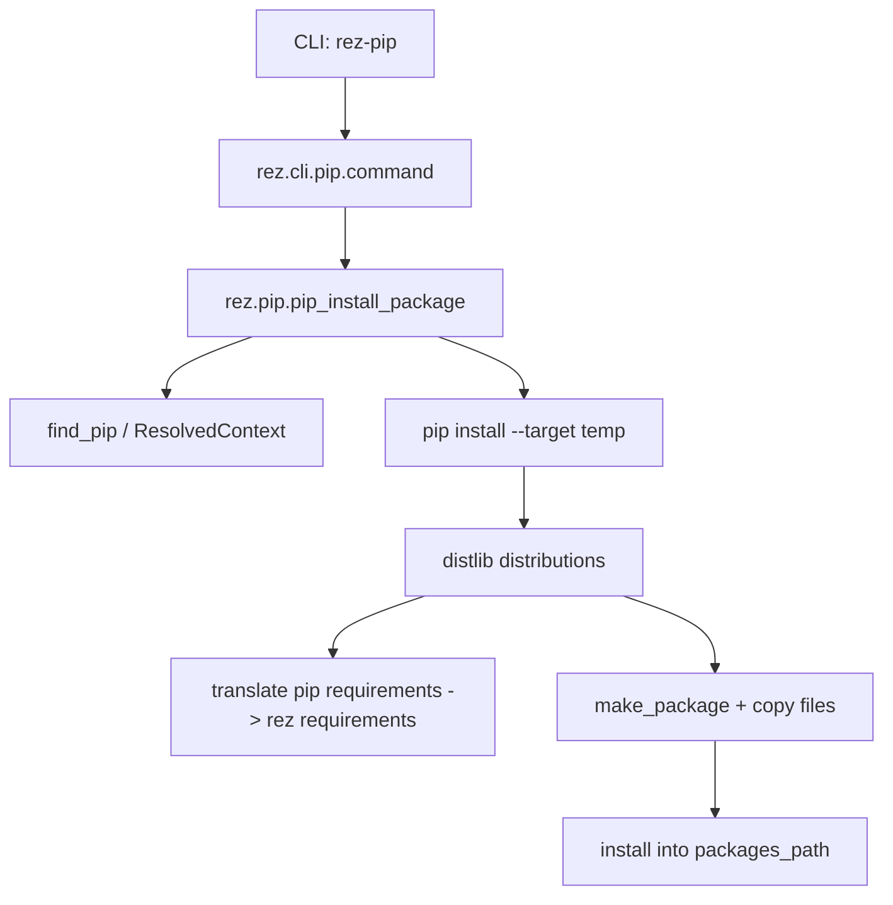

# Diagrams

## Rez-Build Dataflow (Mermaid)

```mermaid
flowchart TD
    A[CLI: rez-build] --> B[rez.cli._entry_points.run_rez_build]
    B --> C[rez.cli._main.run("build")]
    C --> D[rez.cli.build.command]
    D --> E[Load DeveloperPackage from CWD]
    D --> F[Select BuildSystem plugin]
    D --> G[Create BuildProcess plugin]
    G --> H[Iterate variants]
    H --> I[ResolvedContext build env]
    I --> J[Write build.rxt]
    H --> K[BuildSystem.build]
    K --> L[Run build command/build tool]
    H --> M{Install?}
    M -->|yes| N[Copy payload + extra files]
    M -->|yes| O[Run pre_install tests]
    M -->|yes| P[Update package.py in repo]
```

## Rez-Build Codepath (Mermaid)

```mermaid
flowchart TD
    A[rez-build] --> B[rez.cli._entry_points.run_rez_build]
    B --> C[rez.cli._main.run]
    C --> D[rez.cli._util.subcommands["build"]
arg_mode=grouped]
    D --> E[rez.cli.build.setup_parser]
    D --> F[rez.cli.build.command]
    F --> G[rez.build_system.create_build_system]
    F --> H[rez.build_process.create_build_process]
    H --> I[rezplugins.build_process.local.LocalBuildProcess.build]
    I --> J[LocalBuildProcess._build_variant_base]
    J --> K[BuildSystem.build]
```

## Rez-Pip Dataflow (Mermaid)


